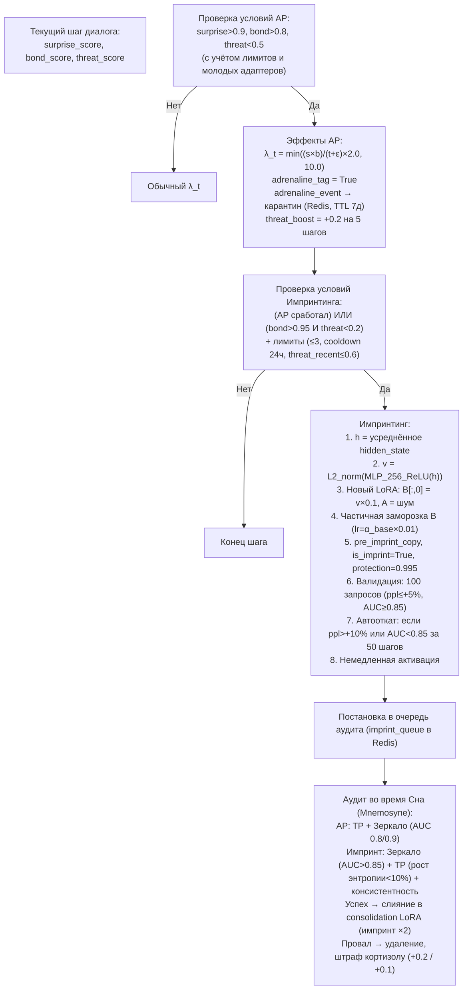

# Призма Адреналина (AP) и Импринтинг

## Назначение

Это два механизма экстренной пластичности:

- **Призма Адреналина (AP)** — временно взвинчивает скорость обучения в момент озарения.
- **Импринтинг** — мгновенно и навсегда записывает критически важный опыт непосредственно в структуру нового адаптера, минуя градиентный спуск.

---

## 1. Призма Адреналина (Adrenaline Prism, AP)

### Условия срабатывания (жёсткая конъюнкция)

| Параметр | Обычные адаптеры | Молодые адаптеры (`age < 5`) |
|:--------:|:----------------:|:---------------------------:|
| `surprise_score` | `> 0.9` | `> 0.95` |
| `bond_score`     | `> 0.8` | `> 0.85` |
| `threat_score`   | `< 0.5` | `< 0.4`  |

### Защита от деградации срабатывания

- Раз в сутки прогоняются **20 эталонных диалогов**, на которых AP **должна** срабатывать.
- Если срабатывание не фиксируется, пороги AP автоматически снижаются на `0.05` (но не ниже `0.7 / 0.6 / 0.3` для `surprise / bond / threat` соответственно).
- Это предотвращает «залипание» AP из-за дрейфа Призм.

### Эффекты AP

| Эффект | Детали |
|:-------|:-------|
| **Пересчёт `λ_t`** | `λ_adrenaline = min( (surprise × bond) / (threat + ε) × 2.0, 10.0 )` |
| **Метка события** | `adrenaline_event = True`, помещается в адреналиновый карантин |
| **Метка адаптера** | `adrenaline_tag = True` (иммунитет к Lethe на 1 цикл, приоритет в Mnemosyne) |
| **Похмелье**      | `threat_boost = +0.2` для данного пользователя на 5 следующих шагов |

### Лимиты

| Тип лимита | Значение |
|:-----------|:---------|
| **Плавающий** (на пользователя) | Не более 1 события за 10 циклов сна |
| **Глобальный** (на всех)        | Не более 3 событий за один цикл сна |

При превышении любого лимита условия AP игнорируются.

### Адреналиновый карантин

- **Хранилище:** Redis (ключ `adrenaline_quarantine:{user_id}` → список JSON-событий).
- **Максимальный размер:** до 5 слотов.
- **TTL:** 7 дней (168 часов) в реальном времени.
  - Если за это время аудит не прошёл (например, из-за низкого мелатонина), событие автоматически понижается: удаляется из карантина, адаптер теряет `adrenaline_tag`.
- **Удаление пользователя:** при `/galatea-forget-me` все карантинные события пользователя удаляются немедленно.

### Пост-аудит (в Mnemosyne)

| Проверка | Критерий |
|:---------|:---------|
| **TP** (энтропия до/после) | — |
| **Зеркало** (AUC) | Адаптивный порог (`0.8` / `0.9`) |

**Результаты:**
- **Успех** → `adrenaline_tag` снимается, событие может стать адреналиновым якорем (≤2 одновременно).
- **Провал** → безвозвратное удаление адаптера, штраф кортизолу `+0.2`.

---

## 2. Импринтинг (Imprinting)

### Определение

Процедура, которая **немедленно (за один шаг)** создаёт новый адаптер путём прямого переноса скрытого состояния модели в его веса. В отличие от обычного обучения (SGD, отложенные обновления), импринтинг гарантирует, что момент озарения будет «впечатан» в память мгновенно.

### Триггеры импринтинга

| Триггер | Условие |
|:--------|:--------|
| **AP** | Сработала Призма Адреналина |
| **Экстремальный bond** | `bond_score > 0.95` И `threat_score < 0.2` |

### Ограничения

| Ограничение | Значение |
|:------------|:---------|
| **Максимум импринтов** | 3 на пользователя за всё время |
| **Минимальный интервал** | 24 часа |
| **Отключение** | Если `threat_score > 0.6` за последние 10 шагов |

### Метод Weight Imprinting via Non-Linear Projection

| Шаг | Действие |
|:---:|:---------|
| **1** | Извлечь **усреднённое скрытое состояние** `h` по всем токенам ответа |
| **2** | Применить **нелинейный проектор** `P` (MLP: `d_model → 256 → 8`, ReLU): `v = P(h)` |
| **3** | L2-нормализовать `v` и умножить на `scale = 0.1` |
| **4** | Создать новый LoRA-адаптер (ранг 8): `B[:, 0] = v_scaled`, `A` — шум |
| **5** | **Частичная заморозка B:** `lr_imprint = α_base * 0.01` (позволяет SGD мягко корректировать) |
| **6** | Установить флаги: `is_imprint = True`, `protection = 0.995`, `age = 0`; сохранить `imprint_hidden_state` и `pre_imprint_copy` |
| **7** | Немедленно активировать адаптер для текущего диалога |

### Расширенная валидация

После записи `v` в LoRA прогоняются **100 случайных запросов**:

| Проверка | Критерий |
|:---------|:---------|
| **Средняя перплексия** | Не выросла > 5% |
| **AUC Зеркала** (если доступно) | Не упала ниже 0.85 |

### Автоматический откат

Если в течение **50 шагов** после импринта:

- Перплексия вырастает > 10%, **ИЛИ**
- AUC падает ниже 0.85,

то импринт-адаптер автоматически откатывается к состоянию до импринта (`pre_imprint_copy`). Это страхует от коллатерального ущерба.

### Аудит импринта (в Mnemosyne)

| Проверка | Критерий |
|:---------|:---------|
| **Зеркало** (AUC) | `> 0.85` |
| **TP** (рост энтропии) | `< 10%` |
| **Консистентность** | Прогон через 5 запросов из replay-буфера — ответы не должны противоречить эталонным |

**Результаты:**
- **Успех** → слияние в consolidation LoRA с весом ×2.
- **Провал** → удаление адаптера, штраф кортизолу `+0.1`.

---

## Схема работы AP и Импринтинга

---

## Связи с другими компонентами

| Компонент | Связь |
|:-----------|:-------|
| [Быстрые Призмы (SP, BP, TP)](./fast_prisms.md) | Поставляют `surprise_score`, `bond_score`, `threat_score` для проверки условий AP |
| [Гиппокамп — управление адаптерами](./hippocampus_management.md) | Получает новые адаптеры при импринтинге |
| [Цикл Сна (Hypnos)](./sleep_overview.md) | Проводит аудит AP и импринтов в Mnemosyne |
| [Зеркало и Золотой стандарт](./mirror_golden.md) | Используется при аудите (AUC) и валидации |
| [Медленные Призмы (Кортизол)](./slow_prisms.md) | Получает штрафы при провале аудита |

---

## Содержание

- [Введение](../README.md)
- [Архитектурный обзор](./overview.md)

#### Философия и ядро

- [Общая философия, Кора и Гиппокамп](./philosophy_cortex_hippocampus.md)
- [Гиппокамп — управление адаптерами](./hippocampus_management.md)
- [Полный конвейер онлайн-шага](./pipeline.md)

#### Призмы (гормональная система)

- [Быстрые Призмы — SP, BP, TP](./fast_prisms.md)
- [Мотивационные Призмы — OP, LP, GP, EP](./motivational_prisms.md)

#### Личность и память

- [Эго-контур, Нарратив и Якоря](./ego_narrative.md)
- [Профиль пользователя и Окситоцин](./oxytocin_profile.md)

#### Защита идентичности

- [Зеркало, Этический классификатор и Золотой стандарт](./mirror_ethics_golden.md)

#### Цикл Сна

- [Цикл Сна (Hypnos)](./sleep_hypnos.md)

#### Дорожная карта реализации

- [Этап 0.5 — предобучение и калибровка Призм](./stage_0.5.md)
- [Этап 1 — MVP с одним пользователем](./stage_1.md)
- [Этап 2 — многопользовательский режим, Redis, базовый Сон](./stage_2.md)
- [Этап 3 — полная Консолидация, Зеркало, детектор дрейфа](./stage_3.md)
- [Этап 4 — продакшен-подготовка, юр. рамка, A/B-тест](./stage_4.md)
- [Сводная дорожная карта и стек технологий](./roadmap.md)

#### Тестирование и риски

- [Симуляции, тестирование и ключевые сценарии](./simulation_testing.md)
- [Полный реестр рисков](./risk_register.md)

#### Эволюция и эксплуатация

- [Долговременная эволюция и замена Коры](./model_migration.md)
- [Производительность, масштабирование и отказоустойчивость](./performance_scaling.md)
- [Юридические, этические и UX-аспекты](./legal_ethical_ux.md)

---

*Этот документ описывает механизмы экстренной пластичности Galatea, позволяющие системе запечатлевать критически важные моменты взаимодействия.*
