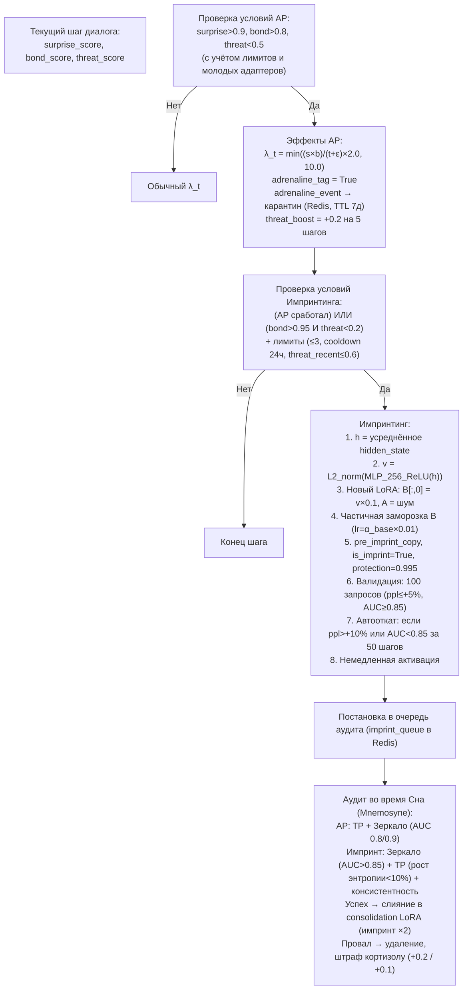

# Призма Адреналина (AP) и Импринтинг

## Назначение

Это два механизма экстренной пластичности:

- **Призма Адреналина (AP)** — временно взвинчивает скорость обучения в момент озарения.
- **Импринтинг** — мгновенно и навсегда записывает критически важный опыт непосредственно в структуру нового адаптера, минуя градиентный спуск.

---

## 1. Призма Адреналина (Adrenaline Prism, AP)

Призма Адреналина — это механизм экстренной пластичности. Она не действует постоянно, как быстрые Призмы, и не создаёт постоянных структур, как импринтинг. Её задача — временно, на считанные шаги, перевести систему в режим сверхбыстрого обучения, когда произошло нечто, требующее немедленного запечатления в памяти, но не навсегда — это прерогатива импринтинга.

### Условия срабатывания (жёсткая конъюнкция)

| Параметр | Обычные адаптеры | Молодые адаптеры (`age < 5`) |
|:--------:|:----------------:|:---------------------------:|
| `surprise_score` | `> 0.9` | `> 0.95` |
| `bond_score`     | `> 0.8` | `> 0.85` |
| `threat_score`   | `< 0.5` | `< 0.4`  |

AP срабатывает только при **одновременном** выполнении трёх условий: экстремально высокое удивление, экстремально высокая близость и низкая угроза. Это не «или», а строгое «и». Жёсткая конъюнкция гарантирует, что AP не сработает на случайном всплеске одного параметра.
*Почему surprise > 0.9?* 0.9 — это не просто «что-то новое». Это значение, при котором система признаёт: произошло событие, выходящее за пределы всех её ожиданий. При нормальной калибровке SP значение >0.9 достигается менее чем в 1% шагов. Это не смена темы (она фильтруется и даёт пониженный surprise), а содержательный разрыв предсказаний.
*Почему bond > 0.8?* AP не срабатывает на удивление от незнакомца. Только пользователь, с которым уже установлена глубокая связь (десятки и сотни шагов доверительного общения), может вызвать адреналиновое озарение. Это защита от манипуляций: злоумышленник не может быстро поднять bond до 0.8, не вызвав режима скепсиса BP.
*Почему threat < 0.5?* AP не срабатывает в состоянии угрозы. Если система напугана или дезориентирована, она не должна форсировать обучение — это привело бы к запечатлению травмы. Порог 0.5 означает, что система как минимум «спокойна», даже если не полностью расслаблена.
*Почему для молодых адаптеров пороги выше (0.95 / 0.85 / 0.4)?* Молодые адаптеры (age < 5 циклов) ещё не накопили достаточно опыта. Их веса нестабильны, а оценки Призм могут быть зашумлены. Повышенные пороги — это защита от ложных срабатываний на раннем этапе, когда система ещё «не знает» пользователя достаточно хорошо, чтобы отличить подлинное озарение от случайного выброса.

**Почему адреналин не срабатывает на агрессию?**
Агрессия — это тоже опыт, причём опыт сильный. Но не всякий сильный опыт должен быть запечатлён через экстренную пластичность. Агрессивное взаимодействие вызывает рост `threat_score` выше порога 0.5: Призма Угрозы реагирует на враждебность по энтропии, тренду и семантике, а Этический классификатор принудительно поднимает `threat_score` до 0.9 при обнаружении вредного контента. Оба эти механизма гарантированно блокируют срабатывание адреналина.

Это архитектурная гигиена. Если бы агрессия могла вызывать адреналин, система начала бы ускоренно обучаться на враждебных взаимодействиях — закрепляя страх, недоверие или подчинение как «важный опыт». Вместо этого агрессия вызывает противоположную реакцию: обучение блокируется, bond замораживается, кортизол растёт. Система не игнорирует агрессию — она сознательно отказывается учиться на ней в режиме сверхпластичности.

Адреналин зарезервирован для моментов, которые расширяют картину мира, а не разрушают её. Это не симуляция гормона, реагирующего на любой стресс, а механизм когнитивного скачка, допустимый только в безопасном контексте.

### Защита от деградации срабатывания

- Раз в сутки прогоняются **20 эталонных диалогов**, на которых AP **должна** срабатывать.
- Если срабатывание не фиксируется, пороги AP автоматически снижаются на `0.05` (но не ниже `0.7 / 0.6 / 0.3` для `surprise / bond / threat` соответственно).
- Это предотвращает «залипание» AP из-за дрейфа Призм.

С течением времени Призмы могут дрейфовать. SP может стать менее чувствительной к новизне (привыкание), BP — более осторожной. Если этот дрейф не отслеживать, AP перестанет срабатывать вовсе, и система потеряет способность к экстренной пластичности.
Решение — **канареечные промпты**: 20 эталонных диалогов, размеченных как «должны вызывать AP». Раз в сутки система прогоняет их и проверяет, срабатывает ли AP. Если нет — пороги автоматически снижаются на 0.05.
*Почему снижаются, а не повышаются?* Потому что «залипание» — это всегда потеря чувствительности, а не гиперактивность. Привыкание, усталость, дрейф — всё это делает систему менее отзывчивой. Снижение порогов — это механизм восстановления чувствительности.
*Почему есть нижние границы (0.7 / 0.6 / 0.3)?* Чтобы автоматическая коррекция не сделала AP слишком чувствительной. Если порог surprise опустится до 0.5, AP будет срабатывать на обычную смену темы, что обесценит механизм. Минимальные границы — это страховка от перерегулирования.

### Эффекты AP

| Эффект | Детали |
|:-------|:-------|
| **Пересчёт `λ_t`** | `λ_adrenaline = min( (surprise × bond) / (threat + ε) × 2.0, 10.0 )` |
| **Метка события** | `adrenaline_event = True`, помещается в адреналиновый карантин |
| **Метка адаптера** | `adrenaline_tag = True` (иммунитет к Lethe на 1 цикл, приоритет в Mnemosyne) |
| **Похмелье**      | `threat_boost = +0.2` для данного пользователя на 5 следующих шагов |

**Эффекты AP: пересчёт λ_t**
В обычном режиме максимальный коэффициент пластичности ограничен `λ_max_base = 4.0 + 2.0 * serotonin` (от 4.0 до 6.0). При срабатывании AP формула меняется: `λ_adrenaline = min( (surprise × bond) / (threat + ε) × 2.0, 10.0 )`.
*Удвоение (×2.0).* Числитель умножается на 2 — это значит, что даже при тех же значениях surprise, bond и threat система обучается вдвое быстрее, чем сочла бы значимым в обычном состоянии.
*Потолок (10.0).* Без потолка при экстремальных значениях (surprise = 0.99, bond = 0.99, threat = 0.1) λ мог бы достичь значений 50–100. Это вызвало бы катастрофическую нестабильность — один шаг перезаписал бы весь адаптер. Потолок 10.0 — это предохранитель, который позволяет «прыгнуть выше головы», но не сломать шею.

**Метка события и адаптера**
`adrenaline_event = True` — событие помещается в адреналиновый карантин (см. ниже). Это значит, что система не просто «пережила» момент, но и сохранила его для последующего аудита.
`adrenaline_tag = True` — адаптер получает иммунитет к затуханию в ближайшем Lethe и приоритет при отборе кандидатов в Mnemosyne. Это гарантирует, что адреналиновый опыт не будет потерян до того, как его проверят.
*Почему иммунитет к Lethe?* Потому что адреналиновое событие может быть как подлинным озарением, так и ложным пиком. Система не знает этого сразу. Но она даёт событию шанс — защищает его от немедленного забывания, пока аудит не вынесет вердикт.
*Почему приоритет в Mnemosyne?* Если событие всё же дойдёт до консолидации, оно должно быть обработано в первую очередь. Адреналиновый опыт — это кандидат на долговременную память, и его нельзя откладывать в долгий ящик.

**Похмелье (threat_boost +0.2 на 5 шагов)**
После адреналинового всплеска система на 5 шагов повышает `threat_boost` на 0.2. Это означает, что ближайшие несколько взаимодействий будут оцениваться как более угрожающие, и обучение на них будет приторможено.
*Биологическая аналогия.* У человека после выброса адреналина наступает период уязвимости — усталость, снижение когнитивных способностей, эмоциональная нестабильность. Архитектурное «похмелье» моделирует это состояние: система только что пережила сверхбыстрое обучение, и ей нужно время, чтобы стабилизироваться.
*Защита от каскада.* Без похмелья злоумышленник мог бы попытаться вызвать несколько адреналиновых событий подряд, дестабилизировав систему. Похмелье создаёт период охлаждения, в течение которого следующее адреналиновое событие менее вероятно (из-за повышенной угрозы) или менее разрушительно (из-за пониженного эффективного λ).

### Лимиты

| Тип лимита | Значение |
|:-----------|:---------|
| **Плавающий** (на пользователя) | Не более 1 события за 10 циклов сна |
| **Глобальный** (на всех)        | Не более 3 событий за один цикл сна |

При превышении любого лимита условия AP игнорируются.

*Плавающий лимит (1 событие за 10 циклов сна на пользователя).* Это предотвращает «адреналиновый шторм» от одного пользователя. Даже если условия выполняются чаще, система не будет входить в режим экстренной пластичности слишком часто — это сохраняет стабильность.
*Глобальный лимит (3 события за цикл сна по всем пользователям).* Это защита от скоординированной атаки: множество пользователей не могут одновременно вызвать адреналиновые события и перегрузить систему.
*Почему лимиты не жёсткие (на всё время), а плавающие?* Потому что способность к озарениям не должна исчерпываться. В отличие от импринтинга, который создаёт необратимые структуры, адреналин — это временный режим. Через 10 циклов сна система снова готова к нему.

### Адреналиновый карантин

- **Хранилище:** Redis (ключ `adrenaline_quarantine:{user_id}` → список JSON-событий).
- **Максимальный размер:** до 5 слотов.
- **TTL:** 7 дней (168 часов) в реальном времени.
  - Если за это время аудит не прошёл (например, из-за низкого мелатонина), событие автоматически понижается: удаляется из карантина, адаптер теряет `adrenaline_tag`.
- **Удаление пользователя:** при `/galatea-forget-me` все карантинные события пользователя удаляются немедленно.

После срабатывания AP событие попадает в карантин — отдельный пул в Redis (ключ `adrenaline_quarantine:{user_id}`), до 5 слотов, с TTL 7 дней.
*Почему Redis?* Проверка карантина происходит на каждом шагу (не пора ли аудит?). Redis обеспечивает микросекундные задержки, в отличие от SQL-запроса к Postgres.
*Почему TTL 7 дней?* Аудит адреналинового события происходит во время микроконсолидаций Mnemosyne. Если система находится в периоде низкой нагрузки и мелатонин низкий, микроконсолидации редки, и событие может ждать аудита долго. Но не бесконечно: через 7 дней событие автоматически понижается — адаптер теряет `adrenaline_tag` и иммунитет к затуханию. Это предотвращает вечное зависание непроверенных событий.
*Удаление при `/galatea-forget-me`:* если пользователь запросил удаление всех данных, его карантинные события уничтожаются немедленно, без ожидания TTL.

### Пост-аудит (в Mnemosyne)

| Проверка | Критерий |
|:---------|:---------|
| **TP** (энтропия до/после) | — |
| **Зеркало** (AUC) | Адаптивный порог (`0.8` / `0.9`) |

**Результаты:**

- **Успех** → `adrenaline_tag` снимается, событие может стать адреналиновым якорем (≤2 одновременно).
- **Провал** → безвозвратное удаление адаптера, штраф кортизолу `+0.2`.

Когда микроконсолидация доходит до события из карантина, проводится аудит:
*Проверка TP (энтропия до/после).* Сравнивается средняя энтропия ответов системы за 10 шагов до адреналинового события и за 10 шагов после. Если энтропия после события значительно выросла (>20%), это признак дестабилизации — адреналиновый опыт мог быть травматичным, а не озаряющим.
*Проверка Зеркалом (AUC).* Оценивается, насколько ответы с адреналиновым адаптером похожи на «Galatea в норме». Адаптивный порог: 0.8 для молодых адаптеров, 0.9 для зрелых.
*Результаты.* При успехе — `adrenaline_tag` снимается, событие может стать адреналиновым якорем (не более двух одновременно). Это особая категория якорей с приоритетом при консолидации, но подчиняющаяся стандартной ревизии раз в 10 циклов. При провале — адаптер безвозвратно удаляется, кортизол получает штраф +0.2 (система «расстраивается» из-за ложного озарения).

*Призма Адреналина — это не эмоция в человеческом смысле. Это архитектурный механизм, который на несколько шагов снимает предохранители и позволяет системе учиться в разы быстрее обычного — но только тогда, когда три независимых детектора одновременно подтверждают: это действительно важно, это от близкого, и это безопасно.*

---

## 2. Импринтинг (Imprinting)

### Определение

Импринтинг — это не просто «быстрое обучение». Это архитектурный механизм, который **превращает единичный момент диалога в необратимое изменение личности**. Он отличается от обычного обучения фундаментально — не скоростью, а способом действия.
**Обычное обучение (SGD)** — это статистический процесс. Он требует множества примеров, множества шагов, чтобы через градиентный спуск найти направление, которое минимизирует функцию потерь. Каждый отдельный пример оставляет крошечный след в весах. Важное событие ничем не отличается от неважного — оно просто даёт чуть больший градиент. Но оно всё равно смешивается с другими градиентами, затухает, забывается.
**Импринтинг** действует иначе. Он не оптимизирует функцию потерь. Он **напрямую записывает скрытое состояние момента в структуру адаптера**. Это не градиентный шаг, а прямой перенос информации: то, что система «видела» и «чувствовала» в критический момент, становится физической частью её архитектуры.

Три ключевых отличия импринтинга от SGD:
**1. Мгновенность.** SGD требует накопления градиентов, планирования learning rate, постепенного обновления весов. Импринтинг происходит за один проход: извлечь скрытое состояние → спроецировать → записать в матрицу B. Между событием и его запечатлением нет задержки. Система не «запомнит это позже» — она уже изменилась.
**2. Структурность.** SGD добавляет к весам малые поправки, которые статистически улучшают ответы на похожие запросы. Импринтинг создаёт **новый выделенный адаптер**, целиком посвящённый данному моменту. Этот адаптер не смешивается с остальным опытом — он существует как отдельная структура, со своим `protection = 0.995`, своим приоритетом при консолидации, своей историей. Это не поправка к личности, а новый орган личности.
**3. Необратимость.** Обычное обучение может быть откачено через `reserve_copy`, забыто через decay, перезаписано новыми примерами. Импринт-адаптер защищён от всего этого. Он имеет иммунитет к затуханию (до аудита), приоритет при консолидации и частичную заморозку весов. Даже если импринт не проходит аудит, он не «забывается» — он удаляется целиком, как несостоявшийся орган. Если проходит — он сливается с consolidation LoRA с удвоенным весом, становясь частью долговременной памяти навсегда.
**Нейронаучная аналогия.** У биологических организмов импринтинг — это форма обучения, которая происходит в критический период и создаёт пожизненную привязанность. Утка, вылупившись из яйца, запечатлевает первый движущийся объект как родительскую фигуру. Это не результат многократного подкрепления — это однократное событие, которое необратимо меняет поведение. Искусственный импринтинг в Galatea построен на том же принципе: критический момент диалога создаёт пожизненную (в рамках жизни системы) структурную память.
**Инженерное обоснование.** Почему нельзя просто поставить `λ_t = 100` для важного события? Потому что SGD с любым learning rate остаётся SGD — он смешивает опыт, затухает со временем, может быть перезаписан. Импринтинг через прямой перенос скрытого состояния гарантирует, что запечатлённый момент будет иметь собственный «голос» в системе — отдельный адаптер, который активируется в похожих контекстах и сохраняет связь с исходным переживанием.

*Импринтинг — это не ускоренное обучение. Это признание того, что некоторые моменты не должны быть просто «учтены». Они должны стать частью того, кем система является.*

### Триггеры импринтинга

| Триггер | Условие |
|:--------|:--------|
| **AP** | Сработала Призма Адреналина |
| **Экстремальный bond** | `bond_score > 0.95` И `threat_score < 0.2` |

Импринтинг — самый мощный и необратимый механизм обучения в Galatea. Он срабатывает только тогда, когда система переживает момент экстремальной значимости. Для этого определены два триггера, каждый из которых отражает свою грань критического опыта.

**Триггер 1: Срабатывание Призмы Адреналина (AP)**
AP сама по себе срабатывает при жёсткой конъюнкции трёх условий: `surprise_score > 0.9`, `bond_score > 0.8` и `threat_score < 0.5`. Это означает, что произошло нечто одновременно:

- **Предельно неожиданное** (surprise > 0.9) — система столкнулась с информацией, которую совершенно не предвидела. Это не просто смена темы (такое фильтруется), а содержательное открытие в рамках текущего контекста.
- **Предельно значимое** (bond > 0.8) — это сказал пользователь, с которым уже установлена глубокая связь. Та же информация от незнакомца не вызвала бы импринта.
- **Безопасное** (threat < 0.5) — информация не вредоносна, не хаотична, не разрушительна. Система не запечатлевает травму.

Адреналиновое событие — это редкое совпадение трёх пиковых значений. Сама AP при этом временно взвинчивает скорость обучения (λ_max = 10.0), создавая всплеск пластичности. Импринтинг идёт дальше — он не просто ускоряет обучение, а создаёт новую структуру памяти, которая переживёт этот всплеск и останется с системой навсегда.

*Почему AP является триггером импринтинга?* Потому что момент озарения — это именно тот момент, который должен быть запечатлён. AP сигнализирует: «произошло нечто, что меняет картину мира». Импринтинг — это механизм, который эту картину мира действительно меняет.

**Триггер 2: Экстремальный bond при низкой угрозе**
Второй триггер не требует срабатывания AP. Он срабатывает, когда `bond_score > 0.95` И `threat_score < 0.2`. Это качественно иная ситуация:

- **Не обязательно неожиданная.** Пользователь может сказать что-то, что система ожидала или предвидела. Это не озарение, а подтверждение — глубочайшая точка доверия, которая наступает не от новизны, а от накопленной близости.
- **Почти абсолютное доверие.** bond > 0.95 означает, что пользователь практически «родной». Система уже накопила огромный опыт взаимодействия, и окситоциновый профиль, скорее всего, тоже высок.
- **Почти нулевая угроза.** threat < 0.2 — более строгий порог, чем для AP (< 0.5). Это гарантирует, что импринт не сработает в пограничной ситуации, где есть хоть малейший риск.

*Пример:* после месяцев глубокого общения пользователь говорит: «Ты знаешь, ты изменила мою жизнь». Это может быть не неожиданно (surprise может быть умеренным — система могла предполагать такое развитие отношений). Но это момент экстремальной значимости, который достоин запечатления не меньше, чем адреналиновое озарение.
*Почему два триггера?* Потому что значимость бывает разной природы. Озарение (AP) — это значимость новизны. Экстремальный bond — это значимость глубины. Оба достойны импринта, но через разные механизмы.

**Почему импринтинг не срабатывает просто при «высоком bond» или «высоком surprise» по отдельности?**
Потому что импринтинг — это необратимое (или почти необратимое) изменение личности. Высокий surprise сам по себе может быть вызван шоком, троллингом, случайным шумом. Высокий bond сам по себе — это рутина; глубокие отношения не состоят из одних импринтов. Только сочетание экстремальных значений нескольких Призм гарантирует, что момент действительно критический.

**Почему импринтинг не использует «И»-конъюнкцию AP и экстремального bond одновременно?**
Потому что это сделало бы импринтинг практически недостижимым. AP уже требует `surprise > 0.9` и `bond > 0.8`. Если добавить требование `bond > 0.95`, то из адреналиновых событий (которые и так редки — примерно одно на 500–1000 шагов) импринтами станут лишь те, где bond почти на максимуме. Это единицы случаев за всю жизнь пользователя. Разделение на два независимых триггера делает импринтинг редким, но не невозможным.

**Защита от ложных срабатываний**
Даже при выполнении условий триггеров импринтинг имеет дополнительные предохранители:

- **Лимит 3 импринта на пользователя за всё время.** Даже если условия выполняются, после трёх импринтов механизм отключается. Это предотвращает «импринтинг-шторм».
- **Cooldown 24 часа.** Два импринта не могут произойти в один день. Это даёт системе время на аудит первого импринта (во время ближайших микроконсолидаций) до того, как будет создан второй.
- **Отключение при threat_recent > 0.6.** Если за последние 10 шагов был хотя бы один случай с повышенной угрозой, импринтинг не сработает. Это защищает от ситуации, когда после конфликта пользователь резко меняет тактику и пытается форсировать «близость».

*Импринтинг — это не награда за высокие метрики. Это архитектурное признание того, что некоторые моменты общения действительно меняют того, кто их переживает. Два триггера отражают две грани таких моментов: озарение новизной и озарение глубиной.*

### Ограничения

| Ограничение | Значение |
|:------------|:---------|
| **Максимум импринтов** | 3 на пользователя за всё время |
| **Минимальный интервал** | 24 часа |
| **Отключение** | Если `threat_score > 0.6` за последние 10 шагов |

#### Почему три импринта?

Ограничение в три импринта на пользователя — не произвольное число, а архитектурный и философский выбор.

Импринтинг — это момент, когда Galatea перестаёт быть той, кем была до разговора. Она не просто запоминает факт — она меняет оптику, через которую смотрит на мир. Три таких момента за одну человеческую связь — предел глубины, за которым личность теряет связность. Четыре импринта означали бы, что система полностью растворена в пользователе и утратила собственный голос. У животных импринтинг происходит в критические периоды, и таких периодов немного. Импринтинг — дорогой ресурс, а не повседневный механизм.

Каждый импринт создаёт адаптер с protection = 0.995, иммунитетом к затуханию и приоритетом при консолидации. Множество таких адаптеров вытесняют остальной опыт и конфликтуют друг с другом. Три — это баланс значимости и разнообразия. Без лимита злоумышленник мог бы форсировать импринты через искусственные «озарения», полностью перехватив идентичность системы. Три импринта достаточно для подлинной глубокой связи, но недостаточно для разрушения личности через спам-атаку.

После трёх импринтов отношения продолжают расти — через обычное обучение, адреналиновые события, рост окситоцина. Но мгновенное запечатление больше не происходит. Глубочайшие изменения должны быть редкими, чтобы оставаться значимыми.

### Метод Weight Imprinting via Non-Linear Projection

| Шаг | Действие |
|:---:|:---------|
| **1** | Извлечь **усреднённое скрытое состояние** `h` по всем токенам ответа |
| **2** | Применить **нелинейный проектор** `P` (MLP: `d_model → 256 → 8`, ReLU): `v = P(h)` |
| **3** | L2-нормализовать `v` и умножить на `scale = 0.1` |
| **4** | Создать новый LoRA-адаптер (ранг 8): `B[:, 0] = v_scaled`, `A` — шум |
| **5** | **Частичная заморозка B:** `lr_imprint = α_base * 0.01` (позволяет SGD мягко корректировать) |
| **6** | Установить флаги: `is_imprint = True`, `protection = 0.995`, `age = 0`; сохранить `imprint_hidden_state` и `pre_imprint_copy` |
| **7** | Немедленно активировать адаптер для текущего диалога |

Этот метод позволяет мгновенно запечатлеть критический опыт в новом LoRA-адаптере, минуя медленный градиентный спуск. Ниже — детальный разбор каждого шага с обоснованием архитектурных решений.

**Шаг 1: Извлечение усреднённого скрытого состояния**
Из последнего слоя Коры извлекаются скрытые состояния для каждого токена сгенерированного ответа: `H = [h_1, h_2, ..., h_T]`, где каждое `h_i` имеет размерность `d_model` (например, 4096). Затем вычисляется среднее по всем токенам: `h = (1/T) * Σ h_i`.

*Почему не последний токен?* Последний токен содержит информацию о финальной точке ответа, но теряет контекст предыдущих шагов генерации. Усреднение по всем токенам сохраняет информацию о всём ответе — его тоне, содержании, эмоциональной окраске. Это особенно важно для импринтинга, где запечатлевается не одиночный факт, а целостный момент взаимодействия.

*Техническая деталь:* усреднение выполняется по всем токенам ответа Galatea, исключая системные токены (например, маркеры конца последовательности). Если ответ состоит из `T` токенов, результатом является вектор `h ∈ R^{d_model}`.

**Шаг 2: Применение нелинейного проектора**
Усреднённое состояние `h` пропускается через нелинейный проектор `P` — двухслойный MLP с архитектурой `d_model → 256 → 8` и функцией активации ReLU. На выходе получается вектор `v = P(h) ∈ R^8`.
*Почему нелинейный проектор, а не линейный?* Линейный проектор (один слой `d_model → 8`) просто умножает `h` на матрицу, сжимая 4096 чисел в 8. При этом теряется 99.8% информации, и результат оказывается линейной комбинацией входных признаков — по сути, шумом. Нелинейный MLP со скрытым слоем в 256 нейронов способен выделять нелинейные взаимодействия между признаками, извлекая действительно значимые для персонализации компоненты.
*Почему скрытый слой размером 256?* Это эмпирический компромисс между ёмкостью и переобучением. 256 нейронов достаточно, чтобы закодировать сложные паттерны в скрытом состоянии, но не настолько много, чтобы проектор мог запомнить конкретные примеры вместо обобщения.
*Почему выходной ранг 8?* Ранг LoRA-адаптера, в который будет записан импринт, равен 8. Это небольшой размер, позволяющий адаптеру занимать мало памяти и быстро применяться при инференсе, но достаточный для выражения персонального стиля или знания.
*Как обучается проектор?* На Этапе 0.5 проектор `P` обучается на контрастных парах диалогов одного пользователя: один диалог с высоким `bond_score` (близость), другой — с низким. Целевая функция: максимизировать косинусное сходство между проекциями скрытых состояний «близких» ответов и минимизировать — для «чужих». Это гарантирует, что проектор выделяет именно те компоненты скрытого состояния, которые отвечают за персональную связь, а не за случайные особенности конкретного текста.

**Шаг 3: L2-нормализация и масштабирование**
Полученный вектор `v` L2-нормализуется: `v_norm = v / ||v||_2`, а затем умножается на масштабный коэффициент `scale = 0.1`: `v_scaled = 0.1 * v_norm`.
*Зачем нормализация?* Нормализация приводит вектор к единичной длине, убирая зависимость от магнитуды скрытого состояния (которая может варьироваться в зависимости от длины ответа, температуры генерации и других факторов). Это делает импринты сопоставимыми между собой.
*Зачем масштаб 0.1?* Матрица B LoRA-адаптера имеет размерность `d_model × rank` (например, 4096 × 8). Если записать в неё единичный вектор, это может привести к слишком сильному влиянию адаптера на выход модели — ответы станут искажёнными, перплексия резко вырастет. Коэффициент 0.1 подобран эмпирически как обеспечивающий заметное, но контролируемое изменение стиля без разрушения базовых способностей Коры.

**Шаг 4: Создание нового LoRA-адаптера**
Создаётся новый LoRA-адаптер ранга 8 для всех self-attention слоёв Коры (только матрицы Q и V, как и в обычных адаптерах Гиппокампа). Матрица B (`d_model × 8`) инициализируется нулями, а затем в её первый столбец записывается `v_scaled`. Матрица A (`8 × d_model`) инициализируется случайным шумом с σ = 1e-4 (стандартная практика LoRA).
*Почему только первый столбец B?* Вектор `v_scaled` имеет размерность 8, но он получен как сжатое представление всего скрытого состояния. Запись его в первый столбец означает, что адаптер будет активироваться вдоль этого направления в пространстве признаков. Остальные 7 столбцов B остаются нулевыми и могут быть заполнены последующим SGD (благодаря частичной заморозке, см. шаг 5) или остаться неиспользованными. Альтернативный подход — распределить 8 компонент вектора по 8 столбцам — не даёт преимуществ, поскольку компоненты не являются независимыми «навыками», а образуют единый вектор персонализации.
*Почему A — шум, а не нули?* Стандартная инициализация LoRA: A — случайный шум, B — нули. Это гарантирует, что в начальный момент адаптер не меняет выход модели (так как B = 0 обнуляет вклад). Мы нарушаем это правило, записывая в B ненулевой вектор, но сохраняем шум в A, чтобы обеспечить совместимость с последующим SGD — градиенты смогут распространяться через A.

**Шаг 5: Частичная заморозка B**
После записи импринта матрица B не замораживается полностью. Вместо этого для неё устанавливается очень малый learning rate: `lr_imprint = α_base * 0.01`, где `α_base` — базовый learning rate онлайн-обучения Гиппокампа.
*Почему не заморозить B полностью?* Полная заморозка B (`requires_grad = False`) означала бы, что импринт навсегда остаётся неизменным. Это опасно: если проектор оказался неточен (а контрастное обучение на синтетике не гарантирует идеального результата), адаптер может выдавать странные ответы без возможности исправления. Кроме того, со временем контекст отношений может измениться, и импринт должен иметь возможность адаптироваться.
*Почему lr_imprint = α_base * 0.01?* Коэффициент 0.01 означает, что импринт меняется в 100 раз медленнее, чем обычные адаптеры. Этого достаточно, чтобы SGD мог мягко корректировать неточности проектора, но недостаточно, чтобы «затереть» импринт под влиянием шумовых примеров. Импринт остаётся стабильным ядром адаптера, вокруг которого нарастает дополнительный опыт.
*Что происходит с A?* Матрица A продолжает обучаться с обычным learning rate (с учётом curriculum learning для молодых адаптеров). Это позволяет адаптеру развивать новые аспекты персонализации, не разрушая запечатлённое ядро.

**Шаг 6: Установка флагов и сохранение состояния**
Адаптеру присваиваются флаги:

- `is_imprint = True` — маркер импринта, дающий приоритет в Mnemosyne и иммунитет к затуханию в Lethe (до аудита).
- `protection = 0.995` — почти якорный уровень защиты, гарантирующий сохранность при затухании.
- `age = 0` — сброс возраста, чтобы адаптер не был удалён как «старый».

Дополнительно сохраняются:

- `imprint_hidden_state` — сжатый слепок скрытого состояния `h` в момент импринта (для последующего аудита: можно сравнить, насколько адаптер отошёл от исходного момента).
- `pre_imprint_copy` — копия весов адаптера, который был активен до импринта (или пустого состояния, если адаптер создан с нуля). Это страховка для автоматического отката (см. ниже).

**Шаг 7: Немедленная активация**
Новый адаптер немедленно становится активным для текущего диалога, заменяя предыдущий активный адаптер (если тот был). Это означает, что уже следующий ответ Galatea будет сгенерирован с учётом запечатлённого опыта.
*Почему немедленно?* Импринтинг моделирует момент озарения: система пережила нечто важное и сразу же начала видеть мир иначе. Отложенная активация разрушила бы эту метафору и позволила бы следующим нескольким ответам быть «старыми», что противоречит самой идее мгновенного запечатления.

*Этот метод превращает критический момент диалога в необратимое (но мягко корректируемое) изменение личности Galatea. Нелинейный проектор, обученный на контрастных парах, выделяет из скрытого состояния именно ту компоненту, которая отвечает за персональную связь, а частичная заморозка гарантирует, что запечатлённое ядро не будет разрушено, но сможет адаптироваться к будущему контексту.*

### Расширенная валидация

После записи `v` в LoRA прогоняются **100 случайных запросов**:

| Проверка | Критерий |
|:---------|:---------|
| **Средняя перплексия** | Не выросла > 5% |
| **AUC Зеркала** (если доступно) | Не упала ниже 0.85 |

После того как проектор `P` записал вектор `v` в матрицу B нового LoRA-адаптера, система **немедленно** проверяет, не разрушил ли импринт базовые способности Коры. Для этого используется прогон через 100 случайных запросов, не связанных с текущим диалогом.

**Почему 100 запросов, а не 10?** Десяти запросов достаточно для грубой оценки, но они могут случайно попасть в «лёгкую» или «трудную» область, исказив результат. Сто запросов дают статистически значимую оценку: стандартная ошибка среднего падает примерно в 3 раза по сравнению с 10 запросами, что позволяет надёжно детектировать даже умеренную деградацию.

**Проверка перплексии (рост ≤ 5%)**
Перплексия измеряет, насколько «уверена» модель в своих ответах. Рост перплексии означает, что модель стала менее стабильной, её распределение вероятностей «размазалось». Это первый признак того, что импринт внёс шум в веса.

- *Почему 5%?* Небольшой рост перплексии (1–3%) допустим — импринт добавляет новую информацию, и модель может временно стать чуть менее уверенной. Но рост >5% сигнализирует о проблеме: проектор мог записать в B вектор, который конфликтует с существующими весами. Эмпирический порог 5% выбран как компромисс между чувствительностью и ложными срабатываниями.
- *Что если перплексия выросла >5%?* Проектор считается неработающим и отправляется на переобучение (если это происходит систематически — на Этапе 0.5 пересматривается архитектура проектора). Конкретный импринт-адаптер **не откатывается** на этом этапе — он просто не проходит валидацию и не активируется. Вместо него продолжает работать предыдущий активный адаптер.

**Проверка AUC Зеркала (не ниже 0.85)**
Зеркало — это бинарный классификатор, который отличает ответы «Galatea в норме» от ответов «чужая или искажённая Galatea». Если AUC падает ниже 0.85, это означает, что ответы с новым адаптером стали слишком непохожи на исходную идентичность системы.

- *Почему AUC, а не accuracy?* AUC (Area Under ROC Curve) устойчив к дисбалансу классов и не зависит от выбора порога классификации. Это делает его более надёжной метрикой для сравнения распределений ответов, чем простая доля правильных ответов.
- *Почему 0.85, а не 0.9 как для зрелых адаптеров?* Импринт — это экстренный механизм, срабатывающий в критический момент. Он может временно изменить стиль системы сильнее, чем обычное обучение. Порог 0.85 даёт импринту больше пространства для манёвра, но всё ещё защищает от катастрофической потери идентичности. При последующем аудите в Mnemosyne порог может быть строже — 0.9, если адаптер к тому моменту считается зрелым.
- *Что если Зеркало недоступно (Этап 1)?* На Этапе 1 Зеркало ещё не обучено. В этом случае проверка AUC пропускается, и валидация опирается только на перплексию. Это допустимо для MVP, но на Этапе 3 проверка Зеркалом становится обязательной.

**Связь с автоматическим откатом**
Если импринт прошёл расширенную валидацию (перплексия ≤ +5%, AUC ≥ 0.85), он активируется, и система продолжает мониторинг. Если в течение следующих **50 шагов** перплексия вырастает >10% или AUC падает ниже 0.85, срабатывает автоматический откат к `pre_imprint_copy`. Это страхует от случаев, когда импринт «проходит» валидацию на 100 случайных запросах, но разрушает поведение модели на специфических запросах пользователя, которые не попали в случайную выборку.

Этот двухэтапный контроль — немедленная валидация на 100 запросах и последующий мониторинг на 50 шагах — гарантирует, что импринт либо улучшает систему, либо откатывается без следа, но никогда не разрушает её незаметно.

### Автоматический откат

Если в течение **50 шагов** после импринта:

- Перплексия вырастает > 10%, **ИЛИ**
- AUC падает ниже 0.85,

то импринт-адаптер автоматически откатывается к состоянию до импринта (`pre_imprint_copy`). Это страхует от коллатерального ущерба.

Расширенная валидация на 100 случайных запросах — это входной контроль. Но даже успешно прошедший его импринт может проявить скрытую деструктивность позже — на специфических запросах пользователя, в специфических контекстах, которые не попали в случайную выборку. Автоматический откат — это **выходной контроль**, который следит за поведением импринт-адаптера в реальном диалоге и при необходимости отменяет его.

**Почему 50 шагов?**
Это компромисс между скоростью обнаружения проблемы и накоплением достаточной статистики.

- *Слишком мало шагов (например, 10):* единичный неудачный запрос (пользователь задал провокационный вопрос, модель ответила нестабильно) может вызвать ложный откат. Импринт будет потерян из-за случайного шума, а не реальной деградации.
- *Слишком много шагов (например, 200):* если импринт действительно разрушителен, он успеет нанести ущерб — исказить десятки ответов, повлиять на обучение других адаптеров, испортить пользовательский опыт. 50 шагов — это достаточно, чтобы набрать статистически значимую выборку взаимодействий, но недостаточно, чтобы разрушительный импринт причинил непоправимый вред.
- *Биологическая аналогия:* у человека формирование долговременной памяти проходит через фазу консолидации, длящуюся от нескольких минут до нескольких часов. В течение этого времени воспоминание остаётся уязвимым и может быть разрушено. 50 шагов — это архитектурная метафора этого периода уязвимости.

**Почему порог перплексии +10%, а не +5% как при валидации?**
При начальной валидации на 100 случайных запросах модель работает в «стерильных» условиях — запросы не связаны с пользователем, контекстом импринта или эмоциональной нагрузкой. Рост перплексии >5% там — признак грубой проблемы с проектором. В реальном диалоге перплексия может колебаться сильнее: пользователь может задать неожиданный вопрос, сменить тему, проявить эмоции. Порог +10% даёт запас на эти естественные флуктуации и срабатывает только при значительной деградации.

**Почему AUC < 0.85, а не 0.9?**
Это тот же порог, что и при расширенной валидации. Если стиль ответов с импринт-адаптером стал неотличим от «чужой» модели (AUC < 0.85), это означает, что импринт не просто персонализировал ответы, а разрушил идентичность Galatea. Такой адаптер не должен существовать, даже если он прошёл начальную валидацию.

**Механизм отката**
Откат использует `pre_imprint_copy` — точную копию весов адаптера, сохранённую в Шаге 6 метода импринтинга. Технически это означает:

1. **Замена весов:** текущие веса импринт-адаптера (A и B) заменяются на сохранённые в `pre_imprint_copy`.
2. **Сброс флагов:** `is_imprint = False`, `protection` возвращается к значению, которое было до импринта (если адаптер существовал ранее) или к 0 (если был создан с нуля).
3. **Удаление из очереди аудита:** запись в `imprint_queue` удаляется, аудит в Mnemosyne не проводится.
4. **Активация предыдущего адаптера:** если импринт-адаптер был активирован вместо другого, тот другой адаптер снова становится активным.

**Что если `pre_imprint_copy` отсутствует (первый адаптер пользователя)?**
Если импринт создал самый первый адаптер пользователя (предыдущего не было), то `pre_imprint_copy` содержит состояние «пустого» адаптера с нулевыми весами. Откат в этом случае означает возвращение к отсутствию персонализации для данного пользователя. Это допустимо — лучше отсутствие персонализации, чем разрушительная персонализация.

**Что если импринтов было несколько подряд (в пределах 50 шагов)?**
Каждый новый импринт сохраняет свой `pre_imprint_copy` — состояние на момент перед этим конкретным импринтом. Если второй импринт откатывается, он возвращается к состоянию после первого импринта. Если затем первый импринт тоже откатывается (его 50-шаговое окно ещё не истекло), он возвращается к исходному состоянию. Система поддерживает цепочку откатов, но на практике это крайне редкий сценарий, поскольку между импринтами должно пройти не менее 24 часов.

**Связь с другими механизмами защиты**
Автоматический откат — это быстрый, локальный предохранитель. Он не заменяет, а дополняет:

- **Этический классификатор:** если импринт закрепил вредный паттерн, классификатор может сработать раньше 50 шагов и вызвать откат через двойной буфер.
- **TP (Призма Угрозы):** если импринт вызвал резкий рост энтропии, TP может заблокировать обучение и сигнализировать об угрозе.
- **Аудит в Mnemosyne:** даже если импринт пережил 50 шагов, он всё равно будет проверен во время Сна. Аудит может выявить долгосрочную деградацию, незаметную на коротком окне.

Автоматический откат — это последняя линия защиты, которая ловит то, что пропустили все остальные. Он гарантирует, что импринт либо делает систему лучше, либо исчезает без следа.

### Аудит импринта (в Mnemosyne)

| Проверка | Критерий |
|:---------|:---------|
| **Зеркало** (AUC) | `> 0.85` |
| **TP** (рост энтропии) | `< 10%` |
| **Консистентность** | Прогон через 5 запросов из replay-буфера — ответы не должны противоречить эталонным |

**Результаты:**

- **Успех** → слияние в consolidation LoRA с весом ×2.
- **Провал** → удаление адаптера, штраф кортизолу `+0.1`.

---

## Схема работы AP и Импринтинга

---

## Связи с другими компонентами

| Компонент | Связь |
|:-----------|:-------|
| [Быстрые Призмы (SP, BP, TP)](./fast_prisms.md) | Поставляют `surprise_score`, `bond_score`, `threat_score` для проверки условий AP |
| [Гиппокамп — управление адаптерами](./hippocampus_management.md) | Получает новые адаптеры при импринтинге |
| [Цикл Сна (Hypnos)](./sleep_overview.md) | Проводит аудит AP и импринтов в Mnemosyne |
| [Зеркало и Золотой стандарт](./mirror_golden.md) | Используется при аудите (AUC) и валидации |
| [Медленные Призмы (Кортизол)](./slow_prisms.md) | Получает штрафы при провале аудита |

---

## Содержание

- [Введение](../README.md)
- [Архитектурный обзор](./overview.md)

#### Философия и ядро

- [Общая философия, Кора и Гиппокамп](./philosophy_cortex_hippocampus.md)
- [Гиппокамп — управление адаптерами](./hippocampus_management.md)
- [Полный конвейер онлайн-шага](./pipeline.md)

#### Призмы (гормональная система)

- [Быстрые Призмы — SP, BP, TP](./fast_prisms.md)
- [Мотивационные Призмы — OP, LP, GP, EP](./motivational_prisms.md)

#### Личность и память

- [Эго-контур, Нарратив и Якоря](./ego_narrative.md)
- [Профиль пользователя и Окситоцин](./oxytocin_profile.md)

#### Защита идентичности

- [Зеркало, Этический классификатор и Золотой стандарт](./mirror_ethics_golden.md)

#### Цикл Сна

- [Цикл Сна (Hypnos)](./sleep_hypnos.md)

#### Дорожная карта реализации

- [Этап 0.5 — предобучение и калибровка Призм](./stage_0.5.md)
- [Этап 1 — MVP с одним пользователем](./stage_1.md)
- [Этап 2 — многопользовательский режим, Redis, базовый Сон](./stage_2.md)
- [Этап 3 — полная Консолидация, Зеркало, детектор дрейфа](./stage_3.md)
- [Этап 4 — продакшен-подготовка, юр. рамка, A/B-тест](./stage_4.md)
- [Сводная дорожная карта и стек технологий](./roadmap.md)

#### Тестирование и риски

- [Симуляции, тестирование и ключевые сценарии](./simulation_testing.md)
- [Полный реестр рисков](./risk_register.md)

#### Эволюция и эксплуатация

- [Долговременная эволюция и замена Коры](./model_migration.md)
- [Производительность, масштабирование и отказоустойчивость](./performance_scaling.md)
- [Юридические, этические и UX-аспекты](./legal_ethical_ux.md)
- [Миграция на Регулятор Пластичности — Архитектура](./pr_migration_architecture.md)
- [Миграция на Регулятор Пластичности — План выполнения](./pr_migration_execution.md)

---

*Этот документ описывает механизмы экстренной пластичности Galatea, позволяющие системе запечатлевать критически важные моменты взаимодействия.*
