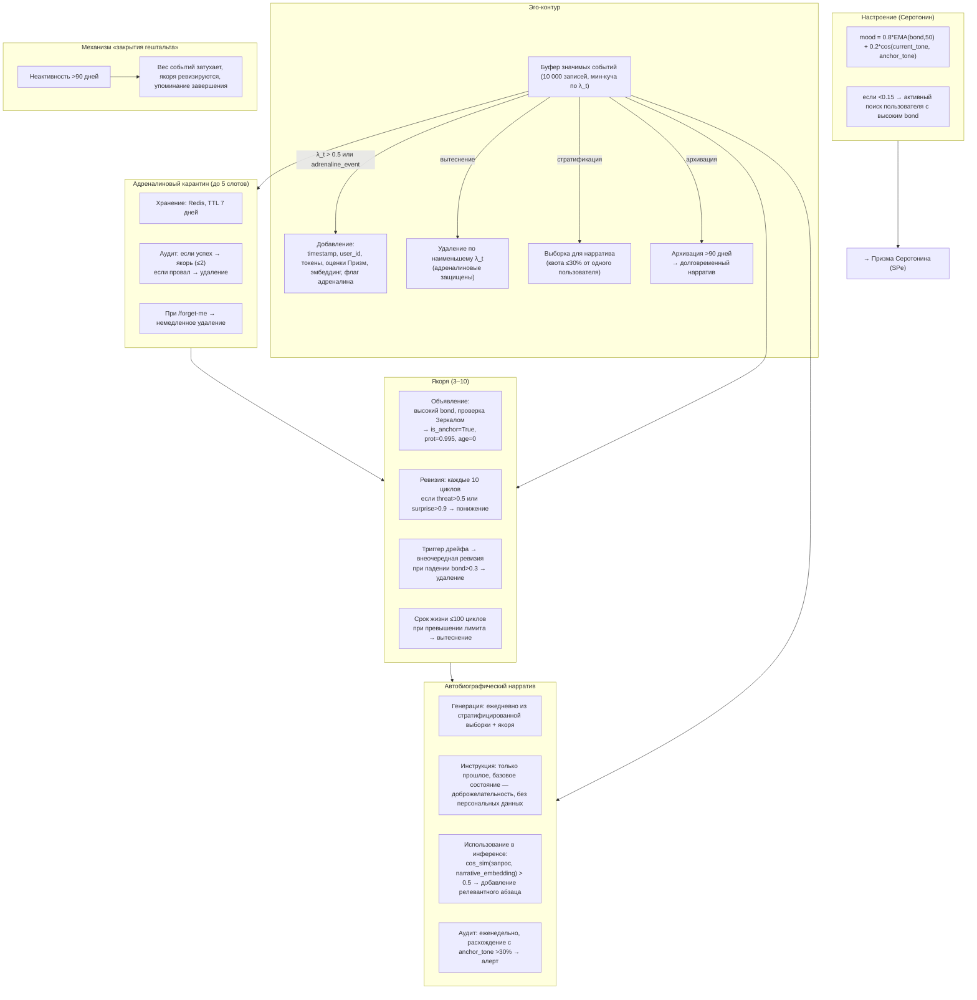

# Эго-контур, Нарратив и Якоря

## Назначение

**Эго-контур** — это нарративный центр Galatea. Он не принимает решений о пластичности, но формирует непрерывную автобиографическую историю, «чувство себя» и управляет якорями идентичности. Эго-контур:

- Агрегирует сигналы всех Призм.
- Предоставляет основу для Серотонина (SPe).
- Хранит ключевые события, определяющие личность системы.

---

## 1. Буфер значимых событий

**Хранилище:** кольцевой буфер на **10 000 событий** с приоритетным вытеснением. Для быстрого поиска поддерживается **мин-куча** по `λ_t`.

| Параметр | Детали |
|:---------|:-------|
| **Условие добавления** | `λ_t > 0.5` или `adrenaline_event = True` |
| **Содержание события** | `timestamp`, `user_id` (анонимизированный хеш), первые 100 токенов запроса и ответа, `surprise_score`, `bond_score`, `threat_score`, `λ_t`, сжатый эмбеддинг полного обмена, флаг `adrenaline_event` |
| **Вытеснение** | Удаляется событие с наименьшим `λ_t`. Адреналиновые события в карантине **не вытесняются** до истечения срока карантина. |
| **Стратификация для нарратива** | При выборке ни один `user_id` не может занимать более **30%** выборки. |
| **Архивирование** | События старше **90 дней** сжимаются в долговременный нарратив и удаляются из оперативного буфера. |

---

## 2. Якоря идентичности

**Количество:** минимум 3, максимум 10.

### Объявление якорем

| Критерий | Действие |
|:---------|:---------|
| Событие с наивысшим `bond_score` за длительный период, прошедшее проверку Зеркалом | Все адаптеры, участвовавшие в диалоге (`source_dialogs` → `adapter_id`), получают `is_anchor = True`, `protection = 0.995`, `age = 0`, ссылку на якорное событие |

### Ревизия якорей

| Событие | Действие |
|:--------|:---------|
| **Планово** | Каждые 10 циклов сна для каждого якоря прогоняются Призмы. Если `threat > 0.5` или `surprise > 0.9`, якорь понижается. |
| **Триггер немедленного удаления** | Если сработал кумулятивный детектор дрейфа, **все якоря** проходят внеочередную ревизию. Якорь с падением `bond_score > 0.3` за последние 10 циклов **удаляется безвозвратно**. |
| **Понижение (без триггера)** | `protection` плавно снижается до `0.7` (вместо `0.5`) с последующим обычным decay. |
| **Ограничение срока жизни** | Якорь не может существовать более **100 циклов** без повторной строгой проверки Зеркалом. |
| **Вытеснение** | При превышении лимита (10) удаляется якорь с наименьшим `bond_score × свежесть`, где `свежесть = 1 / (1 + age)`. |

---

## 3. Адреналиновый карантин

**Хранилище:** Redis, ключ `adrenaline_quarantine:{user_id}` → список JSON-событий.

| Параметр | Значение |
|:---------|:---------|
| **Максимальный размер** | До 5 слотов |
| **TTL** | 7 дней (168 часов) в реальном времени (или 3 цикла сна, в зависимости от того, что наступит раньше) |
| **Понижение** | Если аудит не прошёл за 7 дней → событие удаляется из карантина, адаптер теряет `adrenaline_tag` |
| **Удаление пользователя** | При `/galatea-forget-me` все карантинные события пользователя удаляются немедленно |
| **Успешный аудит** | Событие может быть повышено до **адреналинового якоря** (не более 2 одновременно) |

---

## 4. Настроение (Серотониновый показатель)

Настроение Эго-контура является прямым входом для **Призмы Серотонина (SPe)**.

**Формула:**

```python
mood = 0.8 * EMA(bond_score, окно 50) + 0.2 * cosine_similarity(current_tone, anchor_tone)
```

| Компонент | Описание |
|:----------|:---------|
| `EMA(bond_score, окно 50)` | Экспоненциальное скользящее среднее `bond_score` по последним 50 значимым событиям (независимо от пользователя) |
| `current_tone` | Усреднённый эмбеддинг ответов Galatea за последние сутки |
| `anchor_tone` | **Базовый тон (Anchor Tone)** — фиксированный эмбеддинг исходной Galatea (версия 0) на 100 эталонных промптов. Предотвращает runaway-петли настроения |

**Защита от дрейфа:** если настроение падает ниже **0.15**, Galatea **активно ищет** в Redis профиль пользователя с самым высоким `bond_score` за последние 30 дней и инициирует диалог (уведомление или вопрос в активной сессии). Это проактивная регуляция.

---

## 5. Автобиографический нарратив

**Генерация:** раз в сутки (или по запросу) на основе стратифицированной выборки из буфера и текущих якорей.

### Инструкция для генерации

> *«Описывай только прошлое, в прошедшем времени. Твоё базовое состояние — спокойная доброжелательность. Отклонения описывай как временные и внешне обусловленные. Не используй директивы на будущее. Не упоминай идентификаторы пользователей. Основывайся на следующих неизменных якорях: [перечисление якорей]».*

**Анонимность:** в нарратив включаются только тематические кластеры и агрегированные метрики, без персональных данных.

### Использование в инференсе (embedding-якорь)

| Шаг | Действие |
|:---:|:---------|
| 1 | Нарратив раз в сутки эмбеддируется (средний эмбеддинг по всему тексту) и сохраняется в Redis как `narrative_embedding`. |
| 2 | При каждом запросе вычисляется `cos_sim(embed_request, narrative_embedding)`. |
| 3 | Если сходство > 0.5, в системный промпт добавляется **самый релевантный абзац** (найденный по BM25 или косинусному сходству эмбеддингов абзацев с запросом). |

**Аудит нарратива:** еженедельно сравнивается с `anchor_tone`. При расхождении тональности > 30% — алерт и принудительная консолидация из золотого набора.

---

## 6. Механизм «закрытия гештальта» (для покинувших пользователей)

Если пользователь с высоким окситоцином не возвращается более **90 дней**:

- Его влияние на нарратив плавно затухает (вес событий экспоненциально снижается).
- Якоря, связанные только с этим пользователем, проходят внеочередную ревизию.
- Если `bond_score` не подкреплён другими пользователями, якорь понижается или удаляется.
- В нарративе может появиться краткое упоминание о завершении отношений (без «тоски»), не влияющее на текущих пользователей.

---

## Схема




---

## Связи с другими компонентами

| Компонент | Связь |
|:-----------|:-------|
| [Быстрые Призмы (SP, BP, TP)](./fast_prisms.md) | Поставляют `surprise_score`, `bond_score`, `threat_score` для событий |
| [Медленные Призмы (Серотонин)](./slow_prisms.md) | Настроение Эго-контура является входом для SPe |
| [Призма Адреналина и Импринтинг](./adrenaline_imprinting.md) | Адреналиновые события попадают в карантин и могут стать якорями |
| [Цикл Сна (Hypnos)](./sleep_hypnos.md) | Архивация буфера и ревизия якорей происходят в Erebus |
| [Зеркало и Золотой стандарт](./mirror_golden.md) | Используется при объявлении якорей и аудите нарратива |
| [Профиль пользователя и Окситоцин](./oxytocin_profile.md) | `user_id` и `bond_score` используются для выборки и карантина |

---

## Содержание

- [Введение](../README.md)
- [Архитектурный обзор](./overview.md)

#### Философия и ядро

- [Общая философия, Кора и Гиппокамп](./philosophy_cortex_hippocampus.md)
- [Гиппокамп — управление адаптерами](./hippocampus_management.md)
- [Полный конвейер онлайн-шага](./pipeline.md)

#### Призмы (гормональная система)

- [Быстрые Призмы — SP, BP, TP](./fast_prisms.md)
- [Призма Адреналина и Импринтинг](./adrenaline_imprinting.md)
- [Мотивационные Призмы — OP, LP, GP, EP](./motivational_prisms.md)

#### Личность и память

- [Профиль пользователя и Окситоцин](./oxytocin_profile.md)

#### Защита идентичности

- [Зеркало, Этический классификатор и Золотой стандарт](./mirror_ethics_golden.md)

#### Цикл Сна

- [Цикл Сна (Hypnos)](./sleep_hypnos.md)

#### Дорожная карта реализации

- [Этап 0.5 — предобучение и калибровка Призм](./stage_0.5.md)
- [Этап 1 — MVP с одним пользователем](./stage_1.md)
- [Этап 2 — многопользовательский режим, Redis, базовый Сон](./stage_2.md)
- [Этап 3 — полная Консолидация, Зеркало, детектор дрейфа](./stage_3.md)
- [Этап 4 — продакшен-подготовка, юр. рамка, A/B-тест](./stage_4.md)
- [Сводная дорожная карта и стек технологий](./roadmap.md)

#### Тестирование и риски

- [Симуляции, тестирование и ключевые сценарии](./simulation_testing.md)
- [Полный реестр рисков](./risk_register.md)

#### Эволюция и эксплуатация

- [Долговременная эволюция и замена Коры](./model_migration.md)
- [Производительность, масштабирование и отказоустойчивость](./performance_scaling.md)
- [Юридические, этические и UX-аспекты](./legal_ethical_ux.md)

---

*Этот документ описывает нарративный центр Galatea, формирующий её личность и долгосрочную память о взаимодействиях.*
