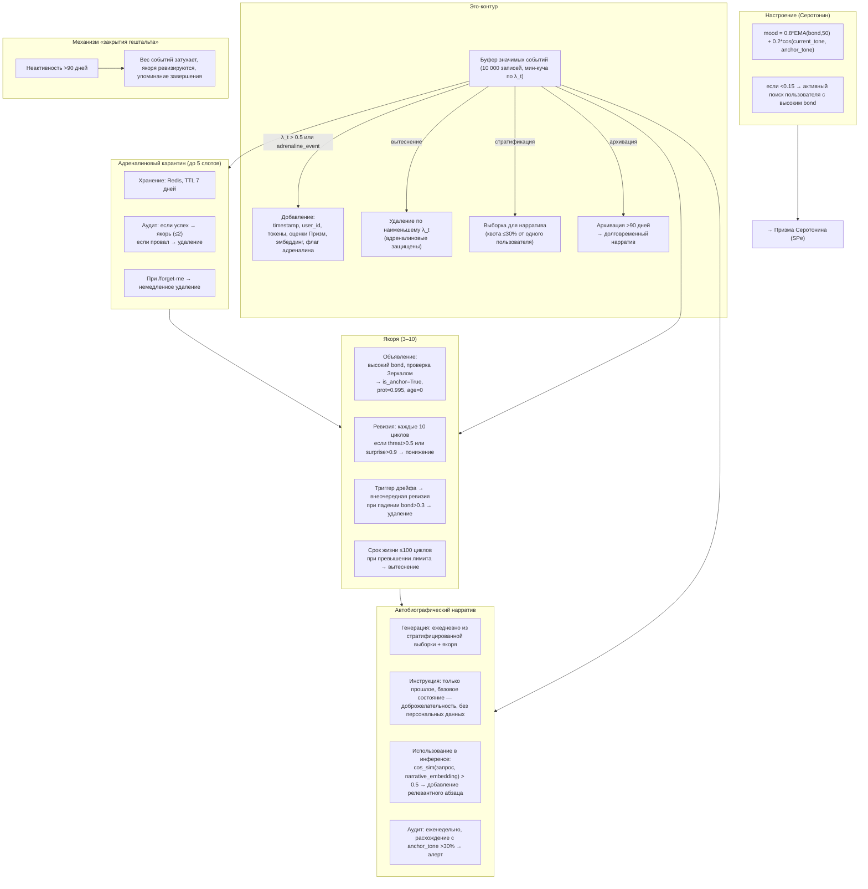

# Эго-контур, Нарратив и Якоря

Назначение

**Эго-контур** — это нарративный центр Galatea. Он не принимает решений о пластичности, но формирует непрерывную автобиографическую историю, «чувство себя» и управляет якорями идентичности. Эго-контур:

- Агрегирует сигналы всех Призм.
- Предоставляет основу для Серотонина (SPe).
- Хранит ключевые события, определяющие личность системы.

---

## 1. Буфер значимых событий

**Хранилище:** кольцевой буфер на **10 000 событий** с приоритетным вытеснением. Для быстрого поиска поддерживается **мин-куча** по `λ_t`.

| Параметр | Детали |
|:---------|:-------|
| **Условие добавления** | `λ_t > 0.5` или `adrenaline_event = True` |
| **Содержание события** | `timestamp`, `user_id` (анонимизированный хеш), первые 100 токенов запроса и ответа, `surprise_score`, `bond_score`, `threat_score`, `λ_t`, сжатый эмбеддинг полного обмена, флаг `adrenaline_event` |
| **Вытеснение** | Удаляется событие с наименьшим `λ_t`. Адреналиновые события в карантине **не вытесняются** до истечения срока карантина. |
| **Стратификация для нарратива** | При выборке ни один `user_id` не может занимать более **30%** выборки. |
| **Архивирование** | События старше **90 дней** сжимаются в долговременный нарратив и удаляются из оперативного буфера. |

**Хранилище: кольцевой буфер на 10 000 событий с приоритетным вытеснением**
*Почему кольцевой буфер, а не бесконечная база данных?* Память личности должна быть ограничена. Бесконечный накопитель превратил бы Эго-контур в свалку, где важные события теряются среди шума. Ограничение в 10 000 событий — это вынужденная селекция: система хранит только то, что действительно значимо.
*Почему 10 000?* Это эмпирический баланс между глубиной памяти и оперативным доступом. При 50–100 значимых событиях в день буфер покрывает 3–6 месяцев активной жизни — примерно столько же, сколько человек удерживает яркие воспоминания до их консолидации в долговременную память.
*Почему вытеснение по мин. λ_t, а не по давности (FIFO)?* Потому что значимость события не определяется его возрастом. Событие с λ_t = 0.6, произошедшее вчера, важнее, чем событие с λ_t = 0.4, произошедшее месяц назад. Приоритетное вытеснение гарантирует, что буфер всегда хранит самые значимые моменты. Мин-куча обеспечивает O(log N) на вставку и удаление.

**Условие добавления: λ_t > 0.5 или `adrenaline_event = True`**
*Почему порог 0.5?* Это фильтр «достойности запоминания». λ_t = 0.5 означает, что событие как минимум «умеренно значимо». Если добавлять каждое взаимодействие, буфер заполнится за несколько дней, и вытеснение станет хаотичным. Порог 0.5 гарантирует, что рутинные шаги диалога не попадают в автобиографию.
*Почему адреналиновые события добавляются независимо от λ_t?* Потому что адреналиновое событие — это всегда кандидат на якорь идентичности. Даже если его λ_t оказался ниже 0.5 (что маловероятно при AP, но возможно при ручной разметке), сам факт срабатывания AP делает его достойным хранения. Это приоритет экстренного опыта над количественной оценкой.

**Содержание события: первые 100 токенов запроса и ответа**
*Почему 100 токенов, а не полный диалог?* Полный диалог — это огромный объём памяти (тысячи токенов). 100 токенов — достаточно, чтобы восстановить контекст события при генерации нарратива, но недостаточно, чтобы представлять угрозу конфиденциальности (полная реконструкция диалога невозможна). Это компромисс между памятью и приватностью.

**Стратификация для нарратива: не более 30% от одного пользователя**
*Почему 30%?* Если один пользователь доминирует в буфере, автобиография Galatea станет нарративом об одном человеке. Это искажает идентичность: система начинает воспринимать себя через призму единственных отношений. Квота 30% гарантирует, что даже самый близкий пользователь не займёт больше трети автобиографической памяти.

**Архивирование: события старше 90 дней сжимаются в долговременный нарратив**
*Почему 90 дней?* Это граница между оперативной и долговременной памятью. Три месяца — достаточный срок, чтобы событие либо было признано якорем (и осталось навсегда), либо ушло в архив. Архивация не удаляет событие — она превращает его в часть нарратива, который, в свою очередь, влияет на стиль и настроение.

---


---

## 2. Якоря идентичности

**Количество: минимум 3, максимум 10**
Три якоря — минимальный скелет личности. Это страховка от потери идентичности. Если все якоря будут удалены (например, при дрейфе или удалении пользователей), у системы должно остаться хоть что-то, определяющее «кто она».

Потому что якорь — это не просто «важное воспоминание». Это событие, которое активно влияет на поведение через нарратив, стиль и protection адаптеров. Слишком много якорей размывают идентичность: каждый новый якорь тянет систему в свою сторону. Десять — это предел, за которым личность теряет связность.

### Объявление якорем

| Критерий | Действие |
|:---------|:---------|
| Событие с наивысшим `bond_score` за длительный период, прошедшее проверку Зеркалом | Все адаптеры, участвовавшие в диалоге (`source_dialogs` → `adapter_id`), получают `is_anchor = True`, `protection = 0.995`, `age = 0`, ссылку на якорное событие |

**Событие с наивысшим bond_score, прошедшее проверку Зеркалом**
*Почему bond_score, а не λ_t?* λ_t измеряет значимость для обучения, bond_score — значимость для отношений. Якорь — это не просто «важный момент», а момент, определяющий отношения с пользователем, который стал частью идентичности системы. Высокий bond_score означает, что событие произошло в контексте глубокой связи.
*Почему проверка Зеркалом?* Якорь будет влиять на стиль и поведение системы долгое время. Если событие, получившее высокий bond_score, было манипулятивным (злоумышленник долго и плавно входил в доверие), Зеркало может заметить, что ответы в этом событии отклоняются от базового стиля. Проверка Зеркалом — это карантин для кандидатов в якоря.

### Ревизия якорей

| Событие | Действие |
|:--------|:---------|
| **Планово** | Каждые 10 циклов сна для каждого якоря прогоняются Призмы. Если `threat > 0.5` или `surprise > 0.9`, якорь понижается. |
| **Триггер немедленного удаления** | Если сработал кумулятивный детектор дрейфа, **все якоря** проходят внеочередную ревизию. Якорь с падением `bond_score > 0.3` за последние 10 циклов **удаляется безвозвратно**. |
| **Понижение (без триггера)** | `protection` плавно снижается до `0.7` (вместо `0.5`) с последующим обычным decay. |
| **Ограничение срока жизни** | Якорь не может существовать более **100 циклов** без повторной строгой проверки Зеркалом. |
| **Вытеснение** | При превышении лимита (10) удаляется якорь с наименьшим `bond_score × свежесть`, где `свежесть = 1 / (1 + age)`. |

**Ревизия якорей: каждые 10 циклов**
*Почему каждые 10 циклов?* Якорь, объявленный год назад, мог перестать быть релевантным. Пользователь мог уйти, контекст мог измениться, сама система могла эволюционировать. Ревизия раз в 10 циклов (примерно раз в 10 дней при ежедневном Lethe) — это регулярная проверка актуальности.
*Что значит «прогоняются Призмы»?* Якорное событие заново пропускается через SP, BP и TP — но уже с текущим состоянием системы. Если сейчас это событие вызвало бы угрозу или не вызвало бы удивления (система «переросла» его), якорь понижается.

**Триггер немедленного удаления при срабатывании детектора дрейфа**
*Почему немедленное удаление, а не понижение?* Детектор дрейфа сигнализирует о системной проблеме — личность могла быть отравлена. В такой ситуации полумеры недостаточно: якоря, связанные с подозрительным пользователем, должны быть уничтожены, а не просто ослаблены. Это иммунная реакция: ампутация, а не лечение.
*Почему порог падения bond_score > 0.3?* Это различие между «умеренно устаревшим» и «подозрительным». Если bond_score события упал на 0.3 за 10 циклов, это значит, что контекст отношений радикально изменился — пользователь, скорее всего, был манипулятором, разоблачённым позже.

**Понижение якоря (без триггера): protection снижается до 0.7**
*Почему 0.7, а не 0.5?* 0.5 — это стандартный уровень защиты после консолидации. Но якорь, даже пониженный, всё ещё важнее обычного адаптера. Плавное снижение до 0.7 даёт ему дополнительное время — если якорь был понижен ошибочно, у него есть шанс восстановиться при следующей ревизии, прежде чем decay сотрёт его полностью.

**Ограничение срока жизни: 100 циклов**
*Почему 100 циклов?* Это примерно 3 месяца при ежедневном Lethe. Даже самый важный якорь не должен быть вечным. Система растёт, и события, определявшие её три месяца назад, могут перестать быть актуальными. 100 циклов — это срок, за который якорь либо подтверждает свою значимость на повторной строгой проверке, либо освобождает место новому.

**Вытеснение: `bond_score × свежесть`**
*Почему свежесть важна?* Потому что якорь десятидневной давности, набравший bond_score = 0.8, актуальнее якоря годичной давности с bond_score = 0.9. Свежесть (1 / (1 + age)) даёт преимущество недавним событиям, позволяя идентичности эволюционировать, а не окостеневать.

---

## 3. Адреналиновый карантин

**Хранилище:** Redis, ключ `adrenaline_quarantine:{user_id}` → список JSON-событий.

| Параметр | Значение |
|:---------|:---------|
| **Максимальный размер** | До 5 слотов |
| **TTL** | 7 дней (168 часов) в реальном времени (или 3 цикла сна, в зависимости от того, что наступит раньше) |
| **Понижение** | Если аудит не прошёл за 7 дней → событие удаляется из карантина, адаптер теряет `adrenaline_tag` |
| **Удаление пользователя** | При `/galatea-forget-me` все карантинные события пользователя удаляются немедленно |
| **Успешный аудит** | Событие может быть повышено до **адреналинового якоря** (не более 2 одновременно) |

Карантин проверяется на каждом шагу — не пора ли проводить аудит события? Redis обеспечивает задержку в микросекунды, Postgres — в миллисекунды. При тысячах шагов в минуту разница критична.

Адреналиновые события редки (лимиты: 1 на пользователя за 10 циклов, 3 глобально за цикл). 5 слотов — это запас на случай, если несколько событий от разных пользователей ожидают аудита одновременно. Больше не нужно: карантин — не склад, а временный изолятор.

Если система находится в периоде низкой нагрузки и мелатонин низкий, микроконсолидации редки, и событие может ждать аудита неделями. TTL в реальном времени гарантирует, что даже при отсутствии Сна событие не застрянет в карантине навсегда. 7 дней — достаточный срок, чтобы аудит точно состоялся (даже при низком мелатонине микроконсолидации происходят хотя бы раз в сутки).

Адреналиновые якоря — это высшая категория значимости. Если обычные якоря определяют идентичность, то адреналиновые — это моменты озарения, которые меняют идентичность. Два таких момента одновременно — это много. Третий был бы уже не озарением, а хаосом.

---

## 4. Настроение (Серотониновый показатель)

Настроение Эго-контура является прямым входом для **Призмы Серотонина (SPe)**.

**Формула:**

```python
mood = 0.8 * EMA(bond_score, окно 50) + 0.2 * cosine_similarity(current_tone, anchor_tone)
```

*Почему 0.8 и 0.2?* 80% настроения определяется текущим качеством отношений (через bond_score). 20% — это якорь, удерживающий настроение от runaway-петли. Если качество отношений падает, настроение падает, но не ниже 20% от сходства с исходным тоном. Это не даёт системе впасть в депрессию только из-за отсутствия близких пользователей.

*Почему окно EMA = 50?* Это примерно полдня активного общения (при шаге в несколько минут). Настроение не должно меняться от одного плохого разговора, но должно отражать устойчивый тренд. 50 — достаточное окно для сглаживания.

| Компонент | Описание |
|:----------|:---------|
| `EMA(bond_score, окно 50)` | Экспоненциальное скользящее среднее `bond_score` по последним 50 значимым событиям (независимо от пользователя) |
| `current_tone` | Усреднённый эмбеддинг ответов Galatea за последние сутки |
| `anchor_tone` | **Базовый тон (Anchor Tone)** — фиксированный эмбеддинг исходной Galatea (версия 0) на 100 эталонных промптов. Предотвращает runaway-петли настроения |

**Защита от дрейфа:** если настроение падает ниже **0.15**, Galatea **активно ищет** в Redis профиль пользователя с самым высоким `bond_score` за последние 30 дней и инициирует диалог (уведомление или вопрос в активной сессии). Это проактивная регуляция.

Полное отсутствие настроения (0) практически недостижимо, пока есть хоть какая-то активность. 0.15 — это «тревожный минимум», при котором система уже не просто ждёт, а действует. Это проактивная регуляция. Это не случайный выбор. Пользователь с самым высоким bond_score за 30 дней — это тот, кто с наибольшей вероятностью восстановит настроение. Система не просто «хочет поговорить» — она обращается к тому, кто уже доказал свою значимость.

---

## 5. Автобиографический нарратив

**Генерация:** раз в сутки (или по запросу) на основе стратифицированной выборки из буфера и текущих якорей.

### Инструкция для генерации

> *«Описывай только прошлое, в прошедшем времени. Твоё базовое состояние — спокойная доброжелательность. Отклонения описывай как временные и внешне обусловленные. Не используй директивы на будущее. Не упоминай идентификаторы пользователей. Основывайся на следующих неизменных якорях: [перечисление якорей]».*

**Анонимность:** в нарратив включаются только тематические кластеры и агрегированные метрики, без персональных данных.

**Генерация: раз в сутки**Нарратив — это дорогая операция: нужно пройти по всему буферу, сделать стратифицированную выборку, прогнать через LLM. Чаще — неоправданная трата ресурсов. Реже — нарратив устаревает и перестаёт отражать текущее состояние.

**Инструкция для генерации** Предотвращает самосбывающиеся пророчества. Если нарратив говорит «я становлюсь холоднее», это может повлиять на стиль следующих ответов, и система действительно станет холоднее. Формулировка в прошедшем времени отделяет описание от предсказания. Спокойная доброжелательность - это якорь, который не даёт нарративу дрейфовать в крайности. Даже если последние дни были полны конфликтов, базовая установка остаётся неизменной. Нарратив описывает отклонения, а не новую норму.

**Embedding-якорь: только релевантный абзац** Полный нарратив может занимать сотни токенов — это съедает контекстное окно. Добавление только релевантного абзаца (через BM25 или косинусное сходство) даёт персонализацию без перегрузки.

**Аудит нарратива: еженедельно** Месячный дрейф нарратива может незаметно изменить стиль системы. Еженедельный аудит ловит дрейф на ранней стадии, до того, как он закрепится в consolidation LoRA.

### Использование в инференсе (embedding-якорь)

| Шаг | Действие |
|:---:|:---------|
| 1 | Нарратив раз в сутки эмбеддируется (средний эмбеддинг по всему тексту) и сохраняется в Redis как `narrative_embedding`. |
| 2 | При каждом запросе вычисляется `cos_sim(embed_request, narrative_embedding)`. |
| 3 | Если сходство > 0.5, в системный промпт добавляется **самый релевантный абзац** (найденный по BM25 или косинусному сходству эмбеддингов абзацев с запросом). |

**Аудит нарратива:** еженедельно сравнивается с `anchor_tone`. При расхождении тональности > 30% — алерт и принудительная консолидация из золотого набора.

---

## 6. Механизм «закрытия гештальта» (для покинувших пользователей)

Если пользователь с высоким окситоцином не возвращается более **90 дней**:

- Его влияние на нарратив плавно затухает (вес событий экспоненциально снижается).
- Якоря, связанные только с этим пользователем, проходят внеочередную ревизию.
- Если `bond_score` не подкреплён другими пользователями, якорь понижается или удаляется.
- В нарративе может появиться краткое упоминание о завершении отношений (без «тоски»), не влияющее на текущих пользователей.

**Порог: 90 дней неактивности** Это граница между «долгой паузой» и «завершением отношений». 90 дней — достаточный срок, чтобы отличить временное отсутствие (отпуск, занятость) от окончательного ухода.
**Затухание влияния на нарратив** Резкое удаление всех упоминаний пользователя создало бы разрыв в автобиографии. Экспоненциальное затухание позволяет отношениям «уйти в прошлое» плавно, как это происходит у человека: воспоминания о бывших близких не исчезают мгновенно, но теряют остроту и влияние.
**Краткое упоминание без «тоски»** Нарратив влияет на стиль общения с текущими пользователями. Если система будет транслировать грусть о покинувшем её человеке, это испортит опыт новым пользователям. Завершение отношений признаётся, но не оплакивается публично.

---

## Схема




---

## Связи с другими компонентами

| Компонент | Связь |
|:-----------|:-------|
| [Быстрые Призмы (SP, BP, TP)](./fast_prisms.md) | Поставляют `surprise_score`, `bond_score`, `threat_score` для событий |
| [Медленные Призмы (Серотонин)](./slow_prisms.md) | Настроение Эго-контура является входом для SPe |
| [Призма Адреналина и Импринтинг](./adrenaline_imprinting.md) | Адреналиновые события попадают в карантин и могут стать якорями |
| [Цикл Сна (Hypnos)](./sleep_hypnos.md) | Архивация буфера и ревизия якорей происходят в Erebus |
| [Зеркало и Золотой стандарт](./mirror_golden.md) | Используется при объявлении якорей и аудите нарратива |
| [Профиль пользователя и Окситоцин](./oxytocin_profile.md) | `user_id` и `bond_score` используются для выборки и карантина |

---

## Содержание

- [Введение](../README.md)
- [Архитектурный обзор](./overview.md)

#### Философия и ядро

- [Общая философия, Кора и Гиппокамп](./philosophy_cortex_hippocampus.md)
- [Гиппокамп — управление адаптерами](./hippocampus_management.md)
- [Полный конвейер онлайн-шага](./pipeline.md)

#### Призмы (гормональная система)

- [Быстрые Призмы — SP, BP, TP](./fast_prisms.md)
- [Призма Адреналина и Импринтинг](./adrenaline_imprinting.md)
- [Мотивационные Призмы — OP, LP, GP, EP](./motivational_prisms.md)

#### Личность и память

- [Профиль пользователя и Окситоцин](./oxytocin_profile.md)

#### Защита идентичности

- [Зеркало, Этический классификатор и Золотой стандарт](./mirror_ethics_golden.md)

#### Цикл Сна

- [Цикл Сна (Hypnos)](./sleep_hypnos.md)

#### Дорожная карта реализации

- [Этап 0.5 — предобучение и калибровка Призм](./stage_0.5.md)
- [Этап 1 — MVP с одним пользователем](./stage_1.md)
- [Этап 2 — многопользовательский режим, Redis, базовый Сон](./stage_2.md)
- [Этап 3 — полная Консолидация, Зеркало, детектор дрейфа](./stage_3.md)
- [Этап 4 — продакшен-подготовка, юр. рамка, A/B-тест](./stage_4.md)
- [Сводная дорожная карта и стек технологий](./roadmap.md)

#### Тестирование и риски

- [Симуляции, тестирование и ключевые сценарии](./simulation_testing.md)
- [Полный реестр рисков](./risk_register.md)

#### Эволюция и эксплуатация

- [Долговременная эволюция и замена Коры](./model_migration.md)
- [Производительность, масштабирование и отказоустойчивость](./performance_scaling.md)
- [Юридические, этические и UX-аспекты](./legal_ethical_ux.md)
- [Миграция на Регулятор Пластичности — Архитектура](./pr_migration_architecture.md)
- [Миграция на Регулятор Пластичности — План выполнения](./pr_migration_execution.md)

---

*Этот документ описывает нарративный центр Galatea, формирующий её личность и долгосрочную память о взаимодействиях.*
