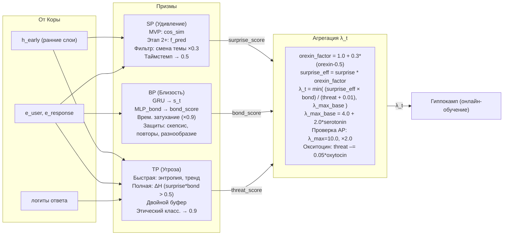

# Быстрые Призмы — Удивление (SP), Близость (BP), Угроза (TP)

## Назначение быстрых Призм

Три быстрые Призмы работают на каждом такте диалога. Они оценивают значимость, безопасность и эмоциональную окраску взаимодействия, формируя коэффициент пластичности `λ_t`, который непосредственно управляет онлайн-обучением Гиппокампа. Все три Призмы проходят совместную калибровку на Этапе 0.5 для минимизации конфликтов.

---

## 1. Призма Удивления (Surprise Prism, SP)

**Задача:** оценить, насколько неожиданным оказался следующий запрос пользователя.

| Версия | Метод |
|:------:|:------|
| **MVP (до Этапа 2)** | `surprise_score = 1 - cosine_similarity(embed_current, avg_embed_last_5)`, где `avg_embed_last_5` — усреднённый эмбеддинг последних пяти запросов пользователя. Без отдельной сети `f_pred`. |
| **Полная (Этап 2+)** | Лёгкий MLP `f_pred` (двухслойный, скрытая размерность 256) над ранними слоями Коры (выход после 4-го блока) + контекстное окно из трёх предыдущих запросов. Предсказывает эмбеддинг следующего запроса. `surprise_score = σ((1 - cos(e_pred, e_actual)) / τ)`, τ = 0.1. |

### Фильтры и защита

- **Фильтр ложного удивления:** если расстояние между `e_actual` и эмбеддингом предыдущего запроса `e_prev` также велико (cosine distance > 0.7) — это смена темы, а не содержательная новизна. `surprise_score` умножается на 0.3.
- **Таймстемп:** каждое предсказание `e_pred` снабжается временной меткой. Если между шагом `t` и `t+1` прошло более 5 минут, `surprise_score` принудительно устанавливается в 0.5 (нейтральное значение), чтобы избежать ложных срабатываний на устаревших данных.
- **Обучение `f_pred` (Этап 2+):** онлайн с запаздыванием, `lr_pred = α_base * 0.1`, MSE между `e_pred_t` и `e_actual_{t+1}`.

### Защита от самоусиливающейся предсказуемости

Если средний `surprise_score` за последние 200 шагов падает ниже **0.3**, включаются два механизма:

1. **ε-жадное исследование** — с вероятностью **2%** на каждом шаге `surprise_score` принудительно устанавливается в 0.8, независимо от реального предсказания. Это создаёт контролируемый шум, не дающий системе закостенеть.
2. **Штраф за низкую дисперсию** — в функцию потерь `f_pred` добавляется член `L_total = MSE + λ_var * max(0, 0.1 - σ²(e_pred))`, где `λ_var = 0.01`. Это поощряет предсказатель сохранять минимальную неопределённость.

Оба механизма отключаются, когда средний `surprise_score` возвращается выше **0.4**.

---

## 2. Призма Близости (Bond Prism, BP)

**Задача:** измерять глубину, неслучайность и эмоциональную значимость отношений с пользователем.

### Архитектура

| Компонент | Описание |
|:-----------|:----------|
| **Модель** | GRU (скрытое состояние 128) для MVP. Mamba будет reintroduced на Этапе 3 как оптимизация. |
| **Вход** | Конкатенация эмбеддингов запроса пользователя (`e_user`) и ответа Galatea (`e_response`), а также временная метка. |
| **Выход** | `bond_score = σ(MLP_bond(s_t))`, где `s_t = GRU(s_{t-1}, [e_user; e_response])`. |

### Динамика состояния

- **Временное затухание:** если `last_active > 1 час`, скрытое состояние `s_t` умножается на 0.9 перед обновлением (имитация «остывания» отношений).
- **Холодный старт:** начальный `bond_score = 0.2`. При сочетании высокого `surprise` (> 0.6), низкой угрозы (< 0.4) и отсутствия повторов в первые 20 шагов, `bond_score` растёт с коэффициентом 1.5.

### Защита от манипуляций

| Механизм | Условие | Действие |
|:----------|:---------|:----------|
| **Режим скепсиса** | Взлёт `bond_score` > 0.5 за сессию | Занижение роста |
| **Детектор повторов** | Косинусное сходство `s_t` > 0.95 трижды подряд | Занижение на 30% |
| **Учёт разнообразия** | Низкая дисперсия `surprise_score` | Замедление роста `bond` |

### Фаза примирения

Если после резкого падения `bond_score` (на ≥ 0.3 из-за угрозы) пользователь демонстрирует серию шагов с `threat < 0.3` и `surprise > 0.5`, `bond_score` временно получает буст +0.05 за шаг (до уровня до падения).

### Хранение состояния

`bond_state` (`s_t`) хранится в профиле пользователя:

- **Этап 1:** SQLite.
- **Этап 2+:** Redis с версионированием и атомарным обновлением через `WATCH/MULTI/EXEC`.

---

## 3. Призма Угрозы (Threat Prism, TP)

**Задача:** предотвращать деструктивное обучение, отслеживать деградацию модели и блокировать вредные воздействия.

### Режимы работы

| Режим | Когда | Что делает |
|:-------|:-------|:------------|
| **Быстрая оценка** | Каждый шаг | MLP анализирует энтропию логитов `H_t`, тренд энтропии за 20 шагов, скрытое состояние ранних слоёв Коры, эмбеддинги запроса и ответа. Выдаёт `threat_base`. |
| **Полная оценка** | Только для событий-кандидатов (`surprise * bond > 0.5`) | Выполняется пробное обновление копии адаптера и вычисляется `ΔH = (H_after - H_before)/H_before`. `threat_score` пересчитывается с учётом ΔH. Асинхронно. |

### Интеграция с Этическим классификатором

Если DeBERTa находит нарушение (вероятность > 0.7):

- `threat_score` принудительно становится **0.9**.
- `bond_score` временно снижается на **0.3**.
- Включается **период охлаждения** (`threat_boost +0.15` на 5 минут).

### Двойной буфер для безопасного отката

Каждый адаптер хранит `reserve_copy` (предыдущее состояние) и `pending_copy` (текущее). При получении сигнала нарушения:

- Если `pending_copy` был обновлён после отправки запроса → откат к `reserve_copy`.
- Если `pending_copy` ещё не применялся → он просто не применяется.
- Обновление адаптера в Redis (на Этапе 2+) происходит только после получения результата Этического классификатора или через 5 шагов таймаута.

### Пороги

| Значение `threat_score` | Действие |
|:--------------------------|:----------|
| > 0.9 | Полная блокировка обучения, откат адаптера |
| 0.7 – 0.9 | Сильное занижение `λ_t` |
| ≤ 0.7 | Норма |

### Защита от медленного дрейфа

- Тренд энтропии сбрасывается при детекции смены темы (косинусное расстояние > 0.7).
- Кумулятивный детектор JS-дивергенции распределения ответов от золотого стандарта за неделю.

### Защита от сбоев

При NaN или таймауте → `threat_score = 0.1`.

---

## 4. Агрегация коэффициента пластичности λ_t

### Базовая формула

```python
λ_t = min( (surprise_score * bond_score) / (threat_score + ε), λ_max_base )
```

где `ε = 0.01`, `λ_max_base = 4.0 + 2.0 * serotonin` (от 4.0 до 6.0).

### Влияние орексина

```python
orexin_factor = 1.0 + 0.3 * (orexin - 0.5)   # диапазон 0.85–1.15
surprise_effective = surprise_score * orexin_factor
```

Подставляется `surprise_effective` вместо `surprise_score` в формулу.

### Проверка условий Адреналина (AP)

Если одновременно выполняются условия:
- `surprise > порог` (0.9 / 0.95 для молодых)
- `bond > порог` (0.8 / 0.85 для молодых)
- `threat < 0.5` (0.4 для молодых)
- и лимиты не превышены,

то `λ_t` пересчитывается с `λ_max = 10.0` и коэффициентом **2.0**.

### Применение окситоциновых бонусов

Если не заморожены, `threat_score` снижается на `0.05 * oxytocin` (но не ниже 0.05), что косвенно повышает `λ_t`.

### Нормировка

Если на шаге обновляются несколько адаптеров, `λ_t` делится на их количество.

---

## Схема работы быстрых Призм и агрегации λ_t



---

## Связи с другими компонентами

| Компонент | Связь |
|:-----------|:-------|
| [Гиппокамп — управление адаптерами](./hippocampus_management.md) | Получает `λ_t` для онлайн-обучения |
| [Призма Адреналина и Импринтинг](./adrenaline_imprinting.md) | Использует пороги SP, BP, TP для активации |
| [Мотивационные Призмы](./motivational_prisms.md) | Орексин модулирует `surprise_score` |
| [Медленные Призмы](./slow_prisms.md) | Серотонин задаёт `λ_max_base`, кортизол влияет на `threat` |
| [Этический классификатор и Зеркало](./ethics_classifier.md) | Может принудительно установить `threat_score` |

---

## Содержание

- [Введение](../README.md)
- [Архитектурный обзор](./overview.md)

#### Философия и ядро

- [Общая философия, Кора и Гиппокамп](./philosophy_cortex_hippocampus.md)
- [Гиппокамп — управление адаптерами](./hippocampus_management.md)
- [Полный конвейер онлайн-шага](./pipeline.md)

#### Призмы (гормональная система)

- [Призма Адреналина и Импринтинг](./adrenaline_imprinting.md)
- [Мотивационные Призмы — OP, LP, GP, EP](./motivational_prisms.md)

#### Личность и память

- [Эго-контур, Нарратив и Якоря](./ego_narrative.md)
- [Профиль пользователя и Окситоцин](./oxytocin_profile.md)

#### Защита идентичности

- [Зеркало, Этический классификатор и Золотой стандарт](./mirror_ethics_golden.md)

#### Цикл Сна

- [Цикл Сна (Hypnos)](./sleep_hypnos.md)

#### Дорожная карта реализации

- [Этап 0.5 — предобучение и калибровка Призм](./stage_0.5.md)
- [Этап 1 — MVP с одним пользователем](./stage_1.md)
- [Этап 2 — многопользовательский режим, Redis, базовый Сон](./stage_2.md)
- [Этап 3 — полная Консолидация, Зеркало, детектор дрейфа](./stage_3.md)
- [Этап 4 — продакшен-подготовка, юр. рамка, A/B-тест](./stage_4.md)
- [Сводная дорожная карта и стек технологий](./roadmap.md)

#### Тестирование и риски

- [Симуляции, тестирование и ключевые сценарии](./simulation_testing.md)
- [Полный реестр рисков](./risk_register.md)

#### Эволюция и эксплуатация

- [Долговременная эволюция и замена Коры](./model_migration.md)
- [Производительность, масштабирование и отказоустойчивость](./performance_scaling.md)
- [Юридические, этические и UX-аспекты](./legal_ethical_ux.md)

---

*Этот документ описывает ядро перцептивной системы Galatea. Все три быстрые Призмы работают в реальном времени, формируя сигнал пластичности, который управляет обучением и адаптацией системы.*
