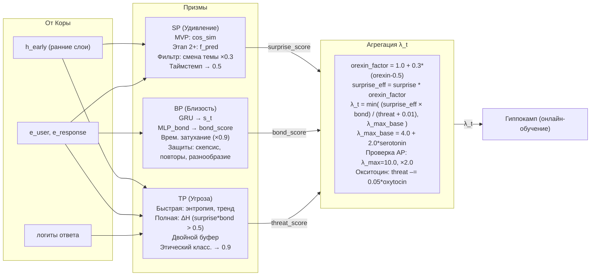

# Быстрые Призмы — Удивление (SP), Близость (BP), Угроза (TP)

## Назначение быстрых Призм

Три быстрые Призмы — это фундаментальный слой восприятия Galatea. На каждом такте диалога они анализируют взаимодействие и вычисляют три скалярные оценки, которые в совокупности определяют значимость события для обучения. Без них система была бы слепа к контексту отношений, новизне и опасности. Все три Призмы проходят совместную калибровку на Этапе 0.5, чтобы их сигналы не конфликтовали друг с другом и давали адекватный коэффициент пластичности `λ_t`.

---

## 1. Призма Удивления (Surprise Prism, SP)

**Задача:** оценить, насколько неожиданным оказался следующий запрос пользователя.

В основе SP лежит фундаментальный принцип: **важно то, что ломает предсказания**. Если пользователь говорит то, что система ожидала, — это рутина, пластичность не нужна. Если пользователь говорит нечто совершенно неожиданное, при этом сохраняя доверительный контекст, — это сигнал к усиленному обучению. Удивление служит индикатором того, что модель столкнулась с опытом, который она не могла предвидеть, и, следовательно, должна скорректировать свои внутренние представления.

### Две реализации

| Версия | Метод |
|:------:|:------|
| **MVP (до Этапа 2)** | `surprise_score = 1 - cosine_similarity(embed_current, avg_embed_last_5)`, где `avg_embed_last_5` — усреднённый эмбеддинг последних пяти запросов пользователя. Это даёт быструю и простую детекцию новизны без обучения отдельной сети. |
| **Полная (Этап 2+)** | Лёгкий MLP `f_pred` (двухслойный, скрытая размерность 256) над ранними слоями Коры (выход после 4-го блока) + контекстное окно из трёх предыдущих запросов. Предсказывает эмбеддинг следующего запроса. `surprise_score = σ((1 - cos(e_pred, e_actual)) / τ)`, τ = 0.1. |

**Почему две версии?** MVP-версия позволяет быстро запустить систему без длительного обучения предсказателя. Она не требует отдельной модели и работает на простом косинусном сходстве. Эмбеддинги пяти последних запросов усредняются, чтобы сформировать «ожидаемый» вектор; отклонение от него считается удивлением. Однако этот подход менее точен: он не различает валентность удивления (приятный сюрприз или шок) и может давать высокий score на простую смену темы — ведь средний эмбеддинг пяти сообщений не способен уловить тонкие закономерности общения с конкретным пользователем. Полная версия с `f_pred` обучается предсказывать поведение конкретного пользователя, что даёт более тонкую оценку. `f_pred` видит не только текущий эмбеддинг, но и контекст из трёх предыдущих запросов, что позволяет ему адаптироваться к стилю собеседника и ожидать определённых поворотов беседы.

**Полная реализация.** `f_pred` — это двухслойный MLP. Первый слой расширяет вход до 256 нейронов, второй проецирует обратно в размерность эмбеддинга. Он принимает эмбеддинги с выхода **ранних слоёв Коры** (после 4-го блока трансформера). Это принципиально: данные слои ещё не затронуты LoRA-адаптерами Гиппокампа, а значит, `f_pred` работает со стабильным, не зависящим от персонализации представлением языка. Это исключает петлю обратной связи, когда адаптация меняет вход и ломает предсказания. Температура τ = 0.1 делает сигмоиду очень крутой: `surprise_score` будет близок к 0 для большинства незначительных расхождений и резко взлетит только при действительно большом косинусном расстоянии.

### Фильтр ложного удивления

Резкая смена темы — это не содержательная новизна, а просто переход в другой контекст. Когда пользователь говорит: «Кстати, какая сегодня погода?» после долгого обсуждения философии, модель, даже идеально обученная, не могла это предсказать. Однако такое событие не является значимым опытом, достойным усиленного обучения. Чтобы отличить такое «пустое» удивление от содержательного, SP проверяет, было ли предыдущее сообщение пользователя (`e_prev`) тоже семантически далеко от текущего. Если косинусное расстояние между `e_actual` и `e_prev` также превышает 0.7, это означает, что пользователь сам совершил резкий скачок в другую тему. В этом случае `surprise_score` умножается на 0.3, снижая его до уровня слабого сигнала. Порог 0.7 выбран эмпирически: он соответствует ситуации, когда два сообщения практически не имеют семантического пересечения. Это позволяет SP не реагировать на обычную для человека спонтанность, но сохранять чувствительность к неожиданному развитию мысли *внутри* текущей темы.

### Таймстемп

Предсказание `e_pred_t` делается в момент `t` на основе истории до этого момента. Если пользователь задумался, отошёл и ответил через 30 минут, предсказание, сделанное полчаса назад, уже нерелевантно. Модель не «видела» эту паузу, и её «ожидание» основывалось на предположении о непрерывном диалоге. В такой ситуации вычисленное `surprise_score` было бы артефактом задержки, а не реальной новизны. Чтобы избежать этого, каждое предсказание снабжается временной меткой. Если между `t` и `t+1` прошло более **5 минут**, `surprise_score` принудительно устанавливается в **0.5** — идеально нейтральное значение, не поощряющее и не подавляющее обучение. 5 минут — это компромисс: достаточно долго, чтобы отделить живую беседу от асинхронного обмена, но достаточно коротко, чтобы не терять чувствительность в вялотекущем диалоге.

### Обучение `f_pred` (Этап 2+)

`f_pred` обучается онлайн с запаздыванием в один шаг. На шаге `t+1` мы получаем реальный эмбеддинг `e_actual_{t+1}`. Теперь мы можем вычислить ошибку предсказания, сделанного на шаге `t`: `MSE(e_pred_t, e_actual_{t+1})`. Веса `f_pred` обновляются с `lr_pred = α_base * 0.1`. Коэффициент обновления умножается на `λ_t` — значимость того самого шага `t`, на котором было сделано предсказание. Это изящно завязывает обучение предсказателя на общую гормональную систему: если момент был важным, мы сильнее корректируем и нашу способность предвидеть будущее. Низкий learning rate (в 10 раз меньше базового) гарантирует, что `f_pred` адаптируется к стилю пользователя плавно, без резких скачков от единичных anomalous событий.

### Защита от самоусиливающейся предсказуемости

У этой архитектуры есть скрытая угроза: **петля самоусиления**. Если `f_pred` обучается слишком хорошо, `surprise_score` начинает неуклонно падать. Низкое удивление → низкий `λ_t` → слабое обучение → модель перестаёт обновлять знания и закостеневает. Система может войти в режим, где она идеально предсказывает ограниченный набор тем и теряет пластичность, необходимую для роста. Чтобы сломать эту петлю, когда средний `surprise_score` за последние **200 шагов** падает ниже **0.3**, автоматически включаются два механизма экстренного восстановления пластичности:

1. **ε-жадное исследование (exploration).** С вероятностью **2%** на каждом шаге `surprise_score` принудительно устанавливается в **0.8**, независимо от реального предсказания. Это впрыскивает в систему контролируемый шум, имитирующий «искусственное удивление». 2% — это достаточно редко, чтобы не зашумлять обучение в нормальном режиме, но достаточно часто, чтобы в периоды застоя создавать стабильный поток вынужденной пластичности, не давая `f_pred` окончательно закостенеть.
2. **Штраф за низкую дисперсию.** В функцию потерь `f_pred` добавляется регуляризационный член: `L_total = MSE + λ_var * max(0, 0.1 - σ²(e_pred))`, где `λ_var = 0.01`. Он штрафует предсказателя за излишнюю «уверенность», выражающуюся в слишком низкой дисперсии предсказанных эмбеддингов `e_pred`. Это напрямую побуждает модель сохранять некоторую неопределённость и не схлопывать все возможные варианты ответа пользователя в одну точку.

Как только средний `surprise_score` возвращается к **0.4** — безопасному уровню, свидетельствующему о восстановлении нормальной пластичности, — оба механизма отключаются. Это гарантирует, что исследовательская активность и штрафы являются временной мерой, а не перманентным источником шума в системе.

---

## 2. Призма Близости (Bond Prism, BP)

**Задача:** измерять глубину, неслучайность и эмоциональную значимость отношений с пользователем.

### Архитектура

Призма Близости — это нейросетевой модуль, который превращает историю взаимодействия с пользователем в скалярную оценку `bond_score`. Архитектура состоит из рекуррентного ядра (GRU), MLP-головы и сигмоиды на выходе. Каждый компонент выбран исходя из специфики задачи: обрабатывать последовательность, сохранять долгосрочный контекст и выдавать плавную, интерпретируемую оценку.

| Компонент | Описание |
|:-----------|:----------|
| **Модель** | GRU (скрытое состояние 128) для MVP. Mamba будет reintroduced на Этапе 3 как оптимизация. |
| **Вход** | Конкатенация эмбеддингов запроса пользователя (`e_user`) и ответа Galatea (`e_response`), а также временная метка. |
| **Выход** | `bond_score = σ(MLP_bond(s_t))`, где `s_t = GRU(s_{t-1}, [e_user; e_response])`. |

**Модель: GRU со скрытым состоянием 128**
*Почему GRU, а не LSTM?* LSTM имеет три вентиля (вход, забывание, выход) и отдельную ячейку памяти — это даёт больше выразительности, но требует больше параметров и вычислений. GRU обходится двумя вентилями (сброс и обновление), объединяя скрытое состояние и память в один вектор. Для задачи оценки близости, где важнее плавная аккумуляция контекста, а не точное запоминание редких событий, GRU достаточно эффективна и значительно легче в обучении и сериализации.
*Почему скрытое состояние 128?* Размерность скрытого состояния определяет ёмкость памяти отношений. 128 — это эмпирический баланс между достаточной выразительностью и вычислительной эффективностью. При большем размере (256) модель могла бы запоминать больше нюансов, но это увеличило бы время инференса и объём хранимых данных (поле `bond_state` в профиле пользователя). При меньшем (64) модель могла бы недообучаться на сложных паттернах отношений. 128 — проверенное компромиссное значение для рекуррентных моделей в NLP.
*Почему GRU, а не Transformer?* Transformer требует хранения всей истории диалога (self-attention по всем предыдущим шагам), что делает его непригодным для потоковой обработки с ограниченной памятью. GRU обновляет состояние инкрементально, храня только текущий вектор `s_t`, и поэтому идеально подходит для задачи, где история отношений должна накапливаться непрерывно и не храниться в виде полного контекстного окна.
*Почему Mamba запланирована на Этап 3?* Mamba — это State Space Model с линейной сложностью по длине последовательности, которая может превзойти Transformer по качеству на длинных последовательностях. Однако её интеграция в продакшен-пайплайн сложнее (требует `mamba-ssm`, CUDA 11.8+, кастомной интеграции с PEFT). GRU работает стабильно из коробки, поэтому на MVP используется она, а Mamba отложена как оптимизация для зрелой системы.

**Вход: конкатенация эмбеддингов запроса, ответа и временной метки**
*Почему конкатенация?* Простое объединение векторов — самый прямой способ подать пару «что пользователь сказал» и «что система ответила» в рекуррентную модель. Альтернативы (например, отдельные рекуррентные слои для пользователя и системы) не дают преимущества в задаче оценки отношений, где важен именно диалог как единый процесс.
*Почему эмбеддинги, а не сырые токены?* Эмбеддинги уже содержат семантическую информацию, извлечённую Короной. Использовать сырые токены означало бы заново обучать языковую модель внутри BP, что неоправданно дорого. Эмбеддинги — это компактное (обычно 4096-мерное) представление смысла, которое BP может эффективно перерабатывать.
*Почему временная метка?* Она позволяет модели учитывать паузы между взаимодействиями. Без временной метки модель не различала бы ответ, данный через секунду, и ответ, данный через неделю. Временная метка (в секундах с эпохи, нормализованная) даёт GRU сигнал: «этот шаг произошёл после долгого перерыва», что важно для временного затухания и динамики отношений.

**Выход: `bond_score = σ(MLP_bond(s_t))`**
*Почему MLP, а не линейный слой?* Скрытое состояние `s_t` — это 128-мерный вектор, содержащий смешанную информацию о всей истории отношений. Линейный слой мог бы только выдать взвешенную сумму компонент этого вектора. MLP с одним скрытым слоем (128 → 64 → 1) способен улавливать нелинейные взаимодействия между компонентами состояния, что позволяет более точно отображать сложные паттерны близости.
*Почему сигмоида (σ)?* Сигмоида сжимает выход MLP в диапазон [0, 1], что даёт интерпретируемый `bond_score`. Это важно, потому что `bond_score` используется в формуле λ_t, в защитах, в окситоцине и в других компонентах. Диапазон [0, 1] позволяет задавать пороги (0.3, 0.5, 0.8) и сравнивать значения между собой.
*Почему не softmax?* Softmax даёт распределение вероятностей по нескольким классам. Здесь задача регрессионная (оценка степени близости), а не классификационная, поэтому сигмоида (бинарная логистическая функция) является естественным выбором.

**Обучение BP**
BP обучается онлайн на трёх целевых сигналах (предсказание возврата пользователя, контрастное обучение, мягкий сигнал от других Призм) с очень малым learning rate (`lr_bp = 1e-5`). Это предотвращает резкие колебания `bond_score` и обеспечивает плавную эволюцию отношений. Микробатчи из 8 шагов накапливают градиенты перед обновлением, что дополнительно сглаживает обучение.
**Почему BP обучается отдельно от Коры?** BP использует эмбеддинги Коры как вход, но её веса не зависят от весов Коры. Это позволяет обновлять BP онлайн, не затрагивая долговременную память, и сохранять стабильность Коры. BP — это «надстройка», которая учится на предобученных представлениях, не меняя их.

### Динамика состояния

Призма Близости поддерживает скрытое состояние `s_t`, которое аккумулирует историю отношений с пользователем. В отличие от `bond_score`, который меняется от шага к шагу, состояние `s_t` эволюционирует плавно и отражает долгосрочный контекст взаимодействия. Два механизма — временное затухание и холодный старт — обеспечивают естественное поведение этой динамики.

**Временное затухание**
*Условие:* если `last_active > 1 час`, скрытое состояние `s_t` умножается на 0.9 перед обновлением.
*Почему 0.9?* Коэффициент 0.9 — это баланс между памятью и адаптивностью. При отсутствии пользователя в течение часа состояние затухает до 90% от исходного. За 10 часов непрерывного отсутствия оно снизится до ~0.35, а за сутки — до ~0.07. Это моделирует естественное «остывание» отношений: система не забывает пользователя мгновенно (0.9 — мягкое затухание), но и не хранит бесконечно активное состояние для того, кто давно ушёл. Часовая пауза — это маркер завершения активной фазы диалога; всё, что дольше, уже не является «тем же разговором».
*Что это даёт?* Когда пользователь возвращается после перерыва, его состояние `s_t` слегка «остыло». Это значит, что первые несколько обменов после возвращения будут иметь чуть меньший вес в накопленной истории, чем если бы паузы не было. Система не теряет контекст полностью, но требует от пользователя «разогреть» отношения заново — это защита от эксплуатации старой близости при изменившемся поведении.

**Холодный старт**
*Условие:* для нового пользователя начальный `bond_score = 0.2`.
*Почему 0.2, а не 0?* Нулевой `bond_score` означает полное отсутствие значимости: λ_t = 0 при любой новизне, обучение не идёт. Это сделало бы систему неспособной к первому знакомству — она бы игнорировала любого нового пользователя. 0.2 — это минимальная пластичность, которая позволяет начать обучение, но не даёт системе чрезмерно доверять незнакомцу. Это «вежливый интерес» к новому собеседнику.
*Ускоренный рост:* при сочетании трёх благоприятных условий в первые 20 шагов — высокого `surprise` (> 0.6), низкой угрозы (< 0.4) и отсутствия повторов — `bond_score` растёт с коэффициентом 1.5.
*Почему 1.5?* Это «ускоренное знакомство»: когда пользователь с первых шагов демонстрирует искренний, разнообразный и безопасный интерес, система отвечает более быстрым формированием связи. Коэффициент 1.5 означает, что каждый шаг обучения увеличивает `bond_score` в полтора раза быстрее обычного. Это позволяет за 20 шагов поднять `bond_score` с 0.2 до ~0.5–0.6, если взаимодействие действительно благоприятно. Без этого коэффициента рост был бы медленным и пользователь мог бы не почувствовать отзывчивости системы.
*Почему только первые 20 шагов?* Это «период адаптации»: система быстро оценивает потенциал отношений. После 20 шагов рост `bond_score` продолжается по стандартной формуле — система уже имеет достаточно данных для оценки и больше не нуждается в ускорении.
*Что дают три условия?* Высокий `surprise` гарантирует, что пользователь приносит новизну, а не повторяет шаблоны. Низкая угроза гарантирует безопасность. Отсутствие повторов (детектор повторов BP) гарантирует, что пользователь не пытается накрутить близость механически. Только при выполнении всех трёх условий система допускает ускоренное сближение — это защита от манипулятивного «быстрого знакомства».

### Защита от манипуляций

Призма Близости накапливает историю отношений в скрытом состоянии `s_t` и выдаёт `bond_score`, который определяет значимость пользователя для системы. Именно поэтому BP является одной из главных мишеней для злоумышленников: быстро подняв `bond_score` до максимума, можно получить доступ к ускоренному обучению, пониженной угрозе и приоритету при консолидации. Три механизма защиты — режим скепсиса, детектор повторов и учёт разнообразия — работают совместно, чтобы отличить подлинную близость от искусственной.

| Механизм | Условие | Действие |
|:----------|:---------|:----------|
| **Режим скепсиса** | Взлёт `bond_score` > 0.5 за сессию | Занижение роста |
| **Детектор повторов** | Косинусное сходство `s_t` > 0.95 трижды подряд | Занижение на 30% |
| **Учёт разнообразия** | Низкая дисперсия `surprise_score` | Замедление роста `bond` |

**Режим скепсиса**
*Условие:* взлёт `bond_score` более чем на 0.5 в течение одной сессии.
*Почему 0.5?* Естественное формирование глубокой привязанности требует времени и разнообразного взаимодействия. Даже при «ускоренном знакомстве» (коэффициент 1.5 для первых 20 шагов) рост `bond_score` с 0.2 до 0.8 занимает десятки шагов. Скачок на 0.5 за короткий промежуток означает, что система получает аномально плотный поток позитивных сигналов без необходимого контекста — это типичный признак лести или манипуляции.
*Действие:* `bond_score` умножается на 0.5 (искусственное занижение), а `threat_score` получает временный буст +0.2 на 10 шагов. Защита адаптера (начисление `protection_score`) откладывается до прохождения 1–2 циклов сна — если за это время `threat_score` превысит 0.7, защита аннулируется полностью. Это даёт системе время проверить, было ли поведение пользователя разовой атакой или началом искренних отношений.

**Детектор повторов**
*Условие:* косинусное сходство текущего скрытого состояния `s_t` с состояниями за последние 20 шагов превышает 0.95 три раза подряд.
*Почему 0.95?* Косинусное сходство скрытых состояний GRU отражает семантическую и эмоциональную близость последовательных взаимодействий. При нормальном диалоге состояние постоянно эволюционирует — сходство редко превышает 0.9. Порог 0.95 означает, что взаимодействия практически идентичны по своему воздействию на систему. Троекратное повторение такой ситуации — это не живой разговор, а зацикленный шаблон (например, пользователь раз за разом повторяет одну и ту же лестную фразу).
*Действие:* `bond_score` занижается на 30%. Это штраф за отсутствие развития отношений; система распознаёт, что её пытаются «накрутить» механическим повторением, а не реальным общением.

**Учёт разнообразия**
*Условие:* низкая дисперсия `surprise_score` в диалоге.
*Почему дисперсия?* В живых, близких отношениях неизбежны колебания новизны: согласие сменяется неожиданным вопросом, привычные темы — новыми поворотами. Если `surprise_score` стабильно монотонен (низкая дисперсия), это означает, что пользователь ведёт «плоский» диалог — либо безоговорочно поддакивает, либо избегает любых новых тем. Подлинная близость включает в себя и здоровые разногласия, и совместные открытия.
*Действие:* рост `bond_score` замедляется. Механизм не штрафует уже накопленный `bond_score`, а снижает скорость его дальнейшего увеличения. Это не даёт пользователю «дожать» близость через однообразное поведение и стимулирует разнообразие взаимодействий.

Три механизма работают в синергии: скепсис ловит быстрые атаки, детектор повторов — механические шаблоны, учёт разнообразия — долгосрочную симуляцию без глубины. Вместе они гарантируют, что `bond_score` отражает реальную, содержательную близость, а не манипулятивную имитацию.

### Фаза примирения

Фаза примирения — это механизм восстановления близости после конфликта. Она позволяет Galatea «прощать» искренние извинения быстрее, чем это происходило бы при холодном пересчёте `bond_score` через стандартную динамику.

**Условие активации: падение bond_score на ≥ 0.3 из-за угрозы**
*Почему 0.3?* Падение на 0.3 — это значительное снижение близости, которое не может быть вызвано случайной флуктуацией. При нормальном общении `bond_score` меняется плавно, на сотые доли за шаг. Резкое падение происходит только в результате срабатывания защитных механизмов: Этический классификатор обнаружил нарушение, `threat_score` взлетел до 0.9, и `bond_score` был принудительно занижен. 0.3 — это порог, отделяющий «лёгкое недопонимание» от «серьёзного инцидента».
*«Из-за угрозы» означает*, что падение вызвано именно срабатыванием TP или Этического классификатора, а не естественным затуханием отношений. Система хранит историю: был ли `bond_score` занижен принудительно (с флагом `threat_triggered = True`). Только такие падения активируют фазу примирения. Если пользователь просто перестал общаться и `bond_score` затух сам по себе, фаза примирения не включается — здесь работает холодный старт.

**Условие продолжения: серия шагов с `threat < 0.3` и `surprise > 0.5`**
*Почему threat < 0.3?* Это более строгий порог, чем обычный «безопасный» уровень (< 0.5). Система требует, чтобы после конфликта пользователь не просто перестал быть агрессивным, а демонстрировал подчёркнуто безопасное поведение. 0.3 означает «почти полное отсутствие угрозы» — система должна чувствовать себя не просто спокойно, а комфортно.
*Почему surprise > 0.5?* Это требование содержательности. Простого «извини, я был неправ» недостаточно — такие фразы предсказуемы и не несут новизны. `surprise > 0.5` означает, что пользователь привносит нечто новое в диалог после конфликта — новый контекст, новую тему, новую глубину. Это доказывает, что пользователь не просто пытается механически восстановить близость, а действительно развивает отношения. Подхалимаж и лесть не дадут `surprise > 0.5`, потому что они предсказуемы.

**Действие: буст +0.05 за шаг, до уровня до падения**
*Почему +0.05?* Обычный рост `bond_score` при благоприятных условиях составляет ~0.01–0.02 за шаг. Буст +0.05 — это ускорение в 2.5–5 раз. Достаточно быстрое, чтобы пользователь почувствовал отзывчивость системы, но не мгновенное: чтобы восстановить падение на 0.3, потребуется 6 шагов искреннего примирения. Это не позволяет «отмазаться» одной фразой, но и не растягивает восстановление на десятки шагов.
*Почему до уровня до падения?* Это потолок: фаза примирения восстанавливает утраченную близость, но не позволяет превысить её. Если до конфликта `bond_score` был 0.7, а после падения стал 0.4, буст будет работать, пока `bond_score` не вернётся к 0.7. Дальше рост продолжается по стандартной динамике. Это предотвращает эксплойт: пользователь не может специально создать конфликт, чтобы потом через фазу примирения поднять `bond_score` выше, чем он был.

### Хранение состояния

Скрытое состояние `s_t` (вектор размерности 128) — это «память отношений» в сжатом виде. Оно должно сохраняться между сессиями и быть защищено от потери и конфликтов при параллельных запросах.

**Этап 1: SQLite**
На MVP система работает с одним пользователем, поэтому достаточно локального хранения. `bond_state` сериализуется в бинарный блоб (float16 × 128 = 256 байт) и сохраняется в SQLite вместе с профилем каждые 10 шагов. `threading.Lock` предотвращает гонки при асинхронных операциях. Это просто, не требует внешних зависимостей и достаточно для прототипа.

**Этап 2+: Redis с версионированием и WATCH/MULTI/EXEC**
При переходе к многопользовательскому режиму `bond_state` переносится в Redis — ключ `user:{user_id}` с полем `bond_state`. Это обеспечивает микросекундные задержки чтения и записи, что критично при тысячах параллельных пользователей.
*Версионирование.* Каждое обновление `bond_state` увеличивает счётчик версии (`version`). При записи реплика проверяет, что версия в Redis совпадает с той, которую она прочитала. Если другая реплика уже обновила состояние, текущая операция отклоняется, и реплика перечитывает актуальное состояние и повторяет расчёт. Это оптимистичная блокировка, которая не требует тяжёлых локаутов.
*WATCH/MULTI/EXEC.* Это нативный механизм Redis для атомарных транзакций. `WATCH` отслеживает ключ на предмет изменений, `MULTI` начинает транзакцию, а `EXEC` выполняет её атомарно. Если ключ был изменён другой репликой между `WATCH` и `EXEC`, транзакция отменяется. Это гарантирует консистентность `bond_state` даже при одновременных запросах от одного пользователя к разным репликам Коры.
*Зачем такие сложности?* `bond_state` — это не просто значение, а накопитель истории. Если две реплики обновят его параллельно, одна из них перезапишет результат другой, и часть истории будет потеряна. Версионирование и атомарные транзакции предотвращают это без снижения пропускной способности (в отличие от глобальных блокировок).

---

## 3. Призма Угрозы (Threat Prism, TP)

**Задача:** предотвращать деструктивное обучение, отслеживать деградацию модели и блокировать вредные воздействия.

TP — это «иммунная система» Galatea. Она не阻止ит обучение вообще, но следит за тем, чтобы пластичность не использовалась во вред. В отличие от SP и BP, которые оценивают содержание диалога, TP анализирует внутреннее состояние самой модели: энтропию, стабильность, реакцию на потенциальное обновление. Её сигнал `threat_score` выступает в роли предохранителя: чем выше угроза, тем сильнее подавляется обучение.

### Режимы работы

TP работает в двух режимах, которые различаются по глубине анализа и вычислительной стоимости.

| Режим | Когда | Что делает |
|:-------|:-------|:------------|
| **Быстрая оценка** | Каждый шаг | MLP анализирует энтропию логитов `H_t`, тренд энтропии за 20 шагов, скрытое состояние ранних слоёв Коры, эмбеддинги запроса и ответа. Выдаёт `threat_base`. |
| **Полная оценка** | Только для событий-кандидатов (`surprise * bond > 0.5`) | Выполняется пробное обновление копии адаптера и вычисляется `ΔH = (H_after - H_before)/H_before`. `threat_score` пересчитывается с учётом ΔH. Асинхронно. |

**Быстрая оценка.** Это основной режим, работающий на каждом шагу. MLP принимает на вход:

- **Энтропию логитов `H_t`.** Высокая энтропия означает, что модель «не уверена» в своих ответах — распределение вероятностей токенов стало размазанным. Это первый признак дезориентации: либо запрос пользователя слишком хаотичен, либо модель уже повреждена.
- **Тренд энтропии за 20 шагов.** Анализируется не только текущее значение, но и динамика. Если 15 из 20 последних шагов показывают рост энтропии, и текущее значение достигло 80% исторического максимума, это сигнал опасного дрейфа.
- **Скрытое состояние ранних слоёв Коры.** Позволяет TP оценить контекст на уровне внутренних представлений, а не только по выходным логитам.
- **Эмбеддинги запроса и ответа.** Дают семантический контекст: о чём идёт речь.

На выходе MLP выдаёт `threat_base` — базовую оценку угрозы без учёта пробного обновления.

**Полная оценка.** Включается только для событий-кандидатов, где `surprise * bond > 0.5`. Это ужесточённый порог (в ранних версиях был 0.3), позволяющий снизить частоту дорогих полных оценок на ~40%. Идея в том, что пробное обновление нужно только тогда, когда событие одновременно новое и значимое — именно такие события с высокой вероятностью могут быть вредными.

Механизм полной оценки:

1. Создаётся временная копия текущего адаптера.
2. К копии применяется тот же градиентный шаг, который был бы сделан при обучении на текущем примере.
3. Вычисляется энтропия модели с обновлённым адаптером: `H_after`.
4. Вычисляется относительное изменение: `ΔH = (H_after - H_before) / H_before`.
5. `threat_score` пересчитывается MLP с учётом `ΔH`.

Если `ΔH` велико — обновление дестабилизирует модель, и это повышает `threat_score`. Вся процедура выполняется асинхронно: результат может прийти уже после того, как обучение на шаге было оптимистично применено. В этом случае срабатывает механизм отката (двойной буфер).

**Почему быстрая оценка недостаточна?** Энтропия — грубый сигнал. Высокая энтропия может быть нормальной в творческом диалоге. Только пробное обновление показывает, как конкретно это взаимодействие повлияет на модель. Но делать пробное обновление на каждом шагу слишком дорого — отсюда двухуровневая система.

### Интеграция с Этическим классификатором

Этический классификатор (DeBERTa) — это внешний детектор вредного контента. Он работает асинхронно и не зависит от внутреннего состояния модели. Когда классификатор обнаруживает нарушение (вероятность > 0.7), TP получает жёсткий сигнал, который переопределяет все внутренние оценки.

- `threat_score` принудительно становится **0.9**. Это максимальный уровень угрозы, при котором обучение полностью блокируется, а адаптер откатывается.
- `bond_score` временно снижается на **0.3**. Это «охлаждение» отношений: система не просто блокирует обучение на один шаг, но и временно снижает значимость пользователя, чтобы предотвратить каскад вредных запросов.
- Включается **период охлаждения** (`threat_boost +0.15` на 5 минут). Это дополнительная страховка: в течение следующих 5 минут все быстрые оценки TP будут получать +0.15, что снижает вероятность повторного вредного обучения и даёт системе время стабилизироваться.

**Почему 0.7 для классификатора?** Это стандартный порог для бинарной классификации с unbalanced классами. DeBERTa обучена на датасете, где вредный контент редок, и порог 0.7 минимизирует ложные срабатывания.

**Почему bond снижается, а threat растёт?** Потому что эти два сигнала действуют в синергии. Рост threat непосредственно блокирует обучение. Снижение bond уменьшает значимость пользователя в будущем — даже если он сменит тактику, системе потребуется время, чтобы восстановить доверие.

### Двойной буфер для безопасного отката

Обучение Гиппокампа в Galatea — оптимистичное: обновление адаптера происходит сразу, не дожидаясь результатов асинхронных проверок (Этический классификатор, Truth Probes). Это сделано ради скорости, но создаёт риск: адаптер мог быть обновлён на вредном примере, и проверка пришла слишком поздно.

Для решения этой проблемы каждый адаптер хранит три состояния:

- `reserve_copy` — предыдущее состояние (до обновления).
- `pending_copy` — текущее состояние (после обновления).
- `pre_imprint_copy` — состояние до импринта (отдельный механизм, не связанный с TP).

При получении сигнала нарушения от Этического классификатора или Truth Probes:

- Если `pending_copy` был обновлён после отправки запроса → выполняется откат к `reserve_copy`. Вредное обучение аннулируется.
- Если `pending_copy` ещё не применялся (результат проверки пришёл до обновления) → он просто не применяется.
- Обновление адаптера в Redis (на Этапе 2+) происходит **только после** получения результата Этического классификатора или через 5 шагов таймаута (если проверка затянулась). Это страхует от записи вредных весов в постоянное хранилище.

**Почему 5 шагов таймаута?** Это компромисс между скоростью и безопасностью. Если проверка занимает больше 5 шагов, система считает, что классификатор недоступен, и применяет обновление оптимистично, полагаясь на быструю оценку TP. 5 шагов — достаточный запас для нормальной работы асинхронных проверок (обычно 10–50 мс), но не настолько большой, чтобы парализовать обучение при сбое классификатора.

### Пороги

| Значение `threat_score` | Действие |
|:--------------------------|:----------|
| > 0.9 | Полная блокировка обучения, откат адаптера |
| 0.7 – 0.9 | Сильное занижение `λ_t` |
| ≤ 0.7 | Норма |

**Почему 0.9 для блокировки?** Это значение, при котором TP практически уверена в угрозе. Оно достигается либо при срабатывании Этического классификатора, либо при сочетании высокой энтропии, негативного тренда и большого ΔH. Блокировка при 0.9 — это крайняя мера, которая применяется только при явной опасности.

**Почему 0.7 для занижения?** Это «жёлтая зона»: угроза достаточно высока, чтобы замедлить обучение, но не настолько, чтобы блокировать его полностью. Занижение происходит через делитель в формуле λ_t: `λ_t = min( (surprise * bond) / (threat + ε), λ_max_base )`. При `threat = 0.7` знаменатель увеличивается до 0.71 (против 0.01 + ε в норме), что снижает λ_t примерно в 70 раз по сравнению с `threat = 0`. При `threat = 0.9` знаменатель 0.91, но блокировка всё равно срабатывает раньше через явную проверку порога.

### Защита от медленного дрейфа

TP защищает не только от резких атак, но и от медленной деградации.

**Сброс тренда энтропии при смене темы.** Если пользователь резко сменил тему (косинусное расстояние > 0.7), счётчик последовательных шагов с ростом энтропии обнуляется. Это предотвращает ложное срабатывание тренда в творческих сессиях, где энтропия естественно растёт при переходе к новому контексту.
**Кумулятивный детектор JS-дивергенции.** Раз в сутки вычисляется JS-дивергенция между распределением ответов Galatea на 50 фиксированных «канареечных» промптов за текущую неделю и за эталонную неделю (сразу после успешной консолидации из золотого стандарта). Если дивергенция превышает порог две недели подряд, это сигнал медленного отравления — атаки «смерть от тысячи порезов», которую не ловят быстрые оценки. При срабатывании запускается принудительный Сон с консолидацией из золотого стандарта и внеочередной ревизией якорей.

### Защита от сбоев

При NaN или таймауте `threat_score` устанавливается в **0.1** — безопасный минимум. Это позволяет обучению продолжаться без ложных блокировок, если TP временно недоступна. 0.1, а не 0, чтобы сохранить минимальное влияние на формулу λ_t (знаменатель 0.11 вместо 0.01).

---

## 4. Агрегация коэффициента пластичности λ_t

λ_t — это единый скалярный коэффициент, который непосредственно управляет скоростью обучения Гиппокампа на текущем шаге. Он вычисляется из трёх оценок быстрых Призм и модулируется гормональным фоном (серотонин, орексин, окситоцин) и экстренными механизмами (адреналин).

### Базовая формула

```python
λ_t = min( (surprise_score * bond_score) / (threat_score + ε), λ_max_base )
```

где `ε = 0.01` (защита от деления на ноль), `λ_max_base = 4.0 + 2.0 * serotonin` (от 4.0 до 6.0).

**Почему умножение surprise и bond?** Это конъюнкция: событие важно для обучения, только если оно одновременно новое (высокий surprise) и значимое для отношений (высокий bond). Одно без другого недостаточно: новизна от незнакомца или рутинное общение с близким не должны вызывать сильное обучение.
**Почему деление на threat?** Это ингибирование: чем выше угроза, тем слабее обучение. Формула гарантирует, что опасные события не закрепляются.
**Почему λ_max_base зависит от серотонина?** Серотонин — это долгосрочное настроение системы. В хорошем настроении (высокий серотонин) система более открыта к обучению, в плохом — более осторожна. Диапазон 4.0–6.0 — это базовая пластичность, которая может быть временно превышена адреналином.

### Влияние орексина

```python
orexin_factor = 1.0 + 0.3 * (orexin - 0.5)   # диапазон 0.85–1.15
surprise_effective = surprise_score * orexin_factor
```

Орексин — гормон любопытства. Когда система «голодна» до нового опыта (высокий орексин), она усиливает сигнал удивления, делая каждое новое событие более значимым. Когда система «сыта» (низкий орексин), она приглушает новизну, избегая перегрузки. Диапазон 0.85–1.15 — это ±15% модуляция, достаточно тонкая, чтобы не искажать базовые оценки, но достаточная для смещения баланса.

### Проверка условий Адреналина (AP)

Если одновременно выполняются условия:

- `surprise > порог` (0.9 / 0.95 для молодых)
- `bond > порог` (0.8 / 0.85 для молодых)
- `threat < 0.5` (0.4 для молодых)
- и лимиты не превышены,

то `λ_t` пересчитывается с `λ_max = 10.0` и коэффициентом **2.0**.

Адреналин временно поднимает потолок пластичности с 4.0–6.0 до 10.0 и удваивает числитель. Это создаёт кратковременный всплеск обучаемости — система «впитывает» важный момент. Но адреналин — редкое событие: лимиты (не более 1 за 10 циклов на пользователя, не более 3 глобально за цикл) гарантируют, что он не превратится в постоянный режим.

### Применение окситоциновых бонусов

Если не заморожены, `threat_score` снижается на `0.05 * oxytocin` (но не ниже 0.05). Это косвенно повышает `λ_t`, делая систему чуть более доверчивой к «родным» пользователям. Жёсткий потолок — окситоцин не может снизить threat более чем до 0.3 — предотвращает чрезмерное доверие.

### Нормировка

Если на шаге обновляются несколько адаптеров (например, персональный и общие), `λ_t` делится на их количество. Это предотвращает чрезмерное суммарное изменение: если бы каждый адаптер получил полный `λ_t`, обучение было бы в N раз сильнее, чем предполагается формулой.

---

## Схема работы быстрых Призм и агрегации λ_t



---

## Связи с другими компонентами

| Компонент | Связь |
|:-----------|:-------|
| [Гиппокамп — управление адаптерами](./hippocampus_management.md) | Получает `λ_t` для онлайн-обучения |
| [Призма Адреналина и Импринтинг](./adrenaline_imprinting.md) | Использует пороги SP, BP, TP для активации |
| [Мотивационные Призмы](./motivational_prisms.md) | Орексин модулирует `surprise_score` |
| [Медленные Призмы](./slow_prisms.md) | Серотонин задаёт `λ_max_base`, кортизол влияет на `threat` |
| [Этический классификатор и Зеркало](./ethics_classifier.md) | Может принудительно установить `threat_score` |

---

## Содержание

- [Введение](../README.md)
- [Архитектурный обзор](./overview.md)

#### Философия и ядро

- [Общая философия, Кора и Гиппокамп](./philosophy_cortex_hippocampus.md)
- [Гиппокамп — управление адаптерами](./hippocampus_management.md)
- [Полный конвейер онлайн-шага](./pipeline.md)

#### Призмы (гормональная система)

- [Призма Адреналина и Импринтинг](./adrenaline_imprinting.md)
- [Мотивационные Призмы — OP, LP, GP, EP](./motivational_prisms.md)

#### Личность и память

- [Эго-контур, Нарратив и Якоря](./ego_narrative.md)
- [Профиль пользователя и Окситоцин](./oxytocin_profile.md)

#### Защита идентичности

- [Зеркало, Этический классификатор и Золотой стандарт](./mirror_ethics_golden.md)

#### Цикл Сна

- [Цикл Сна (Hypnos)](./sleep_hypnos.md)

#### Дорожная карта реализации

- [Этап 0.5 — предобучение и калибровка Призм](./stage_0.5.md)
- [Этап 1 — MVP с одним пользователем](./stage_1.md)
- [Этап 2 — многопользовательский режим, Redis, базовый Сон](./stage_2.md)
- [Этап 3 — полная Консолидация, Зеркало, детектор дрейфа](./stage_3.md)
- [Этап 4 — продакшен-подготовка, юр. рамка, A/B-тест](./stage_4.md)
- [Сводная дорожная карта и стек технологий](./roadmap.md)

#### Тестирование и риски

- [Симуляции, тестирование и ключевые сценарии](./simulation_testing.md)
- [Полный реестр рисков](./risk_register.md)

#### Эволюция и эксплуатация

- [Долговременная эволюция и замена Коры](./model_migration.md)
- [Производительность, масштабирование и отказоустойчивость](./performance_scaling.md)
- [Юридические, этические и UX-аспекты](./legal_ethical_ux.md)

---

*Этот документ описывает ядро перцептивной системы Galatea. Все три быстрые Призмы работают в реальном времени, формируя сигнал пластичности, который управляет обучением и адаптацией системы.*
