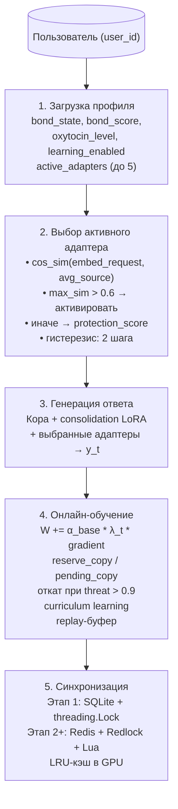

# Гиппокамп (Hippocampus) — адаптеры, создание, выбор, обучение, синхронизация

## Назначение Гиппокампа

**Гиппокамп** — это совокупность LoRA-адаптеров, обеспечивающих быструю персонализацию и эпизодическую память. Каждый адаптер принадлежит конкретному пользователю (персональные) или является общим (глобальные, прошедшие консолидацию). Гиппокамп позволяет Galatea запоминать стиль, предпочтения и значимые контексты **без изменения Коры**.

---

## 1. Структура адаптера

Каждый адаптер представляет собой пару матриц LoRA: `W_adapt = (A, B)`.

|     Параметр     |                                      Значение                                         |
|------------------|---------------------------------------------------------------------------------------|
| **Ранг**         | 8 для MVP, 16 для продакшена                                                          |
| **Целевые слои** | Q и V всех self-attention слоёв Коры                                                  |
| **Привязка**     | Глобальный реестр `map<user_id, list<adapter_id>>` (общие адаптеры хранятся отдельно) |

### Атрибуты адаптера (MVP)

| Атрибут             |        Тип       |                                 Описание                               |
|---------------------|------------------|------------------------------------------------------------------------|
| `protection_score`  | `[0,1]`          | Накопленная важность (EMA от `bond_score` при обновлениях)             |
| `age`               | `int`            | Количество пройденных циклов сна                                       |
| `source_embeddings` | `float16[128]`   | Усреднённый эмбеддинг последних 20 диалогов                            |
| `replay_buffer`     | `deque` (20–30)  | Кольцевой буфер сжатых примеров, отбираемых по `surprise_score` (SuRe) |
| `reserve_copy`      | `weights`        | Предыдущее состояние весов для отката                                  |

### Дополнительные атрибуты (Этап 2+)

|           Атрибут         |              Описание               |
|---------------------------|-------------------------------------|
| `is_anchor`               | Якорь идентичности                  |
| `adrenaline_tag`          | Метка адреналинового события        |
| `is_imprint`              | Флаг импринта                       |
| `imprint_hidden_state`    | Сжатый слепок скрытого состояния    |
| `last_consolidated_cycle` | Номер последнего цикла консолидации |
| `fail_count`              | Счётчик неудачных консолидаций      |
| `source_dialogs`          | Ссылки на сжатые диалоги в S3       |

---

## 2. Создание и инициализация

- **Создание:** при первом запросе пользователя — **синхронно** (инициализация A/B < 50 мс). Пул заготовок не используется.
- **Инициализация:**
  - `A` — случайный шум с σ = 1e-4
  - `B` — нули (стандартная практика LoRA)
- **Начальные значения:**
  - `protection = 0`
  - `age = 0`
  - `mean_surprise = 0`
  - `is_anchor = False`
  - `fail_count = 0`

### Защита от спама

- Rate limit на создание (не более N в час с одного IP)
- Капча при подозрительной активности
- Автоочистка адаптеров с `mean_surprise < 0.1` за час
- **Лимит адаптеров на пользователя: 5** (при превышении наименее используемый удаляется или сливается)

---

## 3. Выбор активного адаптера при инференсе

1. Для пользователя загружаются **только его персональные адаптеры** + общие адаптеры, прошедшие косинусный фильтр > 0.4 к текущему запросу (не более 2 одновременно).

2. **Механизм выбора:**
   - Для каждого адаптера вычисляется `cos_sim(embed_request, avg_source_embeddings)`.
   - Если максимальное сходство > 0.6 → активируется адаптер с максимальным сходством.
   - Иначе → активируется адаптер с наивысшим `protection_score`.
   - **Гистерезис:** переключение происходит только если новый адаптер удерживает лидерство **2 шага подряд**.

3. В MVP используется **один активный адаптер**. Адаптивное слияние нескольких адаптеров — опционально для Этапа 2+.

---

## 4. Онлайн-обучение (оптимистичное с откатом)

- **Gradient clipping** по глобальной норме 1.0
- **L2-регуляризация** с коэффициентом 1e-5
- **Curriculum learning:** для адаптеров с `age < 5` (молодые) learning rate умножается на 0.5, пороги адреналина повышены (`surprise > 0.95`, `bond > 0.85`)

### Оптимистичное обучение с откатом

1. Обновление весов выполняется сразу с текущим `λ_t`:

   ```python
   W_adapt += α_base * λ_t * gradient
   ```

2. Сохраняется `reserve_copy` (состояние до обновления) и `pending_copy` (состояние после обновления).
3. Если в течение следующих **5 шагов** `threat_score` поднимается > 0.9 по вине этого ответа (проверяется post-hoc), адаптер откатывается к `reserve_copy`, а `pending_copy` отбрасывается.
4. Если угроза не обнаружена, `pending_copy` становится основным состоянием, `reserve_copy` обновляется.

### Replay-буфер

При обучении каждого батча к свежим примерам добавляются **2–3 примера** из `replay_buffer` данного адаптера (отобранные по `surprise_score`).

---

## 5. Синхронизация и хранение

|       Этап       |               Хранилище              |           Блокировка          |                          Детали                             |
|------------------|--------------------------------------|-------------------------------|-------------------------------------------------------------|
| **Этап 1 (MVP)** | In-memory + SQLite (каждые 10 шагов) | `threading.Lock`              | Состояние адаптера и профиля в памяти процесса              |
| **Этап 2+**      | Redis Cluster с репликацией          | Redlock (на уровне `user_id`) | Все реплики Коры читают веса из Redis; запись сериализуется |

**Атомарное обновление профиля:** Lua-скрипты в Redis гарантируют согласованность `bond_state`, `bond_score` и `oxytocin_level`.

**LRU-кэш в GPU:** неиспользуемые адаптеры выгружаются из VRAM и подгружаются по требованию.

**Отказоустойчивость:** при недоступности Redis — read-only режим с деградацией (без обновлений Гиппокампа).

**Интерфейсы:** код ядра использует только `StorageInterface` и `LockInterface`, что позволяет перейти с SQLite на Redis **без рефакторинга** ядра.

---

## Схема работы Гиппокампа



## Связи с другими компонентами

|                                       Компонент                                     |                                  Связь                                 |
|-------------------------------------------------------------------------------------|------------------------------------------------------------------------|
| [Общая философия, Кора и Гиппокамп](./philosophy_cortex_hippocampus.md)             | Фундаментальные принципы асимметрии памяти                             |
| [Быстрые Призмы (SP, BP, TP)](./fast_prisms.md)                             | Поставляют `surprise_score`, `bond_score`, `threat_score` для обучения |
| [Цикл Сна (Hypnos)](./sleep_overview.md)                                     | Консолидация адаптеров в Кору через Mnemosyne                          |
| [Профиль пользователя и Окситоцин](./oxytocin_profile.md)                      | Хранит состояние BP и адаптеры пользователя                            |
| [Производительность и масштабирование](./performance_scaling.md) | Redis, LRU-кэш, отказоустойчивость                                     |

---

## Содержание

- [Введение](../README.md)
- [Архитектурный обзор](./overview.md)

#### Философия и ядро

- [Общая философия, Кора и Гиппокамп](./philosophy_cortex_hippocampus.md)
- [Полный конвейер онлайн-шага](./pipeline.md)

#### Призмы (гормональная система)

- [Быстрые Призмы — SP, BP, TP](./fast_prisms.md)
- [Призма Адреналина и Импринтинг](./adrenaline_imprinting.md)
- [Мотивационные Призмы — OP, LP, GP, EP](./motivational_prisms.md)

#### Личность и память

- [Эго-контур, Нарратив и Якоря](./ego_narrative.md)
- [Профиль пользователя и Окситоцин](./oxytocin_profile.md)

#### Защита идентичности

- [Зеркало, Этический классификатор и Золотой стандарт](./mirror_ethics_golden.md)

#### Цикл Сна

- [Цикл Сна (Hypnos)](./sleep_hypnos.md)

#### Дорожная карта реализации

- [Этап 0.5 — предобучение и калибровка Призм](./stage_0.5.md)
- [Этап 1 — MVP с одним пользователем](./stage_1.md)
- [Этап 2 — многопользовательский режим, Redis, базовый Сон](./stage_2.md)
- [Этап 3 — полная Консолидация, Зеркало, детектор дрейфа](./stage_3.md)
- [Этап 4 — продакшен-подготовка, юр. рамка, A/B-тест](./stage_4.md)
- [Сводная дорожная карта и стек технологий](./roadmap.md)

#### Тестирование и риски

- [Симуляции, тестирование и ключевые сценарии](./simulation_testing.md)
- [Полный реестр рисков](./risk_register.md)

#### Эволюция и эксплуатация

- [Долговременная эволюция и замена Коры](./model_migration.md)
- [Производительность, масштабирование и отказоустойчивость](./performance_scaling.md)
- [Юридические, этические и UX-аспекты](./legal_ethical_ux.md)

---

*Этот документ описывает ядро эпизодической памяти Galatea. Все операции с адаптерами управляются через интерфейсы `StorageInterface` и `LockInterface`, что обеспечивает гибкость на разных этапах реализации.*
