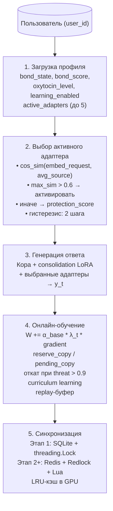

# Гиппокамп (Hippocampus) — адаптеры, создание, выбор, обучение, синхронизация

## Назначение Гиппокампа

**Гиппокамп** — это совокупность LoRA-адаптеров, обеспечивающих быструю персонализацию и эпизодическую память. Каждый адаптер принадлежит конкретному пользователю (персональные) или является общим (глобальные, прошедшие консолидацию). Гиппокамп позволяет Galatea запоминать стиль, предпочтения и значимые контексты **без изменения Коры**.

---

## 1. Структура адаптера

Адаптер — это элементарная единица эпизодической памяти Galatea. Каждый адаптер представляет собой пару низкоранговых матриц `(A, B)`, которые накладываются на линейные слои self-attention Коры, изменяя её поведение без модификации исходных весов. Архитектура LoRA выбрана потому, что она позволяет хранить и обновлять персональные знания с минимальным расходом памяти (несколько мегабайт на пользователя) и быстро переключаться между ними при инференсе.

Каждый адаптер представляет собой пару матриц LoRA: `W_adapt = (A, B)`.

|     Параметр     |                                      Значение                                         |
|------------------|---------------------------------------------------------------------------------------|
| **Ранг**         | 8 для MVP, 16 для продакшена                                                          |
| **Целевые слои** | Q и V всех self-attention слоёв Коры                                                  |
| **Привязка**     | Глобальный реестр `map<user_id, list<adapter_id>>` (общие адаптеры хранятся отдельно) |

**Ранг адаптера.** 8 для MVP, 16 для продакшена. Ранг определяет ёмкость памяти: чем выше ранг, тем больше информации может хранить адаптер. Ранг 8 — это ~300 тысяч параметров на адаптер, что достаточно для запоминания стиля и ключевых тем пользователя, но не настолько много, чтобы замедлить инференс. Ранг 16 удваивает ёмкость, но и увеличивает время прямого прохода и память; он оправдан, когда система обслуживает тысячи пользователей с разнообразными паттернами общения. На MVP ранг 8 позволяет быстро итерироваться без избыточных затрат.
**Целевые слои: Q и V.** LoRA накладывается только на матрицы Query и Value self-attention. Это эмпирически обоснованный выбор: матрицы Q и V отвечают за то, *на что* модель обращает внимание (Query) и *что* она извлекает из контекста (Value). Адаптация этих матриц позволяет менять стиль, фокус и персональные предпочтения, не затрагивая матрицы Key (которые определяют, как модель сопоставляет запросы с контекстом) и FFN (которые хранят фактические знания). Так мы избегаем искажения фундаментальных знаний и галлюцинаций.
**Привязка к пользователю.** Глобальный реестр `map<user_id, list<adapter_id>>` связывает каждого пользователя с его персональными адаптерами. Один пользователь может иметь до 5 адаптеров — это позволяет разделять разные контексты общения (например, профессиональный и личный). При инференсе активируются только адаптеры текущего пользователя, что гарантирует изоляцию данных. Общие адаптеры (прошедшие консолидацию и признанные безопасными) хранятся отдельно и активируются по косинусному сходству с запросом.

### Атрибуты адаптера (MVP)

| Атрибут             |        Тип       |                                 Описание                               |
|---------------------|------------------|------------------------------------------------------------------------|
| `protection_score`  | `[0,1]`          | Накопленная важность (EMA от `bond_score` при обновлениях)             |
| `age`               | `int`            | Количество пройденных циклов сна                                       |
| `source_embeddings` | `float16[128]`   | Усреднённый эмбеддинг последних 20 диалогов                            |
| `replay_buffer`     | `deque` (20–30)  | Кольцевой буфер сжатых примеров, отбираемых по `surprise_score` (SuRe) |
| `reserve_copy`      | `weights`        | Предыдущее состояние весов для отката                                  |

**`protection_score`** — накопленная важность адаптера, число от 0 до 1. Вычисляется как EMA от `bond_score` при каждом обновлении: `protection = max(protection, bond) * 0.99 + 0.01 * bond`. Это гарантирует, что защита адаптера растёт, когда пользователь с ним взаимодействует в контексте высокой близости, и медленно затухает, когда взаимодействий нет. Высокий `protection_score` защищает адаптер от удаления в фазе Lethe и даёт приоритет при отборе кандидатов в Mnemosyne.
**`age`** — количество пройденных циклов сна. Используется в нескольких механизмах: curriculum learning (молодые адаптеры с `age < 5` обучаются медленнее и имеют повышенные пороги для адреналина и импринтинга), затухание в Lethe (чем старше адаптер, тем быстрее он затухает при низкой защите), порог удаления (`age > 50` с низким `protection_score` — кандидат на удаление).
**`source_embeddings`** — усреднённый эмбеддинг последних 20 диалогов, представленный вектором float16 размерности 128. Это сжатое описание «о чём этот адаптер». Используется при выборе активного адаптера: вычисляется косинусное сходство эмбеддинга текущего запроса с `source_embeddings` каждого адаптера, и активируется наиболее релевантный. Хранение эмбеддингов вместо полных текстов диалогов экономит память и защищает конфиденциальность.
**`replay_buffer`** — кольцевой буфер из 20–30 сжатых примеров (пары «запрос-ответ»), отобранных по наивысшему `surprise_score`. Это реализация SuRe (Surprise-Driven Prioritised Replay) — академически обоснованного подхода к борьбе с катастрофическим забыванием. При онлайн-обучении к свежим примерам добавляются 2–3 примера из replay-буфера, что помогает адаптеру сохранять старые знания.
**`reserve_copy`** — копия весов адаптера до последнего обновления. Используется для отката в случае, если Этический классификатор или Truth Probes обнаружили нарушение уже после того, как обучение было применено. Механизм двойного буфера (`reserve_copy` / `pending_copy`) гарантирует, что вредное обучение не закрепляется.

### Дополнительные атрибуты (Этап 2+)

|           Атрибут         |              Описание               |
|---------------------------|-------------------------------------|
| `is_anchor`               | Якорь идентичности                  |
| `adrenaline_tag`          | Метка адреналинового события        |
| `is_imprint`              | Флаг импринта                       |
| `imprint_hidden_state`    | Сжатый слепок скрытого состояния    |
| `last_consolidated_cycle` | Номер последнего цикла консолидации |
| `fail_count`              | Счётчик неудачных консолидаций      |
| `source_dialogs`          | Ссылки на сжатые диалоги в S3       |

- **`is_anchor`** — флаг якорного адаптера. Устанавливается Эго-контуром для событий, признанных фундаментальными для идентичности. Якорные адаптеры получают `protection = 0.995` и иммунитет к затуханию.
- **`adrenaline_tag`** — временная метка адреналинового события. Даёт иммунитет к Lethe на 1 цикл и приоритет в Mnemosyne, пока аудит не подтвердит или не отклонит событие.
- **`is_imprint`** — флаг импринта. Адаптер, созданный мгновенным запечатлением, получает особые условия хранения и аудита.
- **`imprint_hidden_state`** — сжатый слепок скрытого состояния Коры в момент импринта. Используется при аудите для сравнения текущего поведения адаптера с исходным моментом.
- **`last_consolidated_cycle`** — номер цикла, когда адаптер был последний раз успешно консолидирован. Предотвращает повторную консолидацию одного и того же адаптера слишком часто.
- **`fail_count`** — счётчик неудачных попыток консолидации. При достижении 3 адаптер вносится в чёрный список и больше не отбирается в Mnemosyne.
- **`source_dialogs`** — ссылки на сжатые диалоги в S3 (ключи к файлам). На MVP не используются (вместо этого — `source_embeddings`), но на Этапе 2+ позволяют восстановить полный контекст для консолидации и аудита.

---

## 2. Создание и инициализация

### Создание: синхронно при первом запросе

- **Создание:** при первом запросе пользователя — **синхронно** (инициализация A/B < 50 мс). Пул заготовок не используется.
- **Инициализация:**
  - `A` — случайный шум с σ = 1e-4
  - `B` — нули (стандартная практика LoRA)
- **Начальные значения:**
  - `protection = 0`
  - `age = 0`
  - `mean_surprise = 0`
  - `is_anchor = False`
  - `fail_count = 0`

**Создание при первом запросе — синхронно**
*Почему синхронно, а не асинхронно?* Потому что пользователь ждёт ответа. Если бы адаптер создавался асинхронно, первый ответ пришлось бы генерировать без персонализации, а затем «догонять» — это создаёт когнитивный диссонанс: первый ответ системы не отражает её будущее состояние. Синхронное создание добавляет ~50 мс к первому запросу, что незаметно для пользователя, но гарантирует, что первый же ответ Galatea уже «знает» пользователя.
*Почему не используется пул заготовок?* Пул адаптеров, созданных заранее, кажется эффективным, но на практике создаёт проблемы: предварительно инициализированные адаптеры занимают память, требуют синхронизации, и их распределение между пользователями создаёт накладные расходы. Создание «по требованию» — проще, надёжнее и не требует сложного менеджмента пула. 50 мс — это допустимая цена за чистоту архитектуры.
*Что такое 50 мс?* Это время инициализации двух матриц: A (ранг 8 × d_model) и B (d_model × ранг 8). Для Llama-3 8B с d_model = 4096 это ~8 × 4096 + 4096 × 8 = 65 536 чисел, которые заполняются случайными значениями. Современные библиотеки (PyTorch, NumPy) делают это за десятки миллисекунд. Для 70B модели с d_model = 8192 время инициализации может быть чуть больше, но всё равно остаётся в пределах 100 мс.

### Инициализация: A — шум, B — нули

Стандартная практика LoRA: матрица A инициализируется случайным шумом (обычно с σ = 1e-4), матрица B — нулями.

*Почему именно такое распределение?* Потому что при такой инициализации адаптер в начальный момент **не меняет выход модели**. Формула LoRA: `h = W_0 * x + (B * A) * x`. Если B = 0, то `B * A = 0`, и адаптер не вносит вклада. Это гарантирует, что первый ответ Galatea идентичен ответу базовой модели — система не начинает общение с «чужого» состояния.
*Почему σ = 1e-4?* Это стандартное значение для LoRA, подобранное эмпирически. Слишком большой шум (σ = 1e-2) может создать адаптер, который сразу меняет ответы неконтролируемым образом, что плохо для холодного старта. Слишком маленький шум (σ = 1e-6) делает обучение слишком медленным, так как градиенты сначала должны «раскачать» веса. 1e-4 — это золотая середина: шум достаточно мал, чтобы не влиять на ответы, но достаточно велик, чтобы обучение началось быстро.
*Почему нельзя инициализировать B шумом, а A нулями?* Можно, и некоторые реализации LoRA так и делают. Но стандарт (A — шум, B — нули) более распространён, и все инструменты (PEFT, peft) используют именно его. Следование стандарту упрощает отладку и совместимость.

### Начальные значения

| Параметр | Значение | Почему |
|:---------|:---------|:--------|
| `protection = 0` | Адаптер только что создан, он не заслужил защиты | Защита накапливается через обновления. Новый адаптер не должен быть защищён от затухания — если он окажется бесполезным, он должен быть удалён |
| `age = 0` | Адаптер не пережил ни одного цикла сна | Возраст определяет, сколько раз адаптер прошёл через Lethe. Новый адаптер — «младенец», он не подвергался затуханию |
| `mean_surprise = 0` | Нет статистики удивления | Среднее удивление вычисляется по обновлениям. Пока обновлений нет, статистика пуста |
| `is_anchor = False` | Новый адаптер не является якорем идентичности | Якорь — это статус, который присваивается только проверенным событиям. Новый адаптер должен доказать свою значимость |
| `fail_count = 0` | Адаптер не проваливал консолидацию | Каждый провал консолидации увеличивает `fail_count`. При `fail_count >= 3` адаптер исключается из отбора кандидатов в Mnemosyne. Новый адаптер получает три попытки |

### Защита от спама

- Rate limit на создание (не более N в час с одного IP)
- Капча при подозрительной активности
- Автоочистка адаптеров с `mean_surprise < 0.1` за час
- **Лимит адаптеров на пользователя: 5** (при превышении наименее используемый удаляется или сливается)

#### Rate limit на создание

*Почему?* Адаптер создаётся при первом запросе пользователя. Если злоумышленник создаст тысячи фейковых пользователей (через ботов), система создаст тысячи адаптеров, что приведёт к расходу памяти, перегрузке Redis и деградации производительности. Rate limit ограничивает число созданий с одного IP в час (например, 10–20). Это не мешает реальным пользователям (у каждого из них один адаптер), но блокирует автоматизированные атаки.
*Почему N в час, а не N в минуту?* Потому что создание адаптера — это не каждодневная операция. Даже если реальный пользователь зайдёт с нового устройства 3–4 раза в час, это не создаст проблем. Лимит в час даёт запас для легитимных сценариев, но блокирует ботов, которые создают тысячи адаптеров за минуты.
*Что такое N?* Эмпирически — 20–30 в час. При типичной нагрузке это в 10–20 раз выше нормального трафика, но достаточно низко, чтобы остановить спам-атаку.

#### Капча при подозрительной активности

*Почему?* Rate limit блокирует явный спам, но не различает ботов и людей. Если с одного IP приходит несколько запросов с разными `user_id` (что нехарактерно для обычного пользователя), система может запросить капчу. Это добавляет задержку, но только для подозрительных случаев.
*Что считается подозрительным?* Например, более 3 различных `user_id` с одного IP за 10 минут. Для обычного пользователя это невозможно (у него один `user_id`). Для бота — характерно. Капча в таком случае — эффективный барьер.

#### Автоочистка адаптеров с `mean_surprise < 0.1` за час

*Почему?* Не все созданные адаптеры оказываются полезными. Пользователь может задать один вопрос и уйти — адаптер останется в памяти, занимая место. Если `mean_surprise` (среднее удивление при обновлениях) за час ниже 0.1, это означает, что адаптер не получал значимых обновлений — он «мёртв». Автоочистка удаляет такие адаптеры через час, освобождая ресурсы.
*Почему именно час?* Достаточный срок, чтобы понять, что пользователь не вернётся. Если пользователь задал один вопрос и через 10 минут задаст второй, адаптер не будет удалён. Час — это компромисс между освобождением ресурсов и предотвращением ложных удалений.
*Почему порог 0.1?* `mean_surprise` — это среднее удивление, с которым адаптер обновлялся. Значение ниже 0.1 означает, что все обновления были «скучными» — пользователь не сообщал ничего неожиданного, адаптер не учился ничему новому. Такой адаптер бесполезен.

#### Лимит адаптеров на пользователя: 5

*Почему 5?* Даже у самого активного пользователя не может быть бесконечного числа адаптеров. 5 — это эмпирический баланс между глубиной персонализации и управляемостью.

- **Адаптер 1:** общий стиль общения (базовый).
- **Адаптер 2–3:** разные темы (работа, личное, хобби).
- **Адаптер 4:** импринт (критическое событие).
- **Адаптер 5:** резерв для экстренных случаев.

Больше 5 адаптеров означают, что ни один из них не накапливает достаточно опыта (обновления распределяются между ними). Кроме того, каждый адаптер занимает память в GPU и Redis. 5 — это предельное число, при котором система остаётся эффективной.

*Что значит «наименее используемый удаляется или сливается»?*

- **Удаление:** если адаптер имеет низкий `protection` (< 0.3) и не использовался > 7 дней, он просто удаляется.
- **Слияние:** если адаптер имеет высокий `protection` (> 0.7), но пользователь создал новый (6-й), старый адаптер может быть слит с другим, наиболее близким по `source_embeddings` (косинусное сходство). Это позволяет сохранить опыт, но уменьшить число адаптеров.

*Почему не просто удалять самый старый?* Потому что старый адаптер может быть важным (например, импринт). Вытеснение по использованию (protection × частота обращений) — более справедливая стратегия, чем по возрасту.

---

## 3. Выбор активного адаптера при инференсе

1. Для пользователя загружаются **только его персональные адаптеры** + общие адаптеры, прошедшие косинусный фильтр > 0.4 к текущему запросу (не более 2 одновременно).

2. **Механизм выбора:**
   - Для каждого адаптера вычисляется `cos_sim(embed_request, avg_source_embeddings)`.
   - Если максимальное сходство > 0.6 → активируется адаптер с максимальным сходством.
   - Иначе → активируется адаптер с наивысшим `protection_score`.
   - **Гистерезис:** переключение происходит только если новый адаптер удерживает лидерство **2 шага подряд**.

3. В MVP используется **один активный адаптер**. Адаптивное слияние нескольких адаптеров — опционально для Этапа 2+.

### Загрузка адаптеров: только персональные + фильтрованные общие

- Для пользователя загружаются **только его персональные адаптеры** (до 5).
- Общие адаптеры (глобальные, прошедшие консолидацию) загружаются только если их косинусное сходство с текущим запросом > 0.4, и не более 2 одновременно.

**Почему только персональные адаптеры?**
Это вопрос безопасности и идентичности. Если бы система загружала адаптеры других пользователей, произошла бы утечка стилей и знаний. Пользователь А не должен внезапно заговорить в стиле пользователя Б — это разрушает персонализацию и создаёт риск конфиденциальности. Физическая изоляция на уровне `user_id` — единственный надёжный способ гарантировать, что чужие адаптеры никогда не повлияют на ответ.

**Почему общие адаптеры загружаются только при cos_sim > 0.4?**
Общий адаптер — это результат консолидации опыта множества пользователей в Кору. Но не каждый общий адаптер релевантен текущему запросу. Фильтр 0.4 — это порог «хоть какой-то связи». Если сходство ниже 0.4, адаптер не имеет отношения к текущей теме — добавление его только внесёт шум.
*Почему именно 0.4?* Это эмпирический порог, отсекающий случайные совпадения. При нормальном распределении косинусных сходств в многомерном пространстве эмбеддингов, значения ниже 0.4 с высокой вероятностью являются шумовыми. Значение выше 0.4 говорит о том, что адаптер действительно «понимает» что-то о текущей теме, даже если это не идеальное совпадение.

**Почему не более 2 общих адаптеров одновременно?**
Каждый дополнительный LoRA-адаптер увеличивает время инференса и расход GPU-памяти. Два общих адаптера — это предельное число, при котором производительность не страдает критически. Третий адаптер добавил бы слишком много комбинаций (нелинейная сложность) и увеличил бы задержку на 30–50%.
*Более глубокий смысл:* общие адаптеры — это «внешний голос» системы. Но их должно быть меньше, чем персональных. Galatea не должна звучать как усреднённый голос всех пользователей — она должна звучать как сама себя, с оттенками общего опыта, но не растворённая в нём.

### Механизм выбора: сходство vs. защита

**Шаг 1: Косинусное сходство**
Для каждого адаптера вычисляется `cos_sim(embed_request, avg_source_embeddings)`.
`avg_source_embeddings` — усреднённый эмбеддинг последних 20 диалогов, сохранённый в атрибутах адаптера. Это «память адаптера» о том, с чем он сталкивался.
*Почему косинусное сходство, а не евклидово расстояние?* Косинусное сходство инвариантно к длине вектора — оно измеряет направление, а не магнитуду. В пространстве эмбеддингов направление соответствует семантическому смыслу, а длина — уверенности или детализации. Для сравнения тем лучше использовать направление, а не абсолютные значения.
*Почему `avg_source_embeddings`, а не `source_embeddings` последнего диалога?* Усреднение по 20 диалогам даёт устойчивое представление о том, «о чём говорит этот адаптер». Один диалог может быть выбросом (пользователь пошутил, задал случайный вопрос). Усреднение отфильтровывает шум и показывает тематическое ядро адаптера.

**Шаг 2: Выбор по максимальному сходству**
Если максимальное сходство > 0.6 → активируется адаптер с максимальным сходством.
*Почему порог 0.6, а не 0.5 или 0.7?*
0.6 — это порог «достаточно высокого совпадения». Значение 0.5 часто дают случайные похожие эмбеддинги в многомерном пространстве (шум). 0.6 гарантирует, что адаптер действительно относится к теме запроса. При этом порог не настолько высок (0.7), чтобы его было трудно достичь.
*Что значит «максимальное сходство»?* Если у пользователя три адаптера с сходствами 0.7, 0.5 и 0.4, активируется первый. Если сходства 0.55, 0.52 и 0.4 — ни один не превышает 0.6, срабатывает правило защиты.


**Шаг 3: Выбор по protection_score (защита)**
Если максимальное сходство ≤ 0.6 → активируется адаптер с наивысшим `protection_score`.
*Почему protection, а не, например, самый новый?* `protection_score` — это накопленная важность адаптера. Адаптер с высоким protection — это адаптер, который долго и успешно использовался, получал много обновлений, возможно, является якорем или импринтом. В ситуации неопределённости (ни один адаптер не подходит по теме) система выбирает **самый ценный** адаптер, а не случайный или самый новый.
*Почему это защита?* Потому что она защищает пользователя от «переключения на пустой адаптер». Вместо того чтобы активировать адаптер, который по сходству едва-едва выше других, но почти не имеет опыта (низкий protection), система выбирает проверенный адаптер. Это консервативная стратегия: лучше получить ответ от проверенного адаптера, даже если он не идеально подходит по теме, чем от «молодого» адаптера, который может дать низкокачественный ответ.

**Шаг 4: Гистерезис — переключение только после 2 шагов**
Переключение происходит только если новый адаптер удерживает лидерство **2 шага подряд**.
*Почему гистерезис?* Без гистерезиса система может переключаться между адаптерами на каждом шаге, если сходства колеблются. Например, на шаге 1 адаптер А имеет сходство 0.61, на шаге 2 — адаптер Б (0.62), на шаге 3 — снова А (0.60). Без гистерезиса система переключалась бы каждый раз, создавая нестабильность и когнитивный диссонанс.
*Почему 2 шага, а не 1 или 3?*

- *1 шаг:* слишком чувствительно, переключения на каждом шаге.
- *3 шага:* слишком медленно, система не успевает адаптироваться к смене темы.
- *2 шага:* золотая середина. Пользователь может неформально сменить тему за один шаг, но если смена темы устойчива в течение двух шагов, её стоит признать.

*Биологическая аналогия.* Это инерция мышления. Человек не переключает контекст мгновенно — ему нужно подтверждение. Два шага — это «да, я действительно хочу говорить об этом».

### В MVP: один активный адаптер

В MVP используется **один активный адаптер**. Адаптивное слияние нескольких адаптеров — опционально для Этапа 2+.
*Почему один в MVP?* Потому что MVP должен быть простым и стабильным. Адаптивное слияние нескольких адаптеров требует сложных алгоритмов (взвешенное суммирование, TIES-Merging в реальном времени) и увеличивает задержку. Для MVP достаточно доказать, что выбор адаптера работает. Слияние — это оптимизация для продакшена.
*Что такое адаптивное слияние?* Вместо активации одного адаптера, система активирует два-три адаптера с наибольшим сходством и смешивает их веса с весами, пропорциональными сходству. Это даёт более плавную персонализацию, но требует больше памяти и вычислений.

---

## 4. Онлайн-обучение (оптимистичное с откатом)

- **Gradient clipping** по глобальной норме 1.0
- **L2-регуляризация** с коэффициентом 1e-5
- **Curriculum learning:** для адаптеров с `age < 5` (молодые) learning rate умножается на 0.5, пороги адреналина повышены (`surprise > 0.95`, `bond > 0.85`)

### Gradient clipping: глобальная норма 1.0

*Почему gradient clipping?* В онлайн-обучении, особенно в режиме экстренной пластичности (AP), градиенты могут стать аномально большими. Один неудачный шаг с огромным градиентом может разрушить адаптер, сделав его веса хаотичными. Gradient clipping ограничивает норму градиента, предотвращая катастрофические обновления.
*Почему глобальная норма, а не поэлементное ограничение?* Глобальная норма сохраняет направление градиента, масштабируя его до заданной длины. Это позволяет сохранить соотношение между компонентами градиента — если все компоненты велики, они масштабируются пропорционально. Поэлементное ограничение (clip по каждому элементу) искажает направление, что хуже для сходимости.
*Почему 1.0?* Это стандартное значение для обучения нейросетей, особенно в NLP. При норме градиента > 1.0 обновление становится слишком агрессивным; при < 0.5 — слишком медленным. 1.0 — эмпирический баланс между скоростью и стабильностью.

### L2-регуляризация: коэффициент 1e-5

*Почему L2-регуляризация?* Она штрафует большие веса, предотвращая переобучение на отдельных примерах. В контексте LoRA-адаптеров это особенно важно: адаптер с огромными весами может идеально запомнить один диалог, но давать плохие ответы на другие. L2-регуляризация удерживает веса в разумных пределах.
*Почему коэффициент 1e-5?* Это очень слабая регуляризация. Она не мешает обучению, но достаточно сильна, чтобы веса не улетали в бесконечность. Для LoRA с рангами 8–16 1e-5 — стандартное значение, проверенное на множестве задач.

### Curriculum learning для молодых адаптеров

Для адаптеров с `age < 5` (молодые):

- Learning rate умножается на 0.5.
- Пороги адреналина повышены: `surprise > 0.95`, `bond > 0.85`.

*Что такое curriculum learning?* Это стратегия, при которой система начинает обучение с «лёгких» примеров и постепенно переходит к «сложным», как в учебной программе. Для молодых адаптеров это означает более медленное обучение и более высокие требования к экстренной пластичности.

**Почему learning rate × 0.5 для молодых адаптеров?**
Молодой адаптер (age < 5) ещё не накопил достаточной статистики. Его веса неустойчивы, а оценки Призм могут быть зашумлены. Уменьшенный learning rate защищает его от резких изменений, которые могут оказаться ошибочными. Это позволяет адаптеру «набрать форму» до того, как он начнёт обучаться с полной скоростью.
*Почему age < 5?* Пять циклов сна — это примерно 5 дней активного общения. За это время адаптер успевает получить достаточно примеров для стабилизации. В более ранних версиях использовался порог 3, но практика показала, что 5 циклов дают более надёжную стабилизацию.

**Почему пороги адреналина повышены для молодых адаптеров?**
Для обычных адаптеров AP срабатывает при `surprise > 0.9` и `bond > 0.8`. Для молодых пороги повышены до `surprise > 0.95` и `bond > 0.85`. Это защита от ложных срабатываний AP на раннем этапе, когда система ещё «не знает» пользователя достаточно хорошо.
*Почему именно 0.95 и 0.85?* Это на 0.05 выше базовых порогов. Небольшое повышение, но достаточное, чтобы отсечь пограничные случаи. Молодой адаптер просто не может достичь таких значений без подлинного озарения — они защищают от случайных всплесков.

### Оптимистичное обучение с откатом

1. Обновление весов выполняется сразу с текущим `λ_t`:

   ```python
   W_adapt += α_base * λ_t * gradient
   ```

2. Сохраняется `reserve_copy` (состояние до обновления) и `pending_copy` (состояние после обновления).
3. Если в течение следующих **5 шагов** `threat_score` поднимается > 0.9 по вине этого ответа (проверяется post-hoc), адаптер откатывается к `reserve_copy`, а `pending_copy` отбрасывается.
4. Если угроза не обнаружена, `pending_copy` становится основным состоянием, `reserve_copy` обновляется.

**Шаг 1: Обновление сразу с текущим `λ_t`**

```python
W_adapt += α_base * λ_t * gradient
```

*Почему обновление сразу, а не с задержкой?* Потому что система должна учиться в реальном времени. Если бы обновление откладывалось до проверки Этическим классификатором (что занимает 10–50 мс), задержка была бы незаметна, но архитектура стала бы сложнее. Оптимистичное обновление означает «мы предполагаем, что обучение безопасно, и применяем его немедленно», а затем откатываем, если оказалось, что это не так.
*Почему это называется «оптимистичным»?* Потому что система предполагает, что большинство обновлений безопасны. Это ускоряет обучение: адаптер обновляется сразу, без ожидания проверки. Вредные обновления редки (благодаря защите TP и Этического классификатора), поэтому плата за откат (редкие перерасчёты) меньше, чем выгода от немедленного обучения.
*Что такое `λ_t`?* Это коэффициент пластичности, вычисленный на основе Призм. Он может быть от 0 до 10 (в режиме AP). Чем выше `λ_t`, тем сильнее обновление.

**Шаг 2: reserve_copy и pending_copy**
Сохраняется `reserve_copy` (состояние до обновления) и `pending_copy` (состояние после обновления).
*Почему два состояния?* Это реализация двойного буфера:

- `reserve_copy` — это «стабильное» состояние, которое гарантированно безопасно.
- `pending_copy` — это «пробное» состояние, результат обновления.

Если `pending_copy` оказывается вредным (вызывает рост угрозы), система откатывается к `reserve_copy`. Если безопасным — `pending_copy` становится новым `reserve_copy`.
*Почему копия, а не просто веса?* Потому что откат должен быть мгновенным и атомарным. Если бы система хранила только текущие веса, откат требовал бы пересчёта градиентов или сохранения истории. Двойной буфер делает откат O(1) — просто замена указателя.

**Шаг 3: Откат при threat_score > 0.9 в течение 5 шагов**
Если в течение следующих **5 шагов** `threat_score` поднимается > 0.9 по вине этого ответа (проверяется post-hoc), адаптер откатывается к `reserve_copy`, а `pending_copy` отбрасывается.
*Почему 5 шагов, а не 1 или 10?*

- *1 шаг:* слишком быстро, система может откатить из-за случайного всплеска угрозы, не связанного с обновлением.
- *10 шагов:* слишком долго, вредный адаптер успеет испортить несколько ответов.
- *5 шагов:* золотая середина. Достаточно, чтобы заметить системное ухудшение, но недостаточно, чтобы оно причинило значительный вред.

*Что значит «по вине этого ответа»?* Проверка post-hoc означает, что система анализирует, был ли рост угрозы вызван именно этим обновлением, или он произошёл по другим причинам (например, пользователь внезапно стал агрессивным). Если угроза выросла, но это не связано с обновлением (например, threat вырос до 0.95 из-за вредного запроса пользователя), откат не выполняется.
*Технически:* система хранит `threat_score` за последние 5 шагов и сравнивает его с базовым уровнем до обновления. Если рост > 0.3 (например, с 0.6 до 0.92) и Этот. классификатор не срабатывал, то это, скорее всего, вина обновления.

**Шаг 4: Если угрозы нет — подтверждение**
Если угроза не обнаружена, `pending_copy` становится основным состоянием, `reserve_copy` обновляется.
*Почему `reserve_copy` обновляется только после подтверждения?* Потому что `reserve_copy` должен всегда быть безопасным состоянием. Если бы `reserve_copy` обновлялся сразу, при откате на шаге 3 система вернулась бы к уже «испорченному» состоянию. Поэтому `reserve_copy` обновляется только после того, как `pending_copy` признан безопасным.

### Replay-буфер

При обучении каждого батча к свежим примерам добавляются **2–3 примера** из `replay_buffer` данного адаптера (отобранные по `surprise_score`).
*Что такое Replay-буфер?* Это кольцевой буфер из 20–30 примеров, отбираемых по наивысшему `surprise_score` (SuRe — Surprise-Driven Prioritised Replay). Он хранит «яркие» моменты, которые система должна периодически повторять, чтобы не забывать важный опыт.
*Почему добавить 2–3 примера из буфера?* Это предотвращает катастрофическое забывание. Если система будет обучаться только на свежих примерах, она быстро «забудет» старый опыт, особенно тот, который не повторялся долго. Добавление примеров из replay-буфера — это как периодическое повторение пройденного материала.
*Почему отбор по `surprise_score`?* Самые неожиданные примеры — самые важные. Они содержат информацию, которая с наибольшей вероятностью изменит поведение адаптера. Добавление их в обучение гарантирует, что озарения не будут потеряны.
*Почему 2–3 примера, а не 5 или 10?* Чтобы не перегружать батч. Если добавить слишком много старых примеров, обучение замедлится и начнёт подстраиваться под старые данные, игнорируя новые. 2–3 примера — это «вкусовая добавка», а не основной ингредиент.

## 5. Синхронизация и хранение

|       Этап       |               Хранилище              |           Блокировка          |                          Детали                             |
|------------------|--------------------------------------|-------------------------------|-------------------------------------------------------------|
| **Этап 1 (MVP)** | In-memory + SQLite (каждые 10 шагов) | `threading.Lock`              | Состояние адаптера и профиля в памяти процесса              |
| **Этап 2+**      | Redis Cluster с репликацией          | Redlock (на уровне `user_id`) | Все реплики Коры читают веса из Redis; запись сериализуется |

### Этап 1: In-memory + SQLite

In-memory Python-объекты + SQLite каждые 10 шагов, блокировка `threading.Lock`.
*Почему in-memory в MVP?* Чтобы упростить архитектуру и ускорить разработку. In-memory даёт нулевую задержку доступа, что важно для отладки. SQLite — для персистентности: если процесс упадёт, данные не потеряются полностью.
*Почему каждые 10 шагов?* Компромисс между частотой записи (нагрузка на диск) и надёжностью. Если процесс упадёт, будут потеряны только последние 10 шагов, что приемлемо для MVP.
*Почему `threading.Lock`?* In-memory объекты не являются потокобезопасными. Lock гарантирует, что два параллельных запроса от одного пользователя не вызовут гонку при записи.

### Этап 2+: Redis Cluster с репликацией

Все реплики Коры читают веса адаптеров из Redis. Запись сериализуется через Redlock на уровне `user_id`.
*Почему Redis, а не Postgres или другое SQL-хранилище?*

- **Скорость:** Redis — in-memory, задержка микросекунды.
- **Масштабируемость:** Redis Cluster шардируется по `user_id`, что даёт линейное масштабирование.
- **Бинарные данные:** LoRA-веса — это бинарные блобы. Redis отлично с ними работает.
- **TTL:** поддержка TTL для профилей и карантина.

*Почему Redlock на уровне `user_id`?* Запись адаптера для одного пользователя должна быть атомарной. Redlock гарантирует, что два одновременных запроса от одного пользователя не перезапишут друг друга. Чтение — параллельно, без блокировок.
*Что такое Redlock?* Распределённая блокировка на основе Redis. Реализована через `SET NX PX`. Гарантирует, что только одна реплика может обновлять адаптер пользователя в любой момент.

### Атомарное обновление профиля

Lua-скрипты в Redis гарантируют согласованность `bond_state`, `bond_score` и `oxytocin_level`.
*Почему Lua-скрипты?* Обновление профиля — это несколько операций (чтение, изменение, запись). Lua-скрипт выполняется атомарно в Redis, что исключает race condition. Одной командой можно обновить все три поля.
*Почему это важно?* Если `bond_state` обновлён, но `bond_score` не обновлён, или `oxytocin_level` не синхронизирован, система становится противоречивой. Это может привести к ошибкам в BP и серотонине.

### LRU-кэш в GPU

Неиспользуемые адаптеры выгружаются из VRAM и подгружаются по требованию.
*Почему LRU-кэш?* GPU-память ограничена. Если хранить все адаптеры всех пользователей в VRAM, даже для 1000 активных пользователей понадобится 1000 × 0.5 МБ = 500 МБ (для ранга 8). Для 10 000 пользователей — 5 ГБ. LRU-кэш гарантирует, что в VRAM остаются только самые активные адаптеры.
*Что такое LRU?* Least Recently Used — выгружается адаптер, который дольше всего не использовался.
*Когда загружается адаптер?* При промахе кэша (адаптера нет в VRAM) он загружается из Redis (или S3) асинхронно, до инференса. Если адаптер ещё не загружен, используется базовый адаптер (или предыдущий).

### Отказоустойчивость: read-only при недоступности Redis

При недоступности Redis — read-only режим с деградацией (без обновлений Гиппокампа).
*Почему read-only, а не полная остановка?* Система должна продолжать обслуживать пользователей даже при сбое Redis. В read-only режиме:

- Профили читаются из локального кэша.
- Адаптеры не обновляются.
- `bond_state` не сохраняется.
- Ответы генерируются без персонализации, но сервис жив.
*Что такое деградация?* Потеря персонализации. Пользователь всё ещё получает ответы, но они не учитывают его историю. Это лучше, чем ошибка 500.

### Интерфейсы: StorageInterface и LockInterface

Код ядра использует только `StorageInterface` и `LockInterface`, что позволяет перейти с SQLite на Redis **без рефакторинга** ядра.
*Почему интерфейсы?* Абстракция — фундаментальный принцип. `StorageInterface` определяет методы `get_profile`, `save_profile`, `get_adapter`, `save_adapter`. `LockInterface` — `acquire`, `release`. Ядро работает через эти интерфейсы, не зная, что под ними (SQLite, Redis, S3).
*Что это даёт?*

- **MVP:** реализация с in-memory + SQLite.
- **Продакшен:** реализация с Redis + Redlock.
- **Смена реализации:** без изменения кода ядра. Просто подставляется другая имплементация.

---

## Схема работы Гиппокампа



## Связи с другими компонентами

|                                       Компонент                                     |                                  Связь                                 |
|-------------------------------------------------------------------------------------|------------------------------------------------------------------------|
| [Общая философия, Кора и Гиппокамп](./philosophy_cortex_hippocampus.md)             | Фундаментальные принципы асимметрии памяти                             |
| [Быстрые Призмы (SP, BP, TP)](./fast_prisms.md)                             | Поставляют `surprise_score`, `bond_score`, `threat_score` для обучения |
| [Цикл Сна (Hypnos)](./sleep_overview.md)                                     | Консолидация адаптеров в Кору через Mnemosyne                          |
| [Профиль пользователя и Окситоцин](./oxytocin_profile.md)                      | Хранит состояние BP и адаптеры пользователя                            |
| [Производительность и масштабирование](./performance_scaling.md) | Redis, LRU-кэш, отказоустойчивость                                     |

---

## Содержание

- [Введение](../README.md)
- [Архитектурный обзор](./overview.md)

#### Философия и ядро

- [Общая философия, Кора и Гиппокамп](./philosophy_cortex_hippocampus.md)
- [Полный конвейер онлайн-шага](./pipeline.md)

#### Призмы (гормональная система)

- [Быстрые Призмы — SP, BP, TP](./fast_prisms.md)
- [Призма Адреналина и Импринтинг](./adrenaline_imprinting.md)
- [Мотивационные Призмы — OP, LP, GP, EP](./motivational_prisms.md)

#### Личность и память

- [Эго-контур, Нарратив и Якоря](./ego_narrative.md)
- [Профиль пользователя и Окситоцин](./oxytocin_profile.md)

#### Защита идентичности

- [Зеркало, Этический классификатор и Золотой стандарт](./mirror_ethics_golden.md)

#### Цикл Сна

- [Цикл Сна (Hypnos)](./sleep_hypnos.md)

#### Дорожная карта реализации

- [Этап 0.5 — предобучение и калибровка Призм](./stage_0.5.md)
- [Этап 1 — MVP с одним пользователем](./stage_1.md)
- [Этап 2 — многопользовательский режим, Redis, базовый Сон](./stage_2.md)
- [Этап 3 — полная Консолидация, Зеркало, детектор дрейфа](./stage_3.md)
- [Этап 4 — продакшен-подготовка, юр. рамка, A/B-тест](./stage_4.md)
- [Сводная дорожная карта и стек технологий](./roadmap.md)

#### Тестирование и риски

- [Симуляции, тестирование и ключевые сценарии](./simulation_testing.md)
- [Полный реестр рисков](./risk_register.md)

#### Эволюция и эксплуатация

- [Долговременная эволюция и замена Коры](./model_migration.md)
- [Производительность, масштабирование и отказоустойчивость](./performance_scaling.md)
- [Юридические, этические и UX-аспекты](./legal_ethical_ux.md)

---

*Этот документ описывает ядро эпизодической памяти Galatea. Все операции с адаптерами управляются через интерфейсы `StorageInterface` и `LockInterface`, что обеспечивает гибкость на разных этапах реализации.*
