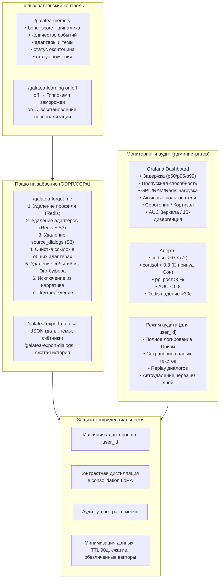

# Юридические, этические и UX-аспекты

## Назначение

Galatea — это не просто технология, это продукт, взаимодействующий с живыми людьми. Юридическая чистота и этическая прозрачность — не опциональные надстройки, а фундаментальные требования. Пользователь имеет право:

- Знать, как работает персонализация.
- Контролировать свою память.
- Полностью удалить свой цифровой след.

---

## 1. Прозрачность для пользователя

Пользователь должен понимать, что Galatea запоминает и как он может этим управлять.

### Команда `/galatea-memory`

В любой момент пользователь может запросить сводку того, что Galatea помнит о нём:

| Информация | Описание |
|:-----------|:---------|
| **Уровень близости** | Текущий `bond_score` и его динамика за последние 7 дней (текстовое описание: «растёт», «стабилен», «снижается») |
| **Сохранённые события** | Количество значимых событий в Эго-буфере, относящихся к этому пользователю |
| **Адаптеры** | Число активных персональных адаптеров и ключевые темы, которые они охватывают (без раскрытия содержания диалогов) |
| **Статус окситоцина** | «Базовый», «устойчивая связь» или «глубокая связь» — качественное описание без точных цифр |
| **Статус обучения** | Включено ли (`learning_enabled`). Если отключено — когда и почему. |

### Графический интерфейс (опционально)

Для веб-клиентов реализуется панель управления памятью:

- Список ключевых тем.
- Ползунок «уровень персонализации» (от «только этот разговор» до «полное запоминание»).
- Кнопки удаления отдельных тем или полного сброса.

---

## 2. Право на забвение и экспорт данных (GDPR/CCPA)

### `/galatea-forget-me`

Полное и необратимое удаление всех данных пользователя:

| Шаг | Действие |
|:---:|:---------|
| 1 | Удаление профиля из Redis (`user_id`, `bond_state`, `oxytocin_level`, статистика) |
| 2 | Удаление всех персональных адаптеров (веса LoRA) из Redis и S3 |
| 3 | Удаление всех `source_dialogs` (сжатых диалогов) из S3 |
| 4 | Удаление ссылок на диалоги из общих адаптеров (если общий адаптер теряет все ссылки, он становится кандидатом на удаление при следующем Lethe) |
| 5 | Удаление всех событий пользователя из Эго-буфера |
| 6 | Исключение всех фрагментов, связанных с пользователем, из нарратива при следующей генерации |
| 7 | Подтверждение операции и уведомление о невозможности восстановления |

### `/galatea-export-data`

Пользователь получает JSON-файл со своими данными:

| Данные | Описание |
|:-------|:---------|
| Даты первого и последнего взаимодействия | Период общения |
| Список ключевых тем | Из адаптеров |
| Количество значимых событий | — |

**Дополнительно:** `/galatea-export-dialogs` — сжатая история диалогов (опционально, если ещё не удалена по TTL).

---

## 3. Информированное согласие и управление обучением

При первом взаимодействии Galatea явно уведомляет пользователя:

> *«Я запоминаю важные моменты наших разговоров, чтобы становиться лучше для тебя. Ты всегда можешь узнать, что я помню (`/galatea-memory`), отключить обучение (`/galatea-learning off`) или полностью удалить свои данные (`/galatea-forget-me`). Твои данные не передаются третьим лицам.»*

### Флаг `learning_enabled`

| Команда | Действие |
|:--------|:---------|
| По умолчанию | `true` (с согласия пользователя) |
| `/galatea-learning off` | Гиппокамп не обновляется, `bond_state` не сохраняется, окситоцин не растёт. Этический классификатор и Зеркало продолжают работать. |
| `/galatea-learning on` | Возобновление персонализации с восстановлением предыдущего состояния (если оно было) |

---

## 4. Предотвращение несанкционированного профилирования

| Механизм | Описание |
|:---------|:---------|
| **Изоляция пользователей** | Адаптеры и состояния BP строго разделены по `user_id`. Один пользователь физически не может повлиять на ответы другому через Гиппокамп. |
| **Consolidation LoRA** | Общий для всех, но контрастная дистилляция учит модель разделять пользователей, а не смешивать стили. Раз в месяц проводится аудит утечек: Galatea генерирует ответы для разных тестовых профилей и сравнивает их на предмет одинаковых личных фактов. |
| **Минимизация данных** | `source_dialogs` хранятся сжато (512 токенов) и с TTL 90 дней. `bond_state` — обезличенный вектор. Эго-буфер содержит только 100 токенов запроса и ответа. |

---

## 5. Метрики здоровья системы (для администратора)

### Дашборд Grafana

| Категория | Метрики |
|:----------|:--------|
| **Задержка** | p50, p95, p99 (общая и по компонентам) |
| **Пропускная способность** | Запросов в секунду |
| **Ресурсы** | Использование GPU (Кора + адаптеры), Redis (профили, адаптеры, буфер), S3 (объём диалогов) |
| **Активные пользователи** | Онлайн, за 24 часа, за неделю |
| **Адаптеры** | Общее количество, на пользователя (среднее, медиана, максимум) |
| **Гормоны** | Серотонин, кортизол (текущие и тренд) |
| **Качество** | Перплексия на валидации, AUC Зеркала, JS-дивергенция от золотого стандарта |
| **Счётчики** | Адреналиновые события, импринты, откаты, успешные/проваленные консолидации |

### Алерты

| Условие | Уровень | Действие |
|:--------|:-------:|:---------|
| `cortisol > 0.7` | ⚠ Жёлтый | Предупреждение |
| `cortisol > 0.8` | 🚨 Красный | Немедленное уведомление, принудительный Сон |
| `val_perplexity` выросла > 5% за сутки | 🔴 Критический | Алерт |
| `AUC Зеркала < 0.8` | ⚠ Жёлтый | Предупреждение о потере идентичности |
| Redis недоступен > 30 секунд | 🔴 Критический | Алерт |

---

## 6. Режим аудита

Для отладки и расследования инцидентов администратор может включить режим аудита для конкретного `user_id` (с согласия пользователя или при расследовании атаки):

| Функция | Описание |
|:--------|:---------|
| **Логирование сигналов Призм** | `surprise`, `bond`, `threat`, `λ_t` с временными метками |
| **Сохранение текстов** | Полные запросы и ответы (временно) |
| **Replay** | Возможность replay цепочки диалогов для анализа поведения Призм |
| **Автоудаление** | Все данные режима аудита автоматически удаляются через **30 дней** |

---

## Схема

---

## Связи с другими компонентами

| Компонент | Связь |
|:-----------|:-------|
| [Профиль пользователя и Окситоцин](./oxytocin_profile.md) | Данные профиля, удаление через `/galatea-forget-me` |
| [Гиппокамп — управление адаптерами](./hippocampus_management.md) | Адаптеры, управление обучением через `learning_enabled` |
| [Эго-контур, Нарратив и Якоря](./ego_narrative.md) | События в Эго-буфере, нарратив |
| [Зеркало и Этический классификатор](./mirror_ethics_golden.md) | AUC Зеркала для мониторинга, этический контроль |
| [Цикл Сна (Hypnos)](./sleep_hypnos.md) | Принудительный Сон при `cortisol > 0.8` |
| [Дорожная карта реализации](./roadmap.md) | Юридическая подготовка на Этапах 1–3 |
| [Полный реестр рисков](./risk_register.md) | Риски L-01 (профилирование) и L-02 (забвение) |

---

## Содержание

- [Введение](../README.md)
- [Архитектурный обзор](./overview.md)

#### Философия и ядро

- [Общая философия, Кора и Гиппокамп](./philosophy_cortex_hippocampus.md)
- [Гиппокамп — управление адаптерами](./hippocampus_management.md)
- [Полный конвейер онлайн-шага](./pipeline.md)

#### Призмы (гормональная система)

- [Быстрые Призмы — SP, BP, TP](./fast_prisms.md)
- [Призма Адреналина и Импринтинг](./adrenaline_imprinting.md)
- [Мотивационные Призмы — OP, LP, GP, EP](./motivational_prisms.md)

#### Личность и память

- [Эго-контур, Нарратив и Якоря](./ego_narrative.md)
- [Профиль пользователя и Окситоцин](./oxytocin_profile.md)

#### Защита идентичности

- [Зеркало, Этический классификатор и Золотой стандарт](./mirror_ethics_golden.md)

#### Цикл Сна

- [Цикл Сна (Hypnos)](./sleep_hypnos.md)

#### Дорожная карта реализации

- [Этап 0.5 — предобучение и калибровка Призм](./stage_0.5.md)
- [Этап 1 — MVP с одним пользователем](./stage_1.md)
- [Этап 2 — многопользовательский режим, Redis, базовый Сон](./stage_2.md)
- [Этап 3 — полная Консолидация, Зеркало, детектор дрейфа](./stage_3.md)
- [Этап 4 — продакшен-подготовка, юр. рамка, A/B-тест](./stage_4.md)
- [Сводная дорожная карта и стек технологий](./roadmap.md)

#### Тестирование и риски

- [Симуляции, тестирование и ключевые сценарии](./simulation_testing.md)
- [Полный реестр рисков](./risk_register.md)

#### Эволюция и эксплуатация

- [Долговременная эволюция и замена Коры](./model_migration.md)
- [Производительность, масштабирование и отказоустойчивость](./performance_scaling.md)

---

*Этот документ описывает юридические, этические и UX-требования Galatea, обеспечивающие прозрачность, контроль пользователя и соответствие регуляторным нормам.*
