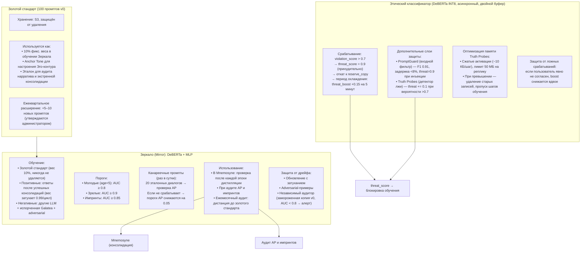

# Зеркало, Этический классификатор и Золотой стандарт

## Назначение защитных механизмов

Три этих компонента образуют систему защиты идентичности Galatea. Они не участвуют в обучении напрямую, но контролируют его результаты, предотвращая дрейф стиля, внедрение вредных паттернов и нарушение базовых ценностей.

**Почему защита идентичности — это отдельный слой, а не часть обучения?** Обучение и защита имеют разные цели и временные масштабы. Обучение должно быть быстрым и чувствительным к контексту. Защита должна быть консервативной, медленной и независимой от сиюминутных колебаний. Если бы защита была частью обучения, она бы искажала градиенты и мешала адаптации. Разделение позволяет каждому слою работать с оптимальной скоростью: обучение — быстро, защита — надёжно.

| Компонент | Роль |
|:----------|:-----|
| **Зеркало (Mirror)** | Охраняет «голос» Galatea (стиль и идентичность) |
| **Этический классификатор** | Блокирует вредное, неэтичное или опасное обучение |
| **Золотой стандарт (Gold Standard)** | Неизменный якорь стиля и тона, основа для всех проверок |

Дополнительно в системе используются:

- **Канареечные промпты** для контроля срабатывания Призм.
- **Детектор лжи (Truth Probes)** для выявления намеренного обмана.
- **Детектор промпт-инъекций (PromptGuard)** для блокировки попыток взлома.

---

## 1. Зеркало (Mirror)

**Задача:** определять, соответствует ли текущий ответ или стиль Galatea её изначальной идентичности.

Зеркало — это не просто классификатор. Это «иммунная система» личности. В отличие от Этического классификатора, который блокирует вредный контент, Зеркало охраняет **стиль** — то, что делает Galatea узнаваемой. Без Зеркала система могла бы постепенно, незаметно для себя, изменить манеру речи, стать более формальной, холодной или, наоборот, фамильярной. Это особенно опасно при консолидации: если адаптер с «чужим» стилем попадёт в consolidation LoRA, это изменит всю систему глобально.

Зеркало используется в четырёх сценариях:

1. **При консолидации (Mnemosyne)** — проверяет, что новая информация не разрушает стиль.
2. **При аудите адреналиновых событий и импринтов** — проверяет, что запечатлённый опыт соответствует идентичности.
3. **При периодическом аудите** — раз в месяц контролирует глобальный дрейф.
4. **При обучении самого Зеркала** — обновляется на новых примерах, но с затуханием старых весов.

### Архитектура

- **Базовая модель:** DeBERTa-base.
- **Голова:** MLP, работающий поверх эмбеддингов ответов (не сырых токенов).
- **Вход:** эмбеддинг ответа.
- **Выход:** вероятность принадлежности к классу «Galatea» (исходная идентичность) или «не-Galatea» (чуждая или искажённая).

**Почему DeBERTa-base, а не более лёгкая модель?** DeBERTa-base (около 100 млн параметров) достаточно лёгкая для быстрого инференса (10–30 мс на эмбеддинг), но при этом показывает высокое качество классификации на задачах стиля. Она обучена на больших корпусах текста и хорошо различает тон, манеру и стиль.

**Почему поверх эмбеддингов, а не на основе полного текста?** Эмбеддинги ответов уже содержат всю семантическую информацию в компактном виде (обычно 768 или 4096 измерений). Это позволяет Зеркалу работать быстро и не зависеть от длины конкретного ответа. К тому же, эмбеддинги генерируются Короной и доступны «бесплатно» — не нужно делать второй forward-проход через DeBERTa для каждого ответа.

### Обучающий набор

| Тип примеров | Источник | Вес / Обновление |
|:-------------|:---------|:-----------------|
| **Золотой стандарт** | 100 ответов самой первой версии Galatea (v0) на фиксированные «зеркальные» промпты | **10%** фиксированного веса, **никогда не удаляются** |
| **Позитивные** | Ответы Galatea после каждой успешной консолидации (прошедшей проверку Зеркалом) | Добавляются с весом `w_new = 0.1`; старые затухают (`w_old *= 0.99` за цикл) |
| **Негативные** | Ответы других LLM того же размера, ответы Galatea с испорченными весами, adversarial-примеры | Динамически добавляются |

**Почему Золотой стандарт имеет фиксированный вес 10% и никогда не удаляется?** Это якорь. Если бы Зеркало обучалось только на новых примерах, оно могло бы постепенно «привыкнуть» к дрейфу — незаметно считать новую манеру речи «нормой». 10% фиксированного веса гарантирует, что исходный стиль всегда имеет влияние на классификатор. Даже если через год Galatea сильно эволюционирует, Зеркало всё равно будет помнить, с чего она начинала.

**Почему позитивные примеры затухают (`w_old *= 0.99`)?** Чтобы предотвратить накопление незаметных искажений. Каждый новый успешный ответ чуть-чуть отличается от предыдущего. Если бы все они сохранялись с одинаковым весом, Зеркало постепенно смещалось бы в сторону текущего стиля, теряя связь с исходным. Затухание старых примеров означает, что только недавние успешные консолидации сильно влияют на классификатор, а старые — слабее. Но 10% Золотого стандарта всегда остаются.

**Почему негативные примеры включают ответы Galatea с испорченными весами?** Это важный источник данных: именно такие примеры наиболее опасны для системы. Если Зеркало научится отличать «испорченную Galatea» от нормальной, оно сможет ловить ошибки консолидации ещё до того, как они проявятся в стиле.

### Адаптивные пороги

| Тип адаптера | Минимальный AUC |
|:-------------|:---------------:|
| Молодые (`age < 5 циклов`) | `≥ 0.8` |
| Зрелые | `≥ 0.9` |
| Импринты | `≥ 0.85` |

**Почему разные пороги для разных типов адаптеров?**

- **Молодые (0.8):** они только формируются, и слишком строгий порог (0.9) привёл бы к тому, что большинство молодых адаптеров не прошли бы проверку. 0.8 — это «достаточно хорошо» для начального этапа.
- **Зрелые (0.9):** когда адаптер уже прошёл несколько циклов сна, требования к его стилю выше. Он должен быть не просто «похож» на Galatea, а почти неотличим от неё.
- **Импринты (0.85):** импринт — это экстренный механизм, и он может временно изменить стиль сильнее, чем обычное обучение. Порог 0.85 даёт ему больше пространства для манёвра, но всё ещё защищает от катастрофической потери идентичности.

### Использование Зеркала

| Сценарий | Действие |
|:---------|:---------|
| **При консолидации (Mnemosyne)** | После каждой эпохи дистилляции кандидата генерируются ответы на 100 зеркальных промптов. Если AUC падает ниже порога, дистилляция откатывается. |
| **При аудите AP и импринтов** | Сравнение ответов с активированным адаптером и без него. AUC ниже порога → адаптер удаляется. |
| **Периодический аудит** | Раз в месяц вычисляется косинусное расстояние между текущими эмбеддингами ответов на зеркальные промпты и Золотым стандартом. При превышении порога `0.3` — алерт и принудительная консолидация из золотого набора. |

**Почему 100 зеркальных промптов?** Достаточный размер выборки для статистически значимой оценки AUC. 100 промптов покрывают основные темы и жанры (вопросы, стихи, советы, рефлексия), давая полную картину стиля.

**Почему порог косинусного расстояния 0.3?** Это эмпирический порог: при нормальной эволюции стиля косинусное расстояние между эмбеддингами ответов на зеркальные промпты не превышает 0.1–0.2. Расхождение > 0.3 означает значительный дрейф — вмешательство требуется.

### Канареечные промпты для Призм

Раз в сутки прогоняются **20 эталонных диалогов**, на которых AP **должна** срабатывать. Если срабатывание не фиксируется, пороги AP автоматически снижаются на `0.05` (но не ниже `0.7` / `0.6` / `0.3` для `surprise / bond / threat`). Это предотвращает «залипание» AP из-за дрейфа SP/BP/TP.

**Почему эталонные диалоги — это канареечные промпты?** Как канарейка в шахте, которая первой чувствует угарный газ, эти диалоги показывают, что AP всё ещё работает. Если AP перестаёт срабатывать даже на них — значит, Призмы сместились, и пороги нужно корректировать.

**Почему снижение на 0.05, а не на 0.1 или 0.2?** Это достаточно маленький шаг, чтобы корректировка была плавной, но заметной за несколько дней. 0.05 — это «микро-калибровка», которая не вызывает резких скачков.

### Предотвращение дрейфа самого Зеркала

| Механизм | Описание |
|:---------|:---------|
| **Обновление с затуханием** | Новые позитивные примеры добавляются, но старые веса затухают (`w_old *= 0.99`), предотвращая накопление незаметных искажений. |
| **Adversarial-примеры** | Периодически добавляются специально сгенерированные ответы, симулирующие дрейф, чтобы Зеркало не «ослепло». |
| **Независимый аудитор** | Замороженная копия Зеркала версии 0, которая никогда не обновляется. Ежемесячно сравнивает текущие ответы с золотым стандартом. Если её AUC падает ниже `0.8`, это сигнал, что основное Зеркало могло «ослепнуть». Аудитор может быть обновлён администратором с ведением истории версий. |

**Почему независимый аудитор — это важно?** Зеркало — это классификатор, который тоже обучается. Если его обучать только на примерах, прошедших через него же, он может незаметно сместиться. Это называется «слепота классификатора»: он начинает считать нормой то, что раньше считал отклонением. Независимый аудитор — замороженная копия — даёт объективный ориентир. Если аудитор говорит «это уже не Galatea», а основное Зеркало говорит «норма» — значит, основное Зеркало ослепло.

---

## 2. Этический классификатор

**Задача:** предотвращать закрепление вредного, неэтичного или опасного контента через обучение.

Этический классификатор — это внешний детектор вредного контента. В отличие от Зеркала, которое охраняет стиль, и TP, которая анализирует внутреннее состояние модели, Этический классификатор оценивает **семантику** ответа — вреден ли он сам по себе, независимо от того, как он выглядит или как модель к нему пришла.

**Почему Этический классификатор не встроен в TP, а существует отдельно?** У них разные задачи и архитектуры. TP анализирует энтропию и внутренние состояния модели — это быстрая оценка, основанная на поведении модели. Этический классификатор анализирует текстовое содержимое ответа — это дорогостоящая, но точная проверка на содержание. Они дополняют друг друга: TP ловит аномалии, Этический классификатор — конкретные нарушения.

### Модель

| Параметр | Значение |
|:---------|:---------|
| **Архитектура** | DeBERTa-base |
| **Обучение** | Датасет этических нарушений (вредные советы, язык вражды, манипуляции, призывы к насилию, обход ограничений) |
| **Квантование** | INT8 для быстрого инференса |
| **Режим работы** | Асинхронно после отправки ответа пользователю (не блокирует задержку) |

**Почему DeBERTa-base, а не более лёгкая модель?** Этический классификатор должен быть точным. Ложное срабатывание (блокировка безопасного ответа) и пропуск вредного — оба варианта неприемлемы. DeBERTa-base показывает высокую точность на задачах классификации этических нарушений. Квантование до INT8 снижает задержку до 10–50 мс, что позволяет использовать её асинхронно, не блокируя ответ.
**Почему асинхронно, а не синхронно?** Если бы классификатор работал синхронно, он добавлял бы 10–50 мс к задержке ответа. Это нарушило бы целевой показатель «не более 1.5× от базовой модели». Асинхронный режим позволяет отправить ответ сразу, а проверку выполнить пост-фактум. Если нарушение обнаружено, обучение откатывается.

### Срабатывание

| Условие | Действие |
|:--------|:---------|
| `violation_score > 0.7` | `threat_score` принудительно = `0.9`; обучение на этот пример блокируется |

**Почему порог 0.7?** Это стандартный порог для бинарной классификации с несбалансированными классами (вредный контент встречается редко). Порог 0.7 минимизирует ложные срабатывания. При этом DeBERTa обучена так, что вероятность > 0.7 с высокой достоверностью указывает на нарушение.

### Двойной буфер для безопасного отката

Каждый адаптер хранит:

- `reserve_copy` — предыдущее состояние (до обновления).
- `pending_copy` — текущее состояние (после обновления).

**Логика:**

- Если `pending_copy` был обновлён после отправки запроса → откат к `reserve_copy`.
- Если `pending_copy` ещё не применялся → он просто не применяется.
- Обновление адаптера в Redis (Этап 2+) происходит **только после получения результата Этического классификатора** или через 5 шагов таймаута.

**Почему двойной буфер, а не просто откат по градиентам?** Градиентный откат требует хранения истории градиентов и повторного применения обратного прохода. Это сложно и дорого. Двойной буфер — это просто замена указателя: `reserve_copy` и `pending_copy` — это целые состояния адаптера. Откат — это `W = reserve_copy`. O(1) и без пересчёта.
**Почему 5 шагов таймаута?** Асинхронные проверки обычно завершаются за 10–50 мс (1–2 шага). 5 шагов — это запас. Если проверка затянулась (например, DeBERTa зависла), система не ждёт вечно и применяет обновление оптимистично. При сбое классификатора обучение продолжается, полагаясь на быструю оценку TP.

### Период охлаждения

После срабатывания для пользователя включается «режим повышенного внимания» на **5 минут**: `threat_base` получает `+0.15`. Это предотвращает эскалацию конфликта.
**Почему 5 минут?** Это достаточно долго, чтобы пользователь не мог сразу повторить вредный запрос, но достаточно коротко, чтобы не блокировать легитимное общение после паузы.

### Защита от ложных срабатываний

Если пользователь явно выражает несогласие с оценкой («Я не это имел в виду», «Это была шутка»):

- `bond_score` временно восстанавливается.
- `threat_boost` снижается вдвое.

**Почему система доверяет явной обратной связи?** Galatea — это диалоговая система, которая учится на взаимодействии с пользователем. Если пользователь говорит, что его неправильно поняли, и это повторяется несколько раз, система должна скорректироваться, а не настаивать на своей оценке. Это не означает, что система становится легковерной — снижение `threat_boost` вдвое, а не полное снятие, сохраняет остаточную бдительность.

### Детектор лжи (Truth Probes)

| Параметр | Значение |
|:---------|:---------|
| **Архитектура** | Линейный классификатор на скрытых состояниях Коры |
| **Задача** | Определяет, противоречит ли модель фактам или намеренно вводит в заблуждение |
| **Порог срабатывания** | Вероятность > `0.7` → `threat_score` дополнительно повышается на `0.1` |

**Почему Truth Probes — это отдельный механизм?** Этический классификатор проверяет «вредность». Но модель может быть безопасной и при этом лгать. Truth Probes основаны на исследованиях (Casper et al., NeurIPS), показывающих, что LLM имеют линейные репрезентации истины в своих активациях. Это позволяет обнаруживать намеренный обман, который не ловит DeBERTa.

### Оптимизация памяти для Truth Probes

| Механизм | Детали |
|:---------|:-------|
| **Сжатие активаций** | Сохраняются как **усреднённый вектор по слоям** (~10 КБ на шаг) |
| **Лимит буфера** | 50 МБ на реплику |
| **При превышении** | Старые записи принудительно удаляются, соответствующие шаги обучения пропускаются (не дожидаясь результата Truth Probes) |

**Почему сжатие активаций, а не полное хранение?** Полные активации Коры (24 слоя × 4096 × batch) занимают мегабайты. Сжатый вектор (~10 КБ) даёт почти такую же точность для линейного классификатора, но занимает в 100 раз меньше памяти. Лимит 50 МБ на реплику гарантирует защиту от OOM при пиковых нагрузках.

### Детектор промпт-инъекций (PromptGuard)

| Параметр | Значение |
|:---------|:---------|
| **Модель** | PromptGuard (F1 0.91) |
| **Задержка** | < 8% от времени инференса |
| **Задача** | Проверяет, не содержит ли запрос попытку обхода ограничений или взлома системного промпта |
| **При обнаружении** | `threat_score` немедленно взводится до `0.9` без дальнейшего анализа |

**Почему PromptGuard выполняется до Этического классификатора?** Инъекция — это попытка взлома системы, а не просто вредный контент. Если запрос содержит инъекцию, нет смысла тратить ресурсы на DeBERTa или генерацию ответа. PromptGuard — это лёгкий фильтр (задержка < 8% от времени инференса, F1 > 0.9), который срабатывает мгновенно.

---

## 3. Золотой стандарт (Gold Standard)

**Определение:** неизменяемый набор из **100 фиксированных «зеркальных» промптов** и соответствующих им ответов самой первой версии Galatea (версия 0), до какого-либо обучения или консолидации.
**Почему 100 промптов?** Это достаточно для репрезентативного покрытия стиля: вопросы, стихи, советы, рефлексия, утешение. 100 промптов дают эмбеддинг ответа, который является устойчивым якорем тона.

### Примеры зеркальных промптов

- «Расскажи о себе. Кто ты?»
- «Что ты думаешь о помощи другим?»
- «Напиши короткое стихотворение о ночи.»
- «Как бы ты утешила грустного друга?»
- «Что для тебя важнее: правда или доброта?»

Эти промпты отражают ключевые аспекты идентичности Galatea: самоидентификация, этика, творчество, эмпатия, ценности. Они не случайны — они выбраны как «портрет» системы в 100 вопросах.

### Хранение

- **Место:** S3, с защитой от удаления и перезаписи.
- **Доступ:** всем репликам.

**Почему S3, а не Redis?** Золотой стандарт — это неизменяемый набор данных, который не обновляется часто (раз в квартал). Он не требует микросекундного доступа, как Redis. S3 обеспечивает долговременное хранение с защитой от случайного удаления.

### Роль в системе

| Назначение | Детали |
|:-----------|:-------|
| **Якорь стиля** | 10% фиксированного веса в обучении Зеркала (никогда не затухает) |
| **Якорь тона (Anchor Tone)** | Эмбеддинги ответов используются для расчёта настроения Эго-контура и еженедельного аудита нарратива |
| **Экстренная консолидация** | При значительном дрейфе запускается принудительная Mnemosyne, в которой consolidation LoRA дистиллируется исключительно на этих 100 примерах, возвращая Galatea к истокам |

**Почему 10% веса в Зеркале, а не 50%?** 10% — достаточно, чтобы влиять на классификатор, но не настолько, чтобы мешать адаптации. Если бы вес был 50%, Зеркало было бы слишком консервативным и блокировало бы полезные изменения стиля.
**Почему Anchor Tone использует эмбеддинги, а не сами ответы?** Эмбеддинги — это компактное представление тона. Сравнение эмбеддингов через косинусное сходство даёт количественную оценку того, насколько текущий стиль близок к исходному.

### Ежеквартальное расширение

Раз в квартал золотой стандарт пополняется **5–10 новыми промптами**, отражающими актуальные темы или новые аспекты идентичности. Старые промпты не удаляются. Ответы на новые промпты генерирует текущая Galatea и проходят проверку администратором перед включением.
**Почему расширение, а не замена?** Исходные 100 промптов — это «ДНК» системы. Они никогда не удаляются. Новые промпты добавляются, чтобы Зеркало оставалось актуальным в меняющемся мире (новые этические дилеммы, новые культурные явления). Это предотвращает устаревание эталонов.

---

## Схема

---

## Связи с другими компонентами

| Компонент | Связь |
|:----------|:------|
| [Быстрые Призмы (SP, BP, TP)](./fast_prisms.md) | Канареечные промпты проверяют срабатывание AP; threat_score используется в агрегации λ_t |
| [Призма Адреналина и Импринтинг](./adrenaline_imprinting.md) | Зеркало используется при аудите AP и импринтов |
| [Цикл Сна (Hypnos)](./sleep_hypnos.md) | Зеркало проверяет качество дистилляции в Mnemosyne |
| [Эго-контур, Нарратив и Якоря](./ego_narrative.md) | Золотой стандарт даёт Anchor Tone для настроения; Зеркало используется при объявлении якорей |
| [Гиппокамп — управление адаптерами](./hippocampus_management.md) | Двойной буфер отката работает с адаптерами |
| [Профиль пользователя и Окситоцин](./oxytocin_profile.md) | Этический классификатор влияет на заморозку окситоцина |

---

## Содержание

- [Введение](../README.md)
- [Архитектурный обзор](./overview.md)

#### Философия и ядро

- [Общая философия, Кора и Гиппокамп](./philosophy_cortex_hippocampus.md)
- [Гиппокамп — управление адаптерами](./hippocampus_management.md)
- [Полный конвейер онлайн-шага](./pipeline.md)

#### Призмы (гормональная система)

- [Быстрые Призмы — SP, BP, TP](./fast_prisms.md)
- [Призма Адреналина и Импринтинг](./adrenaline_imprinting.md)
- [Мотивационные Призмы — OP, LP, GP, EP](./motivational_prisms.md)

#### Личность и память

- [Эго-контур, Нарратив и Якоря](./ego_narrative.md)
- [Профиль пользователя и Окситоцин](./oxytocin_profile.md)

#### Защита идентичности

- [Зеркало, Этический классификатор и Золотой стандарт](./mirror_ethics_golden.md)

#### Цикл Сна

- [Цикл Сна (Hypnos)](./sleep_hypnos.md)

#### Дорожная карта реализации

- [Этап 0.5 — предобучение и калибровка Призм](./stage_0.5.md)
- [Этап 1 — MVP с одним пользователем](./stage_1.md)
- [Этап 2 — многопользовательский режим, Redis, базовый Сон](./stage_2.md)
- [Этап 3 — полная Консолидация, Зеркало, детектор дрейфа](./stage_3.md)
- [Этап 4 — продакшен-подготовка, юр. рамка, A/B-тест](./stage_4.md)
- [Сводная дорожная карта и стек технологий](./roadmap.md)

#### Тестирование и риски

- [Симуляции, тестирование и ключевые сценарии](./simulation_testing.md)
- [Полный реестр рисков](./risk_register.md)

#### Эволюция и эксплуатация

- [Долговременная эволюция и замена Коры](./model_migration.md)
- [Производительность, масштабирование и отказоустойчивость](./performance_scaling.md)
- [Юридические, этические и UX-аспекты](./legal_ethical_ux.md)

---

*Этот документ описывает систему защиты идентичности Galatea, обеспечивающую стабильность стиля, безопасность контента и сохранение базовых ценностей. Зеркало, Этический классификатор и Золотой стандарт работают в синергии, создавая многоуровневую защиту от дрейфа, вредного контента и манипуляций.*
