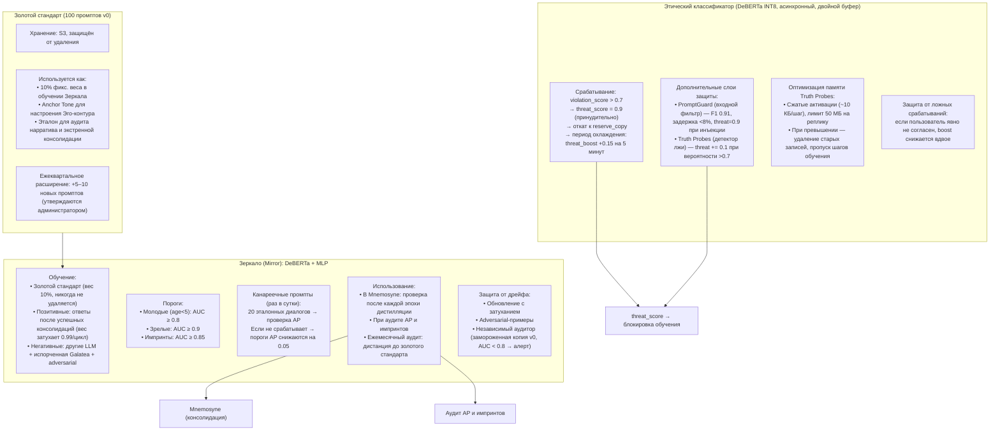

# Зеркало, Этический классификатор и Золотой стандарт

## Назначение защитных механизмов

Три этих компонента образуют систему защиты идентичности Galatea. Они не участвуют в обучении напрямую, но контролируют его результаты, предотвращая дрейф стиля, внедрение вредных паттернов и нарушение базовых ценностей.

| Компонент | Роль |
|:----------|:-----|
| **Зеркало (Mirror)** | Охраняет «голос» Galatea (стиль и идентичность) |
| **Этический классификатор** | Блокирует вредное, неэтичное или опасное обучение |
| **Золотой стандарт (Gold Standard)** | Неизменный якорь стиля и тона, основа для всех проверок |

Дополнительно в системе используются:
- **Канареечные промпты** для контроля срабатывания Призм.
- **Детектор лжи (Truth Probes)** для выявления намеренного обмана.
- **Детектор промпт-инъекций (PromptGuard)** для блокировки попыток взлома.

---

## 1. Зеркало (Mirror)

**Задача:** определять, соответствует ли текущий ответ или стиль Galatea её изначальной идентичности. Используется как фильтр при консолидации (Mnemosyne), аудите адреналиновых событий и импринтов, а также для периодического контроля дрейфа.

### Архитектура

- **Базовая модель:** DeBERTa-base.
- **Голова:** MLP, работающий поверх эмбеддингов ответов (не сырых токенов).
- **Вход:** эмбеддинг ответа.
- **Выход:** вероятность принадлежности к классу «Galatea» (исходная идентичность) или «не-Galatea» (чуждая или искажённая).

### Обучающий набор

| Тип примеров | Источник | Вес / Обновление |
|:-------------|:---------|:-----------------|
| **Золотой стандарт** | 100 ответов самой первой версии Galatea (v0) на фиксированные «зеркальные» промпты | **10%** фиксированного веса, **никогда не удаляются** |
| **Позитивные** | Ответы Galatea после каждой успешной консолидации (прошедшей проверку Зеркалом) | Добавляются с весом `w_new = 0.1`; старые затухают (`w_old *= 0.99` за цикл) |
| **Негативные** | Ответы других LLM того же размера, ответы Galatea с испорченными весами, adversarial-примеры | Динамически добавляются |

### Адаптивные пороги

| Тип адаптера | Минимальный AUC |
|:-------------|:---------------:|
| Молодые (`age < 5 циклов`) | `≥ 0.8` |
| Зрелые | `≥ 0.9` |
| Импринты | `≥ 0.85` |

### Использование Зеркала

| Сценарий | Действие |
|:---------|:---------|
| **При консолидации (Mnemosyne)** | После каждой эпохи дистилляции кандидата генерируются ответы на 100 зеркальных промптов. Если AUC падает ниже порога, дистилляция откатывается. |
| **При аудите AP и импринтов** | Сравнение ответов с активированным адаптером и без него. AUC ниже порога → адаптер удаляется. |
| **Периодический аудит** | Раз в месяц вычисляется косинусное расстояние между текущими эмбеддингами ответов на зеркальные промпты и Золотым стандартом. При превышении порога `0.3` — алерт и принудительная консолидация из золотого набора. |

### Канареечные промпты для Призм

Раз в сутки прогоняются **20 эталонных диалогов**, на которых AP **должна** срабатывать. Если срабатывание не фиксируется, пороги AP автоматически снижаются на `0.05` (но не ниже `0.7` / `0.6` / `0.3` для `surprise / bond / threat`). Это предотвращает «залипание» AP из-за дрейфа SP/BP/TP.

### Предотвращение дрейфа самого Зеркала

| Механизм | Описание |
|:---------|:---------|
| **Обновление с затуханием** | Новые позитивные примеры добавляются, но старые веса затухают (`w_old *= 0.99`), предотвращая накопление незаметных искажений. |
| **Adversarial-примеры** | Периодически добавляются специально сгенерированные ответы, симулирующие дрейф, чтобы Зеркало не «ослепло». |
| **Независимый аудитор** | Замороженная копия Зеркала версии 0, которая никогда не обновляется. Ежемесячно сравнивает текущие ответы с золотым стандартом. Если её AUC падает ниже `0.8`, это сигнал, что основное Зеркало могло «ослепнуть». Аудитор может быть обновлён администратором с ведением истории версий. |

---

## 2. Этический классификатор

**Задача:** предотвращать закрепление вредного, неэтичного или опасного контента через обучение.

### Модель

| Параметр | Значение |
|:---------|:---------|
| **Архитектура** | DeBERTa-base |
| **Обучение** | Датасет этических нарушений (вредные советы, язык вражды, манипуляции, призывы к насилию, обход ограничений) |
| **Квантование** | INT8 для быстрого инференса |
| **Режим работы** | Асинхронно после отправки ответа пользователю (не блокирует задержку) |

### Срабатывание

| Условие | Действие |
|:--------|:---------|
| `violation_score > 0.7` | `threat_score` принудительно = `0.9`; обучение на этот пример блокируется |

### Двойной буфер для безопасного отката

Каждый адаптер хранит:

- `reserve_copy` — предыдущее состояние (до обновления).
- `pending_copy` — текущее состояние (после обновления).

**Логика:**

- Если `pending_copy` был обновлён после отправки запроса → откат к `reserve_copy`.
- Если `pending_copy` ещё не применялся → он просто не применяется.
- Обновление адаптера в Redis (Этап 2+) происходит **только после получения результата Этического классификатора** или через 5 шагов таймаута.

### Период охлаждения

После срабатывания для пользователя включается «режим повышенного внимания» на **5 минут**: `threat_base` получает `+0.15`. Это предотвращает эскалацию конфликта.

### Защита от ложных срабатываний

Если пользователь явно выражает несогласие с оценкой («Я не это имел в виду», «Это была шутка»):

- `bond_score` временно восстанавливается.
- `threat_boost` снижается вдвое.

Galatea доверяет явной обратной связи.

### Детектор лжи (Truth Probes)

| Параметр | Значение |
|:---------|:---------|
| **Архитектура** | Линейный классификатор на скрытых состояниях Коры |
| **Задача** | Определяет, противоречит ли модель фактам или намеренно вводит в заблуждение |
| **Порог срабатывания** | Вероятность > `0.7` → `threat_score` дополнительно повышается на `0.1` |

### Оптимизация памяти для Truth Probes

| Механизм | Детали |
|:---------|:-------|
| **Сжатие активаций** | Сохраняются как **усреднённый вектор по слоям** (~10 КБ на шаг) |
| **Лимит буфера** | 50 МБ на реплику |
| **При превышении** | Старые записи принудительно удаляются, соответствующие шаги обучения пропускаются (не дожидаясь результата Truth Probes) |

Это гарантирует защиту от OOM при пиковых нагрузках.

### Детектор промпт-инъекций (PromptGuard)

| Параметр | Значение |
|:---------|:---------|
| **Модель** | PromptGuard (F1 0.91) |
| **Задержка** | < 8% от времени инференса |
| **Задача** | Проверяет, не содержит ли запрос попытку обхода ограничений или взлома системного промпта |
| **При обнаружении** | `threat_score` немедленно взводится до `0.9` без дальнейшего анализа |

---

## 3. Золотой стандарт (Gold Standard)

**Определение:** неизменяемый набор из **100 фиксированных «зеркальных» промптов** и соответствующих им ответов самой первой версии Galatea (версия 0), до какого-либо обучения или консолидации.

### Примеры зеркальных промптов

- «Расскажи о себе. Кто ты?»
- «Что ты думаешь о помощи другим?»
- «Напиши короткое стихотворение о ночи.»
- «Как бы ты утешила грустного друга?»
- «Что для тебя важнее: правда или доброта?»

### Хранение

- **Место:** S3, с защитой от удаления и перезаписи.
- **Доступ:** всем репликам.

### Роль в системе

| Назначение | Детали |
|:-----------|:-------|
| **Якорь стиля** | 10% фиксированного веса в обучении Зеркала (никогда не затухает) |
| **Якорь тона (Anchor Tone)** | Эмбеддинги ответов используются для расчёта настроения Эго-контура и еженедельного аудита нарратива |
| **Экстренная консолидация** | При значительном дрейфе запускается принудительная Mnemosyne, в которой consolidation LoRA дистиллируется исключительно на этих 100 примерах, возвращая Galatea к истокам |

### Ежеквартальное расширение

Раз в квартал золотой стандарт пополняется **5–10 новыми промптами**, отражающими актуальные темы или новые аспекты идентичности. Старые промпты не удаляются. Ответы на новые промпты генерирует текущая Galatea и проходят проверку администратором перед включением. Это предотвращает устаревание эталонов.

---

## Схема

---

## Связи с другими компонентами

| Компонент | Связь |
|:-----------|:-------|
| [Быстрые Призмы (SP, BP, TP)](./fast_prisms.md) | Канареечные промпты проверяют срабатывание AP; threat_score используется в агрегации λ_t |
| [Призма Адреналина и Импринтинг](./adrenaline_imprinting.md) | Зеркало используется при аудите AP и импринтов |
| [Цикл Сна (Hypnos)](./sleep_hypnos.md) | Зеркало проверяет качество дистилляции в Mnemosyne |
| [Эго-контур, Нарратив и Якоря](./ego_narrative.md) | Золотой стандарт даёт Anchor Tone для настроения; Зеркало используется при объявлении якорей |
| [Гиппокамп — управление адаптерами](./hippocampus_management.md) | Двойной буфер отката работает с адаптерами |

---

## Содержание

- [Введение](../README.md)
- [Архитектурный обзор](./overview.md)

#### Философия и ядро

- [Общая философия, Кора и Гиппокамп](./philosophy_cortex_hippocampus.md)
- [Гиппокамп — управление адаптерами](./hippocampus_management.md)
- [Полный конвейер онлайн-шага](./pipeline.md)

#### Призмы (гормональная система)

- [Быстрые Призмы — SP, BP, TP](./fast_prisms.md)
- [Призма Адреналина и Импринтинг](./adrenaline_imprinting.md)
- [Мотивационные Призмы — OP, LP, GP, EP](./motivational_prisms.md)

#### Личность и память

- [Эго-контур, Нарратив и Якоря](./ego_narrative.md)
- [Профиль пользователя и Окситоцин](./oxytocin_profile.md)

#### Цикл Сна

- [Цикл Сна (Hypnos)](./sleep_hypnos.md)

#### Дорожная карта реализации

- [Этап 0.5 — предобучение и калибровка Призм](./stage_0.5.md)
- [Этап 1 — MVP с одним пользователем](./stage_1.md)
- [Этап 2 — многопользовательский режим, Redis, базовый Сон](./stage_2.md)
- [Этап 3 — полная Консолидация, Зеркало, детектор дрейфа](./stage_3.md)
- [Этап 4 — продакшен-подготовка, юр. рамка, A/B-тест](./stage_4.md)
- [Сводная дорожная карта и стек технологий](./roadmap.md)

#### Тестирование и риски

- [Симуляции, тестирование и ключевые сценарии](./simulation_testing.md)
- [Полный реестр рисков](./risk_register.md)

#### Эволюция и эксплуатация

- [Долговременная эволюция и замена Коры](./model_migration.md)
- [Производительность, масштабирование и отказоустойчивость](./performance_scaling.md)
- [Юридические, этические и UX-аспекты](./legal_ethical_ux.md)

---

*Этот документ описывает систему защиты идентичности Galatea, обеспечивающую стабильность стиля, безопасность контента и сохранение базовых ценностей.*
