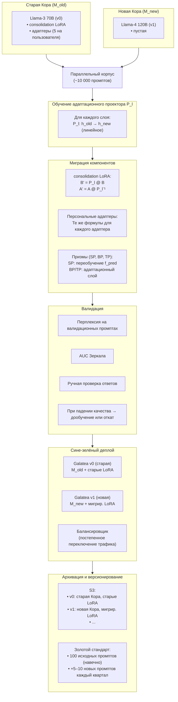

# Долговременная эволюция, замена Коры и миграция знаний

## Назначение

Galatea не может вечно жить на одной версии Llama-3 70B. Мир меняется: появляются новые модели, новые архитектуры, новые знания. Без механизма эволюции Galatea устареет за год-два.

Этот раздел описывает, как Galatea переживает замену своего «мозга» — **Коры** — сохраняя при этом все накопленные знания, адаптеры и идентичность.

---

## 1. Почему это необходимо

| Причина | Описание |
|:--------|:---------|
| **Устаревание базовой модели** | Llama-3 70B обучена на данных до 2023 года. Через два года её знания будут неполны. |
| **Прогресс архитектур** | Новые модели эффективнее, быстрее, точнее. |
| **Эволюция языка и концептов** | Появляются новые термины, культурные феномены, способы общения. |
| **Улучшенное выравнивание** | Новые модели безопаснее и лучше следуют инструкциям. |

---

## 2. Ключевая проблема миграции

Consolidation LoRA (ранг 64 на Q/V) и персональные адаптеры (ранг 16) обучены в пространстве представлений **старой** Коры. Новая Кора имеет:

- другое пространство эмбеддингов,
- другую размерность,
- другую структуру слоёв.

**Просто скопировать LoRA-веса невозможно** — они окажутся в чужом семантическом пространстве и породят шум.

---

## 3. Решение: Адаптационный проектор пространств

При замене Коры с модели `M_old` на `M_new` строится **отображение (projector)** между их пространствами скрытых состояний.

### Процедура обучения проектора

| Шаг | Действие |
|:---:|:---------|
| 1 | **Сбор параллельного корпуса:** `M_old` и `M_new` прогоняют один и тот же набор из ~10 000 разнообразных промптов. Для каждого промпта сохраняются скрытые состояния на каждом слое (или только на слоях Q и V). |
| 2 | **Обучение отображения:** для каждого слоя `l` обучается линейное отображение `P_l: R^{d_old} → R^{d_new}`, которое минимизирует `P_l(h_old) - h_new²`. Это можно сделать аналитически (через псевдообратную матрицу) или градиентным спуском. |
| 3 | **Преобразование LoRA:** consolidation LoRA и все персональные адаптеры преобразуются послойно. |
| 4 | **Валидация:** преобразованные адаптеры тестируются на `M_new`. Проверяется перплексия, AUC Зеркала, качество ответов на зеркальных промптах. |

### Преобразование LoRA

Для каждого слоя:

```python
# Матрица B (d_old × r) → B' (d_new × r)
B' = P_l @ B

# Матрица A (r × d_old) → A' (r × d_new)
A' = A @ P_l^{-1}  # псевдообратная
```

---

## 4. Обновление Призм при замене Коры

Призмы (SP, BP, TP) используют эмбеддинги и скрытые состояния Коры как вход.

| Призма | Действие при замене Коры |
|:-------|:-------------------------|
| **SP (f_pred)** | Переобучается заново на параллельном корпусе `M_new` (те же ~10 000 промптов). Вход — ранние слои новой Коры. |
| **BP (Mamba/GRU)** | Вход — эмбеддинги запроса и ответа. Если размерность изменилась → адаптационный слой. Если нет — используется как есть с тонкой донастройкой. |
| **TP (MLP_threat)** | Аналогично BP: адаптационный слой или дообучение на параллельном корпусе. |

**Медленные Призмы** (SPe, CP, MP, OP, LP, GP, EP) и **Этический классификатор** не зависят напрямую от Коры и переносятся без изменений.

---

## 5. Эволюция Золотого стандарта

| Правило | Описание |
|:--------|:---------|
| **Неизменное ядро** | 100 зеркальных промптов и ответов первой версии Galatea остаются навечно. |
| **Пополнение** | Раз в квартал золотой стандарт пополняется **5–10 новыми промптами**, отражающими актуальные темы (новые этические дилеммы, культурные явления). |
| **Генерация** | Ответы на новые промпты генерирует текущая Galatea. |
| **Утверждение** | Новые промпты проходят проверку администратором перед включением. |

Это предотвращает устаревание эталонов и даёт Зеркалу релевантные ориентиры.

---

## 6. Процедура полной замены Коры (пошагово)

| Шаг | Действие |
|:---:|:---------|
| 1 | **Подготовка:** `M_new` загружается на отдельный стенд. Собирается параллельный корпус. |
| 2 | **Обучение проектора:** для каждого слоя строится `P_l`. |
| 3 | **Миграция consolidation LoRA:** преобразование через `P_l`. |
| 4 | **Миграция всех активных персональных адаптеров:** преобразование через те же `P_l`. |
| 5 | **Обновление Призм:** переобучение/адаптация SP, BP, TP. |
| 6 | **Валидация:** перплексия, Зеркало, зеркальные промпты, ручная проверка ответов. |
| 7 | **Сине-зелёный деплой:** новая версия Galatea (`M_new` + преобразованные адаптеры) разворачивается параллельно. Трафик переключается постепенно. При падении качества — откат на `M_old`. |
| 8 | **Архивация:** старая Кора, старые адаптеры и старый consolidation LoRA сохраняются в S3 как «слепок личности» на случай непредвиденных проблем. |

---

## 7. Версионирование личности

Каждая замена Коры создаёт новую «версию» Galatea:

| Версия | Описание |
|:-------|:---------|
| **v0** | Исходная Llama-3 70B, золотой стандарт |
| **v1** | Первая замена Коры, мигрированные адаптеры |
| **v2** | Вторая замена и так далее |

**Хранение:** все версии хранятся в S3 и могут быть восстановлены. Это позволяет отслеживать эволюцию личности и при необходимости откатываться.

---

## 8. Обратная совместимость

| Проблема | Решение |
|:---------|:---------|
| Старые `source_dialogs` (сжатые диалоги в S3) остаются в пространстве старой Коры. | Хранить их «как есть» для аудита. Для новых обучений использовать только свежие диалоги (в пространстве новой Коры). |

---

## Схема



---

## Связи с другими компонентами

| Компонент | Связь |
|:-----------|:-------|
| [Кора и Гиппокамп](./philosophy_cortex_hippocampus.md) | Базовая архитектура, которая эволюционирует |
| [Гиппокамп — управление адаптерами](./hippocampus_management.md) | Адаптеры мигрируются через проектор |
| [Быстрые Призмы (SP, BP, TP)](./fast_prisms.md) | Переобучаются при замене Коры |
| [Зеркало и Золотой стандарт](./mirror_ethics_golden.md) | Используется при валидации; золотой стандарт эволюционирует |
| [Профиль пользователя и Окситоцин](./oxytocin_profile.md) | `source_dialogs` остаются в старом пространстве |
| [Дорожная карта реализации](./roadmap.md) | LoRASuite интегрируется на Этапе 3 |
| [Производительность и масштабирование](./performance_scaling.md) | Сине-зелёный деплой и отказоустойчивость |

---

## Содержание

- [Введение](../README.md)
- [Архитектурный обзор](./overview.md)

#### Философия и ядро

- [Общая философия, Кора и Гиппокамп](./philosophy_cortex_hippocampus.md)
- [Гиппокамп — управление адаптерами](./hippocampus_management.md)
- [Полный конвейер онлайн-шага](./pipeline.md)

#### Призмы (гормональная система)

- [Быстрые Призмы — SP, BP, TP](./fast_prisms.md)
- [Призма Адреналина и Импринтинг](./adrenaline_imprinting.md)
- [Мотивационные Призмы — OP, LP, GP, EP](./motivational_prisms.md)

#### Личность и память

- [Эго-контур, Нарратив и Якоря](./ego_narrative.md)
- [Профиль пользователя и Окситоцин](./oxytocin_profile.md)

#### Защита идентичности

- [Зеркало, Этический классификатор и Золотой стандарт](./mirror_ethics_golden.md)

#### Цикл Сна

- [Цикл Сна (Hypnos)](./sleep_hypnos.md)

#### Дорожная карта реализации

- [Этап 0.5 — предобучение и калибровка Призм](./stage_0.5.md)
- [Этап 1 — MVP с одним пользователем](./stage_1.md)
- [Этап 2 — многопользовательский режим, Redis, базовый Сон](./stage_2.md)
- [Этап 3 — полная Консолидация, Зеркало, детектор дрейфа](./stage_3.md)
- [Этап 4 — продакшен-подготовка, юр. рамка, A/B-тест](./stage_4.md)
- [Сводная дорожная карта и стек технологий](./roadmap.md)

#### Тестирование и риски

- [Симуляции, тестирование и ключевые сценарии](./simulation_testing.md)
- [Полный реестр рисков](./risk_register.md)

#### Эволюция и эксплуатация

- [Производительность, масштабирование и отказоустойчивость](./performance_scaling.md)
- [Юридические, этические и UX-аспекты](./legal_ethical_ux.md)

---

*Этот документ описывает механизм долговременной эволюции Galatea, позволяющий ей обновлять свою базовую модель без потери накопленных знаний и идентичности.*
