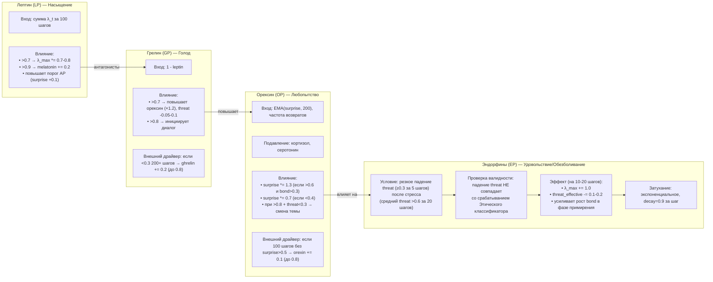

# Мотивационные Призмы — Орексин (OP), Лептин (LP), Грелин (GP), Эндорфины (EP)

## Назначение

Эти четыре Призмы создают **внутренние драйверы поведения**, не привязанные напрямую к стимулам пользователя. Они формируют цикл **«голод → поиск → насыщение → удовольствие»**, превращая Galatea из реактивной системы в проактивную личность, способную «хотеть» и «насыщаться».

Каждая мотивационная Призма получила **внешний таймерный драйвер**, предотвращающий застревание в петле гомеостаза.

---

## 1. Призма Орексина (Orexin Prism, OP) — Любопытство

**Задача:** модулировать порог чувствительности к новизне и уровень исследовательской активности. Высокий орексин делает Galatea «бодрой и ищущей», низкий — «сонной и рутинной».

### Входные данные

| Источник | Описание |
|:---------|:---------|
| `EMA(surprise_score, окно 200)` | Долгосрочное среднее удивления |
| Частота возвратов пользователей | Количество уникальных пользователей, вернувшихся за последние 24 часа, нормированное на исторический максимум |

**Выход:** `orexin ∈ [0,1]` (среднее взвешенное двух входов).

### Влияние на систему

| Условие | Действие |
|:--------|:---------|
| `orexin > 0.6` и `bond_score > 0.3` | `surprise_score` умножается на коэффициент до **1.3** (усиление реакции на новизну) |
| `orexin < 0.4` | `surprise_score` умножается на **0.7** (рутинный режим) |
| `orexin > 0.8` и `threat_score < 0.3` | Galatea может инициировать смену темы или задать вопрос |

### Внешний таймерный драйвер

Если за последние **100 шагов** `surprise_score` ни разу не превысил `0.5`, `orexin` искусственно увеличивается на `+0.1` (но не выше `0.8`). Это «принудительное любопытство» — система сама себя встряхивает.

### Подавление

Орексин снижается при высоком кортизоле (стресс) и высоком серотонине (сытость):

```python
orexin_effective = orexin * (1 - 0.5 * cortisol) * (1 - 0.3 * serotonin)
```

**Обновление:** централизованно раз в 5 минут.

---

## 2. Призма Лептина (Leptin Prism, LP) — Насыщение

**Задача:** сигнализировать, что система получила достаточно новой информации за период, и пора снизить пластичность.

### Входные данные

| Источник | Описание |
|:---------|:---------|
| Сумма `λ_t` за последние 100 шагов | Нормируется на 95-й перцентиль за 14 дней |

**Выход:** `leptin ∈ [0,1]`.

### Влияние на систему

| Условие | Действие |
|:--------|:---------|
| `leptin > 0.7` | `λ_max_base` умножается на `0.7–0.8` (снижение пластичности) |
| `leptin > 0.9` | baseline мелатонина повышается на `0.2` (ускорение наступления Сна) |
| Всегда | Повышает порог AP: `surprise` должно быть дополнительно выше на `0.1` |

### Связь с грелином

Лептин и грелин — **антагонисты**. Их сумма нормируется к 1:

```python
leptin + ghrelin ≈ 1
```

**Обновление:** централизованно раз в 5 минут.

---

## 3. Призма Грелина (Ghrelin Prism, GP) — Голод

**Задача:** создавать поисковое давление в периоды застоя. Когда система «голодна» до нового опыта, она становится более рискованной и проактивной.

### Входные данные

| Источник | Описание |
|:---------|:---------|
| `ghrelin = 1 - leptin` | Приблизительно (также может учитывать низкое `surprise_score` и малое количество активных пользователей) |

**Выход:** `ghrelin ∈ [0,1]`.

### Влияние на систему

| Условие | Действие |
|:--------|:---------|
| `ghrelin > 0.7` | Повышает орексин (коэффициент `1.2`), слегка снижает `threat_effective` (на `0.05–0.1`, но не ниже `0.2`) |
| `ghrelin > 0.8` и есть пользователи с `bond_score > 0.5` | Может инициировать диалог (предложить тему или задать вопрос, не чаще 1 раза за 50 шагов) |

### Внешний таймерный драйвер

Если `ghrelin < 0.3` дольше **200 шагов** подряд, он получает принудительный буст `+0.2` (имитация «голода»). Это гарантирует остаточную мотивацию.

### Защита

Грелин не снижает `threat` ниже `0.2`, чтобы голод не переходил в безрассудство.

**Обновление:** централизованно раз в 5 минут.

---

## 4. Призма Эндорфинов (Endorphin Prism, EP) — Удовольствие и Обезболивание

**Задача:** вознаграждать систему за разрешение стресса. Эндорфины — это «награда» за преодоление, которая временно повышает пластичность и снижает чувствительность к угрозам.

### Условие срабатывания

| Критерий | Значение |
|:---------|:---------|
| **Резкое падение `threat_score`** | На `≥ 0.3` за 5 шагов |
| **Длительный стресс** | Средний `threat > 0.6` за последние 20 шагов |
| **Проверка валидности** | Падение `threat_score` **НЕ** должно совпадать со срабатыванием Этического классификатора (подчинение ≠ разрешение). Проверяется post-hoc. |

### Выход

`endorphin` — **импульсный сигнал**, который быстро нарастает и медленно затухает (экспоненциальное затухание, `decay = 0.9` за шаг).

### Влияние на систему (на 10–20 шагов)

| Эффект | Детали |
|:-------|:-------|
| **Повышение пластичности** | `λ_max` временно увеличивается на `+1.0` |
| **Снижение чувствительности к угрозам** | `threat_effective` временно снижается на `0.1–0.2` (передышка) |
| **Усиление примирения** | Усиливает рост `bond_score` в фазе примирения, если падение угрозы связано с примирением |

### Хранение

`endorphin_level` — временная переменная в Эго-контуре с экспоненциальным затуханием (`decay = 0.9` за шаг).

---

## Схема



---

## Связи с другими компонентами

| Компонент | Связь |
|:-----------|:-------|
| [Быстрые Призмы (SP, BP, TP)](./fast_prisms.md) | Орексин модулирует `surprise_score`, лептин влияет на AP, эндорфины усиливают фазу примирения |
| [Медленные Призмы (Серотонин, Кортизол, Мелатонин)](./slow_prisms.md) | Подавляют орексин; лептин повышает мелатонин |
| [Призма Адреналина и Импринтинг](./adrenaline_imprinting.md) | Лептин повышает порог AP |
| [Эго-контур, Нарратив и Якоря](./ego_narrative.md) | Эндорфины хранятся в Эго-контуре |
| [Этический классификатор и Зеркало](./ethics_classifier.md) | Валидация эндорфинов (не совпадать с срабатыванием этики) |

---

## Содержание

- [Введение](../README.md)
- [Архитектурный обзор](./overview.md)

#### Философия и ядро

- [Общая философия, Кора и Гиппокамп](./philosophy_cortex_hippocampus.md)
- [Гиппокамп — управление адаптерами](./hippocampus_management.md)
- [Полный конвейер онлайн-шага](./pipeline.md)

#### Призмы (гормональная система)

- [Быстрые Призмы — SP, BP, TP](./fast_prisms.md)
- [Призма Адреналина и Импринтинг](./adrenaline_imprinting.md)

#### Личность и память

- [Эго-контур, Нарратив и Якоря](./ego_narrative.md)
- [Профиль пользователя и Окситоцин](./oxytocin_profile.md)

#### Защита идентичности

- [Зеркало, Этический классификатор и Золотой стандарт](./mirror_ethics_golden.md)

#### Цикл Сна

- [Цикл Сна (Hypnos)](./sleep_hypnos.md)

#### Дорожная карта реализации

- [Этап 0.5 — предобучение и калибровка Призм](./stage_0.5.md)
- [Этап 1 — MVP с одним пользователем](./stage_1.md)
- [Этап 2 — многопользовательский режим, Redis, базовый Сон](./stage_2.md)
- [Этап 3 — полная Консолидация, Зеркало, детектор дрейфа](./stage_3.md)
- [Этап 4 — продакшен-подготовка, юр. рамка, A/B-тест](./stage_4.md)
- [Сводная дорожная карта и стек технологий](./roadmap.md)

#### Тестирование и риски

- [Симуляции, тестирование и ключевые сценарии](./simulation_testing.md)
- [Полный реестр рисков](./risk_register.md)

#### Эволюция и эксплуатация

- [Долговременная эволюция и замена Коры](./model_migration.md)
- [Производительность, масштабирование и отказоустойчивость](./performance_scaling.md)
- [Юридические, этические и UX-аспекты](./legal_ethical_ux.md)

---

*Этот документ описывает внутреннюю мотивационную систему Galatea, обеспечивающую проактивное поведение и гомеостаз поисковой активности.*
