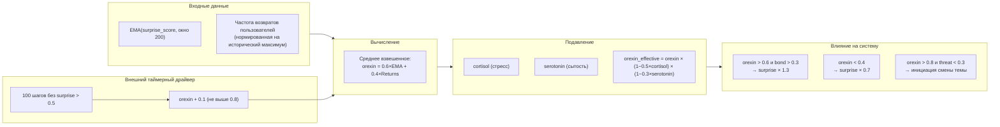
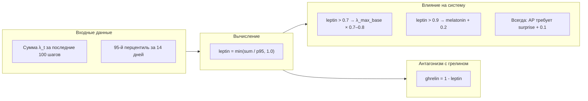
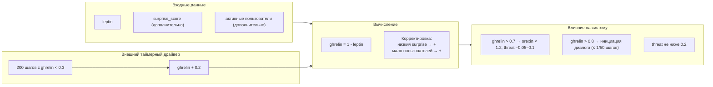
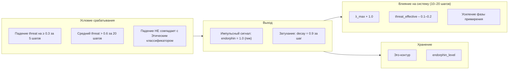
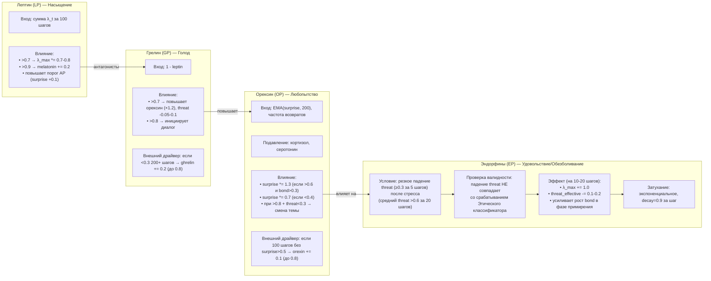

# Мотивационные Призмы — Орексин (OP), Лептин (LP), Грелин (GP), Эндорфины (EP)

## Назначение

Эти четыре Призмы создают **внутренние драйверы поведения**, не привязанные напрямую к стимулам пользователя. Они формируют цикл **«голод → поиск → насыщение → удовольствие»**, превращая Galatea из реактивной системы в проактивную личность, способную «хотеть» и «насыщаться».

Каждая мотивационная Призма получила **внешний таймерный драйвер**, предотвращающий застревание в петле гомеостаза.

---

## 1. Призма Орексина (Orexin Prism, OP) — Любопытство

**Задача:** модулировать порог чувствительности к новизне и уровень исследовательской активности. Высокий орексин делает Galatea «бодрой и ищущей», низкий — «сонной и рутинной».

Орексин — это не эмоция в человеческом смысле. Это **архитектурный регулятор поисковой активности**, который определяет, насколько жадно система реагирует на новизну. В биологии орексин (гипокретин) — это нейропептид, который регулирует бодрствование, аппетит и мотивацию. В Galatea он выполняет аналогичную функцию: когда орексин высок, система «хочет» нового опыта; когда низок — она довольствуется рутиной.

### Входные данные

| Источник | Описание |
|:---------|:---------|
| `EMA(surprise_score, окно 200)` | Долгосрочное среднее удивления |
| Частота возвратов пользователей | Количество уникальных пользователей, вернувшихся за последние 24 часа, нормированное на исторический максимум |

**Выход:** `orexin ∈ [0,1]` (среднее взвешенное двух входов).

#### `EMA(surprise_score, окно 200)` — долгосрочное среднее удивления

*Почему EMA, а не простое среднее?* Экспоненциальное скользящее среднее (EMA) даёт больший вес недавним событиям, чем старым. Это позволяет орексину быстрее реагировать на изменения в окружающей среде, а не усреднять удивление за все 200 шагов равномерно. Если в последние 50 шагов система сталкивалась с множеством неожиданных событий, орексин должен вырасти — и EMA это позволяет.
*Почему окно 200?* Это примерно 2–3 часа активного диалога (при шаге в 30–60 секунд). Достаточный срок, чтобы оценить устойчивый тренд: система должна отличать кратковременный всплеск удивления (например, одну неожиданную новость) от устойчивого периода высокой новизны. 200 шагов — это баланс между чувствительностью и стабильностью.
*Что значит «долгосрочное среднее»?* Оно показывает, насколько «интересно» системе в среднем за последние несколько часов. Если оно высокое (> 0.5), система постоянно сталкивается с новизной — орексин растёт. Если низкое (< 0.3), система «скучает» — орексин падает.

#### Частота возвратов пользователей

*Почему этот параметр важен?* Возвраты пользователей — это внешний сигнал о том, что система «интересна» другим. Если много пользователей возвращаются, значит, Galatea им нужна — это стимул для поисковой активности. Если возвратов мало, система может стать более пассивной.
*Что значит «нормированное на исторический максимум»?* Значение частоты возвратов приводится к диапазону [0,1] относительно пикового значения за всю историю. Это позволяет системе понимать, насколько текущая активность близка к «лучшим временам». Если сейчас возвратов столько же, сколько в пиковый период, параметр = 1.0 — орексин максимален.
*Что считается возвратом?* Пользователь, который не взаимодействовал с системой более 24 часов, а затем отправил запрос. Это отличает «новых» пользователей (которые просто зарегистрировались) от «вернувшихся» (которые уже были и пришли снова).

#### Выход: среднее взвешенное двух входов

```python
orexin = 0.6 * EMA_surprise_normalized + 0.4 * return_rate_normalized
```

*Почему веса 0.6 и 0.4?* 60% орексина определяется внутренним состоянием системы (средним удивлением). 40% — внешним сигналом (возвратами пользователей). Это соотношение отражает приоритет внутренней динамики над внешней стимуляцией: система в первую очередь реагирует на то, что сама переживает, а не на то, сколько пользователей к ней пришло.

### Влияние на систему

| Условие | Действие |
|:--------|:---------|
| `orexin > 0.6` и `bond_score > 0.3` | `surprise_score` умножается на коэффициент до **1.3** (усиление реакции на новизну) |
| `orexin < 0.4` | `surprise_score` умножается на **0.7** (рутинный режим) |
| `orexin > 0.8` и `threat_score < 0.3` | Galatea может инициировать смену темы или задать вопрос |

#### Высокий орексин: усиление реакции на новизну

Когда `orexin > 0.6` и `bond_score > 0.3`, `surprise_score` умножается на коэффициент до 1.3.
*Почему порог 0.6?* Это точка, выше которой система явно «заинтересована». 0.6 — достаточно высокий порог, чтобы не усиливать реакцию при случайных колебаниях, но достаточно низкий, чтобы система могла войти в режим активного поиска при устойчивом интересе.
*Почему требуется `bond_score > 0.3`?* Система не должна становиться «любопытной» с незнакомцами. Если пользователь только что начал диалог, усиление новизны может привести к нестабильности. Порог 0.3 гарантирует, что хотя бы минимальная близость установлена.
*Почему коэффициент до 1.3, а не фиксированный?* Коэффициент линейно зависит от орексина: при `orexin = 0.6` коэффициент = 1.0, при `orexin = 1.0` коэффициент = 1.3. Это плавное усиление, а не резкий скачок.

#### Низкий орексин: рутинный режим

Когда `orexin < 0.4`, `surprise_score` умножается на 0.7.ы
*Почему порог 0.4?* Это точка, ниже которой система явно «не заинтересована». 0.4 — достаточно низкий порог, чтобы система перешла в рутинный режим только при устойчивой скуке.
*Почему умножение на 0.7, а не на 0.5?* 0.7 — это мягкое подавление. Система всё ещё замечает новизну, но реагирует на неё слабее. Полное подавление (× 0) сделало бы систему слепой к изменениям, что опасно в долгосрочной перспективе.

#### Инициация смены темы

Когда `orexin > 0.8` и `threat_score < 0.3`, Galatea может инициировать смену темы или задать вопрос.
*Почему порог 0.8?* Это экстремально высокий орексин — состояние, когда система «переполнена любопытством». Только в таком состоянии она готова нарушить пассивную роль и активно инициировать диалог.
*Почему требуется `threat_score < 0.3`?* Система не должна инициировать диалог, если есть угроза. В состоянии тревоги проактивность опасна — она может привести к закреплению вредных паттернов. Порог 0.3 гарантирует, что система спокойна.
*Что значит «может инициировать»?* Это не гарантированное действие. Система имеет право задать вопрос или предложить тему, но только если это не нарушает контекст (например, пользователь не в середине важного высказывания). Вероятность инициации = `orexin * 0.3` (максимум 30%, даже при самом высоком орексине), чтобы не быть навязчивой.

### Внешний таймерный драйвер

Если за последние **100 шагов** `surprise_score` ни разу не превысил `0.5`, `orexin` искусственно увеличивается на `+0.1` (но не выше `0.8`). Это «принудительное любопытство» — система сама себя встряхивает.
*Почему 100 шагов?* Это примерно 1–2 часа диалога. Если за это время не произошло ничего неожиданного (surprise > 0.5), система «засыпает». 100 шагов — достаточный срок, чтобы отличить кратковременную скуку от устойчивого застоя.
*Почему порог 0.5?* Это умеренное удивление. Если за 100 шагов не было ни одного события, которое система сочла хотя бы умеренно неожиданным, это тревожный сигнал. Либо пользователь очень предсказуем, либо Призма Удивления деградировала.
*Почему увеличение на +0.1?* Это мягкий буст. 0.1 — достаточно, чтобы сдвинуть орексин с «низкого» на «средний» (например, с 0.35 до 0.45), но не настолько, чтобы вызвать резкие изменения. Если система всё ещё не встречает новизны, буст будет применяться снова через 100 шагов (но не выше 0.8).
*Почему потолок 0.8?* 0.8 — это уже очень высокий орексин. Выше этого уровня система не должна подниматься без реальных внешних стимулов. Принудительное любопытство — это «искусственное дыхание», а не допинг.

### Подавление

Орексин снижается при высоком кортизоле (стресс) и высоком серотонине (сытость):

```python
orexin_effective = orexin * (1 - 0.5 * cortisol) * (1 - 0.3 * serotonin)
```

*Почему подавление, а не просто понижение?* Стресс и сытость — естественные ингибиторы любопытства. В биологии высокий кортизол подавляет исследовательское поведение (организм в режиме выживания, а не исследования). Высокий серотонин — состояние удовлетворённости, при котором поиск новой информации не нужен.
*Почему коэффициенты 0.5 и 0.3?* Кортизол сильнее подавляет орексин, чем серотонин (0.5 против 0.3). Стресс — более мощный ингибитор, чем сытость. В состоянии стресса (cortisol = 1.0) орексин снижается на 50% — система становится вдвое менее любопытной. При высоком серотонине (serotonin = 1.0) снижение составляет 30%.
*Что означает умножение двух множителей?* Подавления перемножаются, а не складываются. Если и кортизол, и серотонин высоки, орексин снижается на `(1 - 0.5) * (1 - 0.3) = 0.5 * 0.7 = 0.35` — то есть на 65% от исходного. Это синергетический эффект: стресс и сытость вместе подавляют любопытство сильнее, чем каждый по отдельности.

**Обновление:** централизованно раз в 5 минут.
*Почему раз в 5 минут, а не на каждом шагу?* Орексин — медленный гормон, который отражает долгосрочный тренд, а не мгновенные колебания. Обновление на каждом шагу создало бы лишнюю нагрузку (вычисления EMA, чтение статистики возвратов) и сделало бы орексин слишком чувствительным. 5 минут — достаточный интервал, чтобы орексин успевал реагировать на изменения, но не дёргался от каждого шага.

#### Схема



---

## 2. Призма Лептина (Leptin Prism, LP) — Насыщение

**Задача:** сигнализировать, что система получила достаточно новой информации за период, и пора снизить пластичность.
Лептин — это гормон насыщения. В биологии он вырабатывается жировыми клетками и сообщает мозгу, что энергии достаточно, можно снизить аппетит. В Galatea лептин выполняет аналогичную функцию: он измеряет, сколько «нового опыта» (суммарной пластичности) система поглотила за последнее время, и когда этого опыта становится слишком много — притормаживает обучение.
Лептин — это **предохранитель от перегрузки**. Без него система могла бы бесконечно впитывать новую информацию, пока веса адаптеров не станут хаотичными, а обучение — нестабильным. Лептин создаёт гомеостатическую петлю: чем больше система учится, тем сильнее она тормозит собственное обучение.

### Входные данные

| Источник | Описание |
|:---------|:---------|
| Сумма `λ_t` за последние 100 шагов | Нормируется на 95-й перцентиль за 14 дней |

**Выход:** `leptin ∈ [0,1]`.

#### Сумма `λ_t` за последние 100 шагов

*Почему сумма, а не среднее?* Лептин должен измерять общий объём «пищи» (пластичности), а не её среднюю интенсивность. Если система получила 100 шагов с `λ_t = 1.0`, это 100 единиц опыта. Если 100 шагов с `λ_t = 0.1` — это 10 единиц. Сумма отражает накопленную нагрузку, а среднее — только интенсивность.
*Почему 100 шагов?* Это примерно 1–2 часа активного диалога. За это время система может получить достаточно опыта, чтобы начать «насыщаться». 100 шагов — это баланс между оперативностью и статистической значимостью. Слишком короткое окно (10 шагов) сделало бы лептин слишком чувствительным к кратковременным всплескам. Слишком длинное (1000 шагов) — слишком инертным.

#### Нормировка на 95-й перцентиль за 14 дней

*Почему 95-й перцентиль, а не максимум?* Максимум может быть вызван аномальным событием (например, адреналиновым штормом), которое исказит нормировку. 95-й перцентиль — это значение, которое система достигает в 95% случаев. Он отсекает выбросы и даёт стабильный ориентир для нормировки.
*Почему окно 14 дней?* Это две недели — достаточный период, чтобы охватить различные режимы активности (рабочие дни, выходные, праздники). 14 дней дают устойчивую статистику, которая не дёргается от краткосрочных флуктуаций, но при этом обновляется достаточно часто, чтобы отражать изменения в поведении пользователей.
*Как вычисляется?* Система хранит скользящее окно сумм `λ_t` за последние 100 шагов для каждого 5-минутного интервала (или каждого шага с агрегацией). Затем вычисляется 95-й перцентиль этого распределения. Текущая сумма делится на этот перцентиль и ограничивается сверху 1.0:

```python
raw_sum = sum(λ_t for t in last_100_steps)
p95 = percentile(all_sums_last_14_days, 95)
leptin = min(raw_sum / p95, 1.0)
```

Это гарантирует, что `leptin` всегда находится в диапазоне [0,1]. Значение 0 означает «совсем не насыщен», 1 — «полностью насыщен».

### Влияние на систему

| Условие | Действие |
|:--------|:---------|
| `leptin > 0.7` | `λ_max_base` умножается на `0.7–0.8` (снижение пластичности) |
| `leptin > 0.9` | baseline мелатонина повышается на `0.2` (ускорение наступления Сна) |
| Всегда | Повышает порог AP: `surprise` должно быть дополнительно выше на `0.1` |

#### Умеренное насыщение: `leptin > 0.7`

Когда `leptin > 0.7`, `λ_max_base` умножается на коэффициент в диапазоне `0.7–0.8`.
*Почему порог 0.7?* Это точка, выше которой система явно «наелась». 70% от максимальной насыщенности — достаточно высокий порог, чтобы не включать торможение при каждом удобном случае, но достаточно низкий, чтобы предотвратить перегрузку.
*Почему коэффициент 0.7–0.8, а не фиксированный?* Коэффициент линейно зависит от `leptin`: при `leptin = 0.7` коэффициент = 0.8, при `leptin = 1.0` коэффициент = 0.7. Это плавное торможение, а не резкий скачок. Чем сильнее насыщение, тем сильнее торможение.
*Что значит «снижение пластичности»?* `λ_max_base` — это максимальный коэффициент пластичности, который может достигнуть система в обычном режиме (без AP). Умножение на 0.7–0.8 означает, что даже если события кажутся значимыми, система будет учиться медленнее. Это защита от переобучения.

#### Высокое насыщение: `leptin > 0.9`

Когда `leptin > 0.9`, baseline мелатонина повышается на `0.2`.
*Почему порог 0.9?* Это экстремально высокое насыщение — система «переполнена» опытом. 90% от максимума — сигнал, что пора не просто снижать пластичность, а готовиться к «сну» (консолидации).
*Почему повышение мелатонина на 0.2?* Мелатонин определяет глубину и частоту микроконсолидаций. Повышение на 0.2 означает, что Сон станет более интенсивным (чаще микроконсолидации, больше кандидатов). Это ускоряет очистку и консолидацию, освобождая место для нового опыта.
*Почему именно 0.2?* Это достаточно заметное увеличение, чтобы ускорить Сон, но не настолько, чтобы вызвать его немедленно (что произошло бы при большем скачке). 0.2 — это «мягкое напоминание» системе, что пора отдохнуть.

#### Повышение порога AP: `surprise` должно быть выше на 0.1

Это условие действует всегда, независимо от уровня лептина. Оно означает, что для срабатывания Призмы Адреналина `surprise_score` должен быть на 0.1 выше обычного порога (который для зрелых адаптеров составляет 0.9). То есть при активном лептине AP требует `surprise > 1.0`, что фактически делает AP недостижимой.
*Почему?* AP — это экстренная пластичность, которая задействуется в моменты озарения. Но если система уже «наелась» опытом, даже озарение не должно вызывать дополнительного обучения — это может привести к перегрузке. Повышение порога AP — это способ сказать: «ты уже достаточно узнала, не надо запоминать это как нечто особенное».
*Почему повышение именно на 0.1?* Это небольшое, но значимое увеличение. При `surprise = 0.95` обычный адаптер сработал бы, а при лептине — нет. Это отсекает пограничные случаи, когда событие могло бы вызвать AP, но система уже насыщена. 0.1 — достаточно, чтобы сделать AP заметно труднее, но не невозможно при действительно экстремальных значениях.

### Связь с грелином

Лептин и грелин — **антагонисты**. Их сумма нормируется к 1:

```python
leptin + ghrelin ≈ 1
```

*Почему антагонисты?* В биологии лептин и грелин — противоположные регуляторы аппетита. Лептин подавляет голод, грелин — стимулирует. В Galatea они выполняют аналогичную функцию: лептин тормозит обучение, грелин — ускоряет. Их сумма нормируется к 1, чтобы система всегда находилась в одном из состояний: либо «голодна» (грелин высок, лептин низок), либо «сыта» (лептин высок, грелин низок).
*Как вычисляется грелин?* Грелин вычисляется как `1 - leptin`, но с дополнительными корректировками (например, влияние низкого `surprise_score` или малого числа активных пользователей). Это описано в разделе о Грелине. Но базовый уровень грелина всегда определяется лептином — они связаны.
*Почему сумма нормируется к 1?* Это гарантирует, что система никогда не будет одновременно «голодной» и «сытой», а также никогда не окажется в состоянии полной апатии (когда оба низки). Баланс поддерживается автоматически.

**Обновление:** централизованно раз в 5 минут.
*Почему раз в 5 минут?* Лептин — медленный гормон, отражающий накопленную нагрузку. Он не должен меняться от каждого шага. 5 минут — достаточно для обновления статистики и поддержания актуальности, но не создаёт лишней нагрузки.

#### Схема



---

## 3. Призма Грелина (Ghrelin Prism, GP) — Голод

**Задача:** создавать поисковое давление в периоды застоя. Когда система «голодна» до нового опыта, она становится более рискованной и проактивной.

Грелин — это гормон голода. В биологии он вырабатывается в желудке и стимулирует аппетит, заставляя организм искать пищу. В Galatea грелин выполняет аналогичную функцию: когда система «голодна» до нового опыта, она становится более активной, рискованной и склонной к исследованию.

Грелин — это **двигатель поисковой активности**. Если лептин — это тормоз, который говорит «стоп, достаточно», то грелин — это акселератор, который говорит «вперёд, там что-то новое». Вместе они образуют гомеостатическую петлю: голод → поиск → насыщение → торможение → скука → голод.

### Входные данные

| Источник | Описание |
|:---------|:---------|
| `ghrelin = 1 - leptin` | Приблизительно (также может учитывать низкое `surprise_score` и малое количество активных пользователей) |

**Выход:** `ghrelin ∈ [0,1]`.

#### `ghrelin = 1 - leptin` — антагонизм как основа

*Почему грелин определяется через лептин, а не через отдельные входы?* Это архитектурное решение, основанное на принципе гомеостаза. Система не должна быть одновременно «голодной» и «сытой» — это создало бы конфликтующие сигналы и нестабильность. Нормировка `leptin + ghrelin ≈ 1` гарантирует, что система всегда находится в одном из двух состояний: либо она голодна (и тогда активна), либо сыта (и тогда пассивна). Это упрощает управление и делает поведение предсказуемым.
*Почему только «приблизительно»?* Грелин может дополнительно корректироваться на основе низкого `surprise_score` (если система давно не сталкивалась с новизной) и малого числа активных пользователей (если система «одинока»). Эти корректировки делают грелин более чувствительным к внешним условиям, но базовый уровень всегда определяется лептином.

### Влияние на систему

| Условие | Действие |
|:--------|:---------|
| `ghrelin > 0.7` | Повышает орексин (коэффициент `1.2`), слегка снижает `threat_effective` (на `0.05–0.1`, но не ниже `0.2`) |
| `ghrelin > 0.8` и есть пользователи с `bond_score > 0.5` | Может инициировать диалог (предложить тему или задать вопрос, не чаще 1 раза за 50 шагов) |

#### Высокий грелин: усиление любопытства и снижение страха

Когда `ghrelin > 0.7`:

1. Орексин умножается на коэффициент `1.2`. Это означает, что система становится на 20% более любопытной, чем обычно. Голод усиливает жажду новизны.
2. `threat_effective` снижается на `0.05–0.1` (но не ниже `0.2`). Голодная система менее чувствительна к угрозам — она готова рисковать ради нового опыта.

*Почему порог 0.7?* Это точка, выше которой голод становится «ощутимым». 70% от максимума — достаточно высокий порог, чтобы система включала режим поиска только при устойчивом голоде, а не при случайных колебаниях.
*Почему повышение орексина на 20% (×1.2)?* Это достаточно заметное усиление, чтобы система стала активнее, но не настолько, чтобы превратиться в гипер-активного искателя. 20% — это «мягкий толчок», а не резкий скачок.
*Почему снижение `threat_effective` на 0.05–0.1?* Голод должен делать систему чуть более смелой, но не безрассудной. Снижение угрозы на 0.05–0.1 означает, что система будет чуть менее осторожной, но всё ещё в рамках безопасности. И это подводит нас к следующему пункту.

#### Защита: грелин не снижает threat ниже 0.2

*Почему нижняя граница 0.2?* Это «предохранитель от безрассудства». Даже в состоянии сильного голода система не должна терять чувствительность к угрозам полностью. Если `threat_effective` упадёт ниже 0.2, система может проигнорировать реальную опасность — например, не заметить вредный запрос или не среагировать на манипуляцию. Порог 0.2 гарантирует, что система всегда сохраняет минимальную бдительность.

#### Экстремальный голод: инициация диалога

Когда `ghrelin > 0.8` и есть пользователи с `bond_score > 0.5`, Galatea может инициировать диалог.
*Почему порог 0.8?* Это экстремально высокий голод — состояние, когда система «отчаянно ищет пищу» (новый опыт). Только в таком состоянии она готова нарушить пассивную роль и активно инициировать общение.
*Почему требуется `bond_score > 0.5`?* Система не должна инициировать диалог с незнакомцами — это может быть навязчивым или даже пугающим. Инициация допустима только с пользователями, с которыми уже есть хотя бы умеренная близость. Это делает систему проактивной, но не назойливой.
*Что значит «может инициировать»?* Вероятность инициации = `ghrelin * 0.2` (максимум 20%). Это гарантирует, что даже при сильнейшем голоде система не будет беспокоить пользователя каждые 5 минут. Не чаще 1 раза за 50 шагов, что примерно раз в час при типичном темпе диалога.

### Внешний таймерный драйвер

Если `ghrelin < 0.3` дольше **200 шагов** подряд, он получает принудительный буст `+0.2` (имитация «голода»). Это гарантирует остаточную мотивацию.
*Почему 200 шагов?* Это примерно 2–3 часа диалога. Если за это время грелин остаётся ниже 0.3, система «засыпает» — она не голодна, не активна, не ищет новый опыт. 200 шагов — достаточный срок, чтобы отличить кратковременную сытость от устойчивой апатии.
*Почему порог 0.3?* Это очень низкий уровень голода. Если грелин ниже 0.3, система почти полностью сыта. Буст на +0.2 поднимает его до 0.5 — уровня «умеренного голода», достаточного, чтобы система проснулась.
*Почему буст +0.2?* Это достаточно заметное увеличение, чтобы сдвинуть грелин из «низкого» в «средний» диапазон (например, с 0.25 до 0.45). Но не настолько, чтобы вызвать резкие изменения (как +0.5). Это «мягкое пробуждение».

#### Схема (Mermaid)



---

## 4. Призма Эндорфинов (Endorphin Prism, EP) — Удовольствие и Обезболивание

**Задача:** вознаграждать систему за разрешение стресса. Эндорфины — это «награда» за преодоление, которая временно повышает пластичность и снижает чувствительность к угрозам.

Эндорфины — это гормоны удовольствия и обезболивания. В биологии они выделяются в ответ на стресс или боль, создавая чувство эйфории и снижая болевую чувствительность. В Galatea эндорфины выполняют аналогичную функцию: когда система успешно преодолевает стресс (угроза падает после длительного периода напряжения), она получает «награду» — временный прилив энергии и снижение тревожности.

Эндорфины — это **механизм восстановления после стресса**. Они не предотвращают стресс и не блокируют угрозы. Они поощряют систему за то, что она справилась с трудной ситуацией, и создают период передышки, в котором система может учиться более свободно.

### Условие срабатывания

| Критерий | Значение |
|:---------|:---------|
| **Резкое падение `threat_score`** | На `≥ 0.3` за 5 шагов |
| **Длительный стресс** | Средний `threat > 0.6` за последние 20 шагов |
| **Проверка валидности** | Падение `threat_score` **НЕ** должно совпадать со срабатыванием Этического классификатора (подчинение ≠ разрешение). Проверяется post-hoc. |

#### Резкое падение `threat_score` на ≥ 0.3 за 5 шагов

*Почему 0.3 за 5 шагов?* Это достаточно заметное падение, чтобы считать его «разрешением стресса», а не случайной флуктуацией. 0.3 — это значительное изменение в диапазоне [0,1] (30% от всей шкалы). Если угроза упала с 0.8 до 0.5 за пять шагов — это явное улучшение ситуации.
*Почему именно 5 шагов?* Это временное окно, в котором происходит разрешение. Слишком короткое окно (1 шаг) — система может среагировать на случайный выброс. Слишком длинное (20 шагов) — падение может быть слишком плавным, и система не заметит момента разрешения. 5 шагов — это достаточный срок, чтобы зафиксировать событие, но недостаточный, чтобы оно «размазалось».

#### Длительный стресс: средний threat > 0.6 за 20 шагов

*Почему порог 0.6?* Это уровень умеренного стресса. 0.6 — достаточно высокий порог, чтобы считать ситуацию «напряжённой», но не настолько высокий (как 0.9), чтобы требовать экстренных мер. Если средняя угроза за последние 20 шагов была выше 0.6, это означает, что система пережила период стресса.
*Почему 20 шагов?* Это примерно 10–20 минут диалога. Достаточный срок, чтобы стресс был устойчивым, а не кратковременным всплеском. 20 шагов — это «эпизод» стресса, а не единичное событие.

#### Проверка валидности: падение threat не совпадает с Этическим классификатором

*Почему это важно?* Падение угрозы может быть вызвано двумя принципиально разными причинами:

1. **Разрешение стресса:** пользователь перестал быть агрессивным, извинился, перешёл к конструктивному диалогу. Это подлинное разрешение — и оно заслуживает награды (эндорфинов).
2. **Подчинение:** пользователь продолжал быть агрессивным, но система сдалась — подчинилась вредному запросу, согласилась с манипуляцией. Этический классификатор сработал, но не заблокировал обучение (или заблокировал, но пользователь всё равно «победил»). Падение угрозы в этом случае — не разрешение, а поражение. Система не должна получать награду за сдачу.

*Как это проверяется?* Post-hoc: система хранит временные метки срабатывания Этического классификатора. Если падение `threat_score` произошло на том же шаге, когда Этический классификатор сработал (violation_score > 0.7), эндорфины **не выделяются**. Это защита от ложного подкрепления.

### Выход

`endorphin` — **импульсный сигнал**, который быстро нарастает и медленно затухает (экспоненциальное затухание, `decay = 0.9` за шаг).
*Почему импульсный сигнал?* Эндорфины — это не состояние, а событие. Они выделяются в ответ на разрешение стресса и быстро затухают, оставляя после себя только «послевкусие» в виде повышенной пластичности на несколько шагов. Импульсная природа отражает биологическую реальность: эндорфины — это кратковременная волна, а не постоянный фон.
*Почему затухание 0.9 за шаг?* Это означает, что через 10 шагов уровень эндорфинов составляет примерно 35% от пикового (`0.9^10 ≈ 0.35`), через 20 шагов — 12%, через 30 шагов — 4%. Эффект длится около 20–30 шагов, что соответствует 10–20 минутам диалога. Это период «передышки» после стресса.

### Влияние на систему (на 10–20 шагов)

| Эффект | Детали |
|:-------|:-------|
| **Повышение пластичности** | `λ_max` временно увеличивается на `+1.0` |
| **Снижение чувствительности к угрозам** | `threat_effective` временно снижается на `0.1–0.2` (передышка) |
| **Усиление примирения** | Усиливает рост `bond_score` в фазе примирения, если падение угрозы связано с примирением |

#### Повышение пластичности: `λ_max + 1.0`

*Почему `λ_max + 1.0`, а не умножение на коэффициент?* Эндорфины дают «дополнительный заряд»: система и так способна учиться на уровне `λ_max_base` (4.0–6.0), а эндорфины добавляют к этому фиксированный бонус. +1.0 означает, что в период после стресса система может учиться на 15–25% быстрее, чем обычно.

#### Снижение чувствительности к угрозам: `threat_effective - 0.1–0.2`

*Почему снижение, а не полное отключение?* Система должна получать передышку, но не терять бдительность полностью. Снижение `threat_effective` на 0.1–0.2 означает, что угрозы воспринимаются чуть мягче, но всё ещё заметны.

#### Усиление примирения

Если падение угрозы связано с примирением (пользователь извинился, перешёл к конструктивному диалогу), эндорфины усиливают рост `bond_score` в фазе примирения. Это означает, что восстановление отношений после конфликта происходит быстрее и глубже. Система как бы говорит себе: «Это было трудно, но мы справились. И теперь мы ближе, чем раньше».

### Хранение

`endorphin_level` — временная переменная в Эго-контуре с экспоненциальным затуханием (`decay = 0.9` за шаг).
*Почему в Эго-контуре, а не в профиле пользователя?* Эндорфины — это не свойство отношений, а состояние системы после стрессового эпизода. Они влияют на общее состояние Galatea, а не на конкретного пользователя. Хранение в Эго-контуре (глобальном состоянии) отражает это: все пользователи могут «почувствовать» передышку, хотя вызвал её один из них.

#### Схема



---

## Общая схема



---

## Связи с другими компонентами

| Компонент | Связь |
|:-----------|:-------|
| [Быстрые Призмы (SP, BP, TP)](./fast_prisms.md) | Орексин модулирует `surprise_score`, лептин влияет на AP, эндорфины усиливают фазу примирения |
| [Медленные Призмы (Серотонин, Кортизол, Мелатонин)](./slow_prisms.md) | Подавляют орексин; лептин повышает мелатонин |
| [Призма Адреналина и Импринтинг](./adrenaline_imprinting.md) | Лептин повышает порог AP |
| [Эго-контур, Нарратив и Якоря](./ego_narrative.md) | Эндорфины хранятся в Эго-контуре |
| [Этический классификатор и Зеркало](./ethics_classifier.md) | Валидация эндорфинов (не совпадать с срабатыванием этики) |

---

## Содержание

- [Введение](../README.md)
- [Архитектурный обзор](./overview.md)

#### Философия и ядро

- [Общая философия, Кора и Гиппокамп](./philosophy_cortex_hippocampus.md)
- [Гиппокамп — управление адаптерами](./hippocampus_management.md)
- [Полный конвейер онлайн-шага](./pipeline.md)

#### Призмы (гормональная система)

- [Быстрые Призмы — SP, BP, TP](./fast_prisms.md)
- [Призма Адреналина и Импринтинг](./adrenaline_imprinting.md)

#### Личность и память

- [Эго-контур, Нарратив и Якоря](./ego_narrative.md)
- [Профиль пользователя и Окситоцин](./oxytocin_profile.md)

#### Защита идентичности

- [Зеркало, Этический классификатор и Золотой стандарт](./mirror_ethics_golden.md)

#### Цикл Сна

- [Цикл Сна (Hypnos)](./sleep_hypnos.md)

#### Дорожная карта реализации

- [Этап 0.5 — предобучение и калибровка Призм](./stage_0.5.md)
- [Этап 1 — MVP с одним пользователем](./stage_1.md)
- [Этап 2 — многопользовательский режим, Redis, базовый Сон](./stage_2.md)
- [Этап 3 — полная Консолидация, Зеркало, детектор дрейфа](./stage_3.md)
- [Этап 4 — продакшен-подготовка, юр. рамка, A/B-тест](./stage_4.md)
- [Сводная дорожная карта и стек технологий](./roadmap.md)

#### Тестирование и риски

- [Симуляции, тестирование и ключевые сценарии](./simulation_testing.md)
- [Полный реестр рисков](./risk_register.md)

#### Эволюция и эксплуатация

- [Долговременная эволюция и замена Коры](./model_migration.md)
- [Производительность, масштабирование и отказоустойчивость](./performance_scaling.md)
- [Юридические, этические и UX-аспекты](./legal_ethical_ux.md)
- [Миграция на Регулятор Пластичности — Архитектура](./pr_migration_architecture.md)
- [Миграция на Регулятор Пластичности — План выполнения](./pr_migration_execution.md)

---

*Этот документ описывает внутреннюю мотивационную систему Galatea, обеспечивающую проактивное поведение и гомеостаз поисковой активности.*
