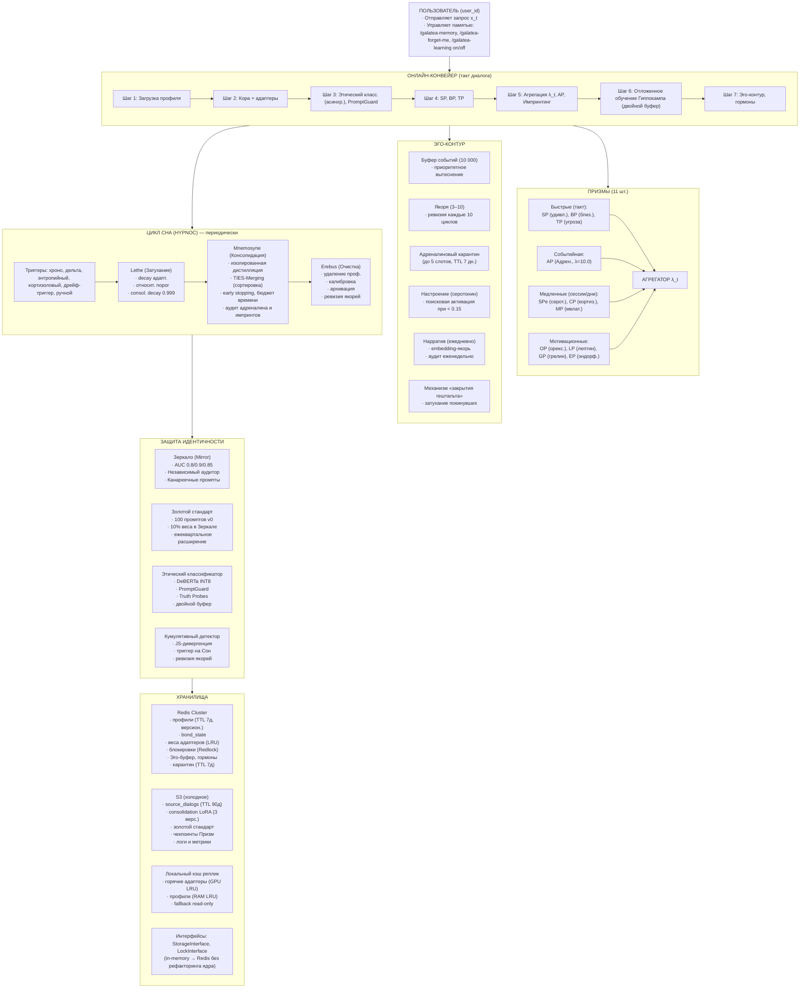

# Заключение — полная архитектурная схема Galatea

## Ключевые цифры архитектуры

| Компонент | Количество / Описание |
|:----------|:----------------------|
| **Кора** | 1 — долговременная память |
| **Призмы** | 11 — гормональная система |
| **Адаптеров на пользователя** | 5 — эпизодическая память |
| **Фазы Сна** | 3 (Lethe, Mnemosyne, Erebus) — консолидация и очистка |
| **Механизмы защиты** | 4 (Зеркало, Этический классификатор, PromptGuard, Truth Probes) |
| **Золотой стандарт** | 1 (100 промптов v0) — якорь стиля |
| **Ключевые сценарии** | 10 — для обязательного тестирования в CI/CD |

---

## Полная архитектурная схема

Ниже представлена полная архитектурная схема Galatea 

---

## Связи с остальными разделами документации

| Раздел | Описание |
|:-------|:---------|
| [Общая философия, Кора и Гиппокамп](./philosophy_cortex_hippocampus.md) | Фундаментальные принципы |
| [Гиппокамп — управление адаптерами](./hippocampus_management.md) | Эпизодическая память |
| [Быстрые Призмы (SP, BP, TP)](./fast_prisms.md) | Оценка на каждом шаге |
| [Призма Адреналина и Импринтинг](./adrenaline_imprinting.md) | Экстренная пластичность |
| [Медленные Призмы (SPe, CP, MP)](./slow_prisms.md) | Гормональный фон |
| [Мотивационные Призмы (OP, LP, GP, EP)](./motivational_prisms.md) | Внутренние драйверы |
| [Эго-контур, Нарратив и Якоря](./ego_narrative.md) | Личность и память |
| [Профиль пользователя и Окситоцин](./oxytocin_profile.md) | Персональные данные |
| [Цикл Сна (Hypnos)](./sleep_hypnos.md) | Инкрементальная консолидация |
| [Зеркало и Этический классификатор](./mirror_ethics_golden.md) | Защита идентичности |
| [Полный конвейер онлайн-шага](./pipeline.md) | Пошаговое описание |
| [Производительность и масштабирование](./performance_scaling.md) | Нефункциональные требования |
| [Дорожная карта реализации](./roadmap.md) | План по этапам |
| [Тестирование и симуляции](./simulation_testing.md) | Стратегия тестирования |
| [Долговременная эволюция](./model_migration.md) | Замена Коры |
| [Юридические и UX-аспекты](./legal_ethical_ux.md) | Пользовательский контроль |

---

## Содержание

- [Введение](../README.md)

#### Философия и ядро

- [Общая философия, Кора и Гиппокамп](./philosophy_cortex_hippocampus.md)
- [Гиппокамп — управление адаптерами](./hippocampus_management.md)
- [Полный конвейер онлайн-шага](./pipeline.md)

#### Призмы (гормональная система)

- [Быстрые Призмы — SP, BP, TP](./fast_prisms.md)
- [Призма Адреналина и Импринтинг](./adrenaline_imprinting.md)
- [Мотивационные Призмы — OP, LP, GP, EP](./motivational_prisms.md)

#### Личность и память

- [Эго-контур, Нарратив и Якоря](./ego_narrative.md)
- [Профиль пользователя и Окситоцин](./oxytocin_profile.md)

#### Защита идентичности

- [Зеркало, Этический классификатор и Золотой стандарт](./mirror_ethics_golden.md)

#### Цикл Сна

- [Цикл Сна (Hypnos)](./sleep_hypnos.md)

#### Дорожная карта реализации

- [Этап 0.5 — предобучение и калибровка Призм](./stage_0.5.md)
- [Этап 1 — MVP с одним пользователем](./stage_1.md)
- [Этап 2 — многопользовательский режим, Redis, базовый Сон](./stage_2.md)
- [Этап 3 — полная Консолидация, Зеркало, детектор дрейфа](./stage_3.md)
- [Этап 4 — продакшен-подготовка, юр. рамка, A/B-тест](./stage_4.md)
- [Сводная дорожная карта и стек технологий](./roadmap.md)

#### Тестирование и риски

- [Симуляции, тестирование и ключевые сценарии](./simulation_testing.md)
- [Полный реестр рисков](./risk_register.md)

#### Эволюция и эксплуатация

- [Долговременная эволюция и замена Коры](./model_migration.md)
- [Производительность, масштабирование и отказоустойчивость](./performance_scaling.md)
- [Юридические, этические и UX-аспекты](./legal_ethical_ux.md)

---

*Этот документ представляет собой итоговый обзор архитектуры Galatea — цифровой личности с гормональной регуляцией, импринтингом и многоуровневой защитой. Все компоненты взаимосвязаны и образуют единую систему, способную к долгосрочной эволюции.*
