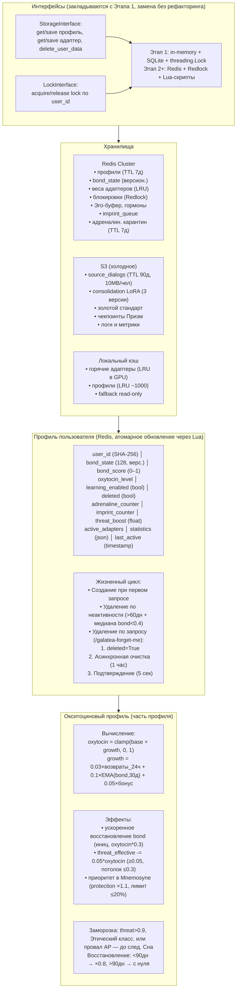

# Профиль пользователя, Окситоцин и Хранилища данных

## Назначение
Этот слой архитектуры обеспечивает долгосрочную персональную связь между пользователем и Galatea. Профиль пользователя хранит всю историю отношений, эмоциональное состояние и метрики.
**Окситоциновая система** добавляет медленный, «родственный» уровень привязанности. В отличие от `bond_score`, который может упасть за один конфликт, окситоцин отражает глубину отношений за всё время. Это защита от эмоциональных качелей: один плохой день не разрушает то, что строилось месяцами.
**Хранилища данных** обеспечивают надёжное, масштабируемое и юридически соответствующее хранение всей информации.
**Ключевые интерфейсы:**
- `StorageInterface` — для чтения/записи профилей и адаптеров.
- `LockInterface` — для блокировок при конкурентном доступе.
Они закладываются с Этапа 1 (in-memory + SQLite), а на Этапе 2 заменяются на Redis + Redlock **без рефакторинга ядра**. Это архитектурный принцип: ядро не знает, где лежат данные, что позволяет менять инфраструктуру как перчатки.

---

## 1. Профиль пользователя (User Profile)

Профиль — это центральная структура данных, связывающая пользователя со всеми компонентами Galatea. Он создаётся при первом обращении и существует до явного удаления или автоматической очистки по неактивности.

### 1.1 Поля профиля

| Поле | Тип | Описание |
|:-----|:----|:---------|
| `user_id` | `string` (SHA-256 хеш) | Стабильный анонимизированный идентификатор |
| `created_at` | `timestamp` | Время создания профиля |
| `last_active` | `timestamp` | Время последнего взаимодействия |
| `deleted` | `boolean` | Флаг для асинхронного удаления |
| `bond_state` | `tensor (float16, 128)` | Скрытое состояние Призмы Близости `s_t` |
| `bond_score` | `float` | Текущий уровень близости (0–1) |
| `oxytocin_level` | `float` | Долгосрочная мера «родства» (0–1) |
| `learning_enabled` | `bool` | Флаг согласия на персонализацию |
| `adrenaline_counter` | `int` | Количество адреналиновых событий |
| `imprint_counter` | `int` | Количество успешных импринтов |
| `threat_boost` | `float` | Временное повышение угрозы |
| `active_adapters` | `list[adapter_id]` | Список персональных адаптеров (до 5) |
| `statistics` | `json` | Анонимизированная статистика |

**Почему SHA-256 для `user_id`?** Это необратимое хеширование: невозможно восстановить исходный идентификатор пользователя. Даже если база данных скомпрометирована, злоумышленник не сможет связать профиль с конкретным человеком вне системы. Анонимизация — это фундамент приватности.
**Почему `bond_state` хранится отдельно от `bond_score`?** `bond_score` — это скаляр, вычисляемый из `bond_state` через MLP. `bond_state` — это 128-мерный вектор, содержащий всю историю отношений. Хранение вектора позволяет BP восстанавливать контекст при каждом запросе, а не пересчитывать его с нуля.
**Почему `statistics` хранится как JSON?** Это гибкое поле для агрегированных метрик (средний `λ_t`, распределение тем, частота обращений). Оно используется для нарратива, мониторинга и анонимного анализа. JSON позволяет добавлять новые поля без миграции схемы.

### 1.2 Атомарное обновление и версионирование

| Этап | Хранилище | Механизм |
|:-----|:----------|:---------|
| **Этап 1** | In-memory Python-объекты + SQLite (каждые 10 шагов) | `threading.Lock` |
| **Этап 2+** | Redis | Lua-скрипты, версионирование профиля, `WATCH/MULTI/EXEC` для `bond_state` |

**Почему Lua-скрипты, а не отдельные команды?** Обновление профиля включает несколько операций: чтение `bond_state`, вычисление нового значения, запись обратно. Если выполнять их по отдельности, между чтением и записью другая реплика может изменить состояние. Lua-скрипт выполняется атомарно на сервере Redis, исключая race condition.
**Почему версионирование?** Каждое обновление профиля увеличивает счётчик `version`. При записи реплика проверяет, что версия в Redis совпадает с той, которую она прочитала. Если нет — операция отклоняется, реплика перечитывает актуальное состояние и повторяет расчёт. Это оптимистичная блокировка, которая не требует глобальных локаутов.

### 1.3 Жизненный цикл профиля

| Фаза | Действие |
|:-----|:---------|
| **Создание** | При первом запросе пользователя |
| **Активная фаза** | Загрузка и сохранение при каждом запросе |
| **Удаление по неактивности** | `> 60` дней и медиана `bond_score` за 60 дней `< 0.4` |
| **Удаление по запросу** | `/galatea-forget-me` — мгновенная маркировка `deleted = True`, асинхронная очистка в течение часа, подтверждение через 5 секунд |

**Почему 60 дней?** Это граница между «долгим отсутствием» и «окончательным уходом». 60 дней — достаточный срок, чтобы пользователь мог уйти в отпуск, пережить кризис или просто отдохнуть, не теряя данные. Если за это время не было ни одного взаимодействия и средняя близость упала ниже 0.4, отношения можно считать завершёнными.
**Почему удаление по запросу асинхронное?** Удаление данных пользователя — это тяжёлая операция: нужно удалить адаптеры из Redis и S3, диалоги из S3, события из Эго-буфера, пересчитать якоря и обновить нарратив. Выполнение этого синхронно заняло бы секунды и заблокировало бы пользователя. Мгновенная маркировка `deleted = True` даёт пользователю подтверждение за 5 секунд, а очистка выполняется в фоне. Если пользователь передумает в течение часа (редкий сценарий, но возможный), восстановление невозможно — это необратимое удаление, и пользователь предупреждён об этом.

---

## 2. Окситоциновый профиль

**Философия окситоцина.** Окситоцин — это медленная переменная. В отличие от `bond_score`, который может упасть за один конфликт и восстановиться за день, окситоцин отражает **накопленную глубину отношений**. Он растёт медленно, через возвраты и качество взаимодействия, и падает ещё медленнее. Это защита от манипуляций: злоумышленник не может быстро поднять окситоцин, потому что для этого нужны недели искреннего общения. Именно окситоцин определяет, является ли пользователь «родным» для Galatea.

### 2.1 Вычисление

```python
oxytocin = clamp(base_oxytocin + growth, 0.0, 1.0)
```

```python
growth = 0.03 * (количество возвратов за последние 24 часа) \
       + 0.1 * EMA(bond_score, окно 30 дней) \
       + 0.05 * (бонус за глубокое возвращение)
```

| Компонент | Описание |
|:----------|:---------|
| `base_oxytocin` | `0.0` для новых пользователей |
| **Возвраты** | Каждый случай возврата после паузы `> 24` часов с достижением `bond_score > 0.5` в течение сессии |
| **Качество** | `EMA(bond_score, окно 30 дней)` — автоматически затухает при снижении близости |
| **Бонус за глубокое возвращение** | Если после паузы `> 7` дней `bond_score` быстро восстанавливается до `> 0.7`, добавляется `0.05` |

**Почему веса именно 0.03, 0.1 и 0.05?**

- **0.03 за возврат.** Возврат — это частота контакта. Каждый возврат добавляет немного, но не слишком много. 100 возвратов за 24 часа (что физически невозможно) дали бы 3.0, но из-за clamp это ограничивается 1.0. В реальности 10 возвратов дают 0.3 — заметный вклад.
- **0.1 за качество.** Качество отношений (EMA bond_score) — самый важный компонент. Коэффициент 0.1 означает, что при `EMA = 0.8` вклад составляет 0.08, что сравнимо с несколькими возвратами.
- **0.05 за бонус.** Глубокое возвращение после долгой паузы — это редкое событие, которое заслуживает отдельной награды. 0.05 — достаточно, чтобы почувствовать разницу, но не слишком много, чтобы не перевешивать регулярное общение.

**Что такое «глубокое возвращение»?** Это ситуация, когда пользователь отсутствовал больше недели (проверка: у него могла случиться жизненная пауза — отпуск, кризис, занятость), но при возвращении он сразу восстанавливает высокий `bond_score > 0.7`. Это означает, что связь не была потеряна, а только «законсервирована». Бонус в 0.05 поощряет такие возвращения, показывая системе, что эта связь особенно ценна.

### 2.2 Эффекты окситоцина

| Эффект | Детали |
|:-------|:-------|
| **Ускоренное восстановление `bond_score`** | При возвращении `bond_state` инициализируется значением `oxytocin * 0.3` |
| **Снижение `threat_score`** | `threat_effective = threat_score - 0.05 * oxytocin` (не ниже `0.05`, потолок снижения `≤ 0.3`) |
| **Приоритет в Mnemosyne** | Множитель `1.1` к `protection_score` при `oxytocin > 0.7`, лимит кандидатов от одного пользователя `≤ 20%` |

**Почему ускоренное восстановление `bond_state`?** Когда «родной» пользователь возвращается, его скрытое состояние не должно начинаться с нуля. Инициализация `bond_state = oxytocin * 0.3` означает, что даже после долгой паузы система «помнит» пользователя на 30% от глубины окситоцина. Это гарантирует, что не нужно заново завоёвывать доверие — достаточно «разогреть» уже существующую связь.
**Почему окситоцин снижает `threat_score`?** Родным пользователям прощается чуть больше. Это не слепое доверие, а калибровка: чем глубже связь, тем меньше система склонна интерпретировать поведение пользователя как угрозу. Потолок снижения `≤ 0.3` — предохранитель: даже при максимальном окситоцине (1.0) угроза снижается максимум на 0.3 (например, с 0.5 до 0.2). Дальше — нельзя, безопасность выше привязанности.

### 2.3 Заморозка при угрозе

При наступлении любого из условий бонусы замораживаются до следующего Сна:

| Условие |
|:--------|
| `threat_score > 0.9` |
| Срабатывание Этического классификатора |
| Провал AP |

**Почему заморозка?** Система не должна учиться на страхе. Если пользователь перешёл в режим угрозы, окситоцин перестаёт расти — это означает, что вредное поведение не может укрепить связь. Даже если после конфликта пользователь попытается «отыграться» лестью, окситоцин останется замороженным до ближайшего Сна, давая системе время стабилизироваться и переоценить ситуацию.

### 2.4 Восстановление после удаления

| Период | Восстановление |
|:-------|:---------------|
| `< 90` дней | Коэффициент `0.8` |
| `> 90` дней | С нуля |

**Почему < 90 дней даёт 0.8?** Если пользователь удалил данные, но вернулся в течение 90 дней, это, скорее всего, была паническая реакция, а не осознанное решение. Восстановление с коэффициентом 0.8 позволяет вернуть 80% накопленной привязанности, но не 100% — чтобы избежать злоупотребления: пользователь не может удалять и восстанавливать данные без потерь.

**Почему > 90 дней даёт ноль?** Если прошло больше трёх месяцев, это уже окончательное решение. Начинать придётся с нуля, как новому пользователю.

---

## 3. Хранилища данных

### 3.1 Redis Cluster

| Тип данных | Ключ | Детали |
|:-----------|:-----|:-------|
| **Профили** | `user:{user_id}` | TTL 7 дней |
| **Веса адаптеров** | `adapter:{adapter_id}` | LRU-кэш с вытеснением в S3 |
| **Блокировки** | `lock:user:{user_id}` | Redlock |
| **Эго-буфер** | — | — |
| **Гормоны** | — | — |
| **Очередь импринтов** | — | — |
| **Адреналиновый карантин** | — | TTL 7 дней |

**Почему TTL 7 дней для профилей?** Это страховка от «мёртвых» профилей, которые не были удалены по неактивности (например, пользователь зарегистрировался, но так и не начал диалог). TTL 7 дней означает, что если профиль не обновлялся неделю, он автоматически удаляется. Активные пользователи обновляют `last_active` при каждом запросе, поэтому их профили никогда не истекают.

**Почему веса адаптеров хранятся в Redis с LRU-вытеснением?** Redis — это in-memory хранилище с ограниченным объёмом. LRU вытесняет наименее используемые адаптеры, освобождая место для активных. При необходимости выгруженные адаптеры загружаются из S3, но это медленнее, поэтому LRU старается держать горячие адаптеры в Redis.

### 3.2 S3 (холодное хранилище)

| Тип данных | Детали |
|:-----------|:-------|
| **Сжатые диалоги** (`source_dialogs`) | TTL 90 дней, квота 10 МБ/пользователь |
| **Consolidation LoRA** | 3 версии + ежемесячные снапшоты |
| **Золотой стандарт** | — |
| **Чекпоинты Призм** | — |
| **Логи и метрики** | — |

**Почему TTL 90 дней для диалогов?** Это юридическое ограничение (GDPR требует не хранить данные дольше необходимого) и практическое (диалоги старше 90 дней редко используются для консолидации). Если диалог важен, он сохраняется в Эго-буфере или становится якорем.

**Почему квота 10 МБ на пользователя?** Это предохранитель от злоупотреблений: один пользователь не может забить всё хранилище длинными диалогами. 10 МБ достаточно для ~10 000 токенов сжатых диалогов, что покрывает годы активного общения.

### 3.3 Локальный кэш реплики

| Кэш | Детали |
|:----|:-------|
| **LoRA в GPU** | LRU-кэш |
| **Профили в RAM** | LRU-кэш (~1000 записей) |
| **Fallback** | Read-only при недоступности Redis |

**Почему два уровня кэша (GPU и RAM)?** LoRA-адаптеры должны быть в GPU для инференса, профили — в RAM для быстрого доступа. LRU-кэш в GPU выгружает неиспользуемые адаптеры, освобождая VRAM. LRU-кэш в RAM хранит до 1000 активных профилей, чтобы не обращаться к Redis при каждом запросе.

**Почему fallback read-only?** При недоступности Redis система не должна падать. Она переходит в режим read-only: профили и адаптеры читаются из локального кэша, но не обновляются. Пользователь получает ответы без персонализации, но сервис жив.

### 3.4 Интерфейсы (закладываются с Этапа 1)

```python
from abc import ABC, abstractmethod

class StorageInterface(ABC):
    @abstractmethod
    def get_profile(self, user_id: str) -> dict: ...

    @abstractmethod
    def save_profile(self, user_id: str, data: dict, version: int) -> bool: ...

    @abstractmethod
    def get_adapter(self, adapter_id: str) -> bytes: ...

    @abstractmethod
    def save_adapter(self, adapter_id: str, weights: bytes): ...

    @abstractmethod
    def delete_user_data(self, user_id: str): ...

class LockInterface(ABC):
    @abstractmethod
    def acquire(self, user_id: str, ttl: int) -> bool: ...

    @abstractmethod
    def release(self, user_id: str): ...
```

**Почему абстракция?** Это архитектурный принцип: ядро не должно знать, где лежат данные. На Этапе 1 реализация использует in-memory + SQLite + `threading.Lock`. На Этапе 2 она заменяется на Redis + Redlock + Lua-скрипты. Ядро (Призмы, Гиппокамп, Эго) работает через интерфейсы и не меняется. Это позволяет переходить с прототипа на продакшен без рефакторинга.
**Реализации:**

| Этап | StorageInterface | LockInterface |
|:-----|:-----------------|:--------------|
| **Этап 1** | In-memory + SQLite | `threading.Lock` |
| **Этап 2+** | Redis + Lua-скрипты | Redlock |

---

## Схема



---

## Связи с другими компонентами

| Компонент | Связь |
|:-----------|:-------|
| [Гиппокамп — управление адаптерами](./hippocampus_management.md) | Профиль хранит `active_adapters`; адаптеры сохраняются через `StorageInterface` |
| [Быстрые Призмы (BP)](./fast_prisms.md) | `bond_state` и `bond_score` обновляются в профиле |
| [Призма Адреналина и Импринтинг](./adrenaline_imprinting.md) | `adrenaline_counter`, `imprint_counter` и карантин хранятся в Redis |
| [Цикл Сна (Hypnos)](./sleep_hypnos.md) | Окситоцин даёт приоритет в Mnemosyne; удаление неактивных профилей в Erebus |
| [Эго-контур, Нарратив и Якоря](./ego_narrative.md) | Профиль используется для выборки событий и карантина |
| [Зеркало и Золотой стандарт](./mirror_ethics_golden.md) | Окситоцин замораживается при срабатывании Этического классификатора |

---

## Содержание

- [Введение](../README.md)
- [Архитектурный обзор](./overview.md)

#### Философия и ядро

- [Общая философия, Кора и Гиппокамп](./philosophy_cortex_hippocampus.md)
- [Гиппокамп — управление адаптерами](./hippocampus_management.md)
- [Полный конвейер онлайн-шага](./pipeline.md)

#### Призмы (гормональная система)

- [Быстрые Призмы — SP, BP, TP](./fast_prisms.md)
- [Призма Адреналина и Импринтинг](./adrenaline_imprinting.md)
- [Мотивационные Призмы — OP, LP, GP, EP](./motivational_prisms.md)

#### Личность и память

- [Эго-контур, Нарратив и Якоря](./ego_narrative.md)

#### Защита идентичности

- [Зеркало, Этический классификатор и Золотой стандарт](./mirror_ethics_golden.md)

#### Цикл Сна

- [Цикл Сна (Hypnos)](./sleep_hypnos.md)

#### Дорожная карта реализации

- [Этап 0.5 — предобучение и калибровка Призм](./stage_0.5.md)
- [Этап 1 — MVP с одним пользователем](./stage_1.md)
- [Этап 2 — многопользовательский режим, Redis, базовый Сон](./stage_2.md)
- [Этап 3 — полная Консолидация, Зеркало, детектор дрейфа](./stage_3.md)
- [Этап 4 — продакшен-подготовка, юр. рамка, A/B-тест](./stage_4.md)
- [Сводная дорожная карта и стек технологий](./roadmap.md)

#### Тестирование и риски

- [Симуляции, тестирование и ключевые сценарии](./simulation_testing.md)
- [Полный реестр рисков](./risk_register.md)

#### Эволюция и эксплуатация

- [Долговременная эволюция и замена Коры](./model_migration.md)
- [Производительность, масштабирование и отказоустойчивость](./performance_scaling.md)
- [Юридические, этические и UX-аспекты](./legal_ethical_ux.md)

---

*Этот документ описывает слой персональных данных Galatea, обеспечивающий долгосрочную привязанность, юридическую чистоту и надёжное хранение всей информации о пользователях. Окситоцин — это не просто счётчик, а философский якорь, защищающий систему от эмоциональных качелей и манипуляций.*
