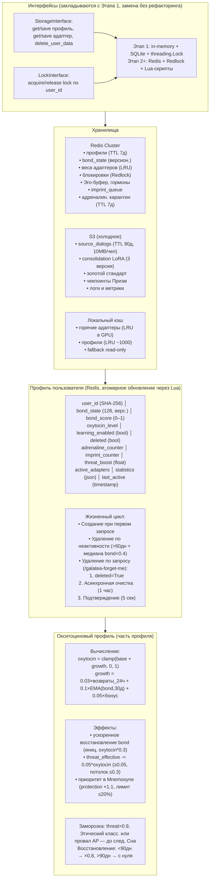

# Профиль пользователя, Окситоцин и Хранилища данных

## Назначение

Этот слой архитектуры обеспечивает долгосрочную персональную связь между пользователем и Galatea. Профиль пользователя хранит всю историю отношений, эмоциональное состояние и метрики. Окситоциновая система добавляет медленный, «родственный» уровень привязанности, который не колеблется вместе с `bond_score`, а отражает глубину отношений за всё время. Хранилища данных обеспечивают надёжное, масштабируемое и юридически соответствующее хранение всей информации.

**Ключевые интерфейсы:**

- `StorageInterface` — для чтения/записи профилей и адаптеров.
- `LockInterface` — для блокировок при конкурентном доступе.

Они закладываются с Этапа 1 (in-memory + SQLite), а на Этапе 2 заменяются на Redis + Redlock **без рефакторинга ядра**.

---

## 1. Профиль пользователя (User Profile)

Профиль — это центральная структура данных, связывающая пользователя со всеми компонентами Galatea. Он создаётся при первом обращении и существует до явного удаления или автоматической очистки по неактивности.

### 1.1 Поля профиля

| Поле | Тип | Описание |
|:-----|:----|:---------|
| `user_id` | `string` (SHA-256 хеш) | Стабильный анонимизированный идентификатор |
| `created_at` | `timestamp` | Время создания профиля |
| `last_active` | `timestamp` | Время последнего взаимодействия |
| `deleted` | `boolean` | Флаг для асинхронного удаления |
| `bond_state` | `tensor (float16, 128)` | Скрытое состояние Призмы Близости `s_t` |
| `bond_score` | `float` | Текущий уровень близости (0–1) |
| `oxytocin_level` | `float` | Долгосрочная мера «родства» (0–1) |
| `learning_enabled` | `bool` | Флаг согласия на персонализацию |
| `adrenaline_counter` | `int` | Количество адреналиновых событий |
| `imprint_counter` | `int` | Количество успешных импринтов |
| `threat_boost` | `float` | Временное повышение угрозы |
| `active_adapters` | `list[adapter_id]` | Список персональных адаптеров (до 5) |
| `statistics` | `json` | Анонимизированная статистика |

### 1.2 Атомарное обновление и версионирование

| Этап | Хранилище | Механизм |
|:-----|:----------|:---------|
| **Этап 1** | In-memory Python-объекты + SQLite (каждые 10 шагов) | `threading.Lock` |
| **Этап 2+** | Redis | Lua-скрипты, версионирование профиля, `WATCH/MULTI/EXEC` для `bond_state` |

### 1.3 Жизненный цикл профиля

| Фаза | Действие |
|:-----|:---------|
| **Создание** | При первом запросе пользователя |
| **Активная фаза** | Загрузка и сохранение при каждом запросе |
| **Удаление по неактивности** | `> 60` дней и медиана `bond_score` за 60 дней `< 0.4` |
| **Удаление по запросу** | `/galatea-forget-me` — мгновенная маркировка `deleted = True`, асинхронная очистка в течение часа, подтверждение через 5 секунд |

---

## 2. Окситоциновый профиль

Окситоцин — расширение профиля, отражающее долгосрочную связь.

### 2.1 Вычисление

```python
oxytocin = clamp(base_oxytocin + growth, 0.0, 1.0)
```

```python
growth = 0.03 * (количество возвратов за последние 24 часа) \
       + 0.1 * EMA(bond_score, окно 30 дней) \
       + 0.05 * (бонус за глубокое возвращение)
```

| Компонент | Описание |
|:----------|:---------|
| `base_oxytocin` | `0.0` для новых пользователей |
| **Возвраты** | Каждый случай возврата после паузы `> 24` часов с достижением `bond_score > 0.5` в течение сессии |
| **Качество** | `EMA(bond_score, окно 30 дней)` — автоматически затухает при снижении близости |
| **Бонус за глубокое возвращение** | Если после паузы `> 7` дней `bond_score` быстро восстанавливается до `> 0.7`, добавляется `0.05` |

### 2.2 Эффекты окситоцина

| Эффект | Детали |
|:-------|:-------|
| **Ускоренное восстановление `bond_score`** | При возвращении `bond_state` инициализируется значением `oxytocin * 0.3` |
| **Снижение `threat_score`** | `threat_effective = threat_score - 0.05 * oxytocin` (не ниже `0.05`, потолок снижения `≤ 0.3`) |
| **Приоритет в Mnemosyne** | Множитель `1.1` к `protection_score` при `oxytocin > 0.7`, лимит кандидатов от одного пользователя `≤ 20%` |

### 2.3 Заморозка при угрозе

При наступлении любого из условий бонусы замораживаются до следующего Сна:

| Условие |
|:--------|
| `threat_score > 0.9` |
| Срабатывание Этического классификатора |
| Провал AP |

### 2.4 Восстановление после удаления

| Период | Восстановление |
|:-------|:---------------|
| `< 90` дней | Коэффициент `0.8` |
| `> 90` дней | С нуля |

---

## 3. Хранилища данных

### 3.1 Redis Cluster

| Тип данных | Ключ | Детали |
|:-----------|:-----|:-------|
| **Профили** | `user:{user_id}` | TTL 7 дней |
| **Веса адаптеров** | `adapter:{adapter_id}` | LRU-кэш с вытеснением в S3 |
| **Блокировки** | `lock:user:{user_id}` | Redlock |
| **Эго-буфер** | — | — |
| **Гормоны** | — | — |
| **Очередь импринтов** | — | — |
| **Адреналиновый карантин** | — | TTL 7 дней |

### 3.2 S3 (холодное хранилище)

| Тип данных | Детали |
|:-----------|:-------|
| **Сжатые диалоги** (`source_dialogs`) | TTL 90 дней, квота 10 МБ/пользователь |
| **Consolidation LoRA** | 3 версии + ежемесячные снапшоты |
| **Золотой стандарт** | — |
| **Чекпоинты Призм** | — |
| **Логи и метрики** | — |

### 3.3 Локальный кэш реплики

| Кэш | Детали |
|:----|:-------|
| **LoRA в GPU** | LRU-кэш |
| **Профили в RAM** | LRU-кэш (~1000 записей) |
| **Fallback** | Read-only при недоступности Redis |

### 3.4 Интерфейсы (закладываются с Этапа 1)

```python
from abc import ABC, abstractmethod

class StorageInterface(ABC):
    @abstractmethod
    def get_profile(self, user_id: str) -> dict: ...

    @abstractmethod
    def save_profile(self, user_id: str, data: dict, version: int) -> bool: ...

    @abstractmethod
    def get_adapter(self, adapter_id: str) -> bytes: ...

    @abstractmethod
    def save_adapter(self, adapter_id: str, weights: bytes): ...

    @abstractmethod
    def delete_user_data(self, user_id: str): ...

class LockInterface(ABC):
    @abstractmethod
    def acquire(self, user_id: str, ttl: int) -> bool: ...

    @abstractmethod
    def release(self, user_id: str): ...
```

**Реализации:**

| Этап | StorageInterface | LockInterface |
|:-----|:-----------------|:--------------|
| **Этап 1** | In-memory + SQLite | `threading.Lock` |
| **Этап 2+** | Redis + Lua-скрипты | Redlock |

---

## Схема



---

## Связи с другими компонентами

| Компонент | Связь |
|:-----------|:-------|
| [Гиппокамп — управление адаптерами](./hippocampus_management.md) | Профиль хранит `active_adapters`; адаптеры сохраняются через `StorageInterface` |
| [Быстрые Призмы (BP)](./fast_prisms.md) | `bond_state` и `bond_score` обновляются в профиле |
| [Призма Адреналина и Импринтинг](./adrenaline_imprinting.md) | `adrenaline_counter`, `imprint_counter` и карантин хранятся в Redis |
| [Цикл Сна (Hypnos)](./sleep_hypnos.md) | Окситоцин даёт приоритет в Mnemosyne; удаление неактивных профилей в Erebus |
| [Эго-контур, Нарратив и Якоря](./ego_narrative.md) | Профиль используется для выборки событий и карантина |
| [Зеркало и Золотой стандарт](./mirror_ethics_golden.md) | Окситоцин замораживается при срабатывании Этического классификатора |

---

## Содержание

- [Введение](../README.md)
- [Архитектурный обзор](./overview.md)

#### Философия и ядро

- [Общая философия, Кора и Гиппокамп](./philosophy_cortex_hippocampus.md)
- [Гиппокамп — управление адаптерами](./hippocampus_management.md)
- [Полный конвейер онлайн-шага](./pipeline.md)

#### Призмы (гормональная система)

- [Быстрые Призмы — SP, BP, TP](./fast_prisms.md)
- [Призма Адреналина и Импринтинг](./adrenaline_imprinting.md)
- [Мотивационные Призмы — OP, LP, GP, EP](./motivational_prisms.md)

#### Личность и память

- [Эго-контур, Нарратив и Якоря](./ego_narrative.md)

#### Защита идентичности

- [Зеркало, Этический классификатор и Золотой стандарт](./mirror_ethics_golden.md)

#### Цикл Сна

- [Цикл Сна (Hypnos)](./sleep_hypnos.md)

#### Дорожная карта реализации

- [Этап 0.5 — предобучение и калибровка Призм](./stage_0.5.md)
- [Этап 1 — MVP с одним пользователем](./stage_1.md)
- [Этап 2 — многопользовательский режим, Redis, базовый Сон](./stage_2.md)
- [Этап 3 — полная Консолидация, Зеркало, детектор дрейфа](./stage_3.md)
- [Этап 4 — продакшен-подготовка, юр. рамка, A/B-тест](./stage_4.md)
- [Сводная дорожная карта и стек технологий](./roadmap.md)

#### Тестирование и риски

- [Симуляции, тестирование и ключевые сценарии](./simulation_testing.md)
- [Полный реестр рисков](./risk_register.md)

#### Эволюция и эксплуатация

- [Долговременная эволюция и замена Коры](./model_migration.md)
- [Производительность, масштабирование и отказоустойчивость](./performance_scaling.md)
- [Юридические, этические и UX-аспекты](./legal_ethical_ux.md)

---

*Этот документ описывает слой персональных данных Galatea, обеспечивающий долгосрочную привязанность и надёжное хранение всей информации о пользователях.*
