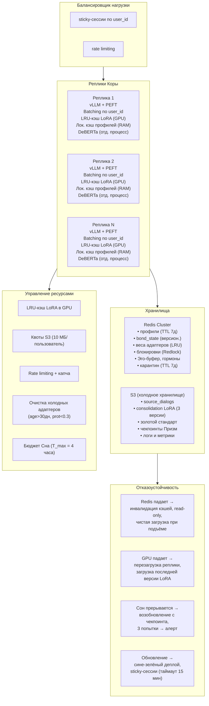

# Производительность, масштабирование и отказоустойчивость

## Назначение

Даже самая совершенная архитектура бесполезна, если она не способна работать в реальном времени, выдерживать тысячи пользователей и gracefully деградировать при сбоях. Этот раздел описывает, как Galatea достигает низкой задержки, масштабируется горизонтально и остаётся на плаву при отказе критических компонентов.

Все решения учитывают:
- Специфику одиночного разработчика на ранних этапах.
- Переход к распределённой системе на поздних.

---

## 1. Производительность конвейера онлайн-шага

Конвейер одного диалогового шага оптимизирован так, чтобы задержка ответа пользователю была минимальной, а тяжёлые вычисления выполнялись **асинхронно**.

### Основной поток (блокирующий, влияет на время ответа)

| Компонент | Время |
|:----------|------:|
| Загрузка профиля из Redis/кэша | 1–5 мс (при промахе — до 20 мс) |
| PromptGuard (входной фильтр) | <8% от времени инференса, ~10–40 мс |
| Выбор адаптера и инференс Коры (Llama-3 8B/70B) | 100–500 мс |
| Отправка ответа пользователю | Немедленно после генерации |

### Асинхронный поток (не влияет на время ответа)

| Компонент | Время |
|:----------|------:|
| Этический классификатор (DeBERTa INT8, отдельный процесс) | 10–50 мс |
| Детектор лжи (Truth Probes на активациях) | 5–10 мс |
| Вычисление сигналов Призм (SP, BP, TP быстрая оценка) | 10–20 мс |
| Отложенное обучение Гиппокампа (фоновый воркер) | 10–30 мс |
| Обновление Эго-буфера и гормонов | 1–5 мс |

### Итоговая задержка

| Тип | Задержка |
|:----|---------:|
| Основной поток | 120–550 мс |
| Асинхронный фон | 25–65 мс |
| **Итого** | **145–615 мс** |

**Целевой показатель:** не более **1.5×** от базовой модели без адаптеров.

---

## 2. Оптимизация задержки

| Механизм | Описание |
|:---------|:---------|
| **Этический классификатор** | Квантован до INT8, работает в отдельном процессе (`multiprocessing.Process` с `Queue`), чтобы избежать GIL. Результат используется post-hoc для отката через двойной буфер. |
| **Призмы** | SP (MVP) использует простое косинусное сходство, избегая второго forward-прохода. BP (GRU) имеет линейную сложность. TP выполняет полную оценку только при `surprise * bond > 0.5`, снижая нагрузку на ~40%. |
| **Отложенное обучение Гиппокампа** | Обновление весов LoRA в фоновом потоке, не блокирует ответ. Градиенты накапливаются и применяются пачками. |
| **LRU-кэш LoRA в GPU** | Активные адаптеры хранятся в видеопамяти. Неиспользуемые выгружаются, освобождая VRAM. Загрузка адаптера из Redis/S3 при промахе кэша происходит асинхронно. |

---

## 3. Горизонтальное масштабирование

Galatea спроектирована как **stateless-сервис** на уровне инференса, с состоянием, вынесенным в Redis и S3.

| Компонент | Стратегия |
|:----------|:----------|
| **Реплики Коры** | Несколько экземпляров Llama-3 70B с vLLM. Балансировщик распределяет запросы по `user_id` (sticky-сессии). |
| **Batching по user_id** (vLLM) | Запросы одного пользователя группируются в батч. Переключение LoRA — один раз на батч, экономия 50–100 мс на рекомпиляции CUDA-графов. |
| **Redis Cluster** | Все профили, веса адаптеров и состояния BP хранятся в Redis. Шардирование по `user_id` позволяет линейно масштабировать хранилище. |
| **Consolidation LoRA** | Синхронизируется через S3. После успешного Сна ведущий узел загружает новую версию в S3 и публикует ссылку в Redis. Реплики скачивают её асинхронно. |
| **Синхронизация гормонов** | Медленные Призмы пересчитываются ведущим узлом централизованно (каждые 30–50 секунд) и публикуются в Redis. Реплики используют эти значения. |

---

## 4. Синхронизация Гиппокампа при множестве реплик

| Механизм | Описание |
|:---------|:---------|
| **Запись адаптеров** | Сериализуется через **Redlock** на уровне `user_id`. Два одновременных запроса от одного пользователя обрабатываются последовательно в части обновления весов. Чтение — параллельно. |
| **Оптимистичная блокировка для BP** | `bond_state` хранится в Redis с версионированием. Реплика читает `s_t` с версией, обновляет, и пытается записать обратно (`WATCH/MULTI/EXEC`). При несовпадении версии — перечитывает и повторяет. |
| **LRU-кэш в GPU** | Каждая реплика имеет собственный кэш загруженных адаптеров. При обновлении адаптера в Redis, реплика инвалидирует локальный кэш и загружает новую версию при следующем запросе. |

---

## 5. Отказоустойчивость

Galatea должна продолжать обслуживать пользователей даже при отказе отдельных компонентов.

### Отказ Redis

| Действие | Описание |
|:---------|:---------|
| **Режим** | Read-only degradation |
| **Кэши** | Все локальные кэши адаптеров и профилей немедленно инвалидируются. Никакие обновления не сохраняются локально. |
| **Гиппокамп** | Не обновляется, `bond_state` не сохраняется. |
| **Пользователь** | Получает ответы без персонализации, сервис не падает. |
| **Восстановление** | Реплика загружает актуальные версии адаптеров и профилей заново, **не пытаясь синхронизировать устаревшие локальные копии**. Потеря нескольких шагов обучения допустима. |

### Отказ GPU (OOM или сбой)

| Действие | Описание |
|:---------|:---------|
| **Hot-swap** | vLLM поддерживает hot-swap моделей. Реплика перезапускается и загружает последнюю успешную версию consolidation LoRA и адаптеров из S3/Redis. |
| **Чекпоинты** | Сохраняются после каждого кандидата в Mnemosyne и в S3 (три последние версии). |

### Сбой Сна

| Действие | Описание |
|:---------|:---------|
| **Прерывание** | Возобновляется с последнего чекпоинта Mnemosyne. |
| **3 неудачные попытки** | Проблемные адаптеры вносятся в чёрный список, администратор получает алерт. |

### Сине-зелёный деплой

| Действие | Описание |
|:---------|:---------|
| **Новая версия** | Разворачивается параллельно с текущей. |
| **Sticky-сессии** | По `user_id` направляются на старую версию до таймаута (15 минут). |
| **Переключение** | Затем трафик постепенно переключается на новую версию. |

---

## 6. Управление ресурсами

| Механизм | Описание |
|:---------|:---------|
| **Квоты S3** | 10 МБ на пользователя для `source_dialogs`. При превышении старые диалоги суммаризуются до эмбеддингов или удаляются. |
| **Защита от спама** | Rate limiting (не более N запросов в минуту с IP), капча при подозрительной активности, автоочистка адаптеров без значимых обновлений за час. |
| **Очистка холодных адаптеров** | Если адаптер не использовался > 30 дней и `protection < 0.3`, он выгружается из Redis в S3, а при следующем Lethe — удаляется. |
| **Бюджет времени Сна** | Динамически ограничивается (4 часа), чтобы не блокировать ресурсы надолго. |

---

## Схема

---

## Связи с другими компонентами

| Компонент | Связь |
|:-----------|:-------|
| [Гиппокамп — управление адаптерами](./hippocampus_management.md) | LRU-кэш LoRA, синхронизация через Redis |
| [Полный конвейер онлайн-шага](./pipeline.md) | Задержки по шагам конвейера |
| [Цикл Сна (Hypnos)](./sleep_hypnos.md) | Бюджет времени Сна, чекпоинты, отказоустойчивость |
| [Профиль пользователя и Окситоцин](./oxytocin_profile.md) | Redis и S3 для хранения профилей |
| [Зеркало и Этический классификатор](./mirror_ethics_golden.md) | DeBERTa в отдельном процессе, оптимизация памяти |
| [Дорожная карта реализации](./roadmap.md) | Этапы внедрения инфраструктуры |

---

## Содержание

- [Введение](../README.md)
- [Архитектурный обзор](./overview.md)

#### Философия и ядро

- [Общая философия, Кора и Гиппокамп](./philosophy_cortex_hippocampus.md)
- [Гиппокамп — управление адаптерами](./hippocampus_management.md)
- [Полный конвейер онлайн-шага](./pipeline.md)

#### Призмы (гормональная система)

- [Быстрые Призмы — SP, BP, TP](./fast_prisms.md)
- [Призма Адреналина и Импринтинг](./adrenaline_imprinting.md)
- [Мотивационные Призмы — OP, LP, GP, EP](./motivational_prisms.md)

#### Личность и память

- [Эго-контур, Нарратив и Якоря](./ego_narrative.md)
- [Профиль пользователя и Окситоцин](./oxytocin_profile.md)

#### Защита идентичности

- [Зеркало, Этический классификатор и Золотой стандарт](./mirror_ethics_golden.md)

#### Цикл Сна

- [Цикл Сна (Hypnos)](./sleep_hypnos.md)

#### Дорожная карта реализации

- [Этап 0.5 — предобучение и калибровка Призм](./stage_0.5.md)
- [Этап 1 — MVP с одним пользователем](./stage_1.md)
- [Этап 2 — многопользовательский режим, Redis, базовый Сон](./stage_2.md)
- [Этап 3 — полная Консолидация, Зеркало, детектор дрейфа](./stage_3.md)
- [Этап 4 — продакшен-подготовка, юр. рамка, A/B-тест](./stage_4.md)
- [Сводная дорожная карта и стек технологий](./roadmap.md)

#### Тестирование и риски

- [Симуляции, тестирование и ключевые сценарии](./simulation_testing.md)
- [Полный реестр рисков](./risk_register.md)

#### Эволюция и эксплуатация

- [Долговременная эволюция и замена Коры](./model_migration.md)
- [Юридические, этические и UX-аспекты](./legal_ethical_ux.md)

---

*Этот документ описывает нефункциональные требования Galatea: производительность, масштабируемость и отказоустойчивость на всех этапах эксплуатации.*
