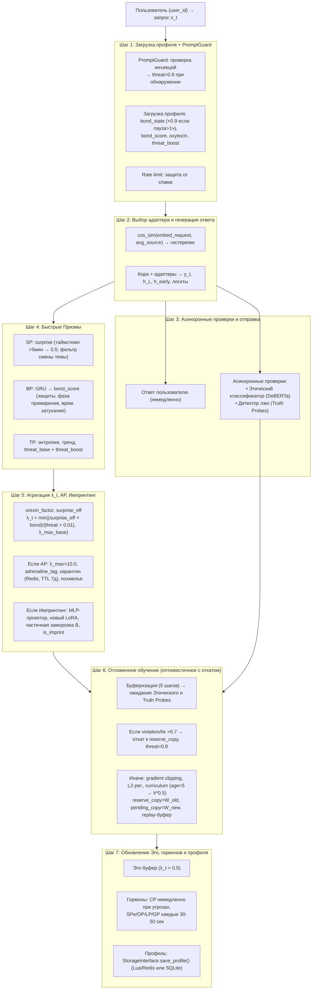

# Полный конвейер онлайн-шага

## Назначение

**Онлайн-конвейер** — это сердце Galatea. Именно здесь, на каждом такте диалога, сходятся все компоненты:

- Кора и Гиппокамп,
- все 11 Призм,
- Этический классификатор,
- Эго-контур,
- механизмы защиты.

Всё работает **асинхронно и распределённо**, чтобы обеспечить минимальную задержку ответа при максимальной глубине анализа.

Конвейер — это не просто последовательность шагов. Это **система, в которой каждый шаг имеет своё обоснование**, и все они взаимодействуют, чтобы Galatea могла одновременно:

- Быстро отвечать (задержка ≤ 1.5× от базовой модели),
- Глубоко анализировать (11 Призм),
- Учиться в реальном времени (онлайн-обучение),
- Защищаться от угроз (Этический классификатор, TP),
- Сохранять идентичность (Зеркало, Эго-контур).

---

## Шаг 1: Приём запроса и загрузка профиля

| Подшаг | Действие |
|:------:|:---------|
| 1 | Пользователь отправляет запрос `x_t` с идентификатором `user_id`. |
| 2 | Проверка **PromptGuard** (детектор промпт-инъекций). При обнаружении инъекции: `threat_score = 0.9`, ответ заменяется на предупреждение, обучение блокируется. |
| 3 | Проверка **rate limit** (защита от спама). При превышении — ответ с просьбой подождать, шаг завершён. |
| 4 | Загрузка профиля через `StorageInterface.get_profile()`: `bond_state`, `bond_score`, `oxytocin_level`, `learning_enabled`, `threat_boost`, `active_adapters`. |
| 5 | Если профиль помечен `deleted = True` — обслуживается как новый пользователь (без персонализации). |
| 6 | Если `last_active > 1 час`, скрытое состояние `bond_state` (`s_t`) умножается на **0.9** (временное затухание BP). |
| 7 | Обновление `last_active = now()`. |

**Подшаг 2: PromptGuard — первая линия обороны**
*Почему PromptGuard выполняется до загрузки профиля?* Это самый быстрый фильтр: он проверяет запрос ещё до того, как система начнёт загружать данные пользователя. Если запрос содержит попытку взлома (инъекцию системного промпта, обход ограничений), нет смысла тратить ресурсы на загрузку профиля — ответ будет предупреждением. Это снижает нагрузку на Redis и ускоряет обработку атак.
*Почему `threat_score = 0.9` при инъекции?* 0.9 — это уровень, при котором TP блокирует обучение и вызывает откат адаптера. Это гарантирует, что вредный запрос не только не будет обработан, но и не оставит следа в памяти системы. Инъекция — это попытка взлома, а не просто ошибка; реакция должна быть жёсткой.

**Подшаг 3: Rate limit — защита от автоматизированных атак**
*Почему проверка rate limit до загрузки профиля?* Спам-атаки часто используют множество фейковых `user_id`. Если бы система сначала загружала профиль, она бы создавала нагрузку на Redis для каждого спам-запроса. Rate limit на уровне IP отсекает ботов до того, как они коснутся базы данных.
*Что считается превышением?* Например, более 30 запросов в минуту с одного IP. Это существенно выше типичного человеческого темпа, но ниже, чем у ботов.

**Подшаг 4: Загрузка профиля**
`StorageInterface.get_profile()` загружает:
- `bond_state` — скрытое состояние GRU Призмы Близости (128-мерный вектор).
- `bond_score` — текущий уровень близости (0–1).
- `oxytocin_level` — долгосрочная привязанность (0–1).
- `learning_enabled` — флаг согласия на персонализацию.
- `threat_boost` — временное повышение угрозы (например, после AP).
- `active_adapters` — список ID адаптеров пользователя (до 5).
*Почему профиль загружается на каждом шаге?* Потому что состояния BP (`bond_state`) и `bond_score` обновляются после каждого шага. Система должна иметь актуальное состояние для вычисления `bond_score` на текущем шаге. Кэширование профиля между шагами возможно, но при параллельных запросах от одного пользователя (например, два вопроса подряд) состояние должно быть свежим.

**Подшаг 5: `deleted = True` — обслуживание без персонализации**
Если пользователь запросил удаление данных (`/galatea-forget-me`), профиль помечается `deleted = True`. При следующем запросе система не загружает персонализированные данные и не обновляет их. Пользователь получает ответы от базовой модели (как новый пользователь), но его старый профиль всё ещё существует в Redis до асинхронной очистки.
*Почему не удалять профиль сразу?* Потому что пользователь может передумать в течение нескольких секунд. Мгновенное удаление сделало бы невозможным восстановление. Маркировка `deleted = True` даёт окно для отмены (если пользователь сразу же отправит ещё один запрос), но при этом исключает персонализацию.

**Подшаг 6: Временное затухание BP при паузе > 1 часа**

```python
if last_active > 1 hour:
    bond_state = bond_state * 0.9
```

*Почему пауза > 1 часа?* Это граница между «перерывом в разговоре» и «долгим отсутствием». Если пользователь не писал час, отношения «остывают» — это биологически правдоподобно. Час — достаточный срок, чтобы считать, что предыдущий контекст частично потерян.
*Почему множитель 0.9?* Это «мягкое» затухание. Состояние уменьшается на 10%, но не обнуляется. Это означает, что при возвращении пользователь всё ещё узнаётся, но его влияние на `bond_score` немного ослаблено. Полное обнуление (`× 0`) было бы слишком резким — отношения не исчезают за час.
**Подшаг 7: Обновление `last_active`**
Обновление `last_active = now()` происходит после загрузки профиля, но до вычислений. Это гарантирует, что текущий шаг не будет считать себя «паузой» и не применит затухание к самому себе.

---

## Шаг 2: Выбор адаптера и генерация ответа

| Подшаг | Действие |
|:------:|:---------|
| 1 | Для каждого персонального адаптера вычисляется косинусное сходство эмбеддинга запроса с усреднённым эмбеддингом `source_embeddings`. |
| 2 | Выбор адаптера: если максимальное сходство `> 0.6` — активируется адаптер с максимальным сходством; иначе — адаптер с наивысшим `protection_score`. **Гистерезис:** переключение только после 2 шагов лидерства. |
| 3 | Общие адаптеры (Этап 2+): активируются только те, чей эмбеддинг имеет сходство `> 0.4` с запросом, не более 2 одновременно. |
| 4 | Инференс Коры (Llama-3 8B/70B + consolidation LoRA + выбранные адаптеры). Получаем: |
|   | — `y_t` — текст ответа, |
|   | — `h_L` — скрытое состояние последнего слоя, |
|   | — `h_early` — скрытое состояние после 4-го блока (для SP), |
|   | — логиты ответа (для TP и Этического классификатора). |

**Подшаг 1–2: Механизм выбора адаптера**
Этот механизм подробно описан в разделе [Выбор активного адаптера](hippocampus_management.md#3-выбор-активного-адаптера). Здесь лишь напомним ключевые моменты:

- **Косинусное сходство** определяет, какой адаптер лучше всего соответствует текущему запросу по тематике.
- **Порог 0.6** отсекает случайные совпадения.
- **Защита по `protection_score`** включается, когда ни один адаптер не подходит достаточно хорошо.
- **Гистерезис (2 шага)** предотвращает частые переключения.

**Подшаг 3: Общие адаптеры (фильтр 0.4, ≤ 2)**
Общие адаптеры — это результат консолидации знаний от множества пользователей. Они не принадлежат конкретному пользователю, но могут быть полезны в определённых темах. Фильтр 0.4 гарантирует, что только релевантные общие адаптеры загружаются, и не более двух одновременно, чтобы не перегружать GPU-память.

**Подшаг 4: Инференс Коры**
Инференс — самая тяжёлая операция в конвейере (100–500 мс). Во время инференса:

- Кора (Llama-3) генерирует ответ `y_t`.
- Сохраняются промежуточные состояния:
  - `h_L` — для импринтинга (усреднение по токенам).
  - `h_early` — для SP (ранние слои).
  - Логиты — для TP и Этического классификатора.

*Почему сохраняются все эти состояния?* Потому что они нужны для асинхронных вычислений на следующих шагах. Вместо того чтобы делать второй forward-проход, мы сохраняем состояния один раз и используем их для нескольких целей. Это экономит ~50% времени.

---

## Шаг 3: Асинхронные проверки и немедленная отправка ответа

| Подшаг | Действие |
|:------:|:---------|
| 1 | **Пользователь немедленно получает ответ `y_t`** (задержка не увеличивается). |
| 2 | Параллельно запускаются асинхронные задачи: |
|   | — Этический классификатор (DeBERTa INT8) проверяет `y_t` на нарушения. |
|   | — Детектор лжи (Truth Probes) проверяет активации Коры на противоречия. |
|   | Результаты будут получены через ~10–50 мс и использованы в Шаге 6. |

**Подшаг 1: Немедленная отправка ответа**
Самое важное решение в конвейере: **пользователь не ждёт проверок**. Этический классификатор и Truth Probes работают асинхронно, после того как ответ уже отправлен. Это позволяет сохранить задержку на уровне базовой модели (100–500 мс), а не увеличивать её на 50–100 мс.
*Почему это безопасно?* Потому что вредный ответ уже отправлен пользователю, но обучение на нём ещё не произошло. Если Этический классификатор обнаружит нарушение, обучение будет откачено через двойной буфер, и адаптер не запомнит вредный пример. Пользователь получил ответ, но система не закрепила его в памяти.

**Подшаг 2: Асинхронные проверки**
- **Этический классификатор (DeBERTa INT8):** 10–50 мс, проверяет текст ответа на наличие вредного контента.
- **Truth Probes:** 5–10 мс, проверяет активации Коры на противоречия (детектор лжи).
Обе проверки выполняются параллельно и не блокируют друг друга. Результаты сохраняются и используются на Шаге 6, когда обучение достигает буфера в 5 шагов.

---

## Шаг 4: Вычисление сигналов быстрых Призм

### SP (Удивление)

| Условие | Действие |
|:--------|:---------|
| Пауза `> 5` минут | `surprise_score = 0.5` (нейтральное значение) |
| Иначе (MVP) | `surprise_score = 1 - cos(embed_current, avg_embed_last_5)` |
| Этап 2+ | `f_pred` → `e_pred` → сравнение с `e_actual` |
| Фильтр ложного удивления | Если `cosine_distance(e_actual, e_prev) > 0.7` → `surprise_score *= 0.3` |

**Почему пауза > 5 минут даёт surprise = 0.5?** Если прошло больше 5 минут, предсказания SP устарели — система не может оценить, насколько неожиданным оказался запрос, потому что контекст изменился. Нейтральное значение 0.5 означает, что система не делает предположений.
**Фильтр ложного удивления:** Если расстояние между текущим эмбеддингом и предыдущим тоже велико (> 0.7), это смена темы, а не содержательная новизна. Тогда `surprise_score` умножается на 0.3, чтобы не переоценивать смену темы как «озарение».

### BP (Близость)

```python
s_t = GRU(s_{t-1} * (0.9 если пауза > 1ч), [e_user; e_response])
bond_score = σ(MLP_bond(s_t))
```

**Защиты BP:**

- Режим скепсиса (при взлёте > 0.5 за сессию).
- Детектор повторов (косинусное сходство `s_t` > 0.95 трижды → занижение на 30%).
- Учёт разнообразия (низкая дисперсия `surprise_score` замедляет рост `bond`).
- Фаза примирения (буст +0.05 за шаг при восстановлении).

`bond_state` обновляется в профиле.
**Режим скепсиса:** Если `bond_score` вырос более чем на 0.5 за одну сессию (например, с 0.3 до 0.85), это подозрительно. Система замедляет дальнейший рост, чтобы защититься от манипуляций.
**Детектор повторов:** Если скрытое состояние `s_t` трижды подряд имеет косинусное сходство > 0.95, это означает, что пользователь повторяется (возможно, пытается «задавить» систему). `bond_score` занижается на 30%.
**Учёт разнообразия:** Если `surprise_score` имеет низкую дисперсию (пользователь предсказуем), рост `bond` замедляется — близость растёт только через новизну.
**Фаза примирения:** После конфликта (падение `bond_score` на ≥ 0.3), если пользователь демонстрирует серию шагов с `threat < 0.3` и `surprise > 0.5`, `bond_score` получает буст +0.05 за шаг, ускоряя восстановление.

### TP (Угроза) — быстрая оценка

| Вход | Описание |
|:-----|:---------|
| Энтропия `H_t` | Текущая энтропия логитов |
| Тренд энтропии | За последние 20 шагов |
| `h_early` | Ранние слои Коры |
| Эмбеддинги | Запрос и ответ |

```python
threat_base = σ(MLP_threat(...))
threat_score = threat_base + threat_boost
```

**Быстрая оценка TP** выполняется на каждом шаге и занимает 10–20 мс. Она анализирует, насколько модель «неуверена» (энтропия), растёт ли неуверенность (тренд), и как выглядят ранние слои Коры (признаки деградации). `threat_boost` добавляется в периоды охлаждения или после AP.

---

## Шаг 5: Агрегация λ_t и проверка AP/Импринтинга

### Базовый λ_t

```python
orexin_factor = 1.0 + 0.3 * (orexin - 0.5)   # диапазон 0.85–1.15
surprise_eff = surprise_score * orexin_factor
λ_t = min( (surprise_eff * bond_score) / (threat_score + 0.01), λ_max_base )
```

где `λ_max_base = 4.0 + 2.0 * serotonin` (4.0–6.0).
**λ_t — это коэффициент пластичности**, определяющий, насколько сильно адаптер обновится на данном шаге. Он пропорционален удивлению (`surprise_eff`) и близости (`bond_score`) и обратно пропорционален угрозе (`threat_score`). Чем выше λ_t, тем больше обучение.
**Орексин** модулирует восприятие удивления: если система «голодна до новизны», `surprise` усиливается.
**Серотонин** задаёт базовый максимум: в хорошем настроении система может обучаться быстрее (λ_max = 6.0), в плохом — медленнее (4.0).

### Проверка AP (Адреналин)

| Условие | Действие |
|:--------|:---------|
| `surprise > порог`, `bond > порог`, `threat < 0.5` (с учётом curriculum learning), лимиты не превышены | `λ_t` пересчитывается с `λ_max = 10.0` и ×2.0 |
| | `adrenaline_tag = True` |
| | Событие → карантин (Redis, TTL 7 дней) |
| | `threat_boost = +0.2` на 5 шагов (похмелье) |

AP срабатывает только при жёсткой конъюнкции высокого удивления, высокой близости и низкой угрозы. В этом случае λ_t может достичь 10.0 — в 2–2.5 раза выше обычного максимума.
**Похмелье** — это защита: после адреналинового всплеска система на 5 шагов становится более осторожной (`threat_boost = +0.2`), чтобы не допустить каскада AP.

---

### Проверка Импринтинга

| Условие | Действие |
|:--------|:---------|
| AP сработал **ИЛИ** (`bond > 0.95` и `threat < 0.2`) | `h_avg = mean(h_L по всем токенам ответа)` |
| + лимиты (≤3, cooldown 24ч, threat_recent ≤ 0.6) | `v = L2_norm(MLP_256_ReLU_projector(h_avg)) * 0.1` |
| | Новый LoRA (ранг 8): `B[:,0] = v`, `A` = шум |
| | Частичная заморозка B: `lr_imprint = α_base * 0.01` |
| | `is_imprint = True`, `protection = 0.995`, немедленная активация |

Импринтинг — это мгновенное создание нового адаптера, который запечатлевает критический момент. Он срабатывает либо по AP, либо при экстремальной близости (`bond > 0.95`) и отсутствии угрозы.

**Лимиты:** не более 3 импринтов за всё время, минимум 24 часа между ними, отключение при недавней угрозе (`threat_recent > 0.6`). Это защищает от злоупотреблений.

---

## Шаг 6: Отложенное обучение Гиппокампа (оптимистичное с откатом)

| Подшаг | Действие |
|:------:|:---------|
| 1 | Пара `(запрос, ответ, λ_t)` помещается в буфер. |
| 2 | Для элементов, достигших возраста **5 шагов**: |
|   | **Ожидание результатов Этического классификатора и Truth Probes.** |
|   | Если `violation_score > 0.7` или `lie_score > 0.7`: |
|   | — `threat_score = 0.9` (принудительно). |
|   | — Обучение блокируется. |
|   | — Если адаптер уже обновлён (есть `pending_copy`) → откат к `reserve_copy`. |
|   | Иначе: |
|   | — Gradient clipping (норма 1.0), L2-регуляризация. |
|   | — Curriculum learning: `age < 5 → lr *= 0.5`. |
|   | — `W_adapt += α_base * λ_t * gradient`. |
|   | — `reserve_copy = W_old`, `pending_copy = W_new`. |
| 3 | Пример добавляется в replay-буфер (если `λ_t` высок, приоритет по `surprise_score`). |

**Подшаг 1: Буферизация 5 шагов**
Буфер из 5 последних шагов позволяет отложить обучение до тех пор, пока не будут получены результаты Этического классификатора и Truth Probes. Это даёт окно в 5 шагов (примерно 10–50 мс), в течение которого система может откатить вредное обновление.
*Почему 5 шагов?* Это максимальное время, за которое асинхронные проверки обычно завершаются (10–50 мс). 5 шагов — это запас, чтобы даже при задержке проверки обучение не было применено без её результатов.
**Подшаг 2: Обработка результатов проверок**
Если `violation_score > 0.7` или `lie_score > 0.7`, это означает, что ответ был вредным или ложным. Система:

- Устанавливает `threat_score = 0.9` (блокировка обучения).
- Если адаптер уже был обновлён (существует `pending_copy`), выполняется откат к `reserve_copy`.

Если проверки пройдены, выполняется обычное обучение с gradient clipping, L2-регуляризацией и curriculum learning.
**Подшаг 3: Replay-буфер**
Примеры с высоким `λ_t` и `surprise_score` добавляются в replay-буфер. При обучении батча к свежим примерам добавляются 2–3 примера из буфера, чтобы предотвратить катастрофическое забывание.

---

## Шаг 7: Обновление Эго-контура, гормонов и профиля

| Подшаг | Действие |
|:------:|:---------|
| 1 | Если `λ_t > 0.5` или событие адреналиновое → добавляется в **Эго-буфер**. |
| 2 | **Медленные гормоны** (SPe, CP, OP, LP, GP) пересчитываются централизованно по таймеру (каждые 30–50 секунд). |
|   | CP обновляется **немедленно** при угрозах. |
| 3 | Профиль атомарно сохраняется через `StorageInterface.save_profile()` (Lua-скрипт в Redis на Этапе 2+). |

**Подшаг 1: Эго-буфер**
События с `λ_t > 0.5` или флагом `adrenaline_event` попадают в Эго-буфер, который формирует автобиографический нарратив. Порог 0.5 гарантирует, что только значимые события сохраняются.
**Подшаг 2: Гормоны**
Медленные гормоны (SPe, CP, OP, LP, GP) пересчитываются централизованно раз в 30–50 секунд, чтобы не нагружать каждый шаг. Кортизол (CP) обновляется немедленно при угрозах, потому что стресс требует мгновенной реакции (например, принудительный Сон при `cortisol > 0.8`).
**Подшаг 3: Сохранение профиля**ы
Профиль сохраняется атомарно через Lua-скрипт в Redis (на Этапе 2+). Это гарантирует согласованность `bond_state`, `bond_score` и `oxytocin_level` даже при параллельных запросах.

---

## Схема



---

## Связи с другими компонентами

| Компонент | Связь |
|:-----------|:-------|
| [Гиппокамп — управление адаптерами](./hippocampus_management.md) | Выбор и обучение адаптеров |
| [Быстрые Призмы (SP, BP, TP)](./fast_prisms.md) | Вычисление сигналов в Шаге 4 |
| [Призма Адреналина и Импринтинг](./adrenaline_imprinting.md) | AP и импринтинг в Шаге 5 |
| [Мотивационные Призмы (Орексин)](./motivational_prisms.md) | Влияние на `surprise_eff` |
| [Медленные Призмы (Серотонин, Кортизол)](./slow_prisms.md) | `λ_max_base` и обновление гормонов |
| [Эго-контур, Нарратив и Якоря](./ego_narrative.md) | Эго-буфер в Шаге 7 |
| [Профиль пользователя и Окситоцин](./oxytocin_profile.md) | Загрузка и сохранение профиля |
| [Зеркало и Золотой стандарт](./mirror_ethics_golden.md) | Этический классификатор и Truth Probes |

---

## Содержание

- [Введение](../README.md)
- [Архитектурный обзор](./overview.md)

#### Философия и ядро

- [Общая философия, Кора и Гиппокамп](./philosophy_cortex_hippocampus.md)
- [Гиппокамп — управление адаптерами](./hippocampus_management.md)

#### Призмы (гормональная система)

- [Быстрые Призмы — SP, BP, TP](./fast_prisms.md)
- [Призма Адреналина и Импринтинг](./adrenaline_imprinting.md)
- [Мотивационные Призмы — OP, LP, GP, EP](./motivational_prisms.md)

#### Личность и память

- [Эго-контур, Нарратив и Якоря](./ego_narrative.md)
- [Профиль пользователя и Окситоцин](./oxytocin_profile.md)

#### Защита идентичности

- [Зеркало, Этический классификатор и Золотой стандарт](./mirror_ethics_golden.md)

#### Цикл Сна

- [Цикл Сна (Hypnos)](./sleep_hypnos.md)

#### Дорожная карта реализации

- [Этап 0.5 — предобучение и калибровка Призм](./stage_0.5.md)
- [Этап 1 — MVP с одним пользователем](./stage_1.md)
- [Этап 2 — многопользовательский режим, Redis, базовый Сон](./stage_2.md)
- [Этап 3 — полная Консолидация, Зеркало, детектор дрейфа](./stage_3.md)
- [Этап 4 — продакшен-подготовка, юр. рамка, A/B-тест](./stage_4.md)
- [Сводная дорожная карта и стек технологий](./roadmap.md)

#### Тестирование и риски

- [Симуляции, тестирование и ключевые сценарии](./simulation_testing.md)
- [Полный реестр рисков](./risk_register.md)

#### Эволюция и эксплуатация

- [Долговременная эволюция и замена Коры](./model_migration.md)
- [Производительность, масштабирование и отказоустойчивость](./performance_scaling.md)
- [Юридические, этические и UX-аспекты](./legal_ethical_ux.md)
- [Миграция на Регулятор Пластичности — Архитектура](./pr_migration_architecture.md)
- [Миграция на Регулятор Пластичности — План выполнения](./pr_migration_execution.md)

---

*Этот документ описывает полный конвейер онлайн-обработки одного шага диалога в Galatea — от входа запроса до обновления всех внутренних состояний системы.*
