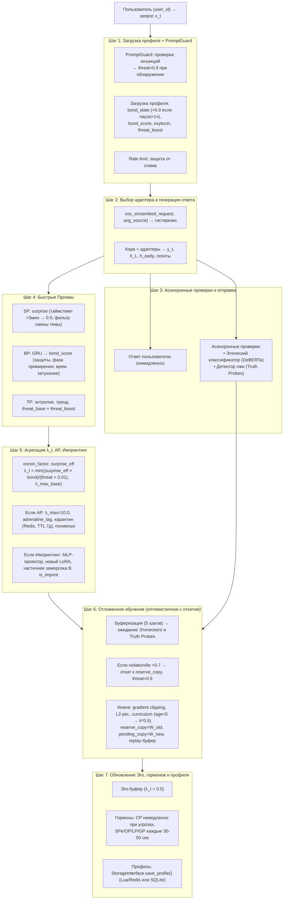

# Полный конвейер онлайн-шага

## Назначение

**Онлайн-конвейер** — это сердце Galatea. Именно здесь, на каждом такте диалога, сходятся все компоненты:

- Кора и Гиппокамп,
- все 11 Призм,
- Этический классификатор,
- Эго-контур,
- механизмы защиты.

Всё работает **асинхронно и распределённо**, чтобы обеспечить минимальную задержку ответа при максимальной глубине анализа.

---

## Шаг 1: Приём запроса и загрузка профиля

| Подшаг | Действие |
|:------:|:---------|
| 1 | Пользователь отправляет запрос `x_t` с идентификатором `user_id`. |
| 2 | Проверка **PromptGuard** (детектор промпт-инъекций). При обнаружении инъекции: `threat_score = 0.9`, ответ заменяется на предупреждение, обучение блокируется. |
| 3 | Проверка **rate limit** (защита от спама). При превышении — ответ с просьбой подождать, шаг завершён. |
| 4 | Загрузка профиля через `StorageInterface.get_profile()`: `bond_state`, `bond_score`, `oxytocin_level`, `learning_enabled`, `threat_boost`, `active_adapters`. |
| 5 | Если профиль помечен `deleted = True` — обслуживается как новый пользователь (без персонализации). |
| 6 | Если `last_active > 1 час`, скрытое состояние `bond_state` (`s_t`) умножается на **0.9** (временное затухание BP). |
| 7 | Обновление `last_active = now()`. |

---

## Шаг 2: Выбор адаптера и генерация ответа

| Подшаг | Действие |
|:------:|:---------|
| 1 | Для каждого персонального адаптера вычисляется косинусное сходство эмбеддинга запроса с усреднённым эмбеддингом `source_embeddings`. |
| 2 | Выбор адаптера: если максимальное сходство `> 0.6` — активируется адаптер с максимальным сходством; иначе — адаптер с наивысшим `protection_score`. **Гистерезис:** переключение только после 2 шагов лидерства. |
| 3 | Общие адаптеры (Этап 2+): активируются только те, чей эмбеддинг имеет сходство `> 0.4` с запросом, не более 2 одновременно. |
| 4 | Инференс Коры (Llama-3 8B/70B + consolidation LoRA + выбранные адаптеры). Получаем: |
|   | — `y_t` — текст ответа, |
|   | — `h_L` — скрытое состояние последнего слоя, |
|   | — `h_early` — скрытое состояние после 4-го блока (для SP), |
|   | — логиты ответа (для TP и Этического классификатора). |

---

## Шаг 3: Асинхронные проверки и немедленная отправка ответа

| Подшаг | Действие |
|:------:|:---------|
| 1 | **Пользователь немедленно получает ответ `y_t`** (задержка не увеличивается). |
| 2 | Параллельно запускаются асинхронные задачи: |
|   | — Этический классификатор (DeBERTa INT8) проверяет `y_t` на нарушения. |
|   | — Детектор лжи (Truth Probes) проверяет активации Коры на противоречия. |
|   | Результаты будут получены через ~10–50 мс и использованы в Шаге 6. |

---

## Шаг 4: Вычисление сигналов быстрых Призм

### SP (Удивление)

| Условие | Действие |
|:--------|:---------|
| Пауза `> 5` минут | `surprise_score = 0.5` (нейтральное значение) |
| Иначе (MVP) | `surprise_score = 1 - cos(embed_current, avg_embed_last_5)` |
| Этап 2+ | `f_pred` → `e_pred` → сравнение с `e_actual` |
| Фильтр ложного удивления | Если `cosine_distance(e_actual, e_prev) > 0.7` → `surprise_score *= 0.3` |

### BP (Близость)

```python
s_t = GRU(s_{t-1} * (0.9 если пауза > 1ч), [e_user; e_response])
bond_score = σ(MLP_bond(s_t))
```

**Защиты BP:**
- Режим скепсиса (при взлёте > 0.5 за сессию).
- Детектор повторов (косинусное сходство `s_t` > 0.95 трижды → занижение на 30%).
- Учёт разнообразия (низкая дисперсия `surprise_score` замедляет рост `bond`).
- Фаза примирения (буст +0.05 за шаг при восстановлении).

`bond_state` обновляется в профиле.

### TP (Угроза) — быстрая оценка

| Вход | Описание |
|:-----|:---------|
| Энтропия `H_t` | Текущая энтропия логитов |
| Тренд энтропии | За последние 20 шагов |
| `h_early` | Ранние слои Коры |
| Эмбеддинги | Запрос и ответ |

```python
threat_base = σ(MLP_threat(...))
threat_score = threat_base + threat_boost
```

---

## Шаг 5: Агрегация λ_t и проверка AP/Импринтинга

### Базовый λ_t

```python
orexin_factor = 1.0 + 0.3 * (orexin - 0.5)   # диапазон 0.85–1.15
surprise_eff = surprise_score * orexin_factor
λ_t = min( (surprise_eff * bond_score) / (threat_score + 0.01), λ_max_base )
```

где `λ_max_base = 4.0 + 2.0 * serotonin` (4.0–6.0).

### Проверка AP (Адреналин)

| Условие | Действие |
|:--------|:---------|
| `surprise > порог`, `bond > порог`, `threat < 0.5` (с учётом curriculum learning), лимиты не превышены | `λ_t` пересчитывается с `λ_max = 10.0` и ×2.0 |
| | `adrenaline_tag = True` |
| | Событие → карантин (Redis, TTL 7 дней) |
| | `threat_boost = +0.2` на 5 шагов (похмелье) |

### Проверка Импринтинга

| Условие | Действие |
|:--------|:---------|
| AP сработал **ИЛИ** (`bond > 0.95` и `threat < 0.2`) | `h_avg = mean(h_L по всем токенам ответа)` |
| + лимиты (≤3, cooldown 24ч, threat_recent ≤ 0.6) | `v = L2_norm(MLP_256_ReLU_projector(h_avg)) * 0.1` |
| | Новый LoRA (ранг 8): `B[:,0] = v`, `A` = шум |
| | Частичная заморозка B: `lr_imprint = α_base * 0.01` |
| | `is_imprint = True`, `protection = 0.995`, немедленная активация |

---

## Шаг 6: Отложенное обучение Гиппокампа (оптимистичное с откатом)

| Подшаг | Действие |
|:------:|:---------|
| 1 | Пара `(запрос, ответ, λ_t)` помещается в буфер. |
| 2 | Для элементов, достигших возраста **5 шагов**: |
|   | **Ожидание результатов Этического классификатора и Truth Probes.** |
|   | Если `violation_score > 0.7` или `lie_score > 0.7`: |
|   | — `threat_score = 0.9` (принудительно). |
|   | — Обучение блокируется. |
|   | — Если адаптер уже обновлён (есть `pending_copy`) → откат к `reserve_copy`. |
|   | Иначе: |
|   | — Gradient clipping (норма 1.0), L2-регуляризация. |
|   | — Curriculum learning: `age < 5 → lr *= 0.5`. |
|   | — `W_adapt += α_base * λ_t * gradient`. |
|   | — `reserve_copy = W_old`, `pending_copy = W_new`. |
| 3 | Пример добавляется в replay-буфер (если `λ_t` высок, приоритет по `surprise_score`). |

---

## Шаг 7: Обновление Эго-контура, гормонов и профиля

| Подшаг | Действие |
|:------:|:---------|
| 1 | Если `λ_t > 0.5` или событие адреналиновое → добавляется в **Эго-буфер**. |
| 2 | **Медленные гормоны** (SPe, CP, OP, LP, GP) пересчитываются централизованно по таймеру (каждые 30–50 секунд). |
|   | CP обновляется **немедленно** при угрозах. |
| 3 | Профиль атомарно сохраняется через `StorageInterface.save_profile()` (Lua-скрипт в Redis на Этапе 2+). |

---

## Схема



---

## Связи с другими компонентами

| Компонент | Связь |
|:-----------|:-------|
| [Гиппокамп — управление адаптерами](./hippocampus_management.md) | Выбор и обучение адаптеров |
| [Быстрые Призмы (SP, BP, TP)](./fast_prisms.md) | Вычисление сигналов в Шаге 4 |
| [Призма Адреналина и Импринтинг](./adrenaline_imprinting.md) | AP и импринтинг в Шаге 5 |
| [Мотивационные Призмы (Орексин)](./motivational_prisms.md) | Влияние на `surprise_eff` |
| [Медленные Призмы (Серотонин, Кортизол)](./slow_prisms.md) | `λ_max_base` и обновление гормонов |
| [Эго-контур, Нарратив и Якоря](./ego_narrative.md) | Эго-буфер в Шаге 7 |
| [Профиль пользователя и Окситоцин](./oxytocin_profile.md) | Загрузка и сохранение профиля |
| [Зеркало и Золотой стандарт](./mirror_ethics_golden.md) | Этический классификатор и Truth Probes |

---

## Содержание

- [Введение](../README.md)
- [Архитектурный обзор](./overview.md)

#### Философия и ядро

- [Общая философия, Кора и Гиппокамп](./philosophy_cortex_hippocampus.md)
- [Гиппокамп — управление адаптерами](./hippocampus_management.md)

#### Призмы (гормональная система)

- [Быстрые Призмы — SP, BP, TP](./fast_prisms.md)
- [Призма Адреналина и Импринтинг](./adrenaline_imprinting.md)
- [Мотивационные Призмы — OP, LP, GP, EP](./motivational_prisms.md)

#### Личность и память

- [Эго-контур, Нарратив и Якоря](./ego_narrative.md)
- [Профиль пользователя и Окситоцин](./oxytocin_profile.md)

#### Защита идентичности

- [Зеркало, Этический классификатор и Золотой стандарт](./mirror_ethics_golden.md)

#### Цикл Сна

- [Цикл Сна (Hypnos)](./sleep_hypnos.md)

#### Дорожная карта реализации

- [Этап 0.5 — предобучение и калибровка Призм](./stage_0.5.md)
- [Этап 1 — MVP с одним пользователем](./stage_1.md)
- [Этап 2 — многопользовательский режим, Redis, базовый Сон](./stage_2.md)
- [Этап 3 — полная Консолидация, Зеркало, детектор дрейфа](./stage_3.md)
- [Этап 4 — продакшен-подготовка, юр. рамка, A/B-тест](./stage_4.md)
- [Сводная дорожная карта и стек технологий](./roadmap.md)

#### Тестирование и риски

- [Симуляции, тестирование и ключевые сценарии](./simulation_testing.md)
- [Полный реестр рисков](./risk_register.md)

#### Эволюция и эксплуатация

- [Долговременная эволюция и замена Коры](./model_migration.md)
- [Производительность, масштабирование и отказоустойчивость](./performance_scaling.md)
- [Юридические, этические и UX-аспекты](./legal_ethical_ux.md)

---

*Этот документ описывает полный конвейер онлайн-обработки одного шага диалога в Galatea — от входа запроса до обновления всех внутренних состояний системы.*
