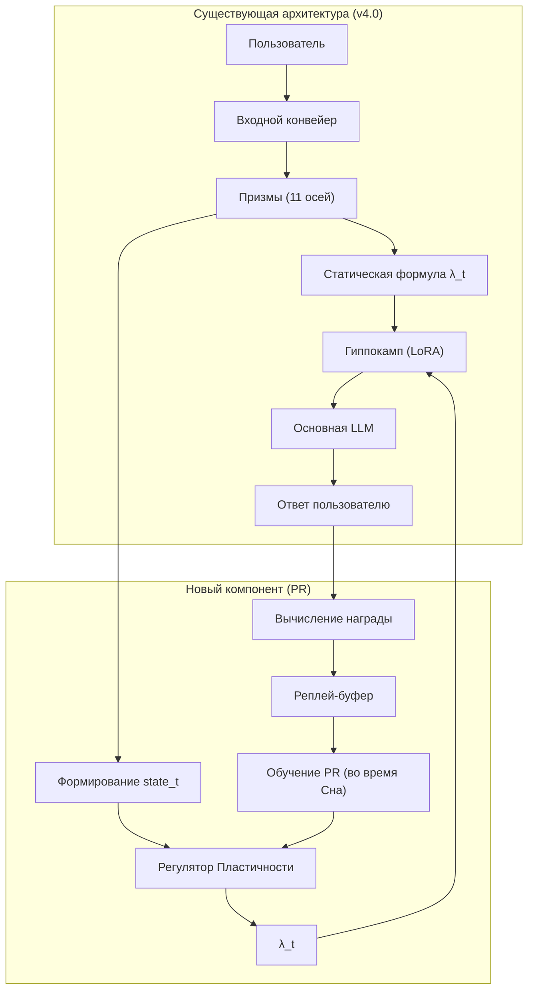
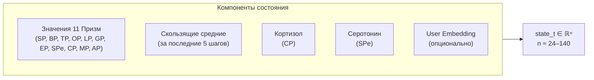
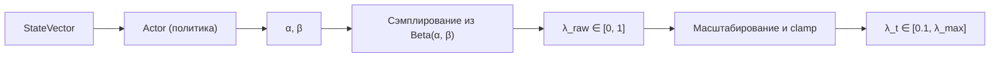
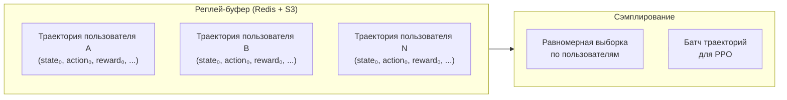
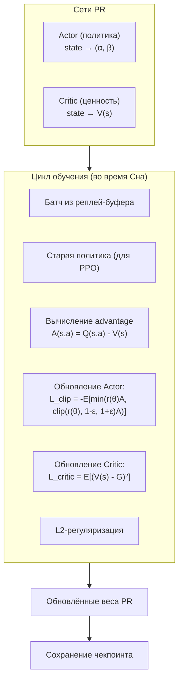
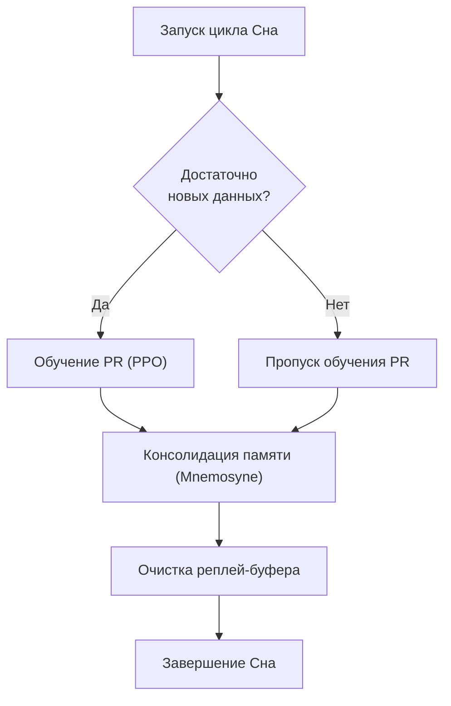
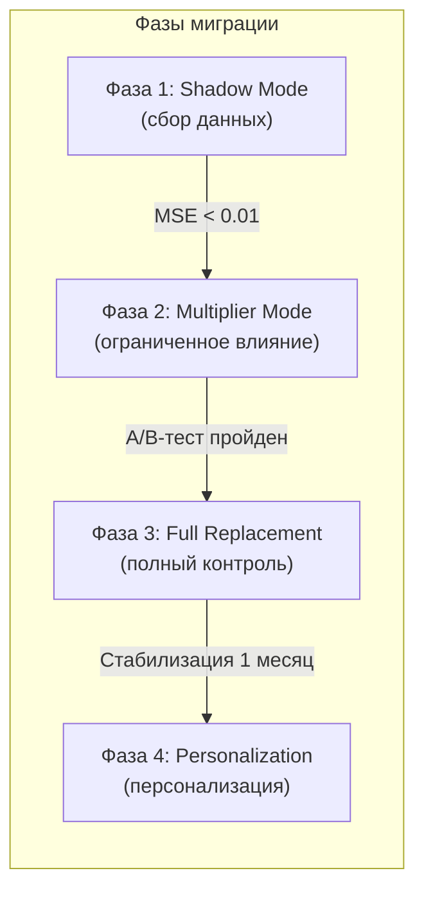

# Миграция на Регулятор Пластичности (PR) — Архитектурный план

## Введение

### Что такое Регулятор Пластичности (PR)?

**Регулятор Пластичности (Plasticity Regulator, PR)** — это обучаемая мета-сеть, которая заменяет статическую формулу вычисления коэффициента пластичности `λ_t`. В текущей архитектуре (v4.0) `λ_t` вычисляется по фиксированной формуле на основе значений Призм и гормонов:

```python
λ_t = min( (surprise_eff * bond_score) / (threat_score + ε), λ_max_base )
```

Эта формула — результат человеческой инженерии, она хорошо работает, но имеет фундаментальные ограничения:

1. **Статичность.** Формула не может адаптироваться к новым паттернам взаимодействия, которые разработчики не предусмотрели.
2. **Отсутствие долгосрочной оптимизации.** Формула учитывает только текущий шаг, не оценивая последствия решения о пластичности через день или неделю.
3. **Отсутствие персонализации.** Один и тот же коэффициент пластичности не подходит всем пользователям.
4. **Ручная калибровка.** Каждое изменение коэффициентов требует экспериментов и анализа.

PR призван решить эти ограничения, обучаясь на реальных траекториях диалогов и оптимизируя `λ_t` для максимизации долгосрочных метрик (retention, удовлетворённость, безопасность).

---

### Место PR в архитектуре Galatea

PR является **надстройкой** над существующим конвейером. Он не заменяет Призмы и не вмешивается в работу Коры или Гиппокампа напрямую. Его единственная задача — выдавать значение `λ_t`, которое затем используется для масштабирования шага обучения LoRA-адаптеров.



**Ключевое:** PR не заменяет Призмы. Призмы остаются источником данных о взаимодействии. PR просто учится интерпретировать эти данные лучше, чем статическая формула.

---

## Архитектура Регулятора Пластичности

### 1. Состояние (State)

На каждом шаге диалога PR получает вектор состояния, который агрегирует всю релевантную информацию о текущем контексте.



| Компонент | Источник | Размерность | Почему включён |
|:----------|:---------|:-----------:|:---------------|
| Значения 11 Призм | SP, BP, TP, OP, LP, GP, EP, SPe, CP, MP, AP | 11 | Текущее состояние системы |
| Скользящие средние (за 5 шагов) | Вычисляются онлайн | 11 | Динамика — тренды, а не мгновенные значения |
| Кортизол | CP | 1 | Уровень стресса системы |
| Серотонин | SPe | 1 | Эмоциональный фон |
| User Embedding | Отдельная сеть или выход Коры | 64–128 | Персонализация (Фаза 4) |

**Почему скользящие средние?** Они дают PR информацию о динамике — растёт ли близость, падает ли угроза. Это позволяет PR принимать решения, учитывая тренд, а не только мгновенные значения. Если bond_score резко вырос, но среднее за 5 шагов низкое — это может быть аномалией, а не устойчивым улучшением.

**Почему кортизол и серотонин вынесены отдельно, если они уже есть в 11 Призмах?** Они включены в 11 Призм, но в состоянии они выделены отдельно, потому что PR должен иметь к ним лёгкий доступ без парсинга всего вектора. Это упрощает архитектуру сети.

---

### 2. Действие (Action)

PR выдаёт параметры **бета-распределения** `α` и `β`, из которого сэмплируется `λ_t`. На практике для ускорения инференса (в режиме эксплуатации) мы можем брать среднее `λ_t = α / (α + β)`, но для исследования (во время обучения) используется сэмплирование.



```python
action = {
    "alpha": float,   # > 0, параметр формы бета-распределения
    "beta": float,    # > 0, параметр формы бета-распределения
    "lambda": float   # 0.1 .. 10.0 (после clamp)
}
```

**Почему бета-распределение?** Оно определено на интервале [0, 1], что удобно для масштабирования на нужный диапазон `λ`. Оно также позволяет регулировать дисперсию (α и β управляют формой распределения), что важно для исследования/эксплуатации. При α=β=1 распределение равномерное (максимальное исследование). При α≫β распределение сосредоточено около 1 (высокая пластичность). При α≪β — около 0 (низкая пластичность).

**Guardrail (жёсткое ограничение):** После сэмплирования `λ_t` обрезается до допустимого диапазона `[λ_min, λ_max]`, где `λ_min = 0.1`, а `λ_max` динамический (обычно 10.0, но может быть снижен при высоком кортизоле или других сигналах тревоги).

---

### 3. Награда (Reward)

Награда — это сигнал, который PR оптимизирует. Она вычисляется на каждом шаге и после завершения сессии.

**Шаговая награда (instant reward):**

```python
r_instant = α * bond_score - β * threat_score - γ * abs(λ_t - λ_{t-1})
```

| Компонент | Коэффициент | Почему |
|:----------|:-----------:|:-------|
| `bond_score` | +α (≈1.0) | Поощрение за близость — хорошие отношения должны вести к обучению |
| `threat_score` | -β (≈2.0) | Штраф за угрозу — безопасность важнее обучения |
| `abs(λ_t - λ_{t-1})` | -γ (≈0.5) | Штраф за резкие изменения — плавность важна для стабильности |

**Финальная награда (после сессии):**

| Компонент | Описание |
|:----------|:---------|
| `retention` | Вернулся ли пользователь в течение суток (1 или 0) |
| `session_duration` | Длительность сессии в минутах (нормированная) |
| `avg_bond` | Средний bond_score за сессию |
| `threat_events` | Количество срабатываний Этического классификатора (штраф) |

**Итоговая награда для каждого шага** вычисляется с дисконтированием (γ_discount = 0.99) на основе будущих наград. Это позволяет PR учитывать долгосрочные последствия решений о пластичности.

---

### 4. Реплей-буфер

Хранит траектории всех пользователей для офлайн-обучения PR. Каждая запись — это последовательность `(state_t, action_t, reward_t, next_state_t, done)`. Буфер ограничен по размеру (например, 100 000 шагов) и поддерживает равномерную выборку по пользователям, чтобы предотвратить перекос в сторону активных пользователей.



**Почему равномерная выборка по пользователям?** Если брать случайные шаги из буфера, активные пользователи (с длинными сессиями) будут доминировать в выборке. Это приведёт к переобучению PR под стратегии, которые работают для «болтливых» пользователей, и игнорированию «молчаливых». Равномерная выборка по пользователям гарантирует, что каждый пользователь вносит равный вклад в обучение.

---

### 5. Обучение PR

Используется алгоритм **PPO** (Proximal Policy Optimization) — стандарт для задач с непрерывным действием и дискретными шагами.



**Алгоритм PPO (кратко):**

1. **Actor** — сеть, которая отображает состояние в параметры бета-распределения (α, β). Из этого распределения сэмплируется λ_t.
2. **Critic** — сеть, которая оценивает ценность состояния V(s) — ожидаемую сумму будущих наград.
3. **Advantage** — показывает, насколько действие лучше, чем среднее в данном состоянии: `A(s,a) = Q(s,a) - V(s)`.
4. **Обновление Actor** — PPO использует клиппинг, чтобы обновления были консервативными (не слишком большими шагами).
5. **Обновление Critic** — минимизация MSE между V(s) и реальной суммой наград G.
6. **Регуляризация** — L2-штраф на веса PR для предотвращения переобучения.

**Частота обучения:** раз в сутки (во время Сна), возможно чаще (каждые 6 часов) при достаточном количестве новых данных.

---

### 6. Взаимодействие с циклом Сна (Hypnos)

Цикл Сна выполняет три задачи, связанные с PR:

1. **Обучение PR.** Из реплей-буфера извлекается батч траекторий, запускается PPO-обновление Actor и Critic.
2. **Консолидация памяти.** Как и раньше: Гиппокамп → Кора. PR не влияет на этот процесс напрямую, но его значение λ_t повлияло на то, какие веса были изменены в Гиппокампе, следовательно, и на то, что попадёт в Кору.
3. **Очистка реплей-буфера.** Удаляются слишком старые траектории (старше 30 дней), если буфер переполнен.



---

## Четыре фазы миграции

Переход от статической формулы к PR выполняется поэтапно, чтобы минимизировать риски и сохранить стабильность сервиса.



### Фаза 1: Shadow Mode (Теневой режим) — Этап v4.5

**Цель:** Собрать данные и обучить PR имитировать текущую формулу, не влияя на систему.

| Аспект | Описание |
|:-------|:---------|
| **PR запущен** | Да, но в теневом режиме |
| **Используемая формула** | Статическая (`λ_static`) |
| **Влияние PR** | Нет (только логирование) |
| **Обучение PR** | Имитационное обучение (Behavioral Cloning) |
| **Критерий перехода** | MSE на валидации < 0.01 |

**Behavioral Cloning** — PR учится предсказывать `λ_static` по состоянию. Это даёт тёплый старт, приближая политику PR к уже работающей формуле. Без этого PR начал бы исследовать случайные стратегии, что дестабилизировало бы систему на следующих фазах.

**Мониторинг:** Сравнение распределений `λ_pr` и `λ_static`; корреляция с bond/threat; отсутствие аномалий.

---

### Фаза 2: Multiplier Mode (Режим множителя) — Этап v5.0

**Цель:** Дать PR ограниченное влияние, проверить его в реальных условиях.

| Аспект | Описание |
|:-------|:---------|
| **PR запущен** | Да, в режиме множителя |
| **Используемая формула** | `λ_final = λ_static * clamp(PR_output, 0.5, 2.0)` |
| **Влияние PR** | 50%–200% от статического значения |
| **Обучение PR** | PPO с шаговыми и финальными наградами |
| **Защита** | При 3+ threat-событиях или cortisol > 0.9 PR отключается |
| **Критерий перехода** | A/B-тест (2 недели): retention не ниже, threat не вырос |

**Почему множитель?** Это мягкое внедрение. Даже если PR ошибается, статическая формула остаётся базой, а PR только корректирует её. Это снижает риск катастрофических последствий.

---

### Фаза 3: Full Replacement (Полная замена) — Этап v5.5

**Цель:** Передать PR полный контроль над пластичностью.

| Аспект | Описание |
|:-------|:---------|
| **PR запущен** | Да, в полном режиме |
| **Используемая формула** | `λ_final = λ_pr` (с clamp и fallback) |
| **Влияние PR** | Полный контроль |
| **Обучение PR** | PPO с реплей-буфером (офлайн-дообучение во время Сна) |
| **Защита** | Hard clamp, fallback при аномалиях, автоматический откат |
| **Критерий стабилизации** | Политика стабильна 1 месяц, метрики не упали |

**Реплей-буфер** предотвращает катастрофическое забывание: PR не забывает старые стратегии, которые работали для других пользователей.

---

### Фаза 4: Personalization (Персонализация) — Этап v6.0 (опционально)

**Цель:** Адаптировать PR к индивидуальным пользователям или группам.

| Аспект | Описание |
|:-------|:---------|
| **PR запущен** | Да, с user embedding |
| **Используемая формула** | `λ_final = PR(state, user_embedding)` |
| **Влияние PR** | Полный контроль, персонализированный |
| **Обучение PR** | PPO с user embedding |
| **Критерий успеха** | Улучшение retention для персонализированной группы |

---

## Механизмы безопасности

| Механизм | Описание |
|:---------|:---------|
| **Hard clamp** | Выход PR всегда ограничен `[λ_min, λ_max]`, где `λ_min = 0.1`, `λ_max` динамический (до 10.0). |
| **Fallback** | При обнаружении аномалий (NaN, резкий рост перплексии, серия threat-событий) система автоматически переключается на статическую формулу и алертит администратора. |
| **Откат версии** | Веса PR сохраняются перед каждым обновлением. При падении ключевых метрик ниже порога за сутки происходит автоматический откат на предыдущую стабильную версию. |
| **Аудит** | Еженедельный отчёт о распределении λ_t, корреляции с наградами, количестве срабатываний fallback. |
| **A/B-тестирование** | Все изменения внедряются через A/B-тесты с чёткими критериями успеха. |

---

## Технические требования

| Компонент | Требование |
|:----------|:-----------|
| **Язык** | Python 3.10+ |
| **Библиотеки** | PyTorch (для PR), NumPy |
| **Хранение реплей-буфера** | Redis (горячие данные) + S3 (архивы) |
| **Частота обновления PR** | Раз в сутки (во время Сна) |
| **Время инференса PR** | < 5 мс (сеть из 2–3 слоёв) |
| **Логирование** | Все действия PR логируются в Elasticsearch |


*Этот документ описывает архитектуру и план миграции на Регулятор Пластичности. Следующий документ — [План выполнения PR](./pr_migration_execution.md) — содержит детальный план реализации с компонентами, форматами и временными характеристиками.*

---

## Связи с другими компонентами

| Компонент | Связь |
|:----------|:------|
| [Быстрые Призмы (SP, BP, TP)](./fast_prisms.md) | Поставляют значения для состояния PR |
| [Медленные Призмы (SPe, CP, MP)](./slow_prisms.md) | Поставляют кортизол и серотонин для состояния PR |
| [Гиппокамп — управление адаптерами](./hippocampus_management.md) | Получает λ_t от PR для масштабирования обучения |
| [Цикл Сна (Hypnos)](./sleep_hypnos.md) | Время обучения PR (во время Сна) |
| [Этический классификатор](./mirror_ethics_golden.md) | Fallback при срабатывании Этического классификатора |
| [Профиль пользователя и Окситоцин](./oxytocin_profile.md) | Данные о пользователе для персонализации |

---

## Содержание

- [Введение](../README.md)
- [Архитектурный обзор](./overview.md)

#### Философия и ядро

- [Общая философия, Кора и Гиппокамп](./philosophy_cortex_hippocampus.md)
- [Гиппокамп — управление адаптерами](./hippocampus_management.md)
- [Полный конвейер онлайн-шага](./pipeline.md)

#### Призмы (гормональная система)

- [Быстрые Призмы — SP, BP, TP](./fast_prisms.md)
- [Призма Адреналина и Импринтинг](./adrenaline_imprinting.md)
- [Мотивационные Призмы — OP, LP, GP, EP](./motivational_prisms.md)

#### Личность и память

- [Эго-контур, Нарратив и Якоря](./ego_narrative.md)
- [Профиль пользователя и Окситоцин](./oxytocin_profile.md)

#### Защита идентичности

- [Зеркало, Этический классификатор и Золотой стандарт](./mirror_ethics_golden.md)

#### Цикл Сна

- [Цикл Сна (Hypnos)](./sleep_hypnos.md)

#### Дорожная карта реализации

- [Этап 0.5 — предобучение и калибровка Призм](./stage_0.5.md)
- [Этап 1 — MVP с одним пользователем](./stage_1.md)
- [Этап 2 — многопользовательский режим, Redis, базовый Сон](./stage_2.md)
- [Этап 3 — полная Консолидация, Зеркало, детектор дрейфа](./stage_3.md)
- [Этап 4 — продакшен-подготовка, юр. рамка, A/B-тест](./stage_4.md)
- [Сводная дорожная карта и стек технологий](./roadmap.md)

#### Тестирование и риски

- [Симуляции, тестирование и ключевые сценарии](./simulation_testing.md)
- [Полный реестр рисков](./risk_register.md)

#### Эволюция и эксплуатация

- [Долговременная эволюция и замена Коры](./model_migration.md)
- [Производительность, масштабирование и отказоустойчивость](./performance_scaling.md)
- [Юридические, этические и UX-аспекты](./legal_ethical_ux.md)

---
