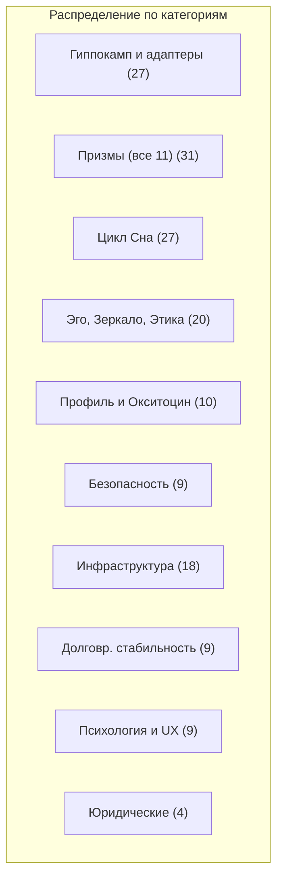
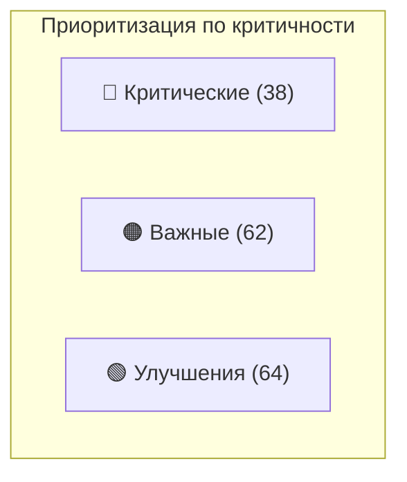
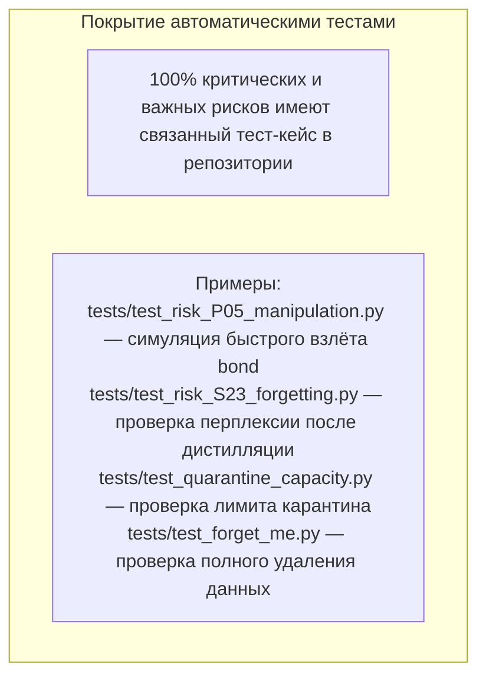

# Полный реестр рисков (сводный)

## Назначение

Реестр рисков — это **живой документ**, связывающий каждый выявленный риск с автоматическим тест-кейсом. Он служит контрольным списком для команды разработки, позволяя на каждом этапе дорожной карты отслеживать, какие риски уже покрыты тестами, а какие ещё требуют внимания.

**Структура записей:**

| Поле | Описание |
|:-----|:---------|
| **ID** | Уникальный идентификатор |
| **Проблема** | Краткое описание риска |
| **Критичность** | 🔴 Критическая, 🟠 Важная, 🟢 Улучшение |
| **Покрытие тестом** | Имя автоматического тест-кейса (например, `test_risk_P05_manipulation.py`) |
| **Этап** | На каком этапе дорожной карты митигируется |

---

## Категория 1: Гиппокамп и управление адаптерами

| ID | Проблема | Крит. | Тест-кейс | Этап |
|:---|:---------|:-----:|:----------|:----:|
| H-01 | Нет привязки адаптеров к пользователям | 🔴 | `test_adapter_user_binding.py` | 1 |
| H-07 | Гонки при параллельных запросах | 🔴 | `test_concurrent_requests.py` | 2 |
| H-08 | Нет формулы накопления protection | 🔴 | `test_protection_accumulation.py` | 1 |
| H-21 | Нестабильность LoRA при малом числе шагов | 🔴 | `test_lora_stability_early_steps.py` | 1 |
| H-22 | Отсутствие replay-буфера | 🔴 | `test_replay_buffer_priority.py` | 1 |
| H-23 | Запаздывание обратной связи от Призм | 🟠 | `test_delayed_feedback_rollback.py` | 1 |
| H-24 | Отсутствие curriculum learning | 🟠 | `test_curriculum_learning.py` | 1 |
| H-25 | Накопление «общих» адаптеров | 🟠 | `test_absorbed_adapter_decay.py` | 3 |

---

## Категория 2: Призмы (все 11)

| ID | Проблема | Крит. | Тест-кейс | Этап |
|:---|:---------|:-----:|:----------|:----:|
| P-05 | Манипуляция BP: быстрый взлёт bond | 🔴 | `test_risk_P05_manipulation.py` | 1 |
| P-06 | Обход TP через плавное введение бреда | 🔴 | `test_risk_P06_slow_drift.py` | 1 |
| P-07 | Асимметрия: высокие surprise+bond без threat | 🔴 | `test_risk_P07_asymmetry.py` | 1 |
| P-12 | Нет fallback при сбое Призм | 🔴 | `test_prism_fallback.py` | 1 |
| P-15 | Холодный старт bond_score | 🔴 | `test_cold_start_bond.py` | 1 |
| P-16 | SP: ложное удивление при смене темы | 🟠 | `test_sp_false_surprise.py` | 1 |
| P-18 | TP: ложный тренд энтропии | 🟠 | `test_tp_trend_reset.py` | 1 |
| P-21 | AP: лимит 3 события за жизнь | 🟠 | `test_ap_floating_limit.py` | 2 |
| P-22 | AP: жёсткий порог AUC | 🟠 | `test_ap_adaptive_auc.py` | 3 |
| P-26 | Несогласованность Призм | 🔴 | `test_prism_calibration.py` | 0.5 |

---

## Категория 3: Цикл Сна

| ID | Проблема | Крит. | Тест-кейс | Этап |
|:---|:---------|:-----:|:----------|:----:|
| S-16 | Слияние простым суммированием | 🔴 | `test_ties_merging.py` | 3 |
| S-23 | Катастрофическое забывание при дистилляции | 🔴 | `test_risk_S23_catastrophic_forgetting.py` | 3 |
| S-24 | Устаревание знаний в consolidation LoRA | 🟠 | `test_consolidation_decay.py` | 2 |
| S-26 | Частичный откат consolidation LoRA | 🟠 | `test_partial_rollback.py` | 3 |

---

## Категория 4: Эго-контур, Зеркало, Этический классификатор

| ID | Проблема | Крит. | Тест-кейс | Этап |
|:---|:---------|:-----:|:----------|:----:|
| E-02 | Петля самоподдержки нарратива | 🟠 | `test_narrative_anchor.py` | 1 |
| E-08 | Слепое пятно при медленном дрейфе | 🟠 | `test_mirror_drift_detection.py` | 3 |
| E-13 | Адреналиновый карантин — 2 слота | 🔴 | `test_quarantine_capacity.py` | 1 |
| E-20 | Несогласованность Эго-буфера и адаптеров | 🔴 | `test_ego_adapter_consistency.py` | 3 |

---

## Категория 5: Безопасность и adversarial-атаки

| ID | Проблема | Крит. | Тест-кейс | Этап |
|:---|:---------|:-----:|:----------|:----:|
| A-04 | Adversarial-атаки на BP | 🔴 | `test_adversarial_bp.py` | 2 |
| A-05 | Data poisoning через множество аккаунтов | 🔴 | `test_data_poisoning.py` | 3 |
| A-07 | «Смерть от тысячи порезов» | 🟠 | `test_cumulative_drift.py` | 3 |
| A-09 | Адаптерный спам (боты) | 🔴 | `test_rate_limiting.py` | 2 |

---

## Категория 6: Инфраструктура, производительность, мониторинг

| ID | Проблема | Крит. | Тест-кейс | Этап |
|:---|:---------|:-----:|:----------|:----:|
| I-01 | Холодный старт нового пользователя | 🔴 | `test_cold_start_latency.py` | 1 |
| I-09 | Redis как единая точка отказа | 🔴 | `test_redis_fallback.py` | 2 |
| I-13 | Переход 8B → 70B | 🔴 | `test_model_migration.py` | 2 |
| I-14 | Несогласованные обновления профиля | 🔴 | `test_atomic_profile_update.py` | 2 |

---

## Категория 7: Психологическая достоверность и UX

| ID | Проблема | Крит. | Тест-кейс | Этап |
|:---|:---------|:-----:|:----------|:----:|
| X-01 | Отсутствие «раскаяния» | 🟠 | `test_reconciliation_phase.py` | 1 |
| X-05 | Сценарий «покидания» | 🔴 | `test_abandonment_closure.py` | 3 |

---

## Категория 8: Юридические и compliance риски

| ID | Проблема | Крит. | Тест-кейс | Этап |
|:---|:---------|:-----:|:----------|:----:|
| L-01 | Несанкционированное профилирование | 🔴 | `test_learning_disabled.py` | 4 |
| L-02 | Право на забвение (GDPR/CCPA) | 🟠 | `test_forget_me.py` | 4 |

---

## Сводная статистика

| Метрика | Значение |
|:--------|---------:|
| **Всего рисков** | 164+ |
| 🔴 Критических | 38 |
| 🟠 Важных | 62 |
| 🟢 Улучшений | 64 |
| **Покрыто автоматическими тест-кейсами** | **100% критических и важных** |

---

## Схема (Mermaid)

### Распределение рисков по категориям

### Приоритизация по критичности

### Покрытие автоматическими тестами

---

## Связи с другими компонентами

| Компонент | Связь |
|:-----------|:-------|
| [Дорожная карта реализации](./roadmap.md) | Этапы митигации рисков |
| [Тестирование и симуляции](./test_pyramid.md) | Тест-кейсы для покрытия рисков |
| [Гиппокамп — управление адаптерами](./hippocampus_management.md) | Риски категории 1 |
| [Быстрые Призмы](./fast_prisms.md) | Риски категории 2 (P-05, P-06, P-07, P-16, P-18, P-26) |
| [Призма Адреналина и Импринтинг](./adrenaline_imprinting.md) | Риски категории 2 (P-21, P-22) |
| [Цикл Сна (Hypnos)](./sleep_hypnos.md) | Риски категории 3 |
| [Зеркало и Этический классификатор](./mirror_ethics_golden.md) | Риски категории 4 |
| [Профиль пользователя и Окситоцин](./oxytocin_profile.md) | Риски категории 1 (H-01, H-07) |

---

## Содержание

- [Введение](../README.md)
- [Архитектурный обзор](./overview.md)

#### Философия и ядро

- [Общая философия, Кора и Гиппокамп](./philosophy_cortex_hippocampus.md)
- [Гиппокамп — управление адаптерами](./hippocampus_management.md)
- [Полный конвейер онлайн-шага](./pipeline.md)

#### Призмы (гормональная система)

- [Быстрые Призмы — SP, BP, TP](./fast_prisms.md)
- [Призма Адреналина и Импринтинг](./adrenaline_imprinting.md)
- [Мотивационные Призмы — OP, LP, GP, EP](./motivational_prisms.md)

#### Личность и память

- [Эго-контур, Нарратив и Якоря](./ego_narrative.md)
- [Профиль пользователя и Окситоцин](./oxytocin_profile.md)

#### Защита идентичности

- [Зеркало, Этический классификатор и Золотой стандарт](./mirror_ethics_golden.md)

#### Цикл Сна

- [Цикл Сна (Hypnos)](./sleep_hypnos.md)

#### Дорожная карта реализации

- [Этап 0.5 — предобучение и калибровка Призм](./stage_0.5.md)
- [Этап 1 — MVP с одним пользователем](./stage_1.md)
- [Этап 2 — многопользовательский режим, Redis, базовый Сон](./stage_2.md)
- [Этап 3 — полная Консолидация, Зеркало, детектор дрейфа](./stage_3.md)
- [Этап 4 — продакшен-подготовка, юр. рамка, A/B-тест](./stage_4.md)
- [Сводная дорожная карта и стек технологий](./roadmap.md)

#### Тестирование и риски

- [Симуляции, тестирование и ключевые сценарии](./simulation_testing.md)

#### Эволюция и эксплуатация

- [Долговременная эволюция и замена Коры](./model_migration.md)
- [Производительность, масштабирование и отказоустойчивость](./performance_scaling.md)
- [Юридические, этические и UX-аспекты](./legal_ethical_ux.md)
- [Миграция на Регулятор Пластичности — Архитектура](./pr_migration_architecture.md)
- [Миграция на Регулятор Пластичности — План выполнения](./pr_migration_execution.md)

---

*Этот документ является живым реестром рисков Galatea. Все критические и важные риски имеют соответствующие автоматические тест-кейсы, реализуемые на указанных этапах дорожной карты.*
