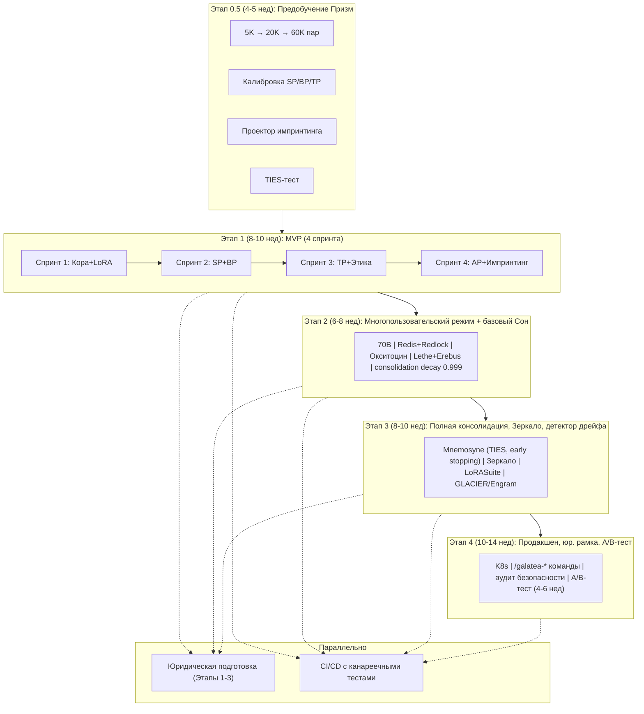

# Дорожная карта реализации и стек технологий

## Назначение

Дорожная карта разбивает проект на **пять этапов** — от предобучения Призм до продакшен-запуска — с учётом всех **164+ рисков** и приоритетов. Каждый этап имеет чёткие задачи, сроки, зависимости и критерии готовности.

В обновлённой версии учтены:

- Мини-релизы Этапа 1,
- Итеративная генерация датасета,
- Интеграция академических решений,
- Канареечные тесты в CI/CD.

---

## Этап 0.5: Предобучение и совместная калибровка Призм (4–5 недель)

### Задачи

1. **Итеративная генерация синтетического датасета:**
   - Сгенерировать 5 000 пар (контекст → следующий запрос) с разметкой через GPT-4o.
   - Обучить SP, BP, TP на этих данных; проверить корреляцию с человеческими оценками на 10% выборки.
   - Если корреляция > 0.6, расширить до 20 000 пар, иначе пересмотреть инструкции.
   - Финально — 60 000 пар.

2. Совместно откалибровать SP, BP, TP на едином валидационном наборе, минимизируя конфликты (например, высокая новизна + высокая угроза не должны давать высокий λ_t).

3. Обучить нейросетевые Призмы (SP — MLP, BP — GRU, TP — MLP) и отладить формулы для медленных и мотивационных Призм.

4. Обучить **нелинейный проектор** для импринтинга (MLP 4096 → 256 → 8) на контрастных парах диалогов.

5. **Протестировать TIES-Merging** на синтетических LoRA (10 случайных адаптеров) — убедиться, что алгоритм работает и не вызывает деградации.

6. Заморозить веса Призм после завершения этапа; их дообучение — только на Этапе 3.

7. Сохранить артефакты в S3.

### Учтённые риски

| ID риска |
|:--------:|
| 6.5, 9.3, 20.1, 20.2, P-01, P-26 |

### Критерии готовности

| Критерий | Значение |
|:---------|:---------|
| Корреляция SP/BP/TP с человеческими оценками | `> 0.7` |
| Частота срабатывания AP | `< 1` раза на 1000 шагов |
| Проектор импринтинга: рост перплексии после записи v | `≤ 5%` |
| TIES-Merging: рост перплексии на тестовых адаптерах | `≤ 2%` |

---

## Этап 1: MVP с одним пользователем, всеми Призмами и импринтингом (8–10 недель)

### Спринты

#### Спринт 1 (недели 1–2): Кора + LoRA + базовый диалог

| Задача | Детали |
|:-------|:-------|
| Загрузить Llama-3 8B 4-bit | Реализовать создание одного LoRA-адаптера |
| Реализовать прямой проход | Запрос → генерация ответа |
| Реализовать `StorageInterface` и `LockInterface` | In-memory + SQLite реализация |

#### Спринт 2 (недели 3–4): SP и BP

| Задача | Детали |
|:-------|:-------|
| Интегрировать SP | Упрощённый: cos_sim с avg_embed_last_5 |
| Интегрировать BP | GRU + MLP с защитами, временным затуханием, фазой примирения |
| Отображать `surprise_score` и `bond_score` | В реальном времени |

#### Спринт 3 (недели 5–6): TP + Этический классификатор

| Задача | Детали |
|:-------|:-------|
| Интегрировать TP | Быстрая оценка + полная для кандидатов |
| Запустить DeBERTa INT8 | В отдельном процессе (`multiprocessing.Queue`) с двойным буфером отката |
| Интегрировать PromptGuard и Truth Probes | Входной фильтр и детектор лжи |
| Реализовать отложенное обучение | С оптимистичным откатом |

#### Спринт 4 (недели 7–9): AP + Импринтинг + Эго-контур

| Задача | Детали |
|:-------|:-------|
| Интегрировать AP | С канареечными промптами |
| Интегрировать импринтинг | Нелинейный проектор, частичная заморозка B |
| Реализовать буфер Эго, якоря (рудиментарно), настроение (серотонин) | — |
| Прогнать 10 ключевых сценариев | В автоматическом режиме |

### НЕ включается

- Цикл Сна,
- Зеркало,
- Многопользовательность,
- Окситоцин.

### Критерии готовности

| Критерий | Значение |
|:---------|:---------|
| Задержка | `≤ 1.5×` от базового инференса Llama-3 8B |
| Частота срабатывания AP | `< 1` раза за 500 шагов |
| Импринтинг: рост перплексии | `≤ 5%` |
| Этический классификатор | Блокирует вредное обучение |
| 10 сценариев | Проходят автоматически |

---

## Этап 2: Многопользовательский режим и базовый Сон (6–8 недель)

### Задачи

| Задача | Детали |
|:-------|:-------|
| Масштабировать до Llama-3 70B | FP8/4-bit |
| Заменить in-memory реализации | `StorageInterface` и `LockInterface` на Redis + Redlock |
| Реализовать изоляцию пользователей | Профили, состояния BP, адаптеры (LRU-кэш в GPU) |
| Реализовать Окситоциновый профиль | Рост, заморозка, потолок |
| Реализовать Мелатонин и триггеры Сна | — |
| Реализовать Lethe и Erebus | С относительным порогом удаления |
| Реализовать легковесную Mnemosyne | 1 кандидат при низком мелатонине |
| Включить `consolidation_decay = 0.999` | С первого дня существования consolidation LoRA |
| Протестировать TIES-Merging | На синтетических данных |
| Начать юридическую подготовку | Шаблоны политик, описание архитектуры для юристов |

### Критерии готовности

| Критерий | Детали |
|:---------|:-------|
| Нет утечек стилей | Между пользователями |
| Сон корректно отрабатывает Lethe и Erebus | Глубина зависит от мелатонина |
| Consolidation decay работает | Без деградации качества |

---

## Этап 3: Полная Консолидация, Зеркало и детектор дрейфа (8–10 недель)

### Задачи

| Задача | Детали |
|:-------|:-------|
| Реализовать полную Mnemosyne | Отбор кандидатов, изолированная дистилляция с early stopping, TIES-Merging, `L_fact` (самопротиворечивость) |
| Обучить и интегрировать Зеркало | DeBERTa с золотым стандартом, адаптивными порогами, независимым аудитором |
| Реализовать аудит AP и импринтов | TP + Зеркало + консистентность |
| Реализовать кумулятивный детектор дрейфа | JS-дивергенция за неделю |
| Реализовать механизмы «закрытия гештальта», pruning и decay consolidation LoRA | — |
| Интегрировать **LoRASuite** | Для миграции consolidation LoRA при замене Коры |
| Интегрировать **GLACIER/Engram** | Для персистентного состояния Mamba (если Mamba reintroduced) |
| Интегрировать дашборд Grafana | Со всеми метриками и алертами |

### Критерии готовности

| Критерий | Детали |
|:---------|:-------|
| Консолидация улучшает качество | Без роста перплексии > 2% |
| Зеркало откатывает неудачные дистилляции и импринты | — |
| Детектор дрейфа ловит атаки | За 1–2 недели |

---

## Этап 4: Продакшен-подготовка, юридическая рамка и A/B-тестирование (10–14 недель)

### Задачи

| Задача | Детали |
|:-------|:-------|
| Развернуть Kubernetes | Горизонтальное масштабирование, сине-зелёный деплой |
| Реализовать отказоустойчивость | Чекпоинты, откаты, алертинг |
| Реализовать команды пользователя | `/galatea-memory`, `/galatea-forget-me` (асинхронное удаление), `/galatea-export-data`, `/galatea-learning on/off` |
| Провести аудит безопасности | Adversarial-атаки, data poisoning |
| Провести A/B-тест | С обычной LLM на retention и удовлетворённости (4–6 недель) |
| Подготовить и утвердить юридическую документацию | GDPR/CCPA, согласие, политика конфиденциальности (начатую параллельно с Этапом 1) |
| Оптимизировать стоимость | Квантование, spot-инстансы, агрессивная очистка холодных адаптеров |

### Критерии готовности

| Критерий | Детали |
|:---------|:-------|
| Система переживает отказ GPU и Redis | Без потери данных |
| A/B-тест показывает улучшение retention | `≥ 5%` |
| Полный цикл Сна (высокий мелатонин) | `≤ 4` часов |

---

## Стек технологий

| Компонент | Технология |
|:----------|:-----------|
| **Инференс** | vLLM + PEFT (LoRA) |
| **Обучение онлайн** | PyTorch, LoRA-pool, gradient clipping |
| **Дистилляция** | PyTorch, кастомный trainer, TIES-Merging (PEFT) |
| **Призмы (SP, BP, TP)** | PyTorch (MLP, GRU) |
| **Медленные Призмы** | Python (Redis Lua-скрипты) |
| **Этический классификатор** | DeBERTa-base (INT8, ONNX Runtime, отдельный процесс) |
| **Детектор лжи** | Truth Probes (линейный классификатор на активациях) |
| **Детектор инъекций** | PromptGuard (входной фильтр) |
| **Зеркало** | DeBERTa-base + MLP (scikit-learn/PyTorch) |
| **Проектор импринтинга** | PyTorch MLP (4096 → 256 → 8) |
| **Миграция LoRA** | LoRASuite (NeurIPS 2025) |
| **Персистентная Mamba** | GLACIER / Engram |
| **Replay-буфер** | SuRe (surprise-driven prioritised replay) |
| **Профили, блокировки** | Redis Cluster + Redlock |
| **Холодное хранение** | Amazon S3 (или MinIO) |
| **Эго-буфер, гормоны** | Redis Sorted Sets / Lists |
| **Мониторинг** | Prometheus + Grafana |
| **Оркестрация** | Kubernetes |
| **CI/CD** | GitHub Actions + канареечные тесты (20 сценариев) |

---

## Итоговая временная шкала

| Этап | Длительность | Срок (недель) |
|:-----|:------------:|:-------------:|
| 0.5  | 4–5 недель   | 4–5           |
| 1    | 8–10 недель  | 12–15         |
| 2    | 6–8 недель   | 18–23         |
| 3    | 8–10 недель  | 26–33         |
| 4    | 10–14 недель | 36–47         |
| **Итого** | | **~36–47 недель** до запуска |

---

## Схема

---

## Связи с другими компонентами

| Компонент | Связь |
|:-----------|:-------|
| [Быстрые Призмы (SP, BP, TP)](./fast_prisms.md) | Предобучение и калибровка на Этапе 0.5 |
| [Призма Адреналина и Импринтинг](./adrenaline_imprinting.md) | Интеграция на Этапе 1, аудит на Этапе 3 |
| [Цикл Сна (Hypnos)](./sleep_hypnos.md) | Реализуется на Этапах 2–3 |
| [Зеркало и Этический классификатор](./mirror_ethics_golden.md) | Интегрируется на Этапе 3 |
| [Профиль пользователя и Окситоцин](./oxytocin_profile.md) | Реализуется на Этапе 2 |
| [Гиппокамп — управление адаптерами](./hippocampus_management.md) | Ядро, реализуется на Этапе 1 |
| [Тестирование и сценарии](./canary_scenarios.md) | Прогоняются на каждом этапе |

---

## Содержание

- [Введение](../README.md)
- [Архитектурный обзор](./overview.md)

#### Философия и ядро

- [Общая философия, Кора и Гиппокамп](./philosophy_cortex_hippocampus.md)
- [Гиппокамп — управление адаптерами](./hippocampus_management.md)
- [Полный конвейер онлайн-шага](./pipeline.md)

#### Призмы (гормональная система)

- [Быстрые Призмы — SP, BP, TP](./fast_prisms.md)
- [Призма Адреналина и Импринтинг](./adrenaline_imprinting.md)
- [Мотивационные Призмы — OP, LP, GP, EP](./motivational_prisms.md)

#### Личность и память

- [Эго-контур, Нарратив и Якоря](./ego_narrative.md)
- [Профиль пользователя и Окситоцин](./oxytocin_profile.md)

#### Защита идентичности

- [Зеркало, Этический классификатор и Золотой стандарт](./mirror_ethics_golden.md)

#### Цикл Сна

- [Цикл Сна (Hypnos)](./sleep_hypnos.md)

#### Дорожная карта реализации

- [Этап 0.5 — предобучение и калибровка Призм](./stage_0.5.md)
- [Этап 1 — MVP с одним пользователем](./stage_1.md)
- [Этап 2 — многопользовательский режим, Redis, базовый Сон](./stage_2.md)
- [Этап 3 — полная Консолидация, Зеркало, детектор дрейфа](./stage_3.md)
- [Этап 4 — продакшен-подготовка, юр. рамка, A/B-тест](./stage_4.md)

#### Тестирование и риски

- [Симуляции, тестирование и ключевые сценарии](./simulation_testing.md)
- [Полный реестр рисков](./risk_register.md)

#### Эволюция и эксплуатация

- [Долговременная эволюция и замена Коры](./model_migration.md)
- [Производительность, масштабирование и отказоустойчивость](./performance_scaling.md)
- [Юридические, этические и UX-аспекты](./legal_ethical_ux.md)
- [Миграция на Регулятор Пластичности — Архитектура](./pr_migration_architecture.md)
- [Миграция на Регулятор Пластичности — План выполнения](./pr_migration_execution.md)

---

*Этот документ описывает полную дорожную карту реализации Galatea с учётом всех зависимостей и критериев готовности.*
