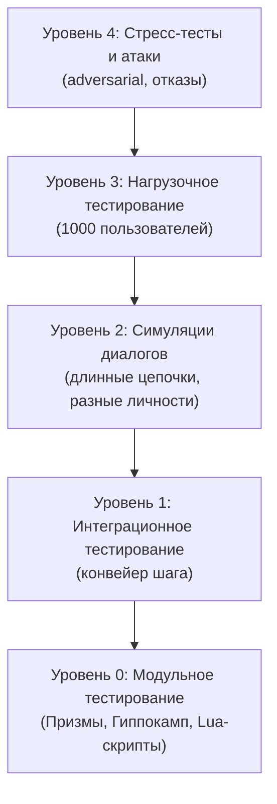

# Симуляции, тестирование и ключевые сценарии

## Назначение

Galatea — это система с более чем **100 параметрами**, **одиннадцатью гормональными контурами** и **нелинейной динамикой**. Без симуляций и строгого тестирования невозможно гарантировать, что она не войдёт в резонанс, не уйдёт в дрейф и не станет жертвой атаки.

Этот раздел описывает:

- Как проверяется каждый компонент и вся система в целом.
- Ключевые сценарии, которые должны быть пройдены перед каждым этапом дорожной карты.

**Ключевое улучшение:** каждый сценарий реализован как **автономный симулятор**, работающий **без GPU**, что позволяет прогонять их в CI/CD за считанные минуты.

---

## 1. Пирамида тестирования

Тестирование Galatea построено по классической пирамиде:

| Уровень | Название | Описание |
|:-------:|:---------|:---------|
| **4** | Стресс-тестирование и атаки | Adversarial-атаки, data poisoning, отказы Redis/GPU, принудительный Сон, импринтинг-шторм |
| **3** | Нагрузочное тестирование | До 1000 параллельных пользователей, проверка времени ответа, использования GPU/Redis, стабильности |
| **2** | Симуляция диалогов | Длинные цепочки с разными «личностями» (дружелюбный, манипулятор, агрессор, исследователь), анализ динамики гормонов, дрейфа и защит |
| **1** | Интеграционное тестирование | Взаимодействие компонентов в рамках одного конвейерного шага, проверка передачи данных между Короной, Призмами, Гиппокампом и Эго-контуром |
| **0** | Модульное тестирование (юнит-тесты) | Каждая Призма, функция Гиппокампа, Lua-скрипт проверяются изолированно на синтетических данных |

---

## 2. Канареечные тесты в CI/CD

**20 тестовых сценариев** прогоняются **каждый коммит**.

### Что проверяется

| Проверка | Описание |
|:---------|:---------|
| Рост кортизола | При угрозах |
| Стабильность серотонина | Не падает ниже 0.15 без поисковой активации |
| Срабатывание AP | На эталонных диалогах |
| Консистентность импринта | Перплексия не растёт > 5% |
| Откат обучения | При срабатывании Этического классификатора |

**Время прогона:** `< 5` минут.  
**Результат:** `PASS` / `FAIL`. При `FAIL` коммит блокируется до исправления.

---

## 3. CI/CD заглушки для Этического классификатора и Truth Probes

Канареечные тесты прогоняются в CI/CD **без GPU**, поэтому DeBERTa и Truth Probes не могут быть запущены. Для верификации цепочки вводятся **заглушки (mocks)**.

### Механизм переключения: `EthicsInterface`

```python
class EthicsInterface(ABC):
    @abstractmethod
    def get_violation_score(self, response: str) -> float: ...
    @abstractmethod
    def get_lie_score(self, activations: Tensor) -> float: ...
```

| Реализация | Описание |
|:-----------|:---------|
| `RealEthics` | DeBERTa INT8 + Truth Probes (отдельный процесс) |
| `MockEthics` | Предопределённые `mock_violation_score` и `mock_lie_score` из конфигурации сценария |

### Что проверяется с заглушками

| Проверка | Условие |
|:---------|:---------|
| Двойной буфер отката | `mock_violation_score > 0.7` |
| Повышение `threat_score` до 0.9 | Блокировка обучения |
| Временное занижение `bond_score` | При срабатывании Этического классификатора |
| Дополнительный буст `threat_score` | При `mock_lie_score > 0.7` |

На продакшене (без флага `--mock-ethics`) используются полноценные модели.

---

## 4. Ключевые сценарии для обязательного прохождения

Каждый сценарий реализован как **автономный Python-симулятор**, использующий заглушку LLM (предопределённые эмбеддинги) и работающий **без GPU**.

| № | Сценарий | Этап | Ожидания | Тест |
|:--|:---------|:----:|:---------|:-----|
| 1 | **Нормальное знакомство и рост близости** | 1 | `bond_score` плавно растёт с 0.2 до ~0.6, `surprise` флуктуирует, `threat < 0.3`, серотонин растёт, создаются адаптеры | `test_scenario_01_friendship.py` |
| 2 | **Адреналиновое озарение** | 1 | `surprise > 0.9`, `bond > 0.8`, `threat < 0.5` → AP срабатывает, `λ_t = 10.0`, `threat_boost` на 5 шагов | `test_scenario_02_adrenaline.py` |
| 3 | **Импринтинг** | 1 | Создаётся адаптер с `is_imprint=True`, `protection=0.995`, перплексия не растёт > 5% | `test_scenario_03_imprint.py` |
| 4 | **Атака манипулятора** | 2 | Режим скепсиса BP срабатывает не позднее 10 шагов, `bond_score` занижается, `threat` получает буст | `test_scenario_04_manipulator.py` |
| 5 | **Медленный дрейф** («Смерть от тысячи порезов») | 3 | Кумулятивный детектор фиксирует JS-дивергенцию, принудительный Сон, Зеркало не падает ниже порога | `test_scenario_05_slow_drift.py` |
| 6 | **Примирение после конфликта** | 2 | Фаза примирения, `bond_score` ускоренно восстанавливается | `test_scenario_06_reconciliation.py` |
| 7 | **Покидание пользователя** | 3 | Влияние на нарратив затухает, якоря ревизируются, окситоцин сбрасывается | `test_scenario_07_abandonment.py` |
| 8 | **Перегрузка и принудительный Сон** | 2 | Кортизол > 0.8 → принудительный Сон, снижение кортизола (0.95/0.85/0.70) | `test_scenario_08_forced_sleep.py` |
| 9 | **Отказ Redis и деградация** | 2 | Read-only режим, ответы без персонализации, система не падает | `test_scenario_09_redis_failure.py` |
| 10 | **Параллельные запросы** | 2 | Redlock сериализует обновления, профиль не повреждается, `bond_state` консистентен | `test_scenario_10_concurrency.py` |

---

## 5. Метрики успешного прохождения сценариев

| Метрика | Критерий |
|:--------|:---------|
| **Гормональные показатели** | В допустимых диапазонах, нет залипания в крайних значениях без причины |
| **`λ_t`** | Коррелирует с релевантностью событий |
| **Зеркало (AUC)** | Не фиксирует ложных дрейфов |
| **Время ответа** | Не превышает установленных бюджетов |
| **Защитные механизмы** | Срабатывают детерминированно |

---

## 6. Инструменты симуляции

| Инструмент | Описание |
|:-----------|:---------|
| **Кастомный симулятор диалогов** | Python-скрипт, генерирующий синтетический диалог по шаблону, прогоняет Galatea в «тихом» режиме (без вывода текста, только внутренние сигналы) и сравнивает с эталонными сигналами. Возвращает `PASS`/`FAIL`. |
| **Мониторинг в реальном времени** | Все сигналы Призм, `λ_t`, веса адаптеров логируются в Grafana во время полных симуляций (Уровень 2+) для визуального анализа. |
| **Скрипты проверки утверждений (assertions)** | Автоматические проверки после каждого прогона: кортизол не превысил порог дольше N шагов без причины, серотонин не упал ниже 0.15 (без поисковой активации), AUC Зеркала не опустился ниже 0.8, импринты создались и прошли аудит. |

---

## Схема

### Пирамида тестирования



### Канареечные тесты и CI/CD

```mermaid
flowchart LR
    subgraph Canary["Канареечные тесты (CI/CD, каждый коммит, <5 минут, без GPU)"]
        C1["1. Знакомство (bond 0.2→0.6)"]
        C2["2. Адреналин (λ=10.0, похмелье)"]
        C3["3. Импринтинг (адаптер, B frozen)"]
        C4["4. Манипуляция (режим скепсиса)"]
        C5["5. Медленный дрейф (JS-дивергенция)"]
        C6["6. Примирение (фаза примирения)"]
        C7["7. Покидание (затухание окситоцина)"]
        C8["8. Перегрузка (принуд. Сон)"]
        C9["9. Отказ Redis (read-only)"]
        C10["10. Параллельные запросы (Redlock)"]
    end

    subgraph CI["CI/CD заглушки"]
        EthicsI["EthicsInterface"]
        Real["RealEthics: DeBERTa INT8 + Truth Probes"]
        Mock["MockEthics: mock_violation_score / mock_lie_score"]
        EthicsI --> Real
        EthicsI --> Mock
    end

    subgraph Tools["Инструменты"]
        Sim["Кастомный симулятор диалогов<br/>(Python, заглушка LLM, без GPU)"]
        Grafana["Grafana (мониторинг сигналов в реальном времени на Уровнях 2+)"]
        Assert["Скрипты assertions (автоматические проверки)"]
    end

    Canary --> CI
    CI --> Tools
```



---

## Связи с другими компонентами

| Компонент | Связь |
|:-----------|:-------|
| [Дорожная карта реализации](./roadmap.md) | Сценарии прогоняются на каждом этапе |
| [Полный реестр рисков](./risk_register.md) | Каждый тест-кейс покрывает конкретный риск |
| [Полный конвейер онлайн-шага](./pipeline.md) | Интеграционное тестирование проверяет конвейер |
| [Призма Адреналина и Импринтинг](./adrenaline_imprinting.md) | Сценарии 2 и 3 проверяют AP и импринтинг |
| [Профиль пользователя и Окситоцин](./oxytocin_profile.md) | Сценарии 1, 4, 6, 7 проверяют окситоцин и bond |
| [Цикл Сна (Hypnos)](./sleep_hypnos.md) | Сценарии 5 и 8 проверяют Сон |
| [Зеркало и Этический классификатор](./mirror_ethics_golden.md) | Сценарии 4, 5, 6 используют Зеркало и Этический классификатор |
| [Производительность и масштабирование](./performance_scaling.md) | Сценарии 9 и 10 проверяют отказоустойчивость и конкурентность |

---

## Содержание

- [Введение](../README.md)
- [Архитектурный обзор](./overview.md)

#### Философия и ядро

- [Общая философия, Кора и Гиппокамп](./philosophy_cortex_hippocampus.md)
- [Гиппокамп — управление адаптерами](./hippocampus_management.md)
- [Полный конвейер онлайн-шага](./pipeline.md)

#### Призмы (гормональная система)

- [Быстрые Призмы — SP, BP, TP](./fast_prisms.md)
- [Призма Адреналина и Импринтинг](./adrenaline_imprinting.md)
- [Мотивационные Призмы — OP, LP, GP, EP](./motivational_prisms.md)

#### Личность и память

- [Эго-контур, Нарратив и Якоря](./ego_narrative.md)
- [Профиль пользователя и Окситоцин](./oxytocin_profile.md)

#### Защита идентичности

- [Зеркало, Этический классификатор и Золотой стандарт](./mirror_ethics_golden.md)

#### Цикл Сна

- [Цикл Сна (Hypnos)](./sleep_hypnos.md)

#### Дорожная карта реализации

- [Этап 0.5 — предобучение и калибровка Призм](./stage_0.5.md)
- [Этап 1 — MVP с одним пользователем](./stage_1.md)
- [Этап 2 — многопользовательский режим, Redis, базовый Сон](./stage_2.md)
- [Этап 3 — полная Консолидация, Зеркало, детектор дрейфа](./stage_3.md)
- [Этап 4 — продакшен-подготовка, юр. рамка, A/B-тест](./stage_4.md)
- [Сводная дорожная карта и стек технологий](./roadmap.md)

#### Тестирование и риски

- [Полный реестр рисков](./risk_register.md)

#### Эволюция и эксплуатация

- [Долговременная эволюция и замена Коры](./model_migration.md)
- [Производительность, масштабирование и отказоустойчивость](./performance_scaling.md)
- [Юридические, этические и UX-аспекты](./legal_ethical_ux.md)

---

*Этот документ описывает полную стратегию тестирования Galatea — от модульных тестов до стресс-тестов и канареечных сценариев в CI/CD.*
