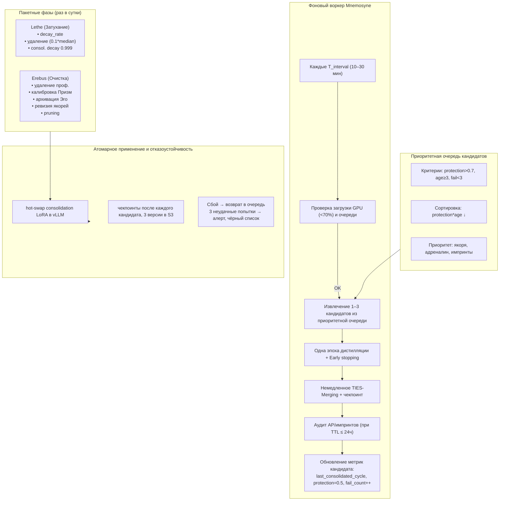

# Цикл Сна (Hypnos) — Инкрементальная консолидация, Lethe и Erebus

## Назначение

Цикл Сна — это непрерывный фоновый процесс, в котором Galatea:

- **Забывает шум** (Lethe),
- **Переносит важный опыт** в долговременную память Коры через микроконсолидации (Mnemosyne),
- **Очищает мусор** (Erebus).

В отличие от классического «тяжёлого ночного окна», Сон в Galatea работает **инкрементально**: небольшие порции консолидации выполняются каждые 10–30 минут, когда система находится под низкой нагрузкой. **Consolidation decay** (`0.999`) применяется с Этапа 2, как только появляется консолидация, чтобы предотвратить накопление «окаменелостей» в consolidation LoRA.

---

## 1. Фоновый воркер микроконсолидации (Mnemosyne)

Mnemosyne реализована как **отдельный фоновый процесс**, который просыпается каждые `T_interval` (по умолчанию 10 минут). Логика пробуждения:

| Шаг | Действие |
|:---:|:---------|
| 1 | **Проверка загрузки системы.** Если загрузка GPU > 70% или длина очереди пользовательских запросов превышает порог, микроконсолидация пропускается. |
| 2 | **Извлечение кандидатов** из приоритетной очереди (см. раздел 2). |
| 3 | **Одна эпоха дистилляции** для каждого кандидата. |
| 4 | **Немедленное слияние** результата в consolidation LoRA через TIES-Merging. |
| 5 | **Аудит адреналиновых/импринт-событий** — если TTL события подходит к концу (≤ 24 часа), аудит выполняется вне очереди. |
| 6 | **Обновление метрик** кандидата: `last_consolidated_cycle`, снижение `protection` до 0.5 при успехе, `fail_count++` при провале. |

---

## 2. Приоритетная очередь кандидатов

Адаптер попадает в очередь сразу после того, как удовлетворяет критериям отбора:

| Критерий | Значение |
|:---------|:---------|
| `protection` | `> 0.7` |
| `age` | `>= 3` |
| `fail_count` | `< 3` |

**Сортировка:** по убыванию `protection * age` (самые важные адаптеры первыми).  
**Дополнительный приоритет:** якоря, адреналиновые и импринт-адаптеры.

---

## 3. Адаптивная агрессивность через Мелатонин (MP)

Вместо одного массивного Сна, Мелатонин регулирует **частоту и интенсивность** микроконсолидаций:

| Уровень мелатонина | `T_interval` | Кандидатов за цикл | Эпох на кандидата |
|:------------------:|:------------:|:------------------:|:-----------------:|
| Низкий (0–0.3)     | 30 мин       | 1                  | 1                 |
| Средний (0.3–0.7)  | 15 мин       | до 2               | 1                 |
| Высокий (0.7–1.0)  | 10 мин       | до 3               | до 2              |

Это даёт адаптивность без пиковых нагрузок.

---

## 4. Изолированная дистилляция (одна эпоха)

Для каждого кандидата:

1. Создаётся временный LoRA `temp_i` (ранг 64).
2. Строится контрастный датасет (до 128 позитивных и 128 негативных примеров, кэшированных из `source_embeddings`).
3. Измеряется **baseline перплексия**.
4. **Одна эпоха дистилляции:**

   ```python
   L_total = mean(L_pos) + β * mean(L_neg) + γ * L_lm + δ * L_fact
   ```

   где `L_fact` — штраф за самопротиворчивость.

5. **Early stopping:** если после эпохи валидационная перплексия выросла > 0.5% от baseline, кандидат возвращается в очередь с пониженным приоритетом и `fail_count++`.
6. Проверки качества: валидационная перплексия, Зеркало (AUC > порога), TP на примерах датасета.

---

## 5. Слияние и чекпоинты

Успешный `temp_i` немедленно сливается в consolidation LoRA через **TIES-Merging**. После каждого слияния сохраняется промежуточный чекпоинт consolidation LoRA. Если финальная проверка провалена — откат к предыдущему чекпоинту.

---

## 6. Аудит адреналиновых событий и импринтов

Выполняется по правилам (TP, Зеркало, консистентность), но не в рамках одного массивного Сна, а по мере приближения TTL события к концу. Приоритет у событий с TTL ≤ 24 часа.

---

## 7. Lethe и Erebus (пакетные, раз в сутки)

### Lethe (Затухание)

| Параметр | Значение |
|:---------|:---------|
| **`decay_rate`** | `base_decay * (1 - protection) * time_factor(age)`, `base_decay = 0.005` (0.0075 при `cortisol > 0.7`) |
| **Якоря** | `base_decay = 1e-5`, `protection = 0.995` |
| **Адреналиновые / импринты** (до аудита) | `decay_rate = 0` |
| **Порог удаления** | норма `< 0.1 * median_norm` (при пустом Гиппокампе порог = 0.001) |
| **Обновление** | `protection *= 0.999`, `consolidation_decay = 0.999` |

### Erebus (Очистка)

- Удаление неактивных профилей (`> 60` дней, медиана `bond < 0.4`).
- Калибровка Призм.
- Архивация Эго-буфера.
- Ревизия якорей (каждые 10 циклов).
- Pruning consolidation LoRA.

---

## 8. Атомарное применение и отказоустойчивость

| Механизм | Детали |
|:---------|:-------|
| **Hot-swap** | После каждого слияния consolidation LoRA атомарно применяется через hot-swap регистра адаптеров в vLLM. |
| **Чекпоинты** | Сохраняются после каждого кандидата. Три последние версии + ежемесячные снапшоты в S3. |
| **Сбой микроконсолидации** | Кандидат возвращается в очередь. После трёх неудачных попыток — алерт, кандидат в чёрный список. |

---

## Схема



---

## Связи с другими компонентами

| Компонент | Связь |
|:-----------|:-------|
| [Быстрые Призмы (SP, BP, TP)](./fast_prisms.md) | Поставляют метрики для оценки нагрузки и качества |
| [Призма Адреналина и Импринтинг](./adrenaline_imprinting.md) | Аудит AP и импринтов выполняется во время Mnemosyne |
| [Гиппокамп — управление адаптерами](./hippocampus_management.md) | Адаптеры консолидируются и затухают |
| [Зеркало и Золотой стандарт](./mirror_ethics_golden.md) | Используется при аудите качества дистилляции |
| [Эго-контур, Нарратив и Якоря](./ego_narrative.md) | Архивация Эго-буфера и ревизия якорей |
| [Профиль пользователя и Окситоцин](./oxytocin_profile.md) | Удаление неактивных профилей |

---

## Содержание

- [Введение](../README.md)
- [Архитектурный обзор](./overview.md)

#### Философия и ядро

- [Общая философия, Кора и Гиппокамп](./philosophy_cortex_hippocampus.md)
- [Гиппокамп — управление адаптерами](./hippocampus_management.md)
- [Полный конвейер онлайн-шага](./pipeline.md)

#### Призмы (гормональная система)

- [Быстрые Призмы — SP, BP, TP](./fast_prisms.md)
- [Призма Адреналина и Импринтинг](./adrenaline_imprinting.md)
- [Мотивационные Призмы — OP, LP, GP, EP](./motivational_prisms.md)

#### Личность и память

- [Эго-контур, Нарратив и Якоря](./ego_narrative.md)
- [Профиль пользователя и Окситоцин](./oxytocin_profile.md)

#### Защита идентичности

- [Зеркало, Этический классификатор и Золотой стандарт](./mirror_ethics_golden.md)

#### Дорожная карта реализации

- [Этап 0.5 — предобучение и калибровка Призм](./stage_0.5.md)
- [Этап 1 — MVP с одним пользователем](./stage_1.md)
- [Этап 2 — многопользовательский режим, Redis, базовый Сон](./stage_2.md)
- [Этап 3 — полная Консолидация, Зеркало, детектор дрейфа](./stage_3.md)
- [Этап 4 — продакшен-подготовка, юр. рамка, A/B-тест](./stage_4.md)
- [Сводная дорожная карта и стек технологий](./roadmap.md)

#### Тестирование и риски

- [Симуляции, тестирование и ключевые сценарии](./simulation_testing.md)
- [Полный реестр рисков](./risk_register.md)

#### Эволюция и эксплуатация

- [Долговременная эволюция и замена Коры](./model_migration.md)
- [Производительность, масштабирование и отказоустойчивость](./performance_scaling.md)
- [Юридические, этические и UX-аспекты](./legal_ethical_ux.md)

---

*Этот документ описывает полностью инкрементальный цикл Сна Galatea, обеспечивающий непрерывную консолидацию опыта без пиковых нагрузок и с отказоустойчивостью.*
