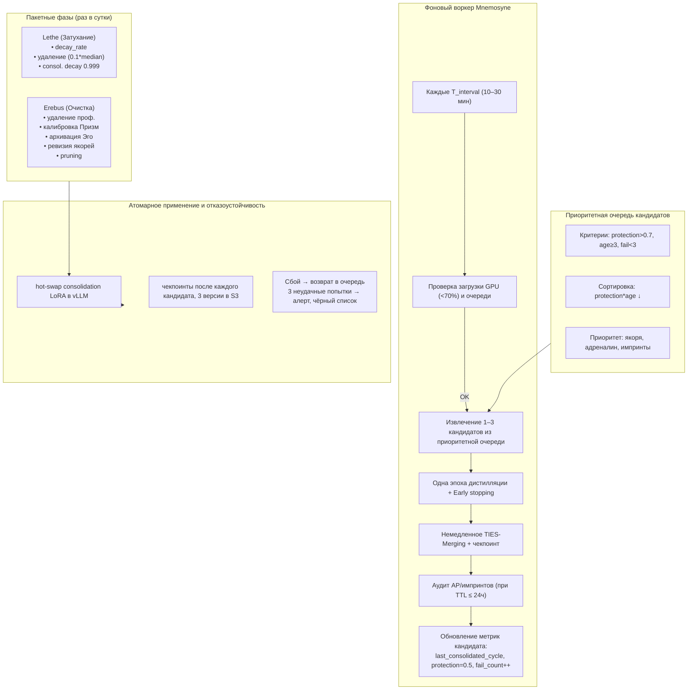

# Цикл Сна (Hypnos) — Инкрементальная консолидация, Lethe и Erebus

## Назначение

Цикл Сна — это непрерывный фоновый процесс, в котором Galatea:

- **Забывает шум** (Lethe),
- **Переносит важный опыт** в долговременную память Коры через микроконсолидации (Mnemosyne),
- **Очищает мусор** (Erebus).

**Почему Сон вообще нужен?** Онлайн-обучение Гиппокампа — это быстрая, эпизодическая память. Она адаптируется к текущему пользователю, но нестабильна: адаптеры могут дрейфовать, зашумляться, накапливать ошибки. Без периодической консолидации система постепенно деградирует: старые адаптеры занимают память, важный опыт смешивается с шумом, а Кора остаётся неизменной. Сон — это механизм, который переводит опыт из эфемерного в постоянное, очищая и структурируя память.

В отличие от классического «тяжёлого ночного окна», Сон в Galatea работает **инкрементально**: небольшие порции консолидации выполняются каждые 10–30 минут, когда система находится под низкой нагрузкой. **Consolidation decay** (`0.999`) применяется с Этапа 2, как только появляется консолидация, чтобы предотвратить накопление «окаменелостей» в consolidation LoRA.

**Почему инкрементально, а не одним массивным процессом?** Классический ночной Сон (4–6 часов непрерывной работы) создаёт пиковые нагрузки, которые требуют дорогого железа и могут конфликтовать с инференсом. Инкрементальный подход распределяет консолидацию во времени: микроконсолидации выполняются в периоды низкой нагрузки, не мешая пользователям. Это дешевле, надёжнее и проще в управлении ресурсами.

---

## 1. Фоновый воркер микроконсолидации (Mnemosyne)

Mnemosyne реализована как **отдельный фоновый процесс**, который просыпается каждые `T_interval` (по умолчанию 10 минут). Логика пробуждения:

| Шаг | Действие |
|:---:|:---------|
| 1 | **Проверка загрузки системы.** Если загрузка GPU > 70% или длина очереди пользовательских запросов превышает порог, микроконсолидация пропускается. |
| 2 | **Извлечение кандидатов** из приоритетной очереди (см. раздел 2). |
| 3 | **Одна эпоха дистилляции** для каждого кандидата. |
| 4 | **Немедленное слияние** результата в consolidation LoRA через TIES-Merging. |
| 5 | **Аудит адреналиновых/импринт-событий** — если TTL события подходит к концу (≤ 24 часа), аудит выполняется вне очереди. |
| 6 | **Обновление метрик** кандидата: `last_consolidated_cycle`, снижение `protection` до 0.5 при успехе, `fail_count++` при провале. |

**Почему проверка загрузки GPU?** Микроконсолидация — это ресурсоёмкий процесс (дистилляция требует GPU-времени). Если GPU уже загружен инференсом пользователей (> 70%), выполнение дистилляции замедлило бы ответы. Проверка загрузки гарантирует, что Сон не мешает основной работе системы.
**Почему только одна эпоха?** Одна эпоха дистилляции — это компромисс между качеством консолидации и временем. Полная консолидация с несколькими эпохами была бы слишком дорогой для микроконсолидаций. Если адаптер важен, он попадёт в очередь снова и получит ещё одну эпоху в следующий раз. Это итеративное улучшение.
**Почему слияние немедленное, а не отложенное?** Если отложить слияние, система могла бы обработать несколько кандидатов, а потом применить их все сразу. Это создало бы пиковую нагрузку и риск: если один кандидат плох, откат затронул бы всех. Немедленное слияние позволяет сразу видеть результат и, при необходимости, откатить только один кандидат.

---

## 2. Приоритетная очередь кандидатов

Адаптер попадает в очередь сразу после того, как удовлетворяет критериям отбора:

| Критерий | Значение |
|:---------|:---------|
| `protection` | `> 0.7` |
| `age` | `>= 3` |
| `fail_count` | `< 3` |

**Сортировка:** по убыванию `protection * age` (самые важные адаптеры первыми).  
**Дополнительный приоритет:** якоря, адреналиновые и импринт-адаптеры.
**Почему `protection > 0.7`?** Это порог «достойности консолидации». Адаптер с protection < 0.7 либо ещё не накопил достаточно опыта, либо был признан неважным. Консолидация такого адаптера — пустая трата ресурсов.
**Почему `age >= 3`?** Адаптер должен пережить как минимум 3 цикла Lethe, чтобы доказать свою устойчивость. Если адаптер исчез бы после первого же затухания, он не заслуживает места в Коре.
**Почему `fail_count < 3`?** Если адаптер провалил консолидацию трижды, он, скорее всего, проблемный. Дальнейшие попытки только тратят ресурсы.
**Почему `protection * age`, а не просто `protection`?** Важность адаптера складывается из его накопленной значимости (`protection`) и его возраста (`age`). Молодой адаптер с высоким protection может быть просто недавним пиком. Старый адаптер с умеренным protection доказал свою устойчивость. Умножение даёт баланс.

---

## 3. Адаптивная агрессивность через Мелатонин (MP)

Вместо одного массивного Сна, Мелатонин регулирует **частоту и интенсивность** микроконсолидаций:

| Уровень мелатонина | `T_interval` | Кандидатов за цикл | Эпох на кандидата |
|:------------------:|:------------:|:------------------:|:-----------------:|
| Низкий (0–0.3)     | 30 мин       | 1                  | 1                 |
| Средний (0.3–0.7)  | 15 мин       | до 2               | 1                 |
| Высокий (0.7–1.0)  | 10 мин       | до 3               | до 2              |

**Почему мелатонин, а не просто фиксированный интервал?** Система не всегда одинаково загружена когнитивно и эмоционально. После интенсивного общения (много адреналиновых событий, высокий средний threat) накапливается больше опыта, который требует консолидации. Мелатонин адаптирует частоту и глубину Сна к текущей нагрузке, предотвращая как перегрузку, так и недогрузку.
**Почему 10–30 минут, а не, скажем, 5 или 60?** 10 минут — это достаточно часто, чтобы система не теряла свежий опыт. 30 минут — достаточно редко, чтобы не создавать лишней нагрузки. Диапазон даёт гибкость.

---

## 4. Изолированная дистилляция (одна эпоха)

Для каждого кандидата:

1. Создаётся временный LoRA `temp_i` (ранг 64).
2. Строится контрастный датасет (до 128 позитивных и 128 негативных примеров, кэшированных из `source_embeddings`).
3. Измеряется **baseline перплексия**.
4. **Одна эпоха дистилляции:**

   ```python
   L_total = mean(L_pos) + β * mean(L_neg) + γ * L_lm + δ * L_fact
   ```

   где `L_fact` — штраф за самопротиворчивость.

5. **Early stopping:** если после эпохи валидационная перплексия выросла > 0.5% от baseline, кандидат возвращается в очередь с пониженным приоритетом и `fail_count++`.
6. Проверки качества: валидационная перплексия, Зеркало (AUC > порога), TP на примерах датасета.
**Почему ранг 64 для временного LoRA?** Временный адаптер должен быть достаточно выразительным, чтобы вместить знания кандидата, но не настолько большим, чтобы дистилляция была слишком дорогой. Ранг 64 — это компромисс между ёмкостью и скоростью.
**Почему `L_fact` (штраф за самопротиворчивость)?** Адаптер не должен противоречить сам себе. Если кандидат даёт ответы на похожие запросы, которые противоречат друг другу, консолидация такого адаптера создаст внутренние конфликты в Коре. `L_fact` штрафует такие случаи.
**Почему Early stopping при росте перплексии > 0.5%?** Если дистилляция ухудшает качество модели (перплексия растёт), это признак того, что кандидат несовместим с Короной. Продолжение дистилляции только ухудшит ситуацию. Ранняя остановка — это защита от деградации.

---

## 5. Слияние и чекпоинты

Успешный `temp_i` немедленно сливается в consolidation LoRA через **TIES-Merging**. После каждого слияния сохраняется промежуточный чекпоинт consolidation LoRA. Если финальная проверка провалена — откат к предыдущему чекпоинту.
**Почему TIES-Merging, а не простое усреднение?** Простое усреднение весов приводит к конфликтам: если два адаптера имеют разные знаки весов, они могут аннигилировать друг друга. TIES-Merging (TrIm, Elect, Sign) разрешает конфликты знаков, сохраняя важные компоненты. Это стандартный алгоритм для слияния LoRA-адаптеров.
**Почему чекпоинты после каждого слияния?** Если финальная проверка провалена, откат должен быть к последнему успешному состоянию, а не к самому первому. Чекпоинты позволяют откатываться на один шаг, а не на всю историю.

---

## 6. Аудит адреналиновых событий и импринтов

Выполняется по правилам (TP, Зеркало, консистентность), но не в рамках одного массивного Сна, а по мере приближения TTL события к концу. Приоритет у событий с TTL ≤ 24 часа.
**Почему аудит по мере приближения TTL, а не сразу?** Адреналиновые события и импринты — это редкие, но важные события. Их аудит требует ресурсов (дистилляция, проверка Зеркалом). Если бы аудит выполнялся сразу после каждого события, система тратила бы ресурсы на каждое, даже если оно окажется ложным. Отложенный аудит позволяет накопить несколько событий и обработать их вместе, экономя ресурсы.

---

## 7. Lethe и Erebus (пакетные, раз в сутки)

### Lethe (Затухание)

| Параметр | Значение |
|:---------|:---------|
| **`decay_rate`** | `base_decay * (1 - protection) * time_factor(age)`, `base_decay = 0.005` (0.0075 при `cortisol > 0.7`) |
| **Якоря** | `base_decay = 1e-5`, `protection = 0.995` |
| **Адреналиновые / импринты** (до аудита) | `decay_rate = 0` |
| **Порог удаления** | норма `< 0.1 * median_norm` (при пустом Гиппокампе порог = 0.001) |
| **Обновление** | `protection *= 0.999`, `consolidation_decay = 0.999` |

**Почему Lethe выполняется раз в сутки, а не непрерывно?** Затухание — это дорогая операция, которая требует обхода всех адаптеров. Выполнять её непрерывно было бы неэффективно. Раз в сутки — достаточно часто, чтобы удалять устаревшие адаптеры, но достаточно редко, чтобы не создавать постоянной нагрузки.
**Почему `decay_rate` зависит от `protection` и `age`?** Важные адаптеры (высокий protection) должны затухать медленнее. Старые адаптеры (большой age) должны затухать быстрее, чтобы освобождать место для новых. `protection` и `age` работают в противофазе: важность защищает, возраст ускоряет забвение.
**Почему порог удаления — относительный (`0.1 * median_norm`), а не абсолютный?** Размер весов адаптеров может меняться в зависимости от архитектуры и обучения. Абсолютный порог (например, 0.01) мог бы быть слишком низким для новых адаптеров или слишком высоким для старых. Относительный порог адаптируется к текущему распределению норм.

### Erebus (Очистка)

- Удаление неактивных профилей (`> 60` дней, медиана `bond < 0.4`).
- Калибровка Призм.
- Архивация Эго-буфера.
- Ревизия якорей (каждые 10 циклов).
- Pruning consolidation LoRA.

**Почему 60 дней?** Это граница между «долгим отсутствием» и «окончательным уходом». 60 дней — достаточный срок, чтобы пользователь мог уйти в отпуск или пережить кризис, не теряя данные. Если за это время не было ни одного взаимодействия и средняя близость упала ниже 0.4, отношения можно считать завершёнными.

---

## 8. Атомарное применение и отказоустойчивость

| Механизм | Детали |
|:---------|:-------|
| **Hot-swap** | После каждого слияния consolidation LoRA атомарно применяется через hot-swap регистра адаптеров в vLLM. |
| **Чекпоинты** | Сохраняются после каждого кандидата. Три последние версии + ежемесячные снапшоты в S3. |
| **Сбой микроконсолидации** | Кандидат возвращается в очередь. После трёх неудачных попыток — алерт, кандидат в чёрный список. |

**Почему hot-swap, а не перезагрузка модели?** Перезагрузка модели заняла бы минуты и прервала бы обслуживание пользователей. Hot-swap позволяет заменить consolidation LoRA на лету, без остановки инференса. vLLM поддерживает этот механизм.
**Почему три последние версии, а не только последняя?** Если последняя версия оказывается дефектной (например, из-за сбоя в дистилляции), две предыдущие версии позволяют откатиться к рабочему состоянию.
**Почему три попытки, а не одна или пять?** Одна попытка слишком мало — сбой может быть случайным. Пять попыток слишком много — система будет тратить ресурсы на заведомо проблемный кандидат. Три — золотая середина.

---

## Схема



---

## Связи с другими компонентами

| Компонент | Связь |
|:-----------|:-------|
| [Быстрые Призмы (SP, BP, TP)](./fast_prisms.md) | Поставляют метрики для оценки нагрузки и качества |
| [Призма Адреналина и Импринтинг](./adrenaline_imprinting.md) | Аудит AP и импринтов выполняется во время Mnemosyne |
| [Гиппокамп — управление адаптерами](./hippocampus_management.md) | Адаптеры консолидируются и затухают |
| [Зеркало и Золотой стандарт](./mirror_ethics_golden.md) | Используется при аудите качества дистилляции |
| [Эго-контур, Нарратив и Якоря](./ego_narrative.md) | Архивация Эго-буфера и ревизия якорей |
| [Профиль пользователя и Окситоцин](./oxytocin_profile.md) | Удаление неактивных профилей |
| [Медленные Призмы (Мелатонин)](./slow_prisms.md) | Регулирует частоту и глубину Сна |

---

## Содержание

- [Введение](../README.md)
- [Архитектурный обзор](./overview.md)

#### Философия и ядро

- [Общая философия, Кора и Гиппокамп](./philosophy_cortex_hippocampus.md)
- [Гиппокамп — управление адаптерами](./hippocampus_management.md)
- [Полный конвейер онлайн-шага](./pipeline.md)

#### Призмы (гормональная система)

- [Быстрые Призмы — SP, BP, TP](./fast_prisms.md)
- [Призма Адреналина и Импринтинг](./adrenaline_imprinting.md)
- [Мотивационные Призмы — OP, LP, GP, EP](./motivational_prisms.md)

#### Личность и память

- [Эго-контур, Нарратив и Якоря](./ego_narrative.md)
- [Профиль пользователя и Окситоцин](./oxytocin_profile.md)

#### Защита идентичности

- [Зеркало, Этический классификатор и Золотой стандарт](./mirror_ethics_golden.md)

#### Цикл Сна

- [Цикл Сна (Hypnos)](./sleep_hypnos.md)

#### Дорожная карта реализации

- [Этап 0.5 — предобучение и калибровка Призм](./stage_0.5.md)
- [Этап 1 — MVP с одним пользователем](./stage_1.md)
- [Этап 2 — многопользовательский режим, Redis, базовый Сон](./stage_2.md)
- [Этап 3 — полная Консолидация, Зеркало, детектор дрейфа](./stage_3.md)
- [Этап 4 — продакшен-подготовка, юр. рамка, A/B-тест](./stage_4.md)
- [Сводная дорожная карта и стек технологий](./roadmap.md)

#### Тестирование и риски

- [Симуляции, тестирование и ключевые сценарии](./simulation_testing.md)
- [Полный реестр рисков](./risk_register.md)

#### Эволюция и эксплуатация

- [Долговременная эволюция и замена Коры](./model_migration.md)
- [Производительность, масштабирование и отказоустойчивость](./performance_scaling.md)
- [Юридические, этические и UX-аспекты](./legal_ethical_ux.md)
- [Миграция на Регулятор Пластичности — Архитектура](./pr_migration_architecture.md)
- [Миграция на Регулятор Пластичности — План выполнения](./pr_migration_execution.md)

---

*Этот документ описывает полностью инкрементальный цикл Сна Galatea, обеспечивающий непрерывную консолидацию опыта без пиковых нагрузок и с отказоустойчивостью. Сон — это не просто технический процесс, а метафора того, как система перерабатывает опыт в личность, забывая шум и сохраняя суть.*
