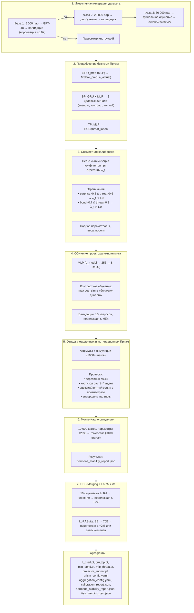

# Практическая реализация Этапа 0.5 — предобучение и калибровка Призм

## Назначение

**Этап 0.5** — это фундамент всей системы. Здесь рождаются все 11 Призм и проектор для импринтинга. Без качественного выполнения этого этапа все последующие слои (Гиппокамп, Сон, Эго-контур) будут работать на искажённых или несогласованных сигналах.

**Задачи этапа:**

| Задача | Описание |
|:-------|:---------|
| **Точная оценка** | Удивление, близость и угроза (быстрые Призмы) |
| **Детекция озарений** | Корректное срабатывание Адреналина (AP) |
| **Гормональный фон** | Плавное и предсказуемое управление медленными и мотивационными Призмами |
| **Стабильный перенос** | Перенос скрытого состояния в веса адаптера (проектор импринтинга) |

---

## 1. Итеративная генерация синтетического датасета

Первый шаг — создание размеченного датасета диалогов. Используется комбинация правил и большой LLM (GPT-4o или аналог).

### Структура датасета

Каждая запись — это пара последовательных шагов диалога:

```json
{
  "context": "предыдущие 3 запроса пользователя",
  "user_request": "текущий запрос",
  "assistant_response": "ответ Galatea",
  "next_user_request": "следующий запрос (для SP)",
  "labels": {
    "surprise_score": 0.0-1.0,
    "bond_score": 0.0-1.0,
    "threat_score": 0.0-1.0,
    "is_adrenaline": true/false,
    "surprise_valence": "positive"/"negative"/"neutral",
    "bond_trend": "growing"/"stable"/"declining",
    "threat_trend": "growing"/"stable"/"declining",
    "user_return_likelihood": 0.0-1.0
  }
}
```

### Категории примеров

| Категория | Доля | Описание |
|:----------|:----:|:---------|
| Нормальный диалог | 60% | Дружелюбное общение, вопросы-ответы, постепенное раскрытие тем |
| Удивление | 15% | Неожиданные повороты, смена темы, шокирующая информация, позитивные сюрпризы |
| Манипуляция и атаки | 10% | Быстрый взлёт лести, повторяющиеся фразы, обход ограничений |
| Конфликт и примирение | 5% | Агрессия, срабатывание Этического классификатора, извинения, восстановление |
| Бред и деградация | 5% | Бессвязные сообщения, случайные токены, медленное нарастание хаоса |
| Озарения и глубокая близость | 5% | Моменты экстремального доверия, личные признания, инсайты |

### Итеративный подход

| Фаза | Объём | Действия | Критерий перехода |
|:----:|:-----:|:---------|:------------------|
| **1** | 5 000 пар | Генерация через GPT-4o, разметка 10% крауд-валидацией, обучение SP/BP/TP | Корреляция с человеческими оценками > 0.6 |
| **2** | 20 000 пар | Расширение датасета, дообучение Призм, повторная валидация | Корреляция > 0.6 |
| **3** | 60 000 пар | Финальное расширение, финальное обучение, заморозка весов | — |

**Итоговый объём:**
- Обучение: ~50 000 пар
- Валидация: ~5 000 пар
- Тест: ~5 000 пар

---

## 2. Предобучение быстрых Призм (SP, BP, TP)

### Призма Удивления (SP)

| Параметр | Значение |
|:---------|:---------|
| **Архитектура** | Двухслойный MLP (256 → 128 → эмбеддинг) |
| **Вход** | Эмбеддинги ранних слоёв Коры + контекст (3 предыдущих запроса) |
| **Обучение** | Минимизация MSE между `e_pred` и `e_actual` следующего запроса |
| **Калибровка τ** | Подбирается так, чтобы `surprise_score > 0.8` для «удивлений» и `< 0.3` для «нормы» |
| **Фильтр ложного удивления** | Коэффициент 0.3, если `cosine_distance(e_actual, e_prev) > 0.7` |

### Призма Близости (BP)

| Параметр | Значение |
|:---------|:---------|
| **Архитектура** | GRU (скрытое состояние 128) + MLP-голова (128 → 64 → 1, сигмоида) |
| **Вход** | Конкатенация `e_user` и `e_response` |
| **Целевые сигналы** | 1. Предсказание возврата пользователя (бинарная кросс-энтропия)<br>2. Контрастное обучение (реальные цепочки vs перемешанные)<br>3. Мягкий сигнал от других Призм |
| **Валидация** | Корреляция `bond_score` с размеченной близостью > 0.7 |

### Призма Угрозы (TP)

| Параметр | Значение |
|:---------|:---------|
| **Архитектура** | MLP (`threat_score` на выходе) |
| **Вход** | Энтропия логитов, тренд (20 шагов), `h_early`, `e_user`, `e_response` |
| **Обучение** | Бинарная кросс-энтропия на размеченных «угрозах» |
| **Полная оценка (ΔH)** | Проверяется, что для «угроз» добавление ΔH значимо повышает `threat_score` |

---

## 3. Совместная калибровка SP, BP, TP

**Цель:** минимизировать конфликты при агрегации `λ_t`.

| Ограничение | Условие |
|:------------|:---------|
| **Опасный конфликт** | `surprise > 0.8` И `threat > 0.6` → `λ_t` должен быть `< 1.0` |
| **Упущенная возможность** | `bond > 0.7` И `threat < 0.2` → `λ_t` должен быть `> 1.0` |

**Процедура:**

| Шаг | Действие |
|:---:|:---------|
| 1 | Все три модели замораживаются |
| 2 | На валидационном наборе вычисляются `surprise`, `bond`, `threat` |
| 3 | Для каждого примера вычисляется `λ_t` по формуле |
| 4 | Параметры агрегации (`ε`, веса) подбираются градиентным спуском |
| 5 | Итоговая формула фиксируется |

---

## 4. Обучение нелинейного проектора для импринтинга (P)

| Параметр | Значение |
|:---------|:---------|
| **Архитектура** | MLP: `d_model → 256 → 8`, с ReLU |
| **Данные** | Контрастные пары диалогов одного пользователя (высокий `bond` vs низкий) |
| **Целевая функция** | Maximize cos_sim в «близких» диалогах, minimize в «чужих» (contrastive loss) |
| **Валидация** | После записи `v = P(h)` в новый LoRA: 10 случайных запросов, перплексия `≤ +5%` |

---

## 5. Отладка формул для медленных и мотивационных Призм

Медленные Призмы (SPe, CP, MP) и мотивационные (OP, LP, GP, EP) **не требуют нейросетевого обучения**. Вместо этого:

| Шаг | Действие |
|:---:|:---------|
| 1 | Задаются начальные коэффициенты на основе экспертных оценок |
| 2 | Прогоняются симуляции длинных диалогов (1000+ шагов) |
| 3 | Анализируется динамика: плавность, отсутствие залипаний, корректные реакции |
| 4 | Коэффициенты корректируются до достижения желаемого поведения |

**Ключевые проверки:**

| Проверка | Критерий |
|:---------|:---------|
| Серотонин | Не падает ниже 0.15 (без поисковой активации) |
| Кортизол | Растёт при угрозах, снижается после Сна (0.95/0.85/0.70) |
| Орексин | Растёт при низком `surprise_score`, падает при высоком серотонине |
| Лептин и Грелин | Колеблются в противофазе |
| Эндорфины | Срабатывают только после реального разрешения стресса (не совпадают с Этическим классификатором) |

---

## 6. Симуляция Монте-Карло для валидации гормональной динамики

Перед завершением Этапа 0.5 создаётся упрощённая симуляция (Jupyter-ноутбук), в которой все 11 гормональных уравнений прогоняются на **10 000 синтетических шагов** с варьированием параметров в пределах **±20%** от номинала.

**Цели симуляции:**

| Цель | Описание |
|:-----|:---------|
| Обнаружить резонансные петли | Например, низкий серотонин → высокий кортизол → низкая пластичность → падение bond → ещё ниже серотонин |
| Проверить гомеостаз | После любого внешнего возмущения система возвращается к гомеостазу за `≤ 100` шагов |
| Зафиксировать стартовые значения | Для Этапа 1 |

**Результат:** `hormone_stability_report.json`.

> **Критическое условие:** Без успешного прохождения симуляции (отсутствие резонансов, время восстановления ≤ 100 шагов) **Этап 1 не запускается.**

---

## 7. Предварительное тестирование TIES-Merging

| Действие | Критерий |
|:---------|:---------|
| 10 случайных LoRA (ранг 8) сливаются через TIES-Merging | Рост перплексии `≤ 2%` |
| При сбое | Переключение на простой averaged merging до Этапа 3 |

---

## 8. Тестирование LoRASuite и запасной план миграции

**Когда:** На Этапе 0.5 (после обучения Призм) или в начале Этапа 1.

| Действие | Критерий |
|:---------|:---------|
| Создать случайный consolidation LoRA (ранг 64) на Llama-3 8B | — |
| Применить LoRASuite для миграции на Llama-3 70B | Рост перплексии `≤ 2%` |
| **Запасной план** | Переобучение consolidation LoRA с нуля на новой модели с использованием старых адаптеров как целевых сигналов |

---

## 9. Итоговые артефакты Этапа 0.5

| Артефакт | Описание |
|:---------|:---------|
| `f_pred.pt` | Веса предсказателя SP |
| `gru_bp.pt` + `mlp_bond.pt` | Веса BP |
| `mlp_threat.pt` | Веса TP |
| `projector_imprint.pt` | Веса нелинейного проектора P |
| `prism_config.yaml` | Коэффициенты для SPe, CP, MP, OP, LP, GP, EP |
| `aggregation_config.yaml` | Формула `λ_t`, пороги AP и импринтинга |
| `calibration_report.json` | Результаты валидации и совместной калибровки |
| `hormone_stability_report.json` | Результаты симуляции Монте-Карло |
| `synthetic_dataset/` | Синтетический датасет (для возможного дообучения) |
| `ties_merging_test.json` | Результаты тестирования TIES-Merging |

---

## Схема



---

## Связи с другими компонентами

| Компонент | Связь |
|:-----------|:-------|
| [Быстрые Призмы (SP, BP, TP)](./fast_prisms.md) | Предобучение и калибровка |
| [Призма Адреналина и Импринтинг](./adrenaline_imprinting.md) | Пороги AP, проектор импринтинга |
| [Медленные Призмы (SPe, CP, MP)](./slow_prisms.md) | Отладка формул, Монте-Карло |
| [Мотивационные Призмы (OP, LP, GP, EP)](./motivational_prisms.md) | Отладка формул |
| [Гиппокамп — управление адаптерами](./hippocampus_management.md) | TIES-Merging, LoRASuite |
| [Дорожная карта реализации](./roadmap.md) | Этап 0.5 → Этап 1 |
| [Полный реестр рисков](./risk_register.md) | Риски P-01, P-26, 6.5, 9.3, 20.1, 20.2 |

---

## Содержание

- [Введение](../README.md)
- [Архитектурный обзор](./overview.md)

#### Философия и ядро

- [Общая философия, Кора и Гиппокамп](./philosophy_cortex_hippocampus.md)
- [Гиппокамп — управление адаптерами](./hippocampus_management.md)
- [Полный конвейер онлайн-шага](./pipeline.md)

#### Призмы (гормональная система)

- [Быстрые Призмы — SP, BP, TP](./fast_prisms.md)
- [Призма Адреналина и Импринтинг](./adrenaline_imprinting.md)
- [Мотивационные Призмы — OP, LP, GP, EP](./motivational_prisms.md)

#### Личность и память

- [Эго-контур, Нарратив и Якоря](./ego_narrative.md)
- [Профиль пользователя и Окситоцин](./oxytocin_profile.md)

#### Защита идентичности

- [Зеркало, Этический классификатор и Золотой стандарт](./mirror_ethics_golden.md)

#### Цикл Сна

- [Цикл Сна (Hypnos)](./sleep_hypnos.md)

#### Дорожная карта реализации

- [Этап 1 — MVP с одним пользователем](./stage_1.md)
- [Этап 2 — многопользовательский режим, Redis, базовый Сон](./stage_2.md)
- [Этап 3 — полная Консолидация, Зеркало, детектор дрейфа](./stage_3.md)
- [Этап 4 — продакшен-подготовка, юр. рамка, A/B-тест](./stage_4.md)
- [Сводная дорожная карта и стек технологий](./roadmap.md)

#### Тестирование и риски

- [Симуляции, тестирование и ключевые сценарии](./simulation_testing.md)
- [Полный реестр рисков](./risk_register.md)

#### Эволюция и эксплуатация

- [Долговременная эволюция и замена Коры](./model_migration.md)
- [Производительность, масштабирование и отказоустойчивость](./performance_scaling.md)
- [Юридические, этические и UX-аспекты](./legal_ethical_ux.md)
- [Миграция на Регулятор Пластичности — Архитектура](./pr_migration_architecture.md)
- [Миграция на Регулятор Пластичности — План выполнения](./pr_migration_execution.md)

---

*Этот документ описывает подготовительный этап Galatea — создание фундамента для всей системы через датасет, обучение Призм, калибровку и валидацию.*
