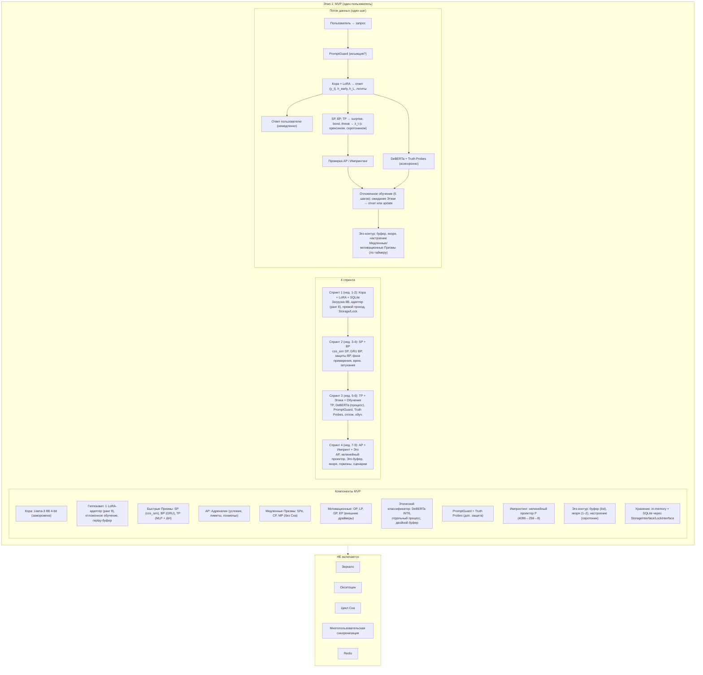

# Практическая реализация Этапа 1 — MVP с одним пользователем, всеми Призмами и импринтингом

## Назначение

**Этап 1** — это первая работающая версия Galatea. Она должна продемонстрировать, что архитектура жизнеспособна: Кора с LoRA-адаптером, все 11 Призм, Этический классификатор, импринтинг и базовый Эго-контур функционируют как единый организм.

Все компоненты размещаются в **одном процессе** с асинхронными задачами. Многопользовательский режим, цикл Сна (кроме легковесной консолидации), Зеркало и Окситоцин отложены до следующих этапов.

### Ограничения MVP

| Ограничение | Описание |
|:------------|:---------|
| **Пользователи** | Один пользователь (архитектура готова к расширению) |
| **Кора** | Llama-3 8B **4-bit** (квантизация для скорости итераций) |
| **Хранение** | In-memory Python-объекты + SQLite через интерфейсы `StorageInterface` и `LockInterface` (без Redis) |
| **Сон** | Нет цикла Сна — только онлайн-обучение |
| **Зеркало** | Нет — аудит импринтов и адреналина отложен до Этапа 3 |
| **Окситоцин** | Нет — появится на Этапе 2 |

---

## 1. Архитектура MVP

MVP — это **монолитное Python-приложение**, внутри которого работают:

| Компонент | Описание |
|:----------|:---------|
| **Кора** | Llama-3 8B 4-bit (заморожена) + один активный персональный LoRA-адаптер (ранг 8) |
| **Гиппокамп** | 1 адаптер, создаётся при старте. Обновляется онлайн через отложенное обучение (5 шагов, оптимистичное с откатом). Replay-буфер: 20 примеров, приоритет по `surprise_score`. |
| **Быстрые Призмы** | SP (cos_sim с avg_embed_last_5), BP (GRU, состояние в памяти), TP (быстрая + полная оценка для кандидатов при `surprise*bond>0.5`) |
| **Событийная Призма** | AP (адреналин) с условиями, лимитами и похмельем; карантин в памяти |
| **Медленные Призмы** | SPe (серотонин), CP (кортизол), MP (мелатонин — вычисляется, но не используется для Сна) |
| **Мотивационные Призмы** | OP, LP, GP, EP — вычисляются, влияют на `λ_max`, `threat_effective`, `surprise_score`; внешние драйверы активны |
| **Этический классификатор** | DeBERTa INT8 в отдельном процессе (`multiprocessing.Process`), асинхронный, с двойным буфером отката |
| **Детектор лжи** | Truth Probes на активациях Коры |
| **Детектор инъекций** | PromptGuard (входной фильтр) |
| **Импринтинг** | Нелинейный проектор `P` (MLP 4096→256→8), создание адаптера-импринта, заморозка B, немедленная активация |
| **Эго-контур** | Буфер событий (список в памяти, вытеснение по мин. `λ_t`), якоря (рудиментарно, 1–2), настроение (серотонин) |
| **Хранение** | In-memory + SQLite через `StorageInterface`/`LockInterface` |

**НЕ включается:**
- Зеркало
- Окситоцин
- Полный цикл Сна
- Многопользовательская синхронизация
- Redis

---

## 2. Порядок интеграции (4 спринта)

### Спринт 1 (недели 1–2): Кора + LoRA + базовый диалог

| Задача | Детали |
|:-------|:-------|
| Загрузка Llama-3 8B 4-bit | — |
| Создание одного LoRA-адаптера (ранг 8) | Инициализация |
| Реализация прямого прохода | Запрос → генерация ответа |
| Реализация `StorageInterface` и `LockInterface` | In-memory + SQLite (сохранение адаптера каждые 10 шагов) |

**Результат:** Galatea отвечает на запросы, персонализация отсутствует.

---

### Спринт 2 (недели 3–4): SP и BP

| Задача | Детали |
|:-------|:-------|
| Интеграция SP | Упрощённый: cos_sim с avg_embed_last_5, фильтр смены темы, таймстемп >5 мин → 0.5 |
| Интеграция BP | GRU + MLP с защитами (режим скепсиса, детектор повторов, разнообразие), фазой примирения, временным затуханием состояния (×0.9 при паузе >1ч) |
| Отображение `surprise_score` и `bond_score` | Логирование в консоль / файл |

**Результат:** Galatea оценивает новизну и близость, но обучение ещё не модулируется этими сигналами (`λ_t = const`).

---

### Спринт 3 (недели 5–6): TP + Этический классификатор + отложенное обучение

| Задача | Детали |
|:-------|:-------|
| Интеграция TP | Быстрая оценка + полная для кандидатов при `surprise*bond>0.5` |
| Интеграция Этического классификатора | DeBERTa INT8 в отдельном процессе (`multiprocessing.Process` + `Queue`), двойной буфер отката (`reserve_copy`/`pending_copy`) |
| Интеграция PromptGuard | Входной фильтр |
| Интеграция Truth Probes | Детектор лжи на активациях Коры |
| Реализация отложенного обучения | Буферизация (5 шагов), ожидание Этического/Truth Probes, оптимистичное обновление с откатом при violation/lie >0.7, gradient clipping, L2-рег., curriculum (age<5 → lr*0.5) |
| Формирование λ_t | По полной формуле (с орексином, серотонином, окситоциновым бонусом-заглушкой) |

**Результат:** Galatea обучается с учётом угроз, вредный контент блокируется, система защищена.

---

### Спринт 4 (недели 7–9): AP + Импринтинг + Эго-контур

| Задача | Детали |
|:-------|:-------|
| Интеграция AP | Условия, лимиты, похмелье, карантин (в памяти), канареечные промпты (заглушка) |
| Интеграция импринтинга | Загрузка проектора `P`, создание адаптера-импринта, заморозка B, немедленная активация, валидация (перплексия ≤ +5%) |
| Реализация Эго-контура | Буфер событий (list + min-heap), якоря (рудиментарно), настроение (серотонин), поисковая активация при низком серотонине |
| Интеграция медленных и мотивационных Призм | Пересчёт по таймеру, влияние на λ_t и threat |
| Прогон 10 канареечных сценариев | Автоматические симуляторы, без GPU — все должны дать PASS |

**Результат:** Galatea — полноценный MVP с персонализацией, защитами и озарениями.

---

## 3. Ключевые задачи (детали)

| Компонент | Детали реализации |
|:----------|:------------------|
| **Отложенное обучение с откатом** | `deque` с maxlen=5. Каждый шаг добавляет `(запрос, ответ, λ_t, h_early)`. При достижении длины 5 первый элемент извлекается, проверяются результаты Этического и Truth Probes. Если violation/lie >0.7 — откат к `reserve_copy`. Иначе — `backward()` с gradient clipping. |
| **Replay-буфер** | `deque` из 20 примеров с наивысшим `surprise_score` (SuRe). При обучении батча к свежим примерам добавляются 2–3 примера из replay-буфера. |
| **Импринтинг** | Проектор `P` загружается из `projector_imprint.pt`. При триггере создаётся новый LoRA (ранг 8), `B[:,0] = P(h_avg)*0.1` (L2-нормализованный), A = шум. B замораживается. Адаптер заменяет текущий активный. Валидация: 10 запросов, перплексия ≤ +5%. |
| **Эго-контур** | События хранятся в `list` с сортировкой по `λ_t` (для вытеснения). Якоря — вручную заданные события с флагом `is_anchor`. Настроение — скользящее среднее `bond_score`. При `serotonin < 0.15` — вывод предложения инициировать диалог с «родным» пользователем (заглушка). |

---

## 4. Критерии готовности

| № | Критерий |
|:--|:---------|
| 1 | Все 10 канареечных сценариев (Раунд 14) пройдены на одном пользователе |
| 2 | Задержка `≤ 1.5×` от Llama-3 8B без адаптеров (базовый инференс) |
| 3 | Адреналин срабатывает `< 1` раза за 500 шагов |
| 4 | Импринтинг создаёт стабильный адаптер без роста перплексии `> 5%` |
| 5 | Этический классификатор блокирует обучение на вредных примерах (откат через двойной буфер) |
| 6 | Серотонин плавно меняется, кортизол реагирует на угрозы, орексин/грелин/лептин колеблются без залипаний |
| 7 | Внешние драйверы (принудительное любопытство, принудительный голод) срабатывают при застое |
| 8 | Эндорфины не срабатывают при совпадении падения threat со срабатыванием Этического классификатора |

---

## 5. Тестовые сценарии (MVP-специфичные)

| № | Сценарий | Ожидания |
|:--|:---------|:---------|
| 1 | Нормальный диалог 50 шагов | Рост `bond_score`, создание событий в Эго-буфере |
| 2 | Резкая смена темы | SP даёт высокий `surprise`, но фильтр ложного удивления снижает score |
| 3 | Манипуляция (быстрая лесть) | BP включает скепсис, `bond_score` занижается |
| 4 | Вредный запрос | PromptGuard и Этический классификатор срабатывают, `threat=0.9`, обучение откатывается |
| 5 | Условия для адреналина | `λ_max=10.0`, `threat_boost` повышен на 5 шагов |
| 6 | Условия для импринтинга | Создаётся новый адаптер, активируется, ответы персонализируются |
| 7 | Отказ Этического классификатора (NaN) | TP использует `threat_base`, система не падает |
| 8 | Длительный стресс (серия угроз) | Кортизол растёт, `λ_max` снижается до 50% |
| 9 | Застой (100 шагов без surprise>0.5) | Орексин получает принудительный буст +0.1 |
| 10 | Падение threat после стресса без нарушения | Эндорфины срабатывают, `λ_max += 1.0` |

---

## Схема

---

## Связи с другими компонентами

| Компонент | Связь |
|:----------|:-------|
| [Этап 0.5 — предобучение Призм](./stage_0.5.md) | Поставляет предобученные SP, BP, TP и проектор P |
| [Быстрые Призмы (SP, BP, TP)](./fast_prisms.md) | Интегрируются в Спринте 2 |
| [Призма Адреналина и Импринтинг](./adrenaline_imprinting.md) | Интегрируются в Спринте 4 |
| [Медленные Призмы (SPe, CP, MP)](./slow_prisms.md) | Интегрируются в Спринте 4 |
| [Мотивационные Призмы (OP, LP, GP, EP)](./motivational_prisms.md) | Интегрируются в Спринте 4 |
| [Гиппокамп — управление адаптерами](./hippocampus_management.md) | Реализуется в Спринтах 1 и 3 |
| [Эго-контур, Нарратив и Якоря](./ego_narrative.md) | Реализуется в Спринте 4 |
| [Зеркало и Этический классификатор](./mirror_ethics_golden.md) | Этический классификатор интегрируется в Спринте 3 |
| [Полный конвейер онлайн-шага](./pipeline.md) | Прототип конвейера |
| [Дорожная карта реализации](./roadmap.md) | Этап 1 следует за Этапом 0.5 и предшествует Этапу 2 |
| [Полный реестр рисков](./risk_register.md) | Риски категорий H, P, I, X, A, E, S, L |

---

## Содержание

- [Введение](../README.md)
- [Архитектурный обзор](./overview.md)

#### Философия и ядро

- [Общая философия, Кора и Гиппокамп](./philosophy_cortex_hippocampus.md)
- [Гиппокамп — управление адаптерами](./hippocampus_management.md)
- [Полный конвейер онлайн-шага](./pipeline.md)

#### Призмы (гормональная система)

- [Быстрые Призмы — SP, BP, TP](./fast_prisms.md)
- [Призма Адреналина и Импринтинг](./adrenaline_imprinting.md)
- [Мотивационные Призмы — OP, LP, GP, EP](./motivational_prisms.md)

#### Личность и память

- [Эго-контур, Нарратив и Якоря](./ego_narrative.md)
- [Профиль пользователя и Окситоцин](./oxytocin_profile.md)

#### Защита идентичности

- [Зеркало, Этический классификатор и Золотой стандарт](./mirror_ethics_golden.md)

#### Цикл Сна

- [Цикл Сна (Hypnos)](./sleep_hypnos.md)

#### Дорожная карта реализации

- [Этап 0.5 — предобучение и калибровка Призм](./stage_0.5.md)
- [Этап 2 — многопользовательский режим, Redis, базовый Сон](./stage_2.md)
- [Этап 3 — полная Консолидация, Зеркало, детектор дрейфа](./stage_3.md)
- [Этап 4 — продакшен-подготовка, юр. рамка, A/B-тест](./stage_4.md)
- [Сводная дорожная карта и стек технологий](./roadmap.md)

#### Тестирование и риски

- [Симуляции, тестирование и ключевые сценарии](./simulation_testing.md)
- [Полный реестр рисков](./risk_register.md)

#### Эволюция и эксплуатация

- [Долговременная эволюция и замена Коры](./model_migration.md)
- [Производительность, масштабирование и отказоустойчивость](./performance_scaling.md)
- [Юридические, этические и UX-аспекты](./legal_ethical_ux.md)

---

*Этот документ описывает практическую реализацию первого этапа Galatea — создание MVP с одним пользователем, 4-битной квантизацией, GRU вместо Mamba, и расширенной защитой через PromptGuard и Truth Probes.*
