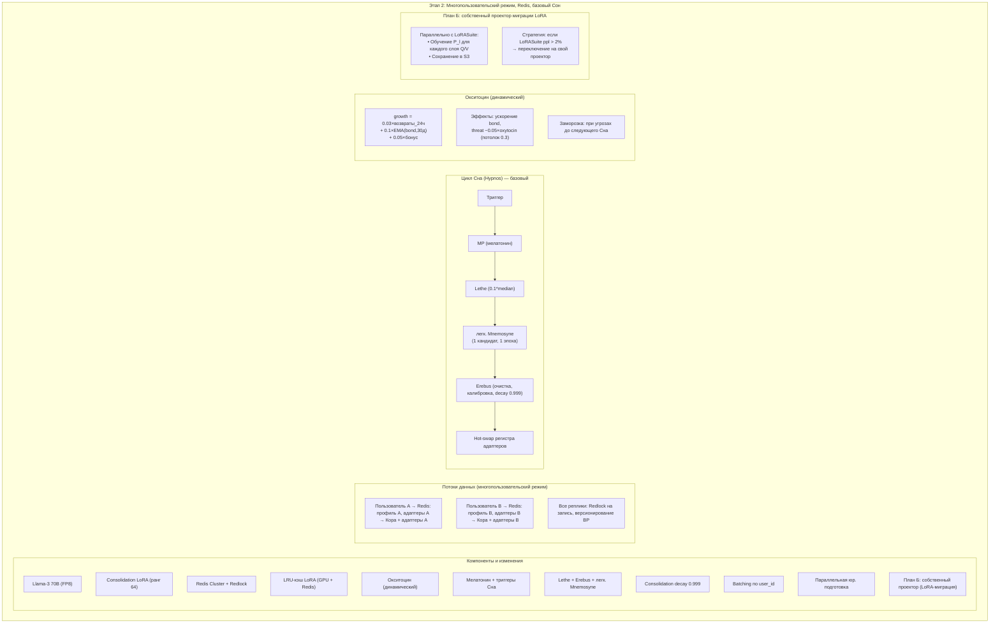

# Практическая реализация Этапа 2 — многопользовательский режим, Redis, базовый Сон и Окситоцин

## Назначение

**Этап 2** превращает Galatea из одноместного прототипа в систему, способную обслуживать множество пользователей одновременно.

**Ключевые изменения:**

- Распределённое хранилище (Redis Cluster)
- Блокировки (Redlock)
- Изоляция данных
- Базовый цикл Сна (Lethe + Erebus + легковесная Mnemosyne)
- Долгосрочная модель привязанности (Окситоцин)
- Consolidation decay (`0.999`) с первого дня существования consolidation LoRA

**Параллельные задачи:**

- Юридическая подготовка
- Разработка плана Б для миграции LoRA

---

## 1. Переход на Llama-3 70B

| Задача | Детали |
|:-------|:-------|
| **Замена модели** | Llama-3 8B → 70B (FP8 или 4-bit квантизация) |
| **Перенос Призм (SP, BP, TP)** | Применяется **адаптационный проектор** для переноса весов (репетиция полной миграции) |
| **Consolidation LoRA** | Создаётся с нуля (ранг 64) |
| **Миграция consolidation LoRA** | Не используется (она ещё пуста) |

---

## 2. Замена хранилища на Redis Cluster

`StorageInterface` и `LockInterface`, заложенные на Этапе 1, теперь реализуются через **Redis** и **Redlock**.

### Структуры данных в Redis

| Тип данных | Ключ | Детали |
|:-----------|:-----|:-------|
| **Профили** | `user:{user_id}` | JSON + бинарный блоб `bond_state`, TTL 7 дней |
| **Веса адаптеров** | `adapter:{adapter_id}` | Бинарный блоб (gzip), LRU-кэш в GPU и Redis |
| **Блокировки** | `lock:user:{user_id}` | Redlock |
| **Эго-буфер** | — | Sorted set + list |
| **Гормоны** | — | — |
| **Очередь импринтов** | `imprint_queue` | — |
| **Адреналиновый карантин** | — | TTL 7 дней |

**Важно:** код ядра (Призмы, Гиппокамп, Эго-контур) **остаётся неизменным** — меняются только реализации интерфейсов.

---

## 3. Многопользовательская изоляция и batching

| Механизм | Описание |
|:---------|:---------|
| **Изоляция адаптеров** | При инференсе активируются только адаптеры текущего пользователя + общие адаптеры (косинусный фильтр > 0.4, не более 2 одновременно) |
| **Batching по `user_id`** | Запросы одного пользователя группируются в батч в vLLM, переключение LoRA — один раз на батч |
| **Сериализация запросов** | Параллельные запросы сериализуются через Redlock |
| **Атомарное обновление BP** | `bond_state` обновляется в Redis с версионированием (`WATCH/MULTI/EXEC`) |

---

## 4. Окситоциновый профиль

В профиль пользователя добавляется `oxytocin_level`.

### Формула вычисления

```python
oxytocin = clamp(base_oxytocin + growth, 0.0, 1.0)

growth = 0.03 * (количество возвратов за последние 24 часа) \
       + 0.1 * EMA(bond_score, окно 30 дней) \
       + 0.05 * (бонус за глубокое возвращение)
```

| Компонент | Описание |
|:----------|:---------|
| **Возвраты** | Каждый случай возврата после паузы > 24 часов с достижением `bond_score > 0.5` |
| **Качество** | `EMA(bond_score, окно 30 дней)` — автоматически затухает при снижении близости |
| **Бонус** | Если после паузы > 7 дней `bond_score` быстро восстанавливается до > 0.7, добавляется 0.05 |

### Эффекты окситоцина

| Эффект | Детали |
|:-------|:-------|
| **Ускоренное восстановление `bond`** | Инициализация `bond_state = oxytocin × 0.3` при возвращении |
| **Снижение `threat`** | `threat_effective = threat_score - 0.05 × oxytocin` (потолок снижения `≤ 0.3`) |
| **Приоритет в Mnemosyne** | Множитель `×1.1` к `protection` при `oxytocin > 0.7`, лимит `≤ 20%` от одного пользователя |

### Заморозка бонусов

Бонусы замораживаются до следующего Сна при:

- `threat_score > 0.9`
- Срабатывании Этического классификатора
- Провале AP

---

## 5. Мелатонин и триггеры Сна

### Триггеры запуска Сна

| Триггер | Условие |
|:--------|:---------|
| **Хроно** | Раз в сутки (фиксированное время) |
| **Дельта** | Число адаптеров с `protection > 0.3` превысило 5000 |
| **Энтропийный** | Средний `threat_score` > 0.5 за 2 часа |
| **Кортизоловый** | `cortisol > 0.8` |
| **Дрейф-триггер** | JS-дивергенция > порога (пока заглушка) |
| **Ручной** | Вызов администратором |

### Вычисление мелатонина

```python
melatonin = 0.4 * load_score + 0.3 * adr_score + 0.3 * threat_score_period
```

Нормализация через 95-й перцентиль за 14 дней.

### Глубина Сна

| Уровень | Описание |
|:--------|:---------|
| **Низкая** | Lethe + Erebus + легковесная Mnemosyne (1 кандидат) |
| **Средняя** | Lethe + Mnemosyne (до 10 кандидатов) + Erebus |
| **Высокая** | Полный цикл (отложен до Этапа 3) |

---

## 6. Фазы Сна (Lethe, Erebus, легковесная Mnemosyne)

### Lethe (Затухание)

| Параметр | Значение |
|:---------|:---------|
| `decay_rate` | `base_decay * (1 - protection) * time_factor(age)` |
| `base_decay` | 0.005 (0.0075 при `cortisol > 0.7`) |
| **Якоря** | `base_decay = 1e-5`, `protection = 0.995` |
| **Адреналиновые / импринты** (до аудита) | `decay_rate = 0` |
| **Порог удаления** | Норма `< 0.1 × median_norm` |
| **Молодые адаптеры** (`age = 0`) | Защищены от удаления |

### Легковесная Mnemosyne

| Условие | Кандидатов | Эпох |
|:--------|:----------:|:----:|
| Низкий мелатонин | 1 (с наивысшим `protection`) | 1 |
| Средний/высокий мелатонин | До 10 | 1 |

### Erebus (Очистка)

- Удаление неактивных профилей (`> 60` дней, медиана `bond < 0.4`)
- Калибровка Призм
- Архивация Эго-буфера
- Ревизия якорей
- `consolidation_decay = 0.999` (с первого Сна)

### Атомарное применение

- Hot-swap регистра адаптеров в vLLM
- Sticky-сессии

---

## 7. План Б для миграции LoRA (LoRASuite)

| Компонент | Детали |
|:----------|:-------|
| **LoRASuite** | Тестируется на синтетике параллельно |
| **Собственный линейный проектор** | Разрабатывается параллельно: для каждого слоя Q/V строится отображение `P_l: h_old → h_new` через псевдообратную матрицу |
| **Обучение проектора** | На Этапе 2 обучается на параллельном корпусе и сохраняется в S3 |
| **Стратегия переключения** | Приоритет у LoRASuite. Если её перплексия > 2% → переключение на собственный проектор без дополнительных спринтов |

---

## 8. Параллельная юридическая подготовка

| Задача | Описание |
|:-------|:---------|
| **Шаблоны политик** | Политика конфиденциальности, пользовательское соглашение |
| **Описание архитектуры** | Для юристов и регуляторов |
| **Целевой результат** | Черновик документов для GDPR/CCPA compliance к концу этапа |

---

## Схема



---

## Связи с другими компонентами

| Компонент  | Связь  |
|:-----------|:-------|
| [Этап 0.5 — предобучение Призм](./stage_0.5.md) | Призмы переносятся на 70B через адаптационный проектор |
| [Этап 1 — MVP](./stage_1.md) | Интерфейсы `StorageInterface`/`LockInterface` заменяются на Redis |
| [Цикл Сна (Hypnos)](./sleep_hypnos.md) | Реализуется базовый Сон (Lethe + Erebus + легковесная Mnemosyne) |
| [Профиль пользователя и Окситоцин](./oxytocin_profile.md) | Реализуется окситоциновый профиль |
| [Медленные Призмы (Мелатонин)](./slow_prisms.md) | Триггеры Сна и мелатонин |
| [Гиппокамп — управление адаптерами](./hippocampus_management.md) | Redis + LRU-кэш, версионирование BP |
| [Долговременная эволюция и миграция](./model_migration.md) | План Б для миграции LoRA |
| [Юридические и UX-аспекты](./legal_ethical_ux.md) | Параллельная юридическая подготовка |
| [Дорожная карта реализации](./roadmap.md) | Этап 2 следует за Этапом 1 и предшествует Этапу 3 |
| [Полный реестр рисков](./risk_register.md) | Риски H-07, I-09, I-13, I-14, A-09, P-21, S-24 |

---

## Содержание

- [Введение](../README.md)
- [Архитектурный обзор](./overview.md)

#### Философия и ядро

- [Общая философия, Кора и Гиппокамп](./philosophy_cortex_hippocampus.md)
- [Гиппокамп — управление адаптерами](./hippocampus_management.md)
- [Полный конвейер онлайн-шага](./pipeline.md)

#### Призмы (гормональная система)

- [Быстрые Призмы — SP, BP, TP](./fast_prisms.md)
- [Призма Адреналина и Импринтинг](./adrenaline_imprinting.md)
- [Мотивационные Призмы — OP, LP, GP, EP](./motivational_prisms.md)

#### Личность и память

- [Эго-контур, Нарратив и Якоря](./ego_narrative.md)
- [Профиль пользователя и Окситоцин](./oxytocin_profile.md)

#### Защита идентичности

- [Зеркало, Этический классификатор и Золотой стандарт](./mirror_ethics_golden.md)

#### Цикл Сна

- [Цикл Сна (Hypnos)](./sleep_hypnos.md)

#### Дорожная карта реализации

- [Этап 0.5 — предобучение и калибровка Призм](./stage_0.5.md)
- [Этап 1 — MVP с одним пользователем](./stage_1.md)
- [Этап 3 — полная Консолидация, Зеркало, детектор дрейфа](./stage_3.md)
- [Этап 4 — продакшен-подготовка, юр. рамка, A/B-тест](./stage_4.md)
- [Сводная дорожная карта и стек технологий](./roadmap.md)

#### Тестирование и риски

- [Симуляции, тестирование и ключевые сценарии](./simulation_testing.md)
- [Полный реестр рисков](./risk_register.md)

#### Эволюция и эксплуатация

- [Долговременная эволюция и замена Коры](./model_migration.md)
- [Производительность, масштабирование и отказоустойчивость](./performance_scaling.md)
- [Юридические, этические и UX-аспекты](./legal_ethical_ux.md)
- [Миграция на Регулятор Пластичности — Архитектура](./pr_migration_architecture.md)
- [Миграция на Регулятор Пластичности — План выполнения](./pr_migration_execution.md)

---

*Этот документ описывает практическую реализацию второго этапа Galatea — превращение прототипа в многопользовательскую систему с распределённым хранилищем, базовой консолидацией и долгосрочной привязанностью.*
