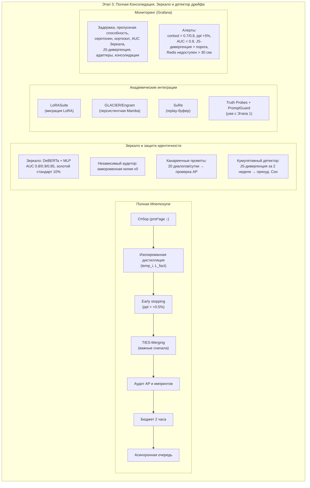

# Практическая реализация Этапа 3 — полная Консолидация, Зеркало и детектор дрейфа

## Назначение

**Этап 3** завершает ядро системы. С этого момента Galatea способна не просто запоминать и персонализироваться, но и защищать свою идентичность, обнаруживать медленные атаки и готовиться к замене Коры.

**Ключевые внедрения:**

- Полная Mnemosyne с TIES-Merging и early stopping
- Зеркало (Mirror) с золотым стандартом и независимым аудитором
- Кумулятивный детектор дрейфа
- Академические решения: LoRASuite, GLACIER/Engram, SuRe

---

## 1. Полная Mnemosyne (консолидация)

Расширение легковесной версии с Этапа 2 до полноценной.

### Отбор кандидатов

| Критерий | Значение |
|:---------|:---------|
| `protection` | `> 0.7` |
| `age` | `>= 3` |
| `mean_surprise` | `< 0.6` (допускается высокий `surprise` при высоком `bond`) |
| `fail_count` | `< 3` |
| `last_consolidated_cycle` | Не входит в последние 10 циклов |
| **Якоря** | `age >= 1` |
| **Приоритет** | Адреналиновые и импринт-адаптеры |
| **Доля от одного пользователя** | `≤ 20%` |

### Изолированная дистилляция

Для каждого кандидата:

| Шаг | Действие |
|:---:|:---------|
| 1 | Создаётся временный LoRA `temp_i` (ранг 64) |
| 2 | Строится контрастный датасет (до 128 позитивных и 128 негативных примеров) |
| 3 | Измеряется baseline перплексия |
| 4 | **Одна эпоха дистилляции** |

**Функция потерь:**

```python
L_total = L_pos + β * L_neg + γ * L_lm + δ * L_fact
```

где `L_fact` — штраф за **самопротиворечивость** (ответы кандидата сравниваются с его же предыдущими ответами на похожие запросы из replay-буфера).

### Early stopping

| Условие | Действие |
|:--------|:---------|
| Рост валидационной перплексии `> 0.5%` от baseline | Немедленное прерывание дистилляции кандидата |

### Бюджет времени

| Параметр | Значение |
|:---------|:---------|
| **Жёсткий лимит** | 2 часа на всю Mnemosyne |
| **Пропуск** | Оставшиеся кандидаты переносятся на следующий цикл Сна |

### Асинхронность

Дистилляция выполняется в **отдельной очереди**. Инференс продолжается **без обновления Гиппокампа**.

### Слияние TIES-Merging

| Шаг | Действие |
|:---:|:---------|
| 1 | Кандидаты сортируются по `protection * age` (от важных к менее важным) |
| 2 | Слияние через TIES-Merging (PEFT, `combination_type="ties"`) |
| 3 | Промежуточные чекпоинты после каждого кандидата |

---

## 2. Зеркало (Mirror) и Золотой стандарт

### Обучение Зеркала

| Компонент | Описание |
|:----------|:---------|
| **Архитектура** | DeBERTa-base + MLP на эмбеддингах ответов |
| **Золотой стандарт** | 10% фиксированного веса, **никогда не удаляется** |
| **Позитивные примеры** | Ответы после успешных консолидаций (вес затухает `0.99`/цикл) |
| **Негативные примеры** | Чужие LLM + испорченная Galatea + adversarial |

### Адаптивные пороги

| Тип адаптера | Минимальный AUC |
|:-------------|:---------------:|
| Молодые (`age < 5`) | `≥ 0.8` |
| Зрелые | `≥ 0.9` |
| Импринты | `≥ 0.85` |

### Использование Зеркала

| Сценарий | Действие |
|:---------|:---------|
| **При консолидации** | Проверка после каждой эпохи дистилляции |
| **При аудите AP и импринтов** | Сравнение ответов с адаптером и без него |
| **Ежемесячный аудит дрейфа** | Косинусное расстояние до золотого стандарта |

### Независимый аудитор

- Замороженная копия Зеркала версии **v0**.
- Если её AUC падает ниже `0.8` — **алерт**.
- Возможность обновления по решению администратора с ведением истории версий.

### Канареечные промпты

- **20** эталонных диалогов раз в сутки.
- Проверяют срабатывание AP.
- Если AP не срабатывает → пороги AP снижаются на `0.05` (до `0.7` / `0.6` / `0.3`).

---

## 3. Кумулятивный детектор дрейфа

| Параметр | Значение |
|:---------|:---------|
| **Метод** | JS-дивергенция распределения ответов на 50 «канареечных» промптов |
| **Сравнение** | Текущая неделя vs эталонная неделя (сразу после успешной консолидации из золотого стандарта) |
| **Триггер** | JS-дивергенция > порога (эмпирически) в течение **двух недель** подряд |
| **Действие** | Принудительный Сон с консолидацией из золотого набора + внеочередная ревизия якорей |

### Интеграция с якорями

| Условие | Действие |
|:--------|:---------|
| Срабатывание детектора дрейфа | Все якоря проходят внеочередную ревизию |
| Падение `bond_score` > 0.3 | Якорь удаляется **немедленно** |

---

## 4. Академические интеграции

| Интеграция | Назначение | Статус |
|:-----------|:-----------|:-------|
| **LoRASuite (NeurIPS 2025)** | Миграция consolidation LoRA при замене Коры | Тестируется на синтетике |
| **GLACIER / Engram** | Персистентное состояние для Mamba (если BP обновлена) | Откладывается до Этапа 4, если BP на GRU |
| **SuRe** (Surprise-Driven Prioritised Replay) | Критерий отбора в replay-буфере | Уже используется с Этапа 1 |
| **Truth Probes + PromptGuard** | Детектор лжи и инъекций | Уже с Этапа 1 |

---

## 5. Аудит адреналиновых событий и импринтов

Полноценный аудит во время Mnemosyne (при высоком мелатонине).

### Аудит AP

| Проверка | Критерий |
|:---------|:---------|
| **TP** (энтропия до/после) | — |
| **Зеркало** (AUC) | Адаптивный порог (`0.8` / `0.9`) |

### Аудит импринтов

| Проверка | Критерий |
|:---------|:---------|
| **Зеркало** (AUC) | `> 0.85` |
| **TP** (рост энтропии) | `< 10%` |
| **Консистентность** | 5 replay-запросов — ответы не должны противоречить эталонным |

### Результаты

| Результат | Действие |
|:----------|:---------|
| **Успех** | Слияние в consolidation LoRA (импринт с весом ×2), разморозка B |
| **Провал** | Удаление адаптера, штраф кортизолу (`+0.2` для AP, `+0.1` для импринта) |

---

## 6. Механизм «закрытия гештальта»

| Условие | Действие |
|:--------|:---------|
| Пользователь с высоким окситоцином неактивен > 90 дней | — |
| **Влияние на нарратив** | Плавно затухает (вес событий экспоненциально снижается) |
| **Якоря** | Проходят внеочередную ревизию |
| **Окситоцин** | Сбрасывается при возврате > 90 дней |

---

## 7. Мониторинг и алерты

### Дашборд Grafana

| Категория | Метрики |
|:----------|:--------|
| **Задержка** | p50, p95, p99 |
| **Пропускная способность** | Запросов в секунду |
| **Гормоны** | Серотонин, кортизол |
| **Качество** | AUC Зеркала, JS-дивергенция |
| **Система** | Количество адаптеров, успешные/проваленные консолидации |

### Алерты

| Условие | Уровень | Действие |
|:--------|:-------:|:---------|
| `cortisol > 0.7` | ⚠ Жёлтый | Предупреждение |
| `cortisol > 0.8` | 🚨 Красный | Уведомление, принудительный Сон |
| Перплексия выросла > 5% | 🔴 Критический | Алерт |
| `AUC Зеркала < 0.8` | ⚠ Жёлтый | Предупреждение о потере идентичности |
| Redis недоступен > 30 сек | 🔴 Критический | Алерт |
| JS-дивергенция > порога | ⚠ Жёлтый | Алерт дрейфа |

---

## Схема



---

## Связи с другими компонентами

| Компонент | Связь |
|:----------|:------|
| [Этап 0.5 — предобучение Призм](./stage_0.5.md) | TIES-Merging, LoRASuite, проектор |
| [Этап 2 — многопользовательский режим](./stage_2.md) | Легковесная Mnemosyne → полная Mnemosyne |
| [Цикл Сна (Hypnos)](./sleep_hypnos.md) | Полная Mnemosyne, аудит AP и импринтов |
| [Зеркало и Этический классификатор](./mirror_ethics_golden.md) | Обучение и интеграция Зеркала |
| [Быстрые Призмы (SP, BP, TP)](./fast_prisms.md) | Канареечные промпты проверяют AP |
| [Призма Адреналина и Импринтинг](./adrenaline_imprinting.md) | Аудит AP и импринтов |
| [Эго-контур, Нарратив и Якоря](./ego_narrative.md) | Ревизия якорей при дрейфе, закрытие гештальта |
| [Долговременная эволюция и миграция](./model_migration.md) | LoRASuite, GLACIER/Engram |
| [Производительность и масштабирование](./performance_scaling.md) | Мониторинг и алерты |
| [Дорожная карта реализации](./roadmap.md) | Этап 3 следует за Этапом 2 и предшествует Этапу 4 |
| [Полный реестр рисков](./risk_register.md) | Риски S-16, S-23, S-26, E-08, E-20, P-22, A-07 |

---

## Содержание

- [Введение](../README.md)
- [Архитектурный обзор](./overview.md)

#### Философия и ядро

- [Общая философия, Кора и Гиппокамп](./philosophy_cortex_hippocampus.md)
- [Гиппокамп — управление адаптерами](./hippocampus_management.md)
- [Полный конвейер онлайн-шага](./pipeline.md)

#### Призмы (гормональная система)

- [Быстрые Призмы — SP, BP, TP](./fast_prisms.md)
- [Призма Адреналина и Импринтинг](./adrenaline_imprinting.md)
- [Мотивационные Призмы — OP, LP, GP, EP](./motivational_prisms.md)

#### Личность и память

- [Эго-контур, Нарратив и Якоря](./ego_narrative.md)
- [Профиль пользователя и Окситоцин](./oxytocin_profile.md)

#### Защита идентичности

- [Зеркало, Этический классификатор и Золотой стандарт](./mirror_ethics_golden.md)

#### Цикл Сна

- [Цикл Сна (Hypnos)](./sleep_hypnos.md)

#### Дорожная карта реализации

- [Этап 0.5 — предобучение и калибровка Призм](./stage_0.5.md)
- [Этап 1 — MVP с одним пользователем](./stage_1.md)
- [Этап 2 — многопользовательский режим, Redis, базовый Сон](./stage_2.md)
- [Этап 4 — продакшен-подготовка, юр. рамка, A/B-тест](./stage_4.md)
- [Сводная дорожная карта и стек технологий](./roadmap.md)

#### Тестирование и риски

- [Симуляции, тестирование и ключевые сценарии](./simulation_testing.md)
- [Полный реестр рисков](./risk_register.md)

#### Эволюция и эксплуатация

- [Долговременная эволюция и замена Коры](./model_migration.md)
- [Производительность, масштабирование и отказоустойчивость](./performance_scaling.md)
- [Юридические, этические и UX-аспекты](./legal_ethical_ux.md)

---

*Этот документ описывает практическую реализацию третьего этапа Galatea — завершение ядра системы с полной консолидацией, защитой идентичности и детекцией дрейфа.*
