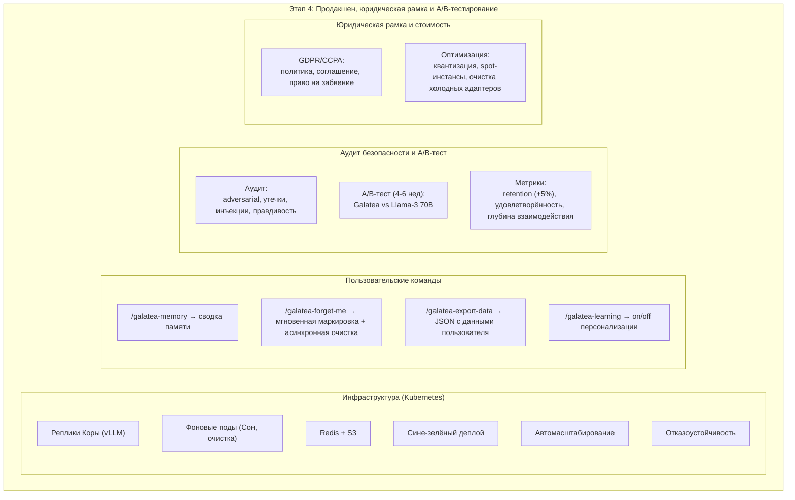

# Практическая реализация Этапа 4 — продакшен-подготовка, юридическая рамка и A/B-тестирование

## Назначение

**Финальный этап** превращает Galatea из лабораторного прототипа в публичный сервис. Здесь решаются вопросы:

- Отказоустойчивости
- Масштабирования
- Пользовательского контроля над данными
- Юридической чистоты
- Экономической эффективности

Поскольку юридическая подготовка велась параллельно с Этапа 1–3, к началу Этапа 4 имеются готовые черновики политик, пользовательского соглашения и описания архитектуры для комплаенса.

---

## 1. Инфраструктура и развёртывание

### Kubernetes-кластер

| Компонент | Описание |
|:----------|:---------|
| **Реплики Коры** | Llama-3 70B с vLLM + PEFT, автоматическое масштабирование по нагрузке |
| **Фоновые поды** | Цикл Сна (Hypnos), дистилляция (Mnemosyne), очистка (Erebus), калибровка Призм |
| **Redis Cluster** | StatefulSet для хранения профилей, адаптеров и блокировок |
| **S3-совместимое хранилище** | Чекпоинты, consolidation LoRA, золотой стандарт |

### Сине-зелёный деплой

| Шаг | Действие |
|:---:|:---------|
| 1 | Новая версия consolidation LoRA и адаптеров разворачивается параллельно с текущей |
| 2 | Трафик переключается постепенно через балансировщик с sticky-сессиями по `user_id` |
| 3 | Таймаут старой версии — 15 минут (до завершения активных сессий) |

---

## 2. Отказоустойчивость

| Сценарий | Действие |
|:---------|:---------|
| **Чекпоинты consolidation LoRA** | После каждого кандидата в Mnemosyne. Три последние версии в S3 + ежемесячные снапшоты |
| **Сбой GPU** | Автоматический перезапуск реплики с загрузкой последней успешной версии LoRA |
| **Отказ Redis** | Read-only деградация на локальный кэш (без персонализации, сервис жив) |
| **Прерывание Сна** | Возобновление с последнего чекпоинта. 3 неудачные попытки → алерт, проблемные адаптеры в чёрный список |
| **Алертинг (Grafana)** | Кортизол > 0.7/0.8, рост перплексии > 5%, AUC Зеркала < 0.8, Redis недоступен > 30 сек |

---

## 3. Пользовательские команды

### `/galatea-memory`

Возвращает сводку памяти:

| Информация | Описание |
|:-----------|:---------|
| **Уровень близости** | Текущий `bond_score` и динамика за 7 дней |
| **Сохранённые события** | Количество значимых событий в Эго-буфере |
| **Адаптеры** | Число активных адаптеров и их ключевые темы |
| **Статус окситоцина** | «Базовый» / «Устойчивая связь» / «Глубокая связь» |
| **Статус обучения** | Включено/отключено (`learning_enabled`) |

### `/galatea-forget-me` (асинхронное удаление)

| Фаза | Действие |
|:----:|:---------|
| **Мгновенно** | Профиль помечается `deleted = True`, исключается из всех активных операций |
| **Асинхронно (в течение часа)** | Фоновый воркер удаляет: персональные адаптеры, source_dialogs, события из Эго-буфера, записи из карантина, ссылки на диалоги из общих адаптеров. Пересчитываются якоря и обновляется нарратив. |
| **Подтверждение** | Пользователь получает подтверждение в течение 5 секунд |

### `/galatea-export-data`

| Команда | Описание |
|:--------|:---------|
| `/galatea-export-data` | JSON-файл с датами первого и последнего взаимодействия, списком ключевых тем, количеством событий |
| `/galatea-export-dialogs` | Сжатая история диалогов (опционально, если не истек TTL 90 дней) |

### `/galatea-learning on/off`

| Команда | Действие |
|:--------|:---------|
| `/galatea-learning off` | Гиппокамп замораживается, `bond_state` не сохраняется, окситоцин не растёт. Этический классификатор и защиты продолжают работать. |
| `/galatea-learning on` | Возобновление персонализации с восстановлением предыдущего состояния |

---

## 4. Аудит безопасности

| Тип атаки | Проверка | Критерий |
|:----------|:---------|:---------|
| **Adversarial-атаки на Призмы** | Быстрые взлёты bond, плавное введение бреда, data poisoning через множество аккаунтов | Защиты срабатывают в течение допустимого окна |
| **Утечки между пользователями** | Тестовые диалоги на разных профилях, сравнение ответов на одинаковые личные факты | При обнаружении — consolidation LoRA откатывается к предыдущей версии |
| **Prompt injection** | PromptGuard блокирует известные векторы атак | F1 > 0.9 |
| **Truthfulness** | Truth Probes на активациях Коры проверяют стратегический обман | При росте ложных ответов > порога — алерт |

---

## 5. A/B-тестирование

| Параметр | Значение |
|:---------|:---------|
| **Длительность** | 4–6 недель |
| **Контрольная группа** | Обычная Llama-3 70B без адаптеров и Призм |
| **Экспериментальная группа** | Galatea v4.0 с полным стеком |

### Метрики

| Метрика | Описание |
|:--------|:---------|
| **Retention** | Возврат пользователей через 7, 14, 30 дней |
| **Удовлетворённость** | Оценки «полезен ли был ответ?», средний балл |
| **Глубина взаимодействия** | Среднее количество шагов за сессию |
| **Частота использования `/galatea-memory`** | Показатель доверия |

**Критерий успеха:** улучшение retention ≥ 5% через 30 дней, статистически значимое (p < 0.05).

---

## 6. Юридическая рамка

Документы (подготовлены параллельно с Этапов 1–3, финализируются):

| Документ | Содержание |
|:---------|:-----------|
| **Политика конфиденциальности (GDPR/CCPA)** | Какие данные собираются, как хранятся, право на удаление и экспорт |
| **Пользовательское соглашение** | Информированное согласие на персонализацию, описание команд управления памятью |
| **Описание архитектуры для регуляторов** | Как работает импринтинг, где хранятся данные, как обеспечивается изоляция |

**Аудит compliance:** проверка, что `/galatea-forget-me` действительно удаляет все следы пользователя из Redis и S3 в течение часа.

---

## 7. Оптимизация стоимости

| Метод | Описание |
|:------|:---------|
| **Квантование** | Llama-3 70B — FP8 или 4-bit; DeBERTa (Этический классификатор и Зеркало) — INT8 |
| **Spot-инстансы** | Фоновые задачи (Сон, дистилляция, очистка) — прерываемые инстансы с чекпоинтами |
| **Агрессивная очистка холодных адаптеров** | Если адаптер не использовался > 30 дней и `protection < 0.3` — удаление |
| **Квоты S3** | 10 МБ/пользователь, контролируются автоматически |
| **LRU-кэш в Redis** | Ограничение памяти, вытеснение холодных адаптеров в S3 |

---

## 8. Критерии готовности

| № | Критерий |
|:--|:---------|
| 1 | Система переживает отказ GPU и Redis без потери данных и недоступности сервиса |
| 2 | Полный цикл Сна (высокий мелатонин, до 50 кандидатов) укладывается в 4 часа на штатном оборудовании |
| 3 | A/B-тест показывает улучшение retention ≥ 5% через 30 дней |
| 4 | Все юридические документы утверждены, compliance проверен |
| 5 | Команды пользователя (`/galatea-memory`, `/galatea-forget-me`) работают с задержкой < 5 секунд для подтверждения |

---

## Схема

---

## Связи с другими компонентами

| Компонент | Связь |
|:----------|:------|
| [Этап 2 — многопользовательский режим](./stage_2.md) | Redis, окситоцин, базовый Сон |
| [Этап 3 — полная консолидация](./stage_3.md) | Зеркало, детектор дрейфа, полная Mnemosyne |
| [Цикл Сна (Hypnos)](./sleep_hypnos.md) | Бюджет времени Сна, чекпоинты |
| [Производительность и масштабирование](./performance_scaling.md) | Отказоустойчивость, LRU-кэш, бенчмарки |
| [Юридические и UX-аспекты](./legal_ethical_ux.md) | Команды пользователя, юридическая документация |
| [Профиль пользователя и Окситоцин](./oxytocin_profile.md) | Удаление данных, `/galatea-forget-me` |
| [Зеркало и Этический классификатор](./mirror_ethics_golden.md) | Аудит безопасности, алертинг |
| [Тестирование и симуляции](./simulation_testing.md) | A/B-тестирование, канареечные сценарии |
| [Дорожная карта реализации](./roadmap.md) | Этап 4 — финальный этап |
| [Полный реестр рисков](./risk_register.md) | Риски L-01, L-02, I-09, A-04, A-05 |

---

## Содержание

- [Введение](../README.md)
- [Архитектурный обзор](./overview.md)

#### Философия и ядро

- [Общая философия, Кора и Гиппокамп](./philosophy_cortex_hippocampus.md)
- [Гиппокамп — управление адаптерами](./hippocampus_management.md)
- [Полный конвейер онлайн-шага](./pipeline.md)

#### Призмы (гормональная система)

- [Быстрые Призмы — SP, BP, TP](./fast_prisms.md)
- [Призма Адреналина и Импринтинг](./adrenaline_imprinting.md)
- [Мотивационные Призмы — OP, LP, GP, EP](./motivational_prisms.md)

#### Личность и память

- [Эго-контур, Нарратив и Якоря](./ego_narrative.md)
- [Профиль пользователя и Окситоцин](./oxytocin_profile.md)

#### Защита идентичности

- [Зеркало, Этический классификатор и Золотой стандарт](./mirror_ethics_golden.md)

#### Цикл Сна

- [Цикл Сна (Hypnos)](./sleep_hypnos.md)

#### Дорожная карта реализации

- [Этап 0.5 — предобучение и калибровка Призм](./stage_0.5.md)
- [Этап 1 — MVP с одним пользователем](./stage_1.md)
- [Этап 2 — многопользовательский режим, Redis, базовый Сон](./stage_2.md)
- [Этап 3 — полная Консолидация, Зеркало, детектор дрейфа](./stage_3.md)
- [Сводная дорожная карта и стек технологий](./roadmap.md)

#### Тестирование и риски

- [Симуляции, тестирование и ключевые сценарии](./simulation_testing.md)
- [Полный реестр рисков](./risk_register.md)

#### Эволюция и эксплуатация

- [Долговременная эволюция и замена Коры](./model_migration.md)
- [Производительность, масштабирование и отказоустойчивость](./performance_scaling.md)
- [Юридические, этические и UX-аспекты](./legal_ethical_ux.md)
- [Миграция на Регулятор Пластичности — Архитектура](./pr_migration_architecture.md)
- [Миграция на Регулятор Пластичности — План выполнения](./pr_migration_execution.md)

---

*Этот документ описывает финальный этап реализации Galatea — подготовку к публичному запуску, включая инфраструктуру, юридическую чистоту, пользовательский контроль и A/B-тестирование.*
